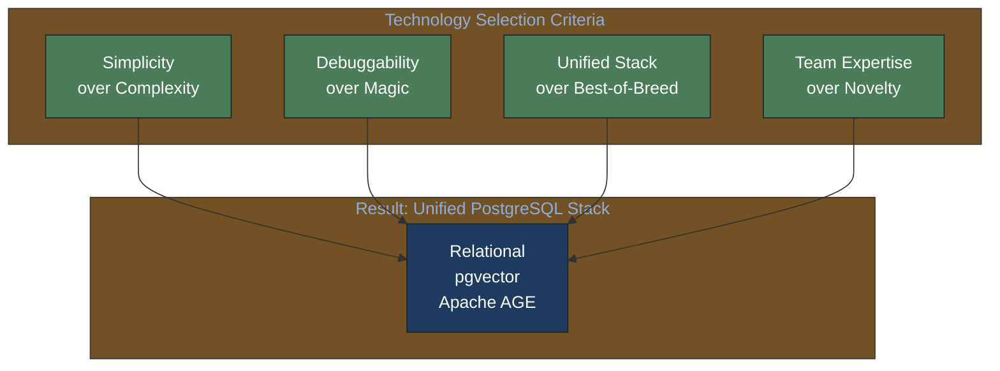
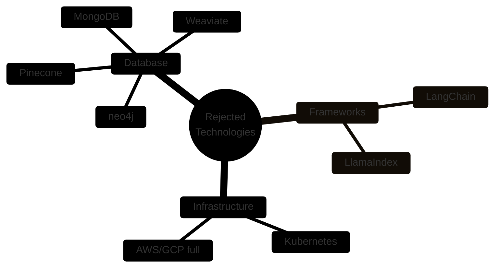
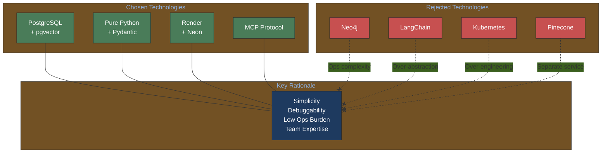

# Rejected Technologies

> **Navigation Note**: This document is part of the Music Attribution PRD system. For the complete hierarchical PRD structure, see [vision-v1.md](vision-v1.md) and domain-specific TOCs in subdirectories.

---

## For Domain Experts

**What this document covers**: Explicit documentation of why certain technologies are NOT recommended for the system.

**Why this matters for non-engineers**:
- Prevents scope creep from "shiny new technology" suggestions
- Documents trade-offs between complexity and capability
- Provides clear criteria for when decisions should be revisited

**High-level technology philosophy**:

---

**Purpose**: Explicit documentation of why certain technologies are NOT recommended for the system. This prevents LLMs from repeatedly suggesting rejected options.

**Format**: Each entry includes brief rationale + when to reconsider.

---

## Quick Reference (For Both Audiences)

**For Stakeholders**: This document explains why we chose simpler, more maintainable technologies over complex alternatives.

**For Engineers**: Check this document before proposing a technology - it may already be evaluated and rejected.

---

## Rejection Decision Matrix

| Technology | Category | Reason Summary | Reconsider When |
|------------|----------|----------------|-----------------|
| neo4j | Database | Ops complexity, licensing | Need native graph algorithms at scale |
| Pinecone | Vector DB | Separate service, pgvector sufficient | >10M vectors |
| MongoDB | Document DB | Need ACID, relational model | Pure document workloads |
| LangChain | LLM Framework | Over-abstraction, debugging | Need many pre-built integrations |
| Kubernetes | Infrastructure | Over-engineering | Multi-region, >10 services |

---

## Database & Data Layer

### neo4j

**Status**: NOT RECOMMENDED
**Last Evaluated**: 2026-02-04
**Category**: Graph Database

#### Why Rejected

1. **Operational Complexity**: Separate database to manage vs. PostgreSQL extension (Apache AGE)
2. **Cost**: Neo4j Aura pricing vs. free Apache AGE on existing PostgreSQL
3. **Team Expertise**: No Neo4j/Cypher experience, strong PostgreSQL knowledge
4. **JVM Dependency**: Additional runtime complexity
5. **Licensing**: Enterprise features require commercial license

#### When to Reconsider

- Native graph algorithms required (PageRank, community detection at scale)
- Graph-first data model (not relational with graph extensions)
- Team hires Neo4j expertise
- Enterprise budget for managed Neo4j Aura

#### Alternative

Use **Apache AGE** (PostgreSQL extension) + recursive CTEs for graph queries. See `data-layer/graph/apache-age.md`.

---

### Pinecone / Weaviate / Dedicated Vector DB

**Status**: NOT RECOMMENDED
**Last Evaluated**: 2026-02-04
**Category**: Vector Database

#### Why Rejected

1. **Separate Service**: Additional infrastructure to manage
2. **pgvector Sufficient**: PostgreSQL extension handles our scale (<1M vectors)
3. **Unified Database**: Single PostgreSQL for relational + vector + graph
4. **Cost**: Pinecone/Weaviate pricing vs. free pgvector
5. **Latency**: Cross-service calls vs. same-database queries

#### When to Reconsider

- Vector count exceeds 10M
- Need dedicated vector scaling independent of relational data
- Require specialized vector features (e.g., Pinecone's metadata filtering)

#### Alternative

Use **pgvector** extension on PostgreSQL. See `data-layer/vector/pgvector.md`.

---

### MongoDB

**Status**: NOT RECOMMENDED
**Last Evaluated**: 2026-02-04
**Category**: Document Database

#### Why Rejected

1. **ACID Compliance**: Attribution data requires strong consistency
2. **Relational Needs**: Artist ↔ Work ↔ Credit relationships are relational
3. **No Benefit**: Our data model is not document-centric
4. **Already Have PostgreSQL**: Adding MongoDB increases complexity

#### When to Reconsider

- New workload that is purely document-centric (logs, events)
- Need MongoDB-specific features (change streams for specific use case)

#### Alternative

Use **PostgreSQL JSONB** for flexible document storage within relational model.

---

## Frameworks & Libraries

### LangChain

**Status**: NOT RECOMMENDED
**Last Evaluated**: 2026-02-04
**Category**: LLM Framework

#### Why Rejected

1. **Over-Abstraction**: Hides LLM behavior, difficult to debug
2. **Rapid Changes**: API instability, breaking changes
3. **Unnecessary**: We use Claude directly with Pydantic for structured outputs
4. **Debugging**: "Magic" makes it hard to understand what's happening

#### When to Reconsider

- Need many pre-built integrations (dozens of tools)
- Team prefers high-level abstractions
- Building prototype where debugging isn't critical

#### Alternative

Use **Pure Python + Pydantic** with Claude API directly. See `ai-integration/langgraph-orchestration.md` for agent patterns without LangChain.

---

## Infrastructure

### Kubernetes

**Status**: NOT RECOMMENDED
**Last Evaluated**: 2026-02-04
**Category**: Container Orchestration

#### Why Rejected

1. **Over-Engineering**: Startup scale doesn't require K8s complexity
2. **Operational Burden**: Significant expertise needed
3. **Cost**: Managed K8s is expensive, self-managed is time-consuming
4. **Render Sufficient**: Simple container deployment meets our needs

#### When to Reconsider

- Multi-region deployment required
- More than 10 services to orchestrate
- Need advanced deployment patterns (canary, blue-green at scale)
- Team has dedicated DevOps expertise

#### Alternative

Use **Render** or **Railway** for simple container deployment. See `infrastructure/render.md`.

---

### AWS / GCP (Full Cloud)

**Status**: DEFERRED (not rejected)
**Last Evaluated**: 2026-02-04
**Category**: Cloud Infrastructure

#### Why Deferred

1. **Complexity**: More services than needed for MVP
2. **Cost**: Pay-per-service adds up quickly
3. **Render Simpler**: Single platform for compute + managed services
4. **Neon for PostgreSQL**: Managed PostgreSQL without AWS/GCP

#### When to Reconsider

- Need specific AWS/GCP services (SageMaker, Vertex AI)
- Enterprise customers require AWS/GCP for compliance
- Scale requires cloud-native services

#### Alternative

Use **Render** (compute) + **Neon** (PostgreSQL) for simpler operations.

---

---

## Visual: Chosen vs Rejected Technologies

---

## Adding New Rejections

When evaluating a technology that gets rejected, add an entry here with:

1. **Status**: NOT RECOMMENDED / NOT MVP SCOPE / DEFERRED
2. **Last Evaluated**: Date
3. **Category**: What type of technology
4. **Why Rejected**: 3-5 bullet points
5. **When to Reconsider**: Conditions that would change the decision
6. **Alternative**: What to use instead

This prevents repeated suggestions of the same rejected technologies.

---

## Related Documents

- [llm-context.md](llm-context.md) - Technology philosophy and DO/DON'T lists
- [defaults.yaml](defaults.yaml) - Current active technology choices
- [SYNTHESIS.md](SYNTHESIS.md) - Key architectural decisions
- [vision-v1.md](vision-v1.md) - Technology stack rationale
