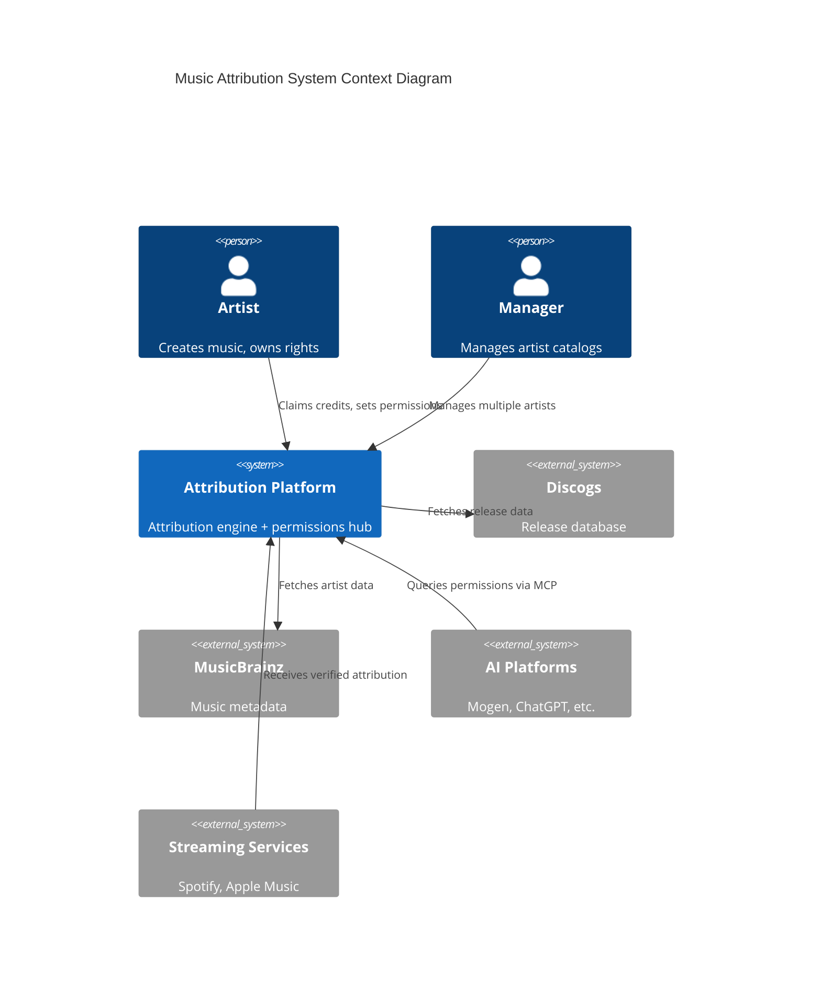
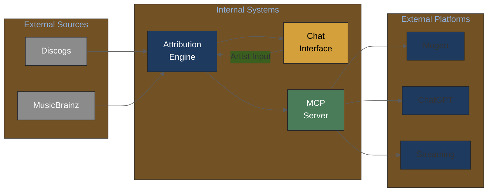
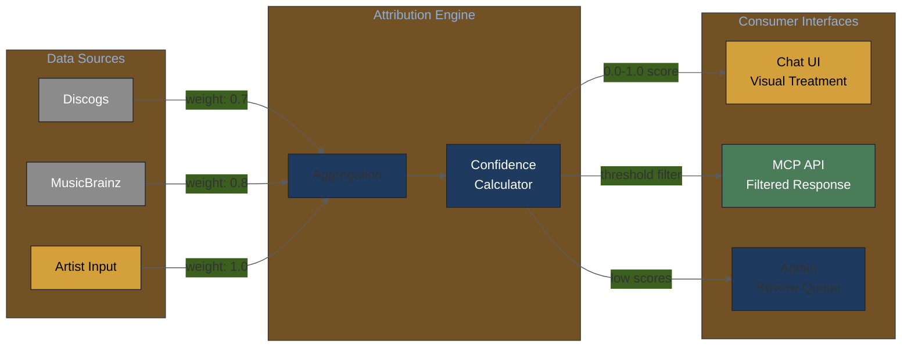
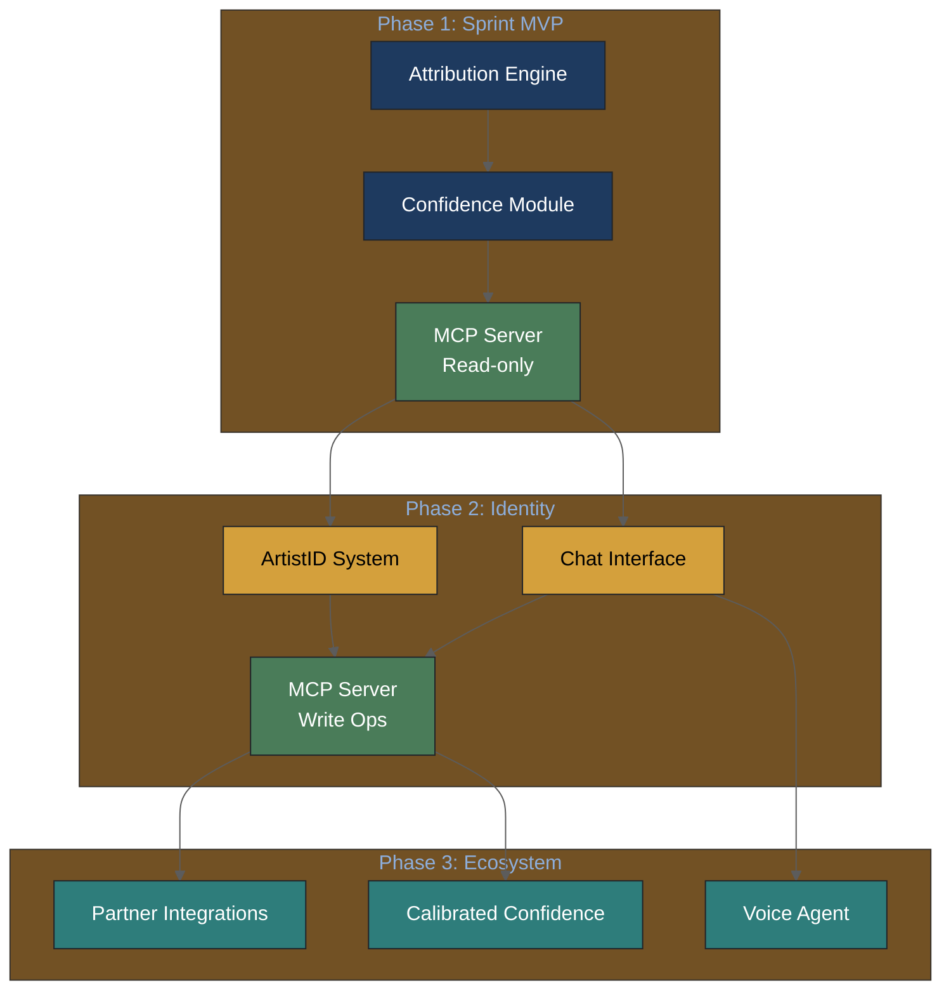
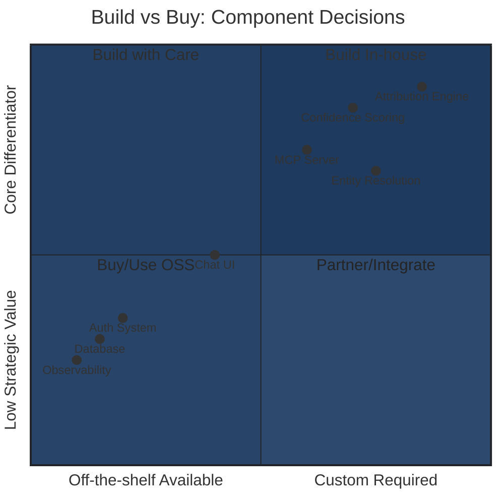
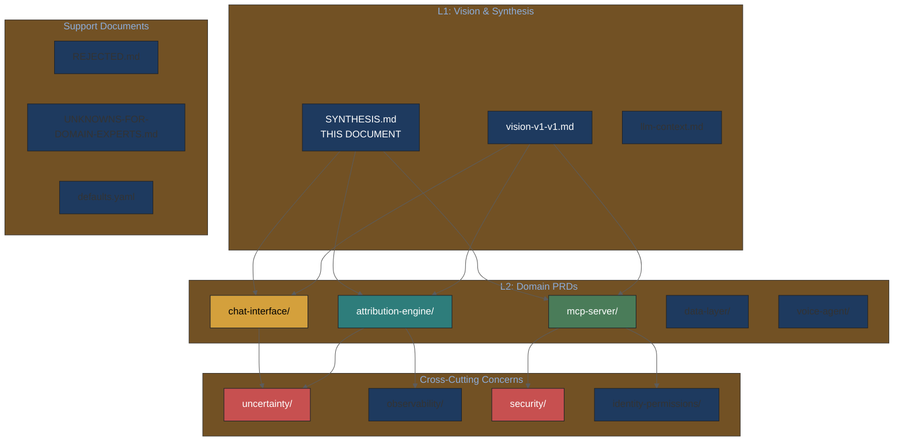
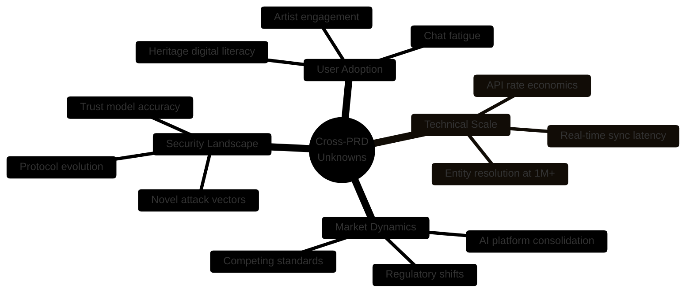
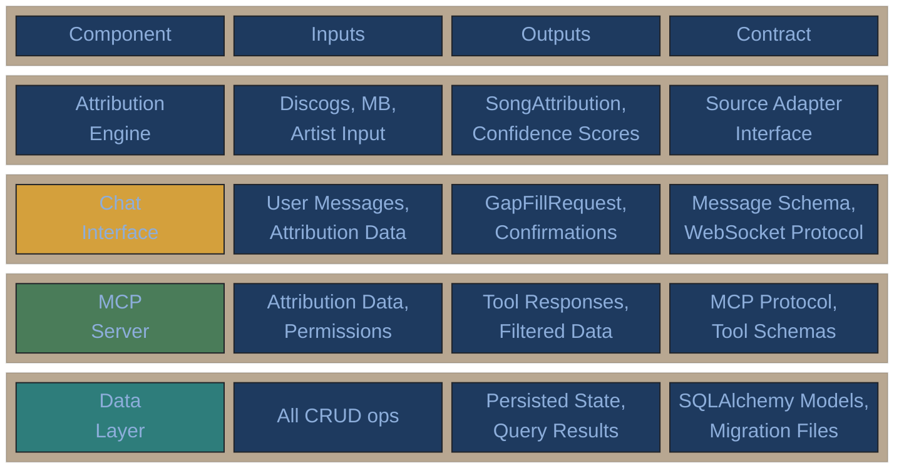

# PRD Synthesis

Cross-cutting insights and decisions across all Music Attribution PRDs.

---

## Executive Summary (For Both Audiences)

**For Stakeholders**: This document shows how all system components work together to solve the music attribution problem.

**For Engineers**: This document defines the contracts between components and shared architectural decisions.

### System Overview



**For Stakeholders**: The system sits at the center of the music data ecosystem, aggregating from sources and serving to platforms.

**For Engineers**: External integrations use distinct protocols: REST for sources, MCP for AI platforms, webhooks for streaming services.

---

## Key Architectural Decisions

| Decision | Choice | Rationale | PRD Reference |
|----------|--------|-----------|---------------|
| Database | PostgreSQL + pgvector | ACID + vectors, no Neo4j complexity | attribution-engine |
| AI Framework | Pure Python + Pydantic | Debuggability, no lock-in | vision-v1 |
| API Protocol | MCP | AI-native, emerging standard | mcp-server |
| UQ Approach | Heuristic → Conformal | API-compatible, formal guarantees | attribution-engine |
| Security | Defense-in-depth | MCPSecBench findings, 4-layer model | mcp-server |

## Cross-PRD Data Flow



### Data Flow Description

| Flow | Description | Contracts |
|------|-------------|-----------|
| Sources → Engine | Raw attribution data ingestion | Source adapter interface |
| Engine → Chat | Confidence-scored data for verification | `SongAttribution` model |
| Chat → Engine | Artist-verified corrections | `GapFillRequest` model |
| Engine → MCP | API-ready attribution responses | `ArtistAttributionResponse` model |
| MCP → Platforms | Permission-checked data access | MCP tool schemas |

## Confidence Score Propagation

Confidence flows through the system:

1. **Attribution Engine** computes per-field confidence (0.0-1.0)
2. **Chat Interface** displays confidence as UX treatment (verified/high/medium/low)
3. **MCP Server** exposes confidence in API responses with `confidence_threshold` filter

### Confidence Flow Diagram



**For Stakeholders**: Artist input has the highest confidence weight (1.0). External sources have lower weights. The system prioritizes artist-verified data.

**For Engineers**: Confidence thresholds are centralized in configuration. All components read from the same source of truth to maintain consistency.

**Consistency requirement**: All components must use the same confidence thresholds:

| Level | Score | Engine | Chat | MCP |
|-------|-------|--------|------|-----|
| verified | ≥0.8 + artist confirm | `level="verified"` | Green checkmark | `confidence_level: "verified"` |
| high | ≥0.8 | `level="high"` | Gray checkmark | `confidence_level: "high"` |
| medium | 0.7-0.8 | `level="medium"` | Yellow question | `confidence_level: "medium"` |
| low | <0.7 | `level="low"` | Red gap | `confidence_level: "low"` |

## Three-Tier Trust Model Application

The MCP trust model affects multiple PRDs:

| Tier | Attribution Engine | Chat Interface | MCP Server |
|------|-------------------|----------------|------------|
| Internal | Full access | Full access | Unlimited |
| Verified | Read + contribute | N/A | 1000 req/hr |
| Public | Read only | N/A | 100 req/hr |

## Open Questions (Cross-PRD)

1. **Disputed credits**: How does chat interface handle conflicts surfaced by attribution engine?
2. **Permission inheritance**: If artist grants permission in chat, how quickly does MCP reflect it?
3. **Confidence calibration**: How large must validation set be before confidence scores are "calibrated"?

## Implementation Sequencing

### Component Dependency Graph



**For Stakeholders**: Arrows show dependencies. Nothing in Phase 2 can start until Phase 1 components are complete.

**For Engineers**: The Attribution Engine is the critical path. Delays there cascade to all downstream components.

```
Phase 1 (Sprint MVP)
├── attribution-engine (core data)
├── mcp-server (read-only API)
└── confidence module (scoring)

Phase 2 (Identity)
├── chat-interface (gap-filling)
└── mcp-server (write ops, permissions)

Phase 3 (Ecosystem)
├── Partner integrations
└── Calibrated confidence
```

### Build vs Buy Decision Matrix



**For Stakeholders**: Components in the top-right (Attribution Engine, Confidence Scoring) are our core differentiators. Components in the bottom-left (Database, Auth) should use existing solutions.

**For Engineers**: Focus engineering effort on top-right quadrant. Use PostgreSQL, standard auth libraries, and observability platforms (Langfuse) for bottom-left.

## Hierarchical PRD Navigation

### PRD Ecosystem Map



### Navigation by Role

| Role | Start Here | Then Read |
|------|------------|-----------|
| **New to project** | [llm-context.md](llm-context.md) | [vision-v1-v1.md](vision-v1-v1.md) |
| **Domain expert** | [UNKNOWNS-FOR-DOMAIN-EXPERTS.md](UNKNOWNS-FOR-DOMAIN-EXPERTS.md) | Vision doc |
| **Backend engineer** | [attribution-engine/toc-attribution-engine.md](attribution-engine/toc-attribution-engine.md) | Data layer PRDs |
| **Frontend engineer** | [chat-interface/toc-chat-interface.md](chat-interface/toc-chat-interface.md) | Voice agent PRDs |
| **API engineer** | [mcp-server/toc-mcp-server.md](mcp-server/toc-mcp-server.md) | Security PRDs |
| **DevOps** | [infrastructure/toc-infrastructure.md](infrastructure/toc-infrastructure.md) | Observability PRDs |

---

## Cross-PRD Unknown Unknowns

Synthesized from individual PRD unknown unknowns sections:



| Unknown | Affected PRDs | Monitoring Approach |
|---------|---------------|---------------------|
| Artist engagement drop-off | Chat Interface, Voice Agent | Session analytics, A/B testing |
| Entity resolution failures | Attribution Engine | Error rate tracking, manual review sampling |
| MCP spec breaking changes | MCP Server | AAIF governance monitoring, abstraction layer |
| Confidence calibration drift | All | Continuous calibration via Langfuse |
| Security zero-days | MCP Server, Data Layer | Bug bounty, security audit schedule |

---

---

## Integration Points Matrix



**For Stakeholders**: Each component has defined inputs and outputs. This ensures teams can work in parallel with clear boundaries.

**For Engineers**: Contracts are enforced via Pydantic models and interface definitions. Breaking changes require migration plans.

---

## Related Knowledge

- [domain/attribution/](../knowledge-base/domain/attribution/) - A0-A3 framework, oracle problem
- [technical/uncertainty/](../knowledge-base/technical/uncertainty/) - Conformal prediction, calibration
- [technical/mcp/](../knowledge-base/technical/mcp/) - Protocol security
- [UNKNOWNS-FOR-DOMAIN-EXPERTS.md](UNKNOWNS-FOR-DOMAIN-EXPERTS.md) - Questions for Imogen/Andy
- [REJECTED.md](REJECTED.md) - Why NOT to use certain technologies
