# Questions for Domain Experts: The system Unknowns

**Purpose**: This document surfaces questions that only domain experts (Imogen, Andy, and the broader music industry) can answer. Your input directly shapes our technical architecture.

**How to Use**:
1. Read each question and the "Why This Matters" context
2. Provide your perspective in the response format
3. Flag questions that trigger NEW questions we haven't asked
4. Don't worry about technical jargon—we'll translate

**Important Context**: This document is informed by Imogen's Medium article (December 2025), conversations with the Mycelia community, and academic research on music attribution systems. We've tried to capture not just what's been said, but what might still be unarticulated.

---

## Quick Navigation

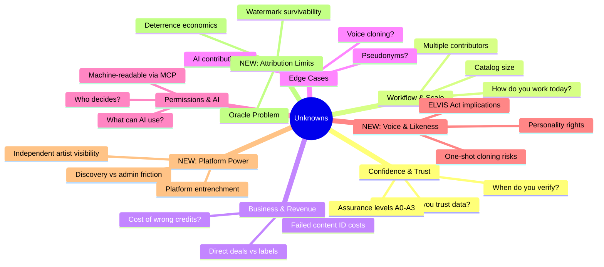

---

## The Two-Friction Taxonomy

Before diving into questions, we want to introduce a framework from academic research that may help structure our thinking:

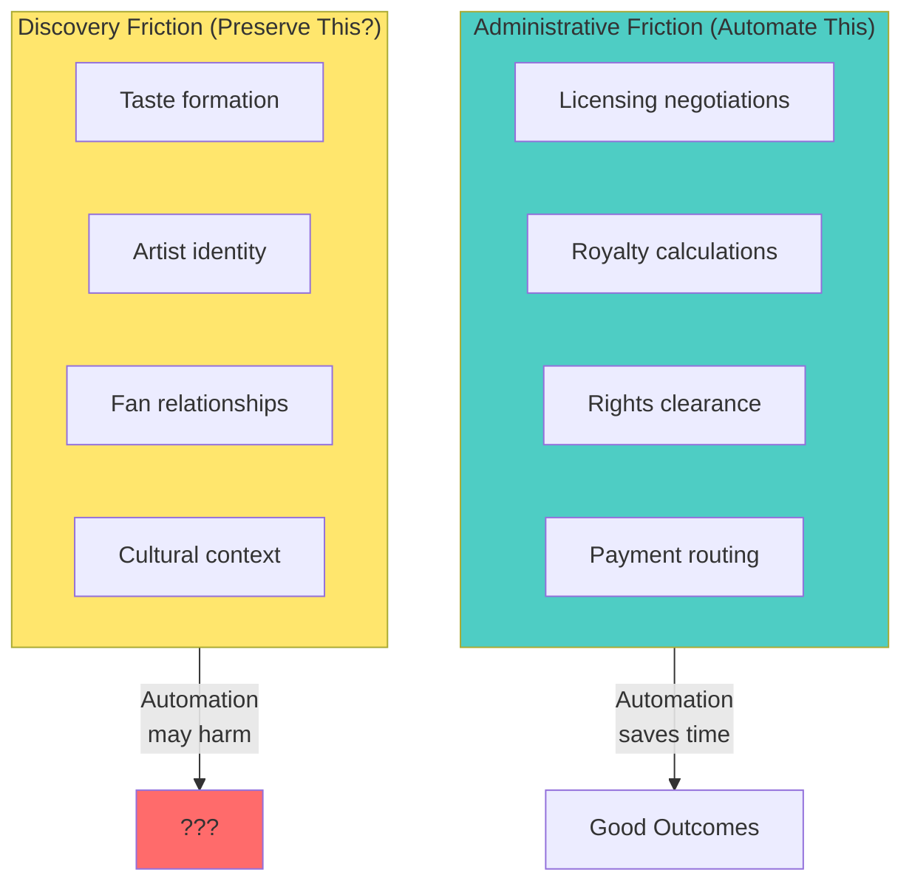

**The Core Tension**: Some friction (paperwork, licensing, royalty tracking) should be automated away. But some friction (how fans discover you, how your identity forms, cultural context) might be valuable. We need your input on where the line is.

---

## Section 1: Confidence & Trust

### Q1.1: What confidence level makes you trust automated data?

**Why This Matters**: We can display "90% confident" on a credit, but we need to know your trust threshold. Too low = you won't use it. Too high = we flag everything for manual review.

**Research Context**: Academic work suggests a tiered "Assurance Level" system:

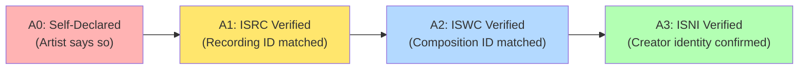

**Options to Consider**:
- [ ] I need A3 (fully verified) to trust any automated data
- [ ] A2 is good enough for most things
- [ ] A1 is fine for low-stakes credits
- [ ] A0 (self-declared) is fine if it's from the artist themselves
- [ ] It depends on the type of credit (explain below)
- [ ] I'll never fully trust automation

**Your Perspective**: _______________________________________________

**Follow-up**: Do you think fans care about assurance levels, or is this just for industry use?

---

### Q1.2: When sources disagree, whose word is final?

**Why This Matters**: Discogs might say "Producer: Rick Rubin" while MusicBrainz says "Producer: Rick Rubin & Andy Wallace". We need a hierarchy.

**Imogen's Insight**: "Artists are the experts on their work and all related data." This suggests artist declaration should be authoritative—but what about when the artist doesn't remember, or when co-creators disagree?

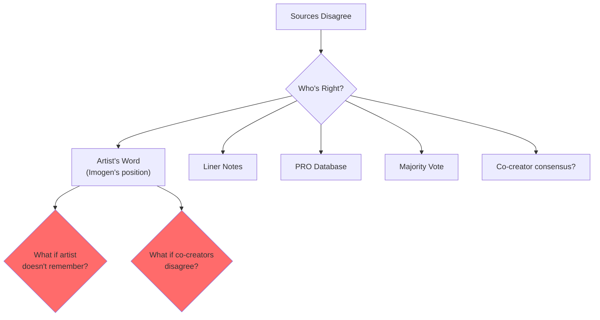

**Your Answer**: _________________________________________________

**Edge Case**: What happens when YOU disagree with a co-creator about credits?

---

### Q1.3: What would make you NOT trust the system?

**Why This Matters**: We need to know the trust-breakers before we build them accidentally.

**Context**: "Do you know how many incomplete data sets of works and failed content ID systems exist?" —Imogen

**Possible Trust-Breakers**:
- [ ] One wrong credit destroys trust
- [ ] Slow updates compared to other sources
- [ ] Can't explain WHERE a credit came from
- [ ] AI making changes without asking
- [ ] Being associated with another failed system
- [ ] Major labels using it to override independent artist data
- [ ] Other: _______________________________________________

**New Question**: What would it take to make you RECOMMEND the system to another artist?

---

### Q1.4: The Oracle Problem—can attribution ever be perfect?

**Why This Matters**: Academic research suggests a fundamental limit: "No watermark survives all transformations." If someone trains an AI on your work without watermarks, we may never be able to prove it post-hoc.

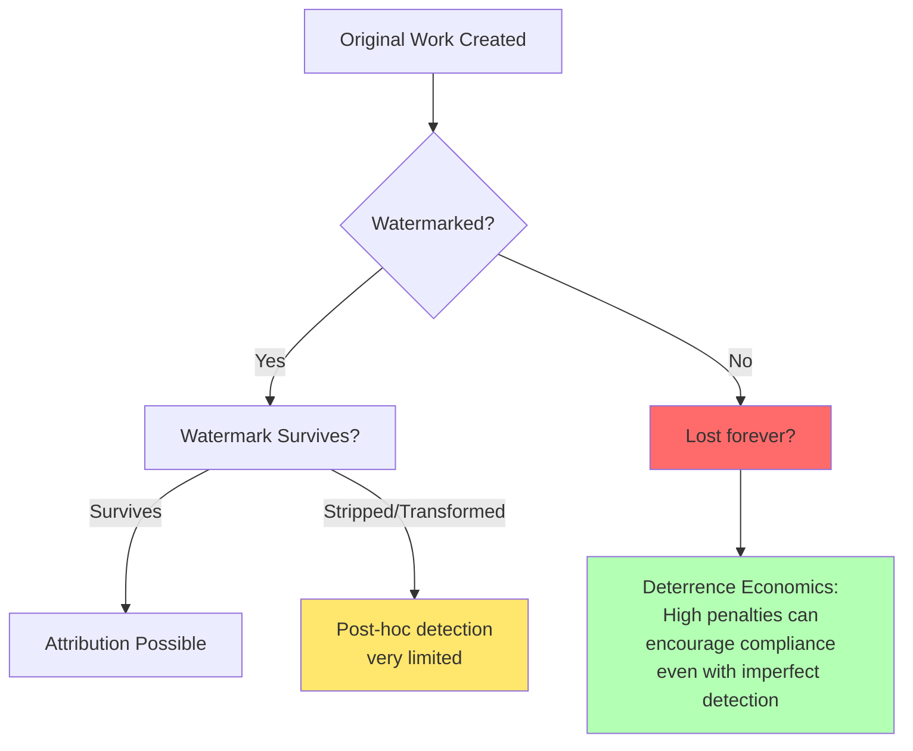

**Your Perspective**:
- Do you accept that perfect attribution is impossible, or is that defeatist?
- Should we focus more on deterrence (making it costly to NOT attribute) rather than detection?
- What matters more: catching bad actors or empowering good actors?

---

## Section 2: Workflow & Scale

### Q2.1: Walk us through how you currently track credits for a release

**Why This Matters**: We're building to fit YOUR workflow, not asking you to change it.

**Imogen's Observation**: "Labels, managers, co-writers, studio musicians, producers" all can contribute data. But who actually DOES?

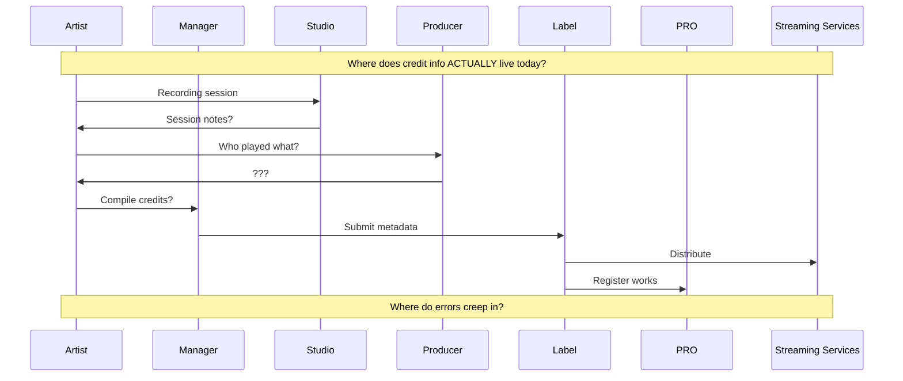

**Your Current Process**: _________________________________________________

**Who Actually Compiles Credits?** (check all that apply)
- [ ] I do it myself
- [ ] My manager
- [ ] A dedicated credit person/team
- [ ] The label
- [ ] It varies project to project
- [ ] Honestly, it's chaos

---

### Q2.2: How many collaborators are typically on one of your albums?

**Why This Matters**: This affects our database design and UI complexity.

| Scale | Impact |
|-------|--------|
| <10 | Simple list UI works |
| 10-50 | Need grouping/filtering |
| 50-100 | Need search, roles hierarchy |
| 100+ | Enterprise-grade complexity |

**Typical Album**: _____ collaborators
**Largest Project**: _____ collaborators

**New Question**: Of these collaborators, how many would you want to have their OWN the system accounts to manage their credits?

---

### Q2.3: How often do credits change AFTER release?

**Why This Matters**: If credits are "set in stone" at release, we build differently than if they change frequently.

- [ ] Never—what's published is final
- [ ] Rarely—maybe corrections once a year
- [ ] Sometimes—samples get cleared, contributors emerge
- [ ] Often—credits are living documents
- [ ] It's complicated: _________________________________________________

**New Edge Case**: Have you ever discovered years later that someone contributed who you'd forgotten to credit?

---

### Q2.4: International releases—same credits or different?

**Why This Matters**: Do we need to track "UK version credits" vs "US version credits"?

**Your Experience**: _________________________________________________

---

### Q2.5: The problem of obscurity—how do you find collaborators?

**Why This Matters**: Imogen notes that independent artists have "no way to be found" for AI training deals and collaborations.

**Your Experience**:
- How do people find YOU for collaboration?
- How do you find collaborators?
- Would you use the system to discover potential collaborators based on their attribution data?

---

## Section 3: Business & Revenue Impact

### Q3.1: How much does incorrect attribution cost you annually?

**Why This Matters**: This determines how much the solution is worth and how precise we need to be.

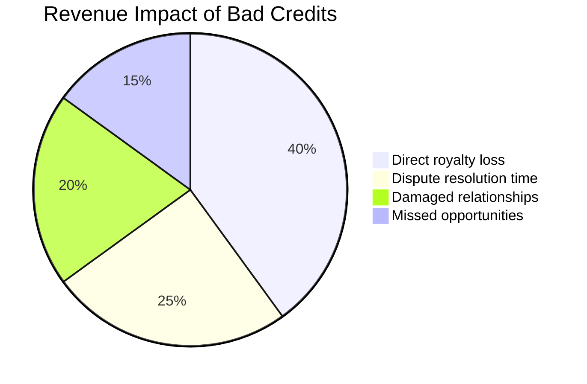

**Estimated Annual Impact**: £_______________

**Biggest Pain Point**: _________________________________________________

---

### Q3.2: Direct deals vs. label intermediation

**Why This Matters**: "Artists want to do deals directly because it makes sense for everyone." —Imogen

**Context**: Major labels are cutting AI deals WITHOUT asking artists. Were you asked about any of these deals?

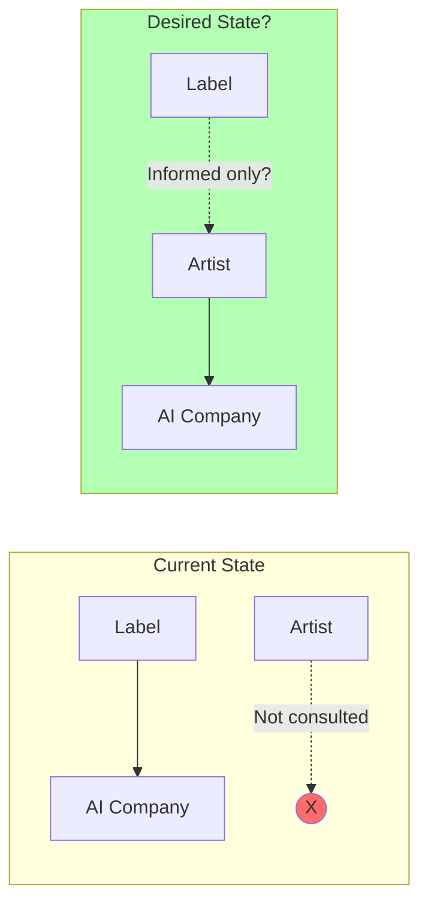

**Your Perspective**:
- Have you been contacted about any AI training deals?
- Would you want to do deals directly with AI companies?
- What role (if any) should labels play in these negotiations?

---

### Q3.3: Who else needs access to your attribution data?

**Why This Matters**: Multi-tenant architecture, permission systems, and pricing all depend on this.

- [ ] Just me
- [ ] My management team
- [ ] Record label
- [ ] Publisher
- [ ] PRO (ASCAP/BMI/PRS)
- [ ] Sync licensing agents
- [ ] AI companies (for training/generation)
- [ ] Other independent artists (for collaboration discovery)
- [ ] Fans (limited view)
- [ ] Other: _______________________________________________

---

### Q3.4: What would you pay for accurate, maintained attribution?

**Why This Matters**: Helps us build a sustainable business model.

- [ ] Nothing—this should be free (funded how?)
- [ ] One-time fee per album
- [ ] Monthly subscription
- [ ] Percentage of recovered royalties
- [ ] Enterprise licensing for organizations
- [ ] Freemium (basic free, premium features paid)
- [ ] Other: _______________________________________________

---

## Section 4: Edge Cases & Complications

### Q4.1: How do you handle pseudonyms and aliases?

**Why This Matters**: Is "Burial" the same as "William Bevan"? Should they be linked or separate?

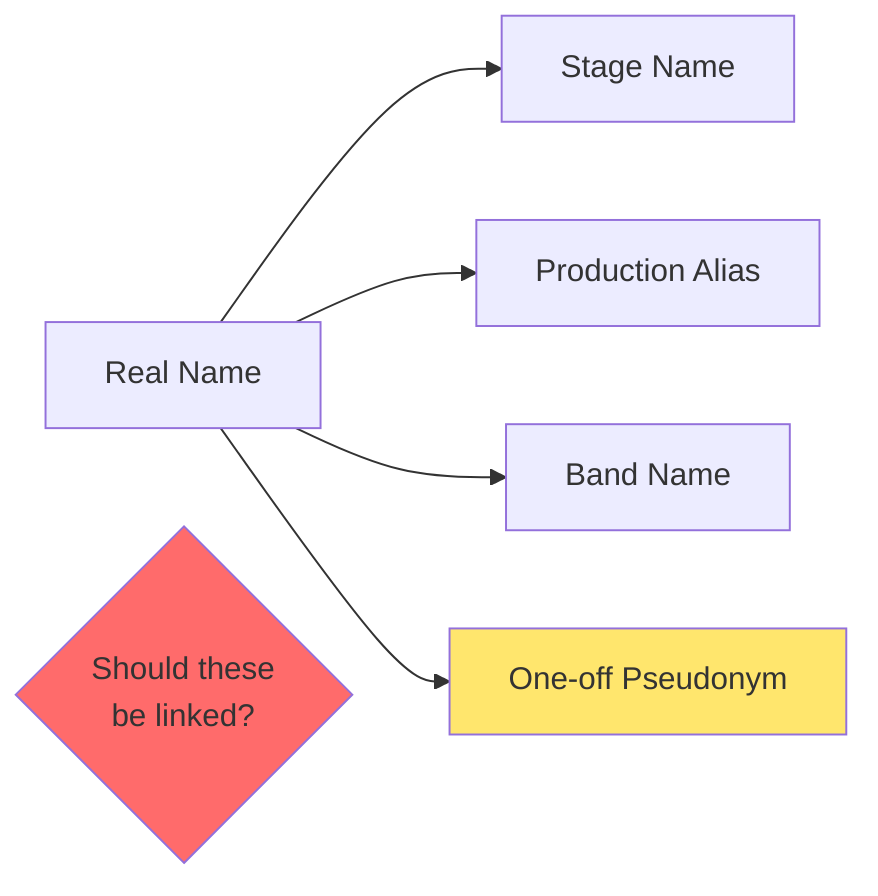

**Your Approach**: _________________________________________________

**Privacy Question**: If you use a pseudonym specifically for privacy, should the system ever reveal the connection?

---

### Q4.2: What about uncredited contributions?

**Why This Matters**: Some contributors prefer to stay uncredited. Do we track them anyway?

- [ ] Track privately, display only to authorized parties
- [ ] Don't track at all if uncredited
- [ ] Artist decides on case-by-case basis
- [ ] Track for royalty purposes but not display
- [ ] Other: _______________________________________________

---

### Q4.3: Samples and interpolations—who gets credited?

**Why This Matters**: If you sample a track, does the original artist appear in YOUR credits?

**Your Practice**: _________________________________________________

---

### Q4.4: AI-generated contributions—how should they be credited?

**Why This Matters**: This is emerging territory. Your input shapes industry norms.

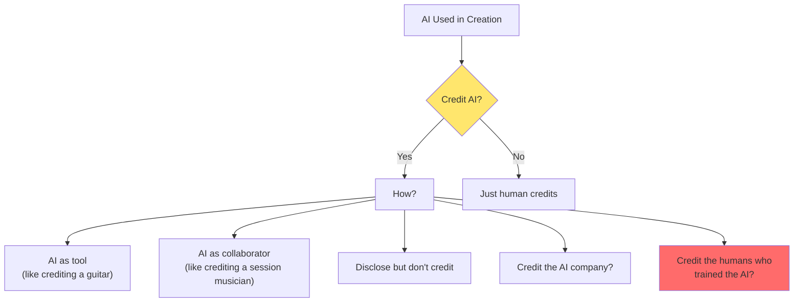

**Your View**: _________________________________________________

**Harder Question**: If an AI was trained on YOUR work, and then helps create someone else's song, should you be credited on THAT song?

---

## Section 5: Permissions & AI Integration

### Q5.1: Machine-readable permissions via MCP

**Why This Matters**: "Connecting models to the system.io through MCPs could revolutionise the system" —Imogen

**What's an MCP?** Model Context Protocol—a way for AI systems to read your permissions automatically, without a human in the loop for every request.

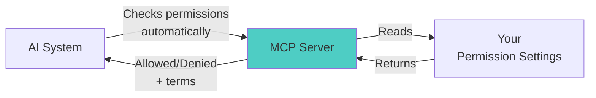

**Your Reaction**:
- [ ] Love it—automate everything
- [ ] Cautiously optimistic
- [ ] Worried about losing control
- [ ] Need to understand more
- [ ] Don't want machines making decisions about my work

**Your Questions About MCP**: _________________________________________________

---

### Q5.2: The Permission Patchbay—granular consent

**Why This Matters**: Instead of "yes/no" for AI use, you could specify exactly what's allowed.

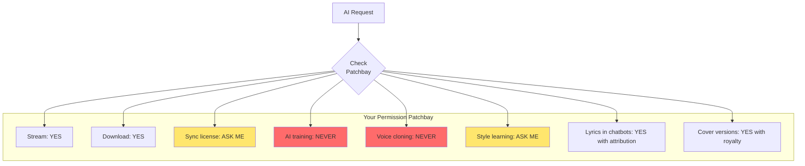

**Your Reaction**: Is this level of granularity useful or overwhelming?

**What Permissions Would YOU Set?**: _________________________________________________

---

### Q5.3: What can AI companies do with your data WITHOUT asking?

**Why This Matters**: This is the core of the permission system design.

- [ ] Nothing—always ask first
- [ ] Read public metadata (names, roles)
- [ ] Use for search/discovery
- [ ] Index lyrics for chat responses (with attribution)
- [ ] Train models on style/patterns
- [ ] Generate new content inspired by me
- [ ] Other: _______________________________________________

---

### Q5.4: What MUST AI companies ask permission for?

**Why This Matters**: Defines our permission bundle structure and "red lines."

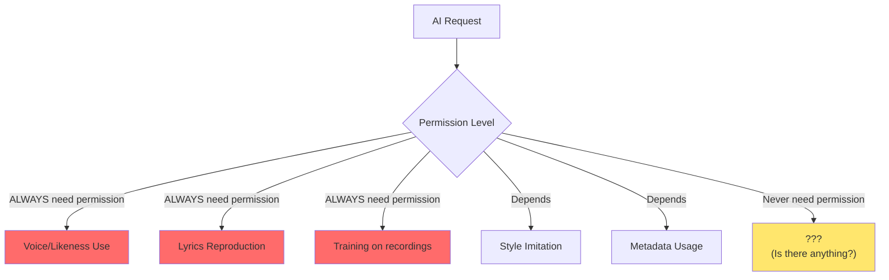

**Your Red Lines**: _________________________________________________

---

### Q5.5: How should permission requests reach you?

**Why This Matters**: Affects our notification and approval workflow.

- [ ] Email me every request
- [ ] Batch digest (daily/weekly)
- [ ] Only notify for commercial uses
- [ ] Auto-approve based on my settings (MCP handles it)
- [ ] Route through my manager
- [ ] Different channels for different permission types
- [ ] Other: _______________________________________________

---

## Section 6: Voice, Likeness & Personality Rights (NEW)

### Q6.1: Voice cloning and the ELVIS Act

**Why This Matters**: The ELVIS Act (and similar laws) now protect voice and likeness as personality rights. Research shows that AI can clone a voice from as little as 3 seconds of audio.

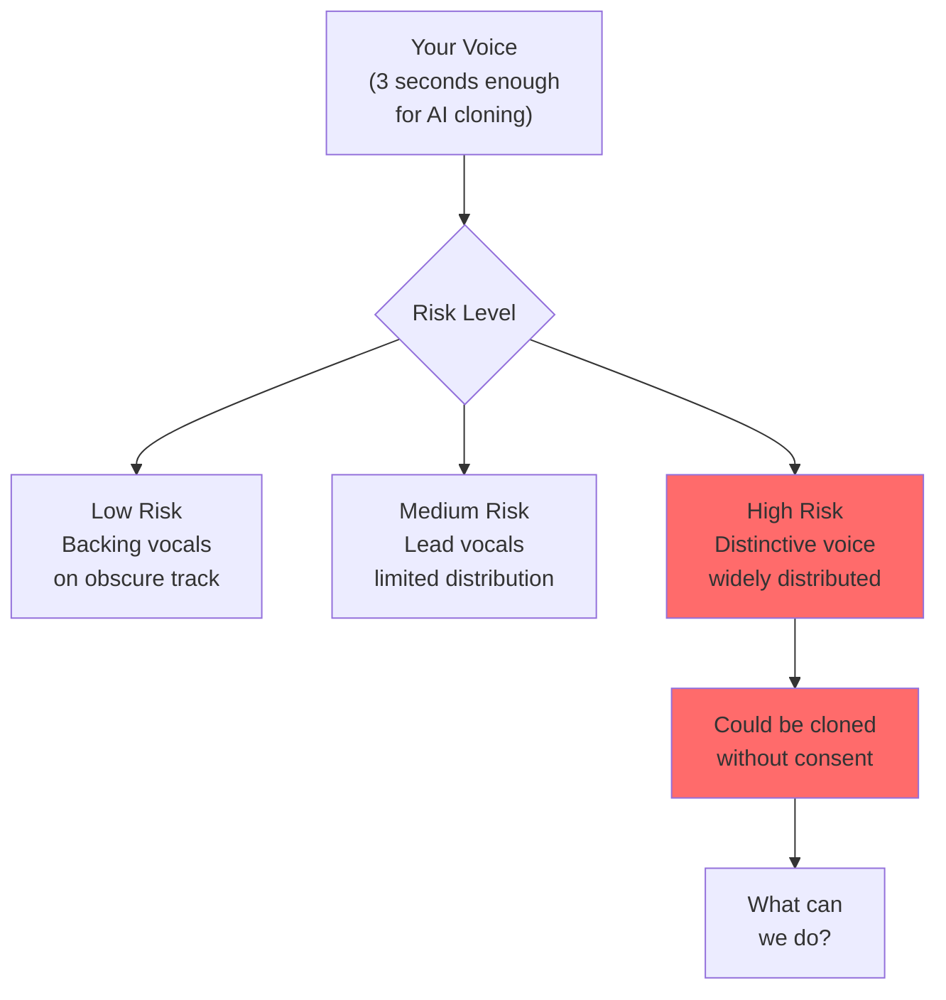

**Your Concerns**:
- How worried are you about voice cloning?
- Have you experienced unauthorized voice use?
- Should voice permissions be separate from other music permissions?

---

### Q6.2: What makes YOUR voice/style distinctive?

**Why This Matters**: If we're going to protect something, we need to understand what "it" is.

**Your Self-Assessment**:
- What do people recognize about YOUR sound?
- Is it your voice? Your production style? Your songwriting patterns?
- Could you articulate what makes you "you"?

---

### Q6.3: Impersonation vs. Inspiration

**Why This Matters**: There's a spectrum from "sounds like" to "is pretending to be."

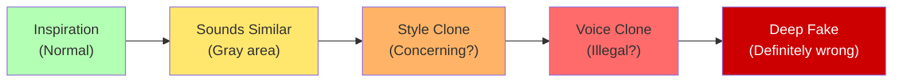

**Where Do You Draw Lines?**:
- At what point does "inspired by" become "ripping off"?
- Should AI-generated music that "sounds like you" require your permission?
- What about a human artist who sounds like you?

---

### Q6.4: "Digital twin" voice agent—revisited with context

**Why This Matters**: The voice agent could serve multiple purposes, but voice cloning for any purpose has implications.

**Potential Uses**:
1. **Attribution collection**: An AI "you" that can answer questions about credits
2. **Fan interaction**: Fans could "talk to" an AI version of you
3. **Content creation**: AI generates content "in your style"
4. **Rights management**: AI negotiates permissions on your behalf

**Your Comfort Level** (rate each 1-5):
- Attribution collection: _____
- Fan interaction: _____
- Content creation: _____
- Rights management: _____

**Your Thoughts**: _________________________________________________

---

## Section 7: Platform Power & Discovery (NEW)

### Q7.1: The Platform Entrenchment Paradox

**Why This Matters**: Research suggests AI agents might INCREASE platform power rather than reduce it. If everyone uses AI to find music, the AI chooses who gets heard.

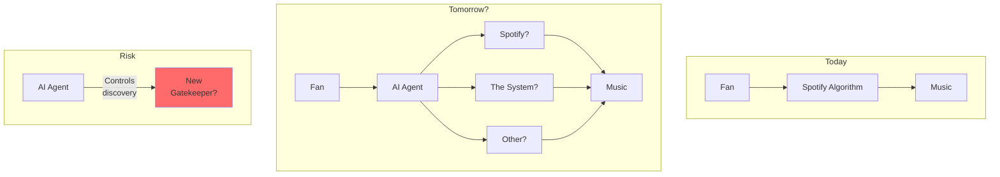

**Your Concerns**:
- Do you worry about AI becoming a new gatekeeper?
- Would you prefer humans to discover your music, even if AI is more efficient?
- How important is the "journey" of music discovery vs. just finding "good" music?

---

### Q7.2: Discovery friction—preserve or automate?

**Why This Matters**: The two-friction taxonomy suggests some friction (admin/licensing) should be automated, but discovery friction might be valuable.

**Discovery Friction Includes**:
- Fans browsing record stores
- Word-of-mouth recommendations
- Radio DJ curation
- Reading album liner notes
- Discovering an artist through a cover version

**Your View**:
- Should AI make it easier to find music, or does that remove something valuable?
- Is there a difference between "finding" and "being found"?
- Do you value fans who discovered you "the hard way"?

---

### Q7.3: The independent artist visibility problem

**Why This Matters**: "Independent artists have no way to be found" for AI training deals and other opportunities.

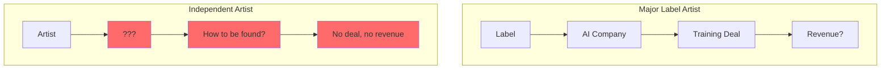

**Your Experience**:
- How do opportunities currently find independent artists?
- Would you use the system as a "discoverability" tool?
- What information would help AI companies find YOU (if you wanted to be found)?

---

### Q7.4: If The system succeeds, who wins?

**Why This Matters**: We want to build something that empowers artists, not a new tool for platforms to extract more value.

**Scenario Planning**:
- If the system becomes the standard, who benefits most?
- Could labels/platforms use the system against artist interests?
- What safeguards should we build in?

---

## Section 8: The Limits of Attribution (NEW)

### Q8.1: What can't be attributed?

**Why This Matters**: Some contributions may be fundamentally unattributable.

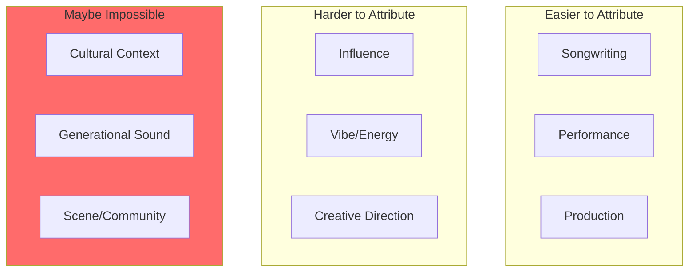

**Your Thoughts**:
- What contributions matter but can't be easily credited?
- Is there value in trying to credit the uncreditable?
- What gets lost in formal attribution systems?

---

### Q8.2: When attribution fails, what's the backup?

**Why This Matters**: Even with perfect systems, attribution will sometimes fail.

**Options**:
- [ ] Accept it—some things can't be tracked
- [ ] Default to "unknown" with revenue held in escrow
- [ ] Community/collective pools for unattributable contributions
- [ ] Legal deterrence (sue bad actors)
- [ ] Social deterrence (reputation damage)
- [ ] Other: _______________________________________________

---

### Q8.3: The "good enough" question

**Why This Matters**: Perfect is the enemy of good. What level of attribution is "good enough"?

**Your Threshold**:
- 80% accurate? 90%? 99%?
- Does it depend on the stakes (royalties vs. credits)?
- Would you rather have 100% of simple credits or 60% of complex credits?

---

## Section 9: Things We Haven't Thought Of

### Q9.1: What question should we have asked but didn't?

**Why This Matters**: This is where unknown unknowns become known unknowns.

**Missing Questions**: _________________________________________________

---

### Q9.2: What assumptions are we making that might be wrong?

**Why This Matters**: We're engineers. We make assumptions. Many are probably wrong.

**Possible Bad Assumptions**:
- Artists want to control their data (maybe some don't?)
- Attribution is always good (maybe sometimes it's not?)
- AI is the main threat (maybe it's platforms? Labels? Something else?)
- Technology can solve this (maybe it's a legal/cultural problem?)

**Your Reaction**: _________________________________________________

---

### Q9.3: What's the one thing that would make the system indispensable?

**Your Vision**: _________________________________________________

---

### Q9.4: What's happening in the music industry that we should be preparing for?

**Why This Matters**: We want to build for 5 years from now, not just today.

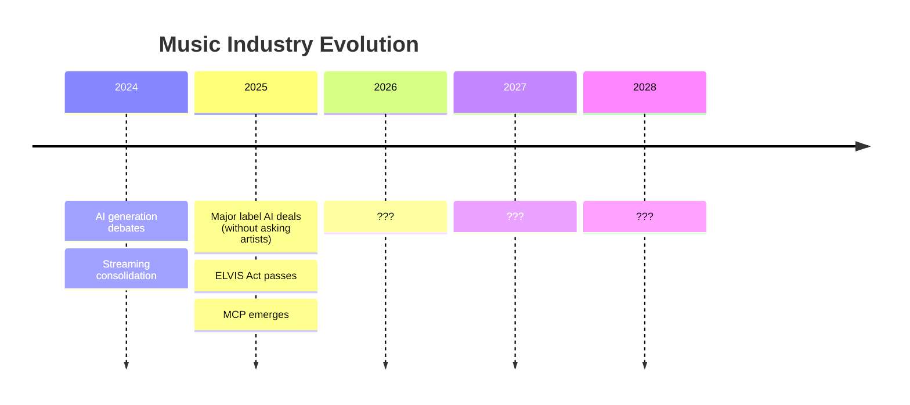

**Your Predictions**: _________________________________________________

---

### Q9.5: What do YOU need that you've never articulated?

**Why This Matters**: Sometimes the most important needs are the ones we haven't found words for yet.

**Prompts to Consider**:
- What do you wish existed but have given up asking for?
- What problem do you solve with workarounds that should be solved properly?
- What would your ideal day look like if attribution "just worked"?
- What would you build if you had unlimited engineering resources?

**Your Unarticulated Needs**: _________________________________________________

---

## Section 10: Technical Translations for Domain Experts

**You don't need to understand this section—it's for our reference. But if you're curious:**

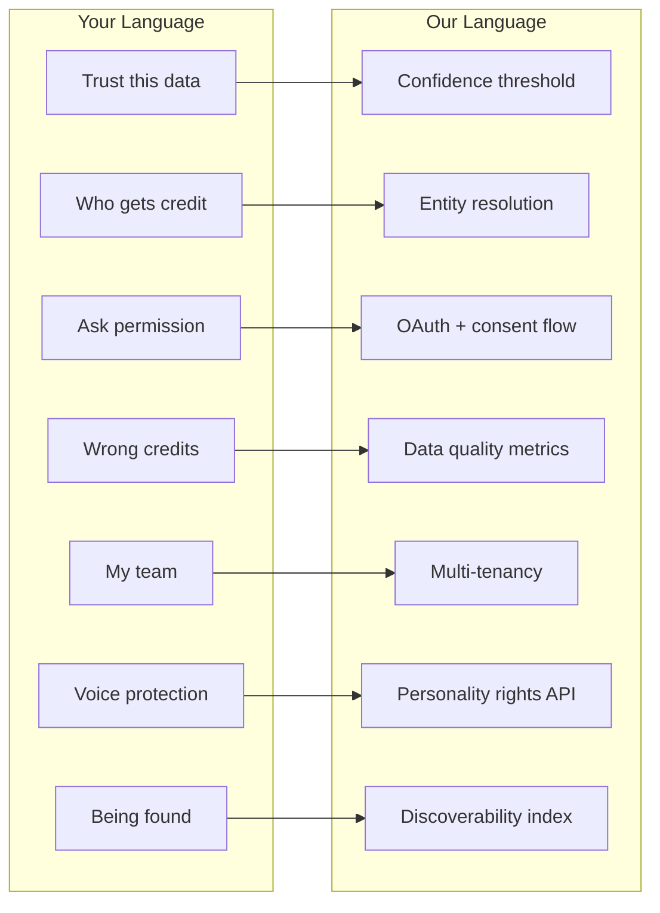

| Domain Expert Term | Technical Term | Why It Matters |
|--------------------|----------------|----------------|
| "Trust this data" | Confidence threshold (A0-A3) | Database design |
| "Who gets credit" | Entity resolution | Graph modeling |
| "Ask permission" | OAuth + MCP consent flow | API architecture |
| "Wrong credits" | Data quality metrics | Validation rules |
| "My team" | Multi-tenancy | Security model |
| "Voice protection" | Personality rights API | Legal compliance |
| "Being found" | Discoverability index | Search/recommendation |
| "Direct deals" | Disintermediation | Business model |
| "Admin friction" | Automation targets | Feature prioritization |
| "Discovery friction" | Preserved serendipity | Product philosophy |

---

## Response Format

Please respond in whatever format is comfortable:
- Fill in this document directly
- Voice memo/recording
- Conversation with the team
- Email with your thoughts
- Annotate a PDF
- Sketch on paper and photograph it

**Contact**: [Team contact info]

**Deadline**: No hard deadline, but earlier input = more influence on architecture

---

## What Happens Next

1. We synthesize all domain expert input
2. Technical team translates to architecture decisions
3. We share back "here's what we heard and what we're building"
4. You review and we iterate
5. Repeat until we get it right

```mermaid
flowchart LR
    A[Your Input] --> B[Synthesis]
    B --> C[Architecture Decisions]
    C --> D[Proposal Back to You]
    D --> E[Your Feedback]
    E --> B

    F["Your Unarticulated Needs"] -.->|"Emerges over time"| A

    style A fill:#4ecdc4
    style E fill:#4ecdc4
    style F fill:#ffe66d
```

---

## Appendix: Key Concepts Referenced

### The Two-Friction Taxonomy
Academic research distinguishes between **administrative friction** (licensing, royalties, clearance—should be automated) and **discovery friction** (taste formation, identity, cultural context—may have value).

### Assurance Levels (A0-A3)
A tiered confidence system: A0 = self-declared, A1 = ISRC verified, A2 = ISWC verified, A3 = ISNI verified.

### The Oracle Problem
Post-hoc attribution has fundamental limits. No watermark survives all transformations. This suggests prevention and deterrence may matter more than detection.

### MCP (Model Context Protocol)
A way for AI systems to automatically check permissions without human intervention for each request.

### Permission Patchbay
Granular consent where you can set different rules for different uses (stream: yes, clone: never, sync: ask me).

### Platform Entrenchment Paradox
The risk that AI agents become new gatekeepers, potentially increasing rather than decreasing platform power.

### ELVIS Act
Legislation protecting voice and likeness as personality rights, relevant to voice cloning concerns.

---

**Thank you for your time and expertise. The music industry has spent decades with broken attribution. Your input helps us build something that actually works.**
