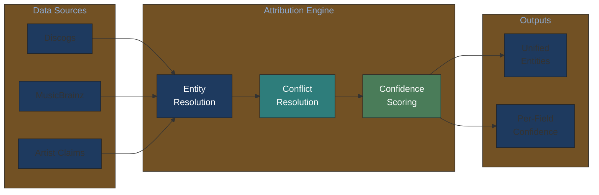
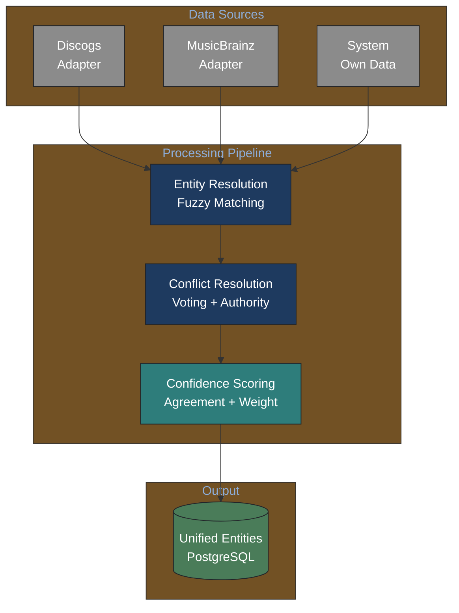
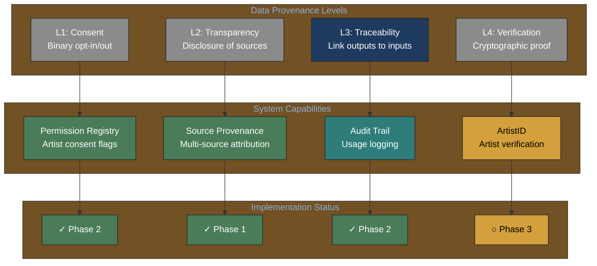
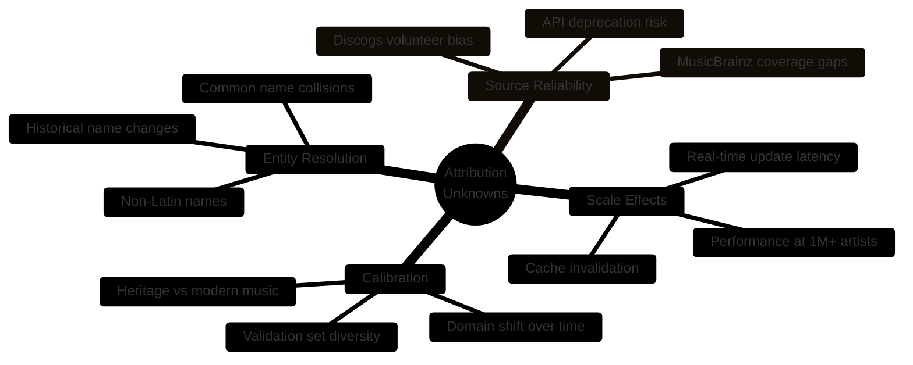
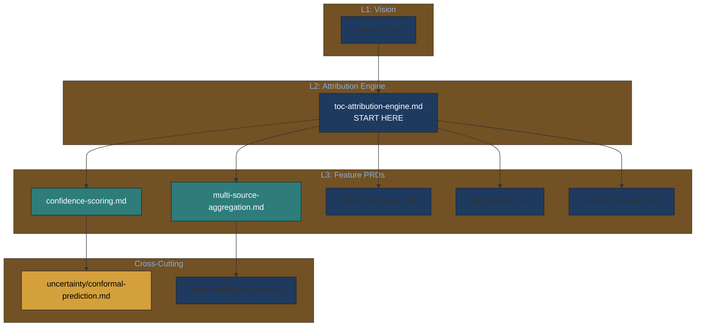

# Attribution Engine PRD v1

> **Navigation Note**: This is a legacy flat PRD. For the new hierarchical structure with granular feature PRDs, see [attribution-engine/toc-attribution-engine.md](attribution-engine/toc-attribution-engine.md).

---

## For Domain Experts

**What this document covers**: Multi-source music attribution data aggregation with confidence scoring.

**Key decisions needing domain input**:
- Entity resolution accuracy for non-Latin names (Q1 in [UNKNOWNS-FOR-DOMAIN-EXPERTS.md](UNKNOWNS-FOR-DOMAIN-EXPERTS.md))
- Confidence thresholds for automated vs. manual verification
- Source authority weights (e.g., should MusicBrainz rank higher than Discogs?)

**Quick architecture overview**:



---

## Metadata

- **Version**: 0.8.0
- **Status**: Draft
- **Created**: 2026-02-03
- **Updated**: 2026-02-03
- **Author**: Claude Code
- **Lineage**: PLAN.md Section 11, original-prompt.md

## Executive Summary

- **What**: Multi-source attribution data aggregation with confidence scoring
- **Why**:
  - Single sources contain 40%+ errors
  - Cross-referencing improves accuracy dramatically
  - Confidence scores enable appropriate UI/UX decisions
- **Investment**: 2-3 weeks for MVP
- **Confidence**: High for architecture, medium for entity resolution accuracy

## 1. Problem Statement

### 1.1 Current State

Music attribution data exists in silos:

| Source | Strengths | Weaknesses |
|--------|-----------|------------|
| **Discogs** | Comprehensive releases, user-contributed | Community-edited, inconsistent |
| **MusicBrainz** | Structured, linked data | Incomplete for non-mainstream |
| **Artist claims** | Authoritative for own work | Self-serving, unverified |

### 1.2 Pain Points

1. **No single source of truth**: Each database has gaps and errors
2. **Entity resolution**: "John Smith" on Discogs ≠ guaranteed same person on MusicBrainz
3. **Conflict resolution**: Sources disagree on credits
4. **Confidence opacity**: Users don't know how trustworthy data is

## 2. Product Vision

### 2.1 Vision Statement

> Cross-reference multiple sources to produce attribution data with explicit confidence, enabling users and AI to make informed decisions based on data quality.

### 2.2 Success Definition

- 90%+ accuracy on cross-referenced claims
- Sub-500ms query response time
- Transparent confidence explanations

## 3. Technical Architecture

### 3.1 Pipeline Overview



### 3.2 Entity Resolution Strategy

Phase 1 (MVP): Rule-based + phonetic matching

```python
from dataclasses import dataclass
import jellyfish  # Phonetic algorithms

@dataclass
class EntityCandidate:
    source: str
    name: str
    identifiers: dict  # ISNI, Discogs ID, MBID, etc.

def match_entities(candidates: list[EntityCandidate]) -> float:
    """Return match probability for entity candidates."""
    # 1. Exact identifier match (ISNI, etc.) -> 1.0
    # 2. Phonetic match (Soundex, Metaphone) -> 0.7-0.9
    # 3. Fuzzy string match (Levenshtein) -> 0.5-0.8
    # 4. No match -> 0.0
    ...
```

Phase 2: Neural entity resolution (dedupe library or custom)

### 3.3 Conflict Resolution Matrix

When sources disagree:

| Scenario | Resolution | Confidence Impact |
|----------|------------|-------------------|
| All sources agree | Accept | High boost |
| Majority agree | Accept majority | Medium |
| Split (50/50) | Flag for review | Low |
| Single source | Accept with caveat | Lowest |

Authority weights apply:

```python
AUTHORITY_WEIGHTS = {
    "system_own": 1.0,    # Artist-verified
    "musicbrainz": 0.8,     # Community-curated
    "discogs": 0.7,         # User-contributed
    "user_submitted": 0.5,  # Unverified claims
    "automated_extraction": 0.4,
}
```

## 4. Data Model

### 4.1 Core Tables

```sql
-- Raw data from sources (immutable)
CREATE TABLE source_records (
    id UUID PRIMARY KEY,
    source_name TEXT NOT NULL,  -- 'discogs', 'musicbrainz', 'attribution'
    source_id TEXT NOT NULL,
    record_type TEXT NOT NULL,  -- 'artist', 'release', 'credit'
    raw_data JSONB NOT NULL,
    fetched_at TIMESTAMPTZ NOT NULL,
    UNIQUE (source_name, source_id, record_type)
);

-- Resolved, deduplicated entities
CREATE TABLE unified_entities (
    id UUID PRIMARY KEY,
    entity_type TEXT NOT NULL,  -- 'artist', 'work', 'release'
    canonical_name TEXT NOT NULL,
    overall_confidence FLOAT NOT NULL,
    metadata JSONB,
    created_at TIMESTAMPTZ NOT NULL,
    updated_at TIMESTAMPTZ NOT NULL
);

-- Links between source records and unified entities
CREATE TABLE entity_links (
    source_record_id UUID REFERENCES source_records(id),
    unified_entity_id UUID REFERENCES unified_entities(id),
    match_confidence FLOAT NOT NULL,
    match_method TEXT NOT NULL,  -- 'exact_id', 'phonetic', 'fuzzy'
    PRIMARY KEY (source_record_id, unified_entity_id)
);

-- Per-field confidence tracking
CREATE TABLE field_confidence (
    unified_entity_id UUID REFERENCES unified_entities(id),
    field_name TEXT NOT NULL,
    field_value TEXT,
    confidence FLOAT NOT NULL,
    sources TEXT[] NOT NULL,  -- Which sources agree
    PRIMARY KEY (unified_entity_id, field_name)
);
```

### 4.2 Pydantic Models

```python
from pydantic import BaseModel
from typing import Literal

class Credit(BaseModel):
    """Individual credit claim."""
    name: str
    role: str  # 'composer', 'performer', 'producer', etc.
    confidence: float
    sources: list[str]

class SongAttribution(BaseModel):
    """Attribution data for a single song."""
    song_id: str
    title: str
    composers: list[Credit]
    performers: list[Credit]
    producers: list[Credit]
    field_confidence: dict[str, float]

class ArtistAttributionResponse(BaseModel):
    """Complete artist attribution response."""
    artist_id: str
    canonical_name: str
    overall_confidence: float
    confidence_level: Literal["verified", "high", "medium", "low"]
    songs: list[SongAttribution]
    sources_consulted: list[str]
    last_updated: str
```

## 5. Confidence Scoring

### 5.1 Algorithm

```python
def compute_confidence(sources: list[DataSource]) -> ConfidenceResult:
    """Compute confidence from multi-source agreement."""
    if not sources:
        return ConfidenceResult(
            score=0.0,
            level="low",
            sources=[],
            explanation="No sources available"
        )

    n_sources = len(sources)
    n_agreeing = count_agreeing_sources(sources)

    # Base confidence from agreement ratio
    agreement_ratio = n_agreeing / n_sources

    # Boost for authoritative sources
    authority_boost = sum(
        AUTHORITY_WEIGHTS.get(s.name, 0.5)
        for s in sources
    ) / n_sources

    # Combined score (cap at 0.95)
    score = min(0.95, agreement_ratio * 0.7 + authority_boost * 0.3)

    # Assign level
    if score >= 0.8:
        level = "verified" if any(s.name == "system_own" for s in sources) else "high"
    elif score >= 0.7:
        level = "medium"
    else:
        level = "low"

    return ConfidenceResult(
        score=score,
        level=level,
        sources=[s.name for s in sources],
        explanation=f"{n_agreeing}/{n_sources} sources agree"
    )
```

### 5.2 Confidence Levels and UX

| Level | Score Range | UI Treatment |
|-------|-------------|--------------|
| **verified** | 0.8+ with artist confirmation | Show as fact |
| **high** | 0.8+ | Show with subtle indicator |
| **medium** | 0.7-0.8 | Show with "may need verification" |
| **low** | <0.7 | Prompt for confirmation |

### 5.3 Calibration Requirements

**Phase 1 MUST include**:

- Validation set of 100+ manually verified attributions
- ECE (Expected Calibration Error) computation
- If ECE > 0.15, display disclaimer about uncalibrated scores

### 5.4 Attribution Type Distinction (Research-Informed)

Per research synthesis ([music-attribution-research-2026-02-03.md](../knowledge-base/domain/music-industry/music-attribution-research-2026-02-03.md)):

| Attribution Type | Definition | System Approach |
|-----------------|------------|-------------------|
| **Corroborative** | Similarity-based, does NOT prove causation | Default for multi-source agreement |
| **Verified** | Artist-confirmed with cryptographic proof | Requires A3 level + artist signature |

**Critical Insight**: Similarity does not imply causation (Morreale et al., 2025). the system's confidence scores measure *evidence strength for compliant participants*, not adversarial proof.

```python
class ConfidenceResult(BaseModel):
    """Confidence result with explicit type distinction."""
    score: float
    level: Literal["verified", "high", "medium", "low"]
    attribution_type: Literal["corroborative", "verified"]  # NEW
    explanation: str

    @property
    def disclaimer(self) -> str | None:
        if self.attribution_type == "corroborative":
            return "Based on source agreement; does not prove causal influence."
        return None
```

## 6. Source Adapters

### 6.1 Discogs Adapter

```python
class DiscogsAdapter(SourceAdapter):
    """Adapter for Discogs API."""

    async def fetch_artist(self, artist_id: str) -> dict:
        """Fetch artist data from Discogs."""
        # Rate limit: 60 requests/minute
        ...

    async def fetch_releases(self, artist_id: str) -> list[dict]:
        """Fetch all releases for an artist."""
        ...

    async def fetch_credits(self, release_id: str) -> list[dict]:
        """Fetch credit details for a release."""
        ...
```

### 6.2 MusicBrainz Adapter

```python
class MusicBrainzAdapter(SourceAdapter):
    """Adapter for MusicBrainz API."""

    async def fetch_artist(self, mbid: str) -> dict:
        """Fetch artist by MusicBrainz ID."""
        # Rate limit: 1 request/second (be nice!)
        ...

    async def fetch_recordings(self, artist_mbid: str) -> list[dict]:
        """Fetch recordings associated with artist."""
        ...
```

## 7. Implementation Roadmap

### Phase 1: MVP (Week 1-2)

- [ ] Source adapters (Discogs, MusicBrainz)
- [ ] Basic entity resolution (exact ID match only)
- [ ] Simple confidence scoring
- [ ] PostgreSQL schema

### Phase 2: Improvement (Week 3-4)

- [ ] Fuzzy entity resolution
- [ ] Conflict resolution logic
- [ ] Calibration validation set

## 8. Success Metrics

| Metric | Target | Measurement |
|--------|--------|-------------|
| Entity resolution accuracy | 95% | Manual review sample |
| Confidence calibration (ECE) | < 0.15 | Validation set |
| Query latency (P95) | < 500ms | APM metrics |
| Source coverage | 3+ sources | Feature flag |

## 9. Research-Informed Design Decisions

### 9.1 Why Not Watermarks?

Per [RAW-Bench study (Özer et al., 2025)](https://arxiv.org/abs/2505.19663):

- Neural codecs (Encodec, DAC) defeat all tested watermarks (<20% survival)
- Even distortion-aware training cannot guarantee robustness
- Polarity inversion defeats some algorithms completely

**Decision**: The system uses declaration-based attribution (A0-A3), not embedded watermarks.

### 9.2 Why Not Machine Unlearning for Opt-Out?

Machine unlearning research shows fundamental limitations:

- Gradient Ascent: Causes catastrophic forgetting on retain set
- Random Labeling: Cannot selectively erase without performance loss
- Leave-One-Out: Computationally infeasible at scale

**Decision**: the attribution permission system operates *before* training, not after. "Right to be forgotten" compliance requires preventing ingestion, not unlearning. *[Note: Specific unlearning research citations pending verification]*

### 9.3 The Data Provenance Gap

Per [Longpre et al. (2024)](https://proceedings.mlr.press/v235/longpre24b.html) "Data Authenticity, Consent, & Provenance for AI are all broken":

- >80% of source content carries non-commercial restrictions
- Licensing terms frequently omitted when datasets are re-packaged

**Decision**: The system's provenance tracking is a competitive moat—most AI training data lacks this documentation.

### 9.4 Data Provenance Taxonomy

The system positions itself at **L3 (Traceability)** in the data provenance hierarchy:



| Level | Industry Standard | System Implementation |
|-------|-------------------|------------------------|
| **L1: Consent** | robots.txt, opt-out lists | Permission Registry with granular controls |
| **L2: Transparency** | Data cards, model cards | Multi-source attribution with confidence |
| **L3: Traceability** | Rare - competitive moat | Audit trail linking queries to artists |
| **L4: Verification** | Emerging (blockchain, etc.) | ArtistID with artist cryptographic proof |

**Research basis**: [Longpre et al. (2024)](https://proceedings.mlr.press/v235/longpre24b.html) - 80%+ of source content carries non-commercial restrictions, yet licensing terms frequently omitted.

## 10. Unknown Unknowns

### Technical Uncertainties We Cannot Yet Quantify



| Unknown | Impact | Discovery Plan |
|---------|--------|----------------|
| **Non-Latin name handling** | Entity resolution may fail for Kanji, Arabic, Cyrillic | Partner with international communities early |
| **Common name collisions** | "John Smith" appears in multiple sources | Develop disambiguation signals beyond name |
| **Discogs volunteer bias** | Western/English content overrepresented | Cross-reference with regional sources |
| **Calibration drift** | Model accuracy may degrade as data evolves | Continuous calibration monitoring via Langfuse |
| **Heritage vs modern split** | Historical credits may need different algorithms | Separate validation sets by era |

---

## 11. Hierarchical PRD Navigation

### Attribution Engine Ecosystem



### Detailed PRD Index

| PRD | Purpose | Status |
|-----|---------|--------|
| [toc-attribution-engine.md](attribution-engine/toc-attribution-engine.md) | Domain overview, architecture | Active |
| [multi-source-aggregation.md](attribution-engine/multi-source-aggregation.md) | Source adapter design | Active |
| [confidence-scoring.md](attribution-engine/confidence-scoring.md) | Conformal prediction integration | Active |
| [source-attribution.md](attribution-engine/source-attribution.md) | Per-source confidence tracking | Active |
| [gap-analysis.md](attribution-engine/gap-analysis.md) | Actionable gap suggestions | Active |

---

## 12. Cross-References

- [vision-v1.md](vision-v1.md) - Vision context
- [mcp-server-prd.md](mcp-server-prd.md) - API exposure
- [attribution-engine/toc-attribution-engine.md](attribution-engine/toc-attribution-engine.md) - Hierarchical detail
- [../knowledge-base/domain/attribution/](../knowledge-base/domain/attribution/) - A0-A3 framework
- [../knowledge-base/technical/uncertainty/](../knowledge-base/technical/uncertainty/) - UQ methods
- [../knowledge-base/domain/music-industry/music-attribution-research-2026-02-03.md](../knowledge-base/domain/music-industry/music-attribution-research-2026-02-03.md) - Research synthesis
- [UNKNOWNS-FOR-DOMAIN-EXPERTS.md](UNKNOWNS-FOR-DOMAIN-EXPERTS.md) - Questions for Imogen/Andy
