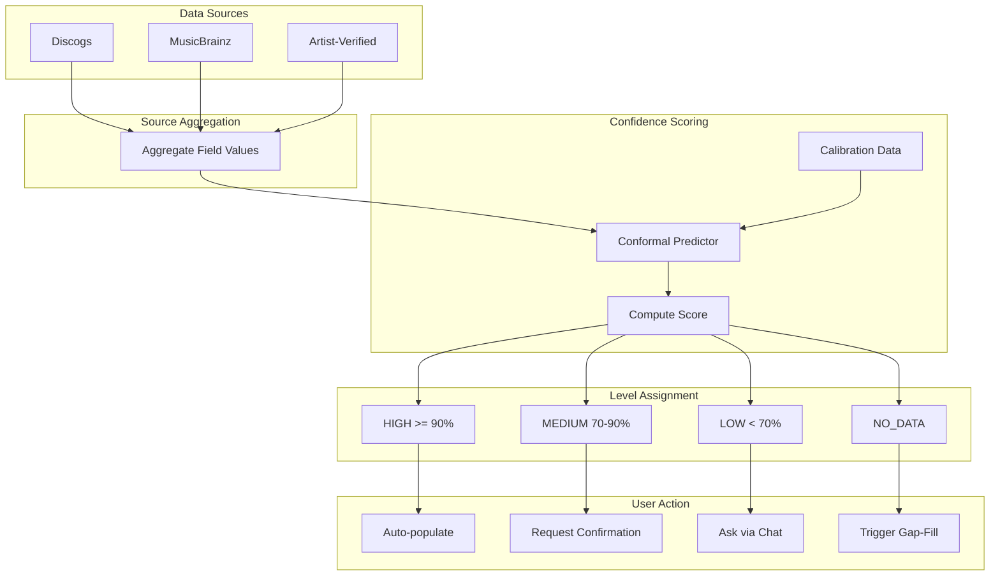
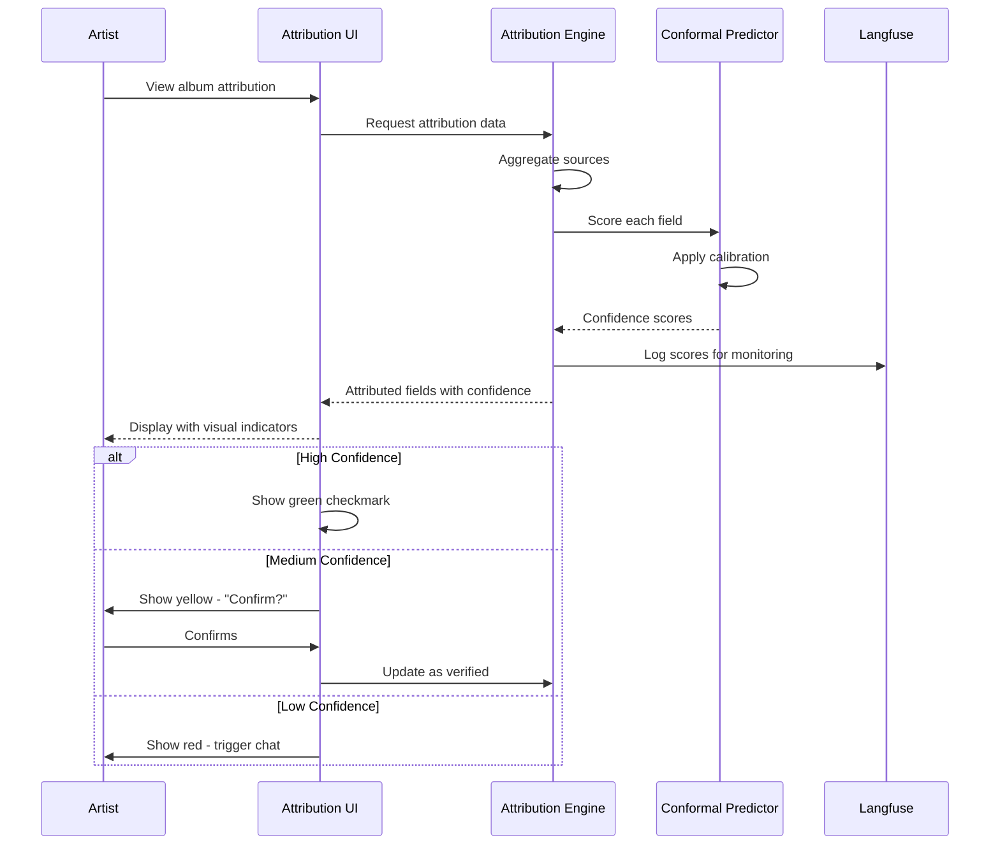

# Confidence Scoring for Attribution Data

**Purpose**: Assign calibrated confidence scores to attribution fields using conformal prediction

**Key Requirement (Imogen)**: "Present data that is 90 to 100% confident is correct"

**Key Insight (Andy)**: Confidence must be traceable to sources - "low confidence data all relates to a particular source"

---

## For Domain Experts

**What This Does**: When the system shows you attribution data (like who produced a track or who played bass), it tells you how confident it is that information is correct. This is not a guess - it uses a mathematical method called "conformal prediction" that guarantees: when we say we are 90% confident, we are actually right 90% of the time.

**Why This Matters for Artists**:
- You can trust "high confidence" data without second-guessing every field
- "Low confidence" fields get flagged so you can correct them
- The system learns from your corrections to get better over time
- You spend time only on data that actually needs attention

**How Artists Experience This**:
1. Fields marked with a green checkmark are auto-filled - you can ignore them
2. Yellow indicators mean "we think this is right, but please confirm"
3. Red gaps mean "we do not have enough data - can you help?"
4. Each field shows which sources contributed (Discogs, MusicBrainz, etc.)

---

## Executive Decision Impact

How technical choices in this document affect business outcomes:

| Technical Choice | Business Impact | Trade-off |
|-----------------|-----------------|-----------|
| **90% confidence threshold** | Artists trust auto-filled data, fewer corrections needed | Higher threshold = fewer auto-fills, more manual work; lower threshold = more auto-fills but more errors |
| **Conformal prediction (not simple ML)** | "90% confident" actually means 90% - builds long-term trust | More complex to implement; requires calibration data |
| **Per-field confidence** | Artists focus only on problematic fields, not entire records | More granular UI needed; more storage for metadata |
| **Source breakdown display** | Transparency builds trust; artists understand where data comes from | Potentially overwhelming UI; requires careful design |
| **Calibration monitoring** | System accuracy improves over time; early warning for drift | Requires ongoing Langfuse investment; data science resources |

**Key Business Questions This Answers**:
- *"Can we trust the auto-filled data?"* - Yes, with mathematical guarantees
- *"How much time will artists save?"* - 60%+ of fields auto-filled (high confidence target)
- *"What happens when the system is wrong?"* - Transparent flagging, artist always has final say

---

## Quick Reference

| Aspect | Value |
|--------|-------|
| **Method** | Conformal Prediction (formal guarantees) |
| **Calibration Target** | "90% confident" must be accurate 90% of the time |
| **Thresholds** | High: ≥90%, Medium: 70-90%, Low: <70% |
| **Per-Field** | Each attribution field scored independently |
| **Per-Source** | Track source contribution to confidence |

---

## Why Conformal Prediction?

Traditional confidence scores (e.g., model probability outputs) are often **poorly calibrated** - a model saying "90% confident" might only be correct 70% of the time.

**Conformal Prediction provides**:
1. **Formal guarantee**: Coverage ≥ 1-α (if we say 90% confident, we're right 90%+ of the time)
2. **Distribution-free**: No assumptions about data distribution
3. **Per-field intervals**: Can say "GLA is between 2080-2120 sqft with 90% confidence"

**Implication for the system**: When we tell an artist data is "90% confident", we have mathematical backing.

---

## Confidence Levels and UX Treatment

| Level | Score | UX Treatment | User Action |
|-------|-------|--------------|-------------|
| **Verified** | ≥90% + artist confirm | Green checkmark, auto-populated | None needed |
| **High** | ≥90% | Gray checkmark, auto-populated | Optional review |
| **Medium** | 70-90% | Yellow indicator, source breakdown | "Which is correct?" |
| **Low** | <70% | Red gap marker, actionable suggestion | Chat prompt or reach out |
| **No Data** | N/A | Empty field | Chat-driven gathering |

---

## Implementation

### Core Data Model

```python
from pydantic import BaseModel, Field
from typing import Optional
from enum import Enum

class ConfidenceLevel(str, Enum):
    VERIFIED = "verified"   # ≥90% + artist confirmation
    HIGH = "high"           # ≥90% algorithmic
    MEDIUM = "medium"       # 70-90%
    LOW = "low"             # <70%
    NO_DATA = "no_data"     # No sources have this

class ConfidenceInterval(BaseModel):
    """For continuous values (e.g., year, duration)."""
    lower: float
    upper: float
    coverage: float = Field(default=0.9, ge=0, le=1)

class SourceContribution(BaseModel):
    """Per-source contribution to a field's confidence."""
    source: str  # "discogs", "musicbrainz", "attribution"
    value: str   # What this source claims
    weight: float  # Contribution to confidence (0-1)
    last_updated: str  # ISO date

class FieldConfidence(BaseModel):
    """Confidence metadata for a single attribution field."""
    score: float = Field(..., ge=0, le=1)
    level: ConfidenceLevel
    interval: Optional[ConfidenceInterval] = None
    sources: list[SourceContribution]

    # Andy's insight: track why confidence is low
    low_confidence_reason: Optional[str] = None  # "single_source", "sources_disagree", etc.
    suggested_action: Optional[str] = None       # "Reach out to [collaborator]"

    @classmethod
    def from_score(cls, score: float, sources: list[SourceContribution]) -> "FieldConfidence":
        """Create FieldConfidence with automatic level assignment."""
        if score >= 0.9 and len([s for s in sources if s.weight > 0.3]) >= 2:
            level = ConfidenceLevel.HIGH
        elif score >= 0.9:
            level = ConfidenceLevel.HIGH  # Single strong source
        elif score >= 0.7:
            level = ConfidenceLevel.MEDIUM
        elif score > 0:
            level = ConfidenceLevel.LOW
        else:
            level = ConfidenceLevel.NO_DATA

        # Determine reason for low confidence
        low_reason = None
        suggested = None
        if level == ConfidenceLevel.LOW:
            if len(sources) == 1:
                low_reason = "single_source"
                suggested = f"Only {sources[0].source} has this. Can you verify?"
            elif len(set(s.value for s in sources)) > 1:
                low_reason = "sources_disagree"
                suggested = "Sources disagree. Which is correct?"

        return cls(
            score=score,
            level=level,
            sources=sources,
            low_confidence_reason=low_reason,
            suggested_action=suggested
        )
```

### Conformal Prediction Implementation

```python
import numpy as np
from typing import Tuple

class AttributionConformalPredictor:
    """
    Conformal prediction for attribution confidence scoring.

    Provides calibrated confidence that "90% confident" means
    the true value is covered 90% of the time.
    """

    def __init__(self, alpha: float = 0.1):
        """
        Args:
            alpha: Miscoverage rate (1-α = coverage level).
                   α=0.1 means 90% coverage (Imogen's requirement).
        """
        self.alpha = alpha
        self.calibration_scores: list[float] = []

    def calibrate(self, validation_set: list[Tuple[str, str, bool]]):
        """
        Calibrate on validation set of (predicted, actual, is_correct).

        For categorical fields (artist name, role), is_correct is boolean.
        """
        # Compute nonconformity scores
        # For categorical: score = 0 if correct, 1 if incorrect
        self.calibration_scores = [
            0.0 if is_correct else 1.0
            for _, _, is_correct in validation_set
        ]
        self.calibration_scores.sort()

    def compute_confidence(
        self,
        source_agreements: int,
        total_sources: int,
        source_weights: list[float]
    ) -> float:
        """
        Compute calibrated confidence score.

        Args:
            source_agreements: How many sources agree on this value
            total_sources: Total sources with data for this field
            source_weights: Quality weights for each source

        Returns:
            Calibrated confidence score (0-1)
        """
        if total_sources == 0:
            return 0.0

        # Base agreement score
        agreement_ratio = source_agreements / total_sources

        # Weight by source quality
        weighted_agreement = sum(
            w for w, agrees in zip(source_weights, [True] * source_agreements)
        ) / sum(source_weights)

        # Apply calibration correction
        if self.calibration_scores:
            n = len(self.calibration_scores)
            q_level = np.ceil((n + 1) * (1 - self.alpha)) / n
            q_idx = min(int(q_level * n) - 1, n - 1)
            calibration_factor = 1 - self.calibration_scores[q_idx]

            # Adjust confidence to be calibrated
            raw_confidence = (agreement_ratio + weighted_agreement) / 2
            calibrated_confidence = raw_confidence * calibration_factor
        else:
            # No calibration data yet, use raw score
            calibrated_confidence = (agreement_ratio + weighted_agreement) / 2

        return min(1.0, calibrated_confidence)

    def get_prediction_set(
        self,
        candidates: list[str],
        probabilities: list[float]
    ) -> list[str]:
        """
        For ambiguous fields, return set of possible values.

        Conformal prediction set: smallest set that contains
        true value with probability ≥ 1-α.
        """
        sorted_pairs = sorted(
            zip(candidates, probabilities),
            key=lambda x: x[1],
            reverse=True
        )

        cumsum = 0.0
        prediction_set = []
        for candidate, prob in sorted_pairs:
            prediction_set.append(candidate)
            cumsum += prob
            if cumsum >= 1 - self.alpha:
                break

        return prediction_set
```

### Integration with Attribution Engine

```python
class AttributedField(BaseModel):
    """A field with value and confidence metadata."""
    field_name: str
    value: str
    confidence: FieldConfidence

    def should_auto_fill(self) -> bool:
        """Auto-fill if high confidence."""
        return self.confidence.level in [
            ConfidenceLevel.VERIFIED,
            ConfidenceLevel.HIGH
        ]

    def needs_user_input(self) -> bool:
        """Prompt user if medium or low confidence."""
        return self.confidence.level in [
            ConfidenceLevel.MEDIUM,
            ConfidenceLevel.LOW,
            ConfidenceLevel.NO_DATA
        ]

    def get_chat_prompt(self) -> Optional[str]:
        """Generate chat prompt for gap-filling."""
        if self.confidence.level == ConfidenceLevel.NO_DATA:
            return f"I don't have any data for {self.field_name}. Can you tell me about it?"
        elif self.confidence.level == ConfidenceLevel.LOW:
            if self.confidence.suggested_action:
                return self.confidence.suggested_action
            return f"I'm not confident about {self.field_name}. The sources say '{self.value}'. Is this correct?"
        elif self.confidence.level == ConfidenceLevel.MEDIUM:
            sources = ", ".join(
                f"{s.source}: {s.value}" for s in self.confidence.sources
            )
            return f"Sources disagree on {self.field_name}: {sources}. Which is correct?"
        return None
```

---

## Calibration Pipeline

To ensure "90% confident" actually means 90% accuracy:

### 1. Collect Validation Data

```python
# Over time, collect artist corrections
validation_data = [
    ("John Smith", "John Smith", True),   # System correct
    ("Jane Doe", "Jane D.", False),        # System wrong
    # ...
]
```

### 2. Calibrate Predictor

```python
predictor = AttributionConformalPredictor(alpha=0.1)  # 90% coverage
predictor.calibrate(validation_data)
```

### 3. Monitor Calibration

Track in Langfuse:
- Expected coverage: 90%
- Actual coverage: % of "high confidence" fields that artists confirm
- ECE (Expected Calibration Error): Should be < 0.05

---

## Mermaid Diagram: Confidence Scoring Flow





---

## Monitoring Metrics

| Metric | Target | Measurement |
|--------|--------|-------------|
| **Coverage at 90%** | ≥90% | % of HIGH fields confirmed correct |
| **ECE** | <0.05 | Calibration error |
| **Auto-fill rate** | >60% | % of fields auto-filled (HIGH confidence) |
| **Gap rate** | <20% | % of fields with NO_DATA |

Track via Langfuse with custom scores:

```python
from langfuse import langfuse_context

# Log confidence metrics
langfuse_context.score_current_trace(
    name="confidence_calibration",
    value=actual_coverage,
    comment=f"Expected: {1-alpha}, Actual: {actual_coverage}"
)
```

---

## When to Reconsider

| Trigger | Action |
|---------|--------|
| ECE > 0.1 | Re-calibrate with more validation data |
| Coverage < 85% | Adjust thresholds or improve source weights |
| Auto-fill rate < 40% | Sources may be too sparse |

---

---

## Known Unknowns

Questions for domain experts and stakeholders to help refine this implementation:

| Question | Context | Who Should Answer |
|----------|---------|-------------------|
| What is the acceptable calibration drift before recalibration? | We propose 3% tolerance; is this too strict or too loose? | Product + Data Science |
| Should confidence thresholds vary by field type? | Producer credits may need higher confidence than recording date | Music Industry Experts |
| How do we handle fields with no historical calibration data? | New field types have no baseline | Data Science |
| What is the minimum calibration set size for reliable conformal bounds? | We propose 1000 examples; is this feasible? | Data Science |
| Should artist-verified data always override algorithmic confidence? | Even if multiple databases disagree? | Product + Artists |
| How do we communicate confidence to non-technical artists? | "90% confident" may confuse some users | UX + Artists |

---

## Technical Deep Dive

### Conformal Prediction Mathematics

The conformal predictor maintains coverage guarantees through the following:

1. **Nonconformity Score**: Measures how "unusual" a prediction is compared to calibration data
2. **Quantile Threshold**: The (1-alpha) quantile of calibration scores determines inclusion
3. **Finite Sample Correction**: Threshold adjusted by (n+1)/n factor for coverage guarantee

**Key Formula**:
```
threshold = quantile(calibration_scores, ceil((n+1)(1-alpha))/n)
```

### Calibration Requirements

- **Minimum calibration set**: 1000 artist-verified examples
- **Stratification**: By field type, source combination, and genre
- **Refresh frequency**: Weekly recalibration with rolling window
- **Monitoring**: Track empirical coverage vs. target in Langfuse

### Edge Cases

1. **Cold Start**: New artists with no calibration data use global priors
2. **Source Unavailability**: If a source is down, confidence adjusts downward
3. **Conflicting High-Confidence Sources**: Escalate to artist rather than picking one
4. **Stale Calibration**: Detect distribution shift via coverage monitoring

### Performance Considerations

- Calibration lookup: O(log n) with sorted scores
- Prediction set generation: O(k log k) where k = candidate count
- Caching: Cache conformal thresholds per field type (hourly refresh)

---

## Related Documents

- [uncertainty/conformal-prediction.md](../uncertainty/conformal-prediction.md) - Full theory
- [source-attribution.md](source-attribution.md) - Per-source tracking (Andy's insight)
- [gap-analysis.md](gap-analysis.md) - Actionable suggestions
- [observability/langfuse.md](../observability/langfuse.md) - Calibration monitoring
