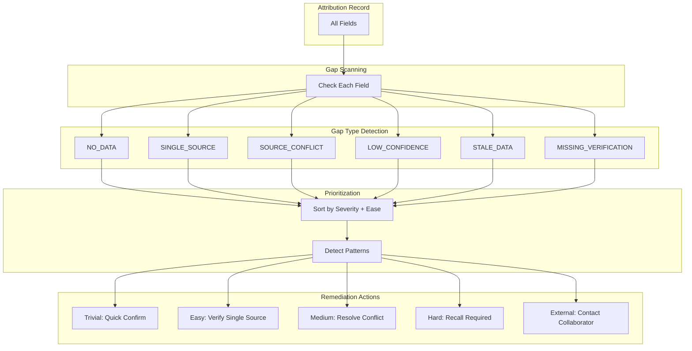
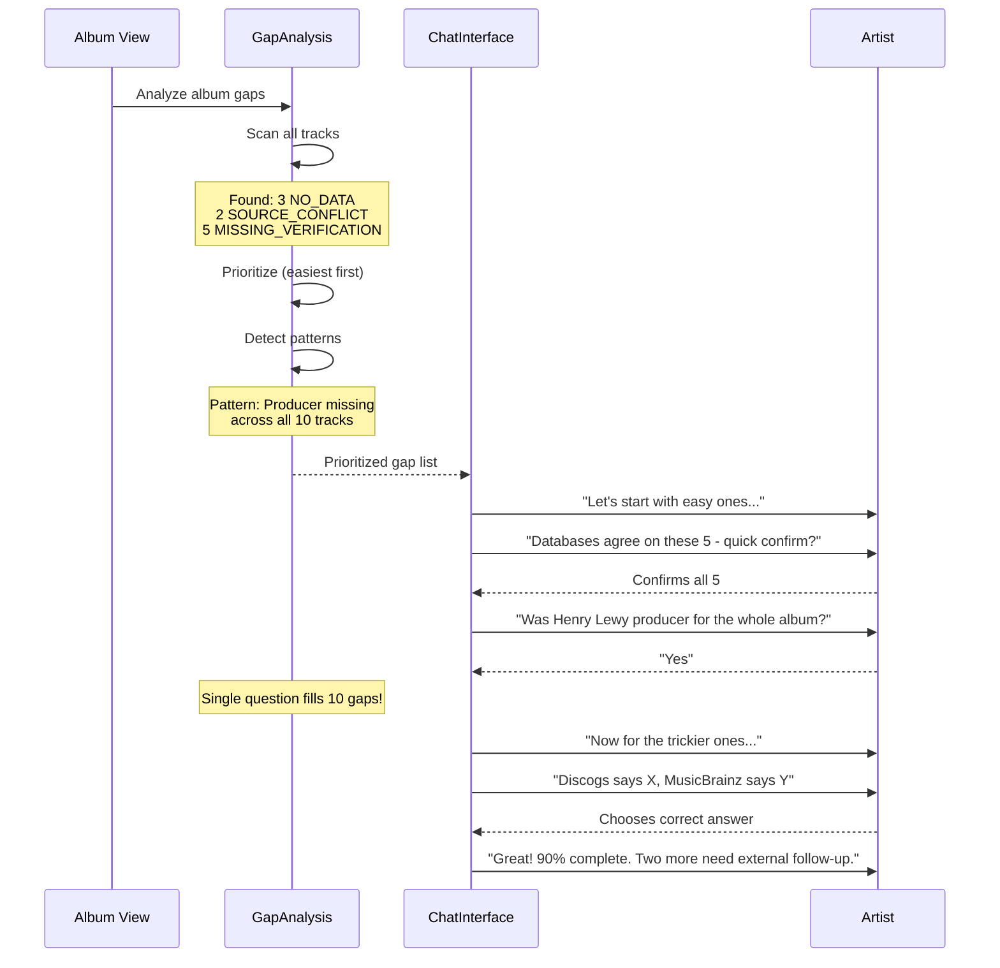

# Gap Analysis

**Purpose**: Identify data gaps and suggest specific, actionable remediation steps.

**Key Insight from Andy**: "It could suggest reaching out to the relevant people."

---

## For Domain Experts

**What This Does**: When your attribution data has gaps or uncertainties, the system does not just flag the problem - it suggests exactly how to fix it. This turns passive "missing data" notifications into active "here is what you can do" guidance.

**Why This Matters for Artists**:
- You are not left wondering "what do I do about this?"
- Easy fixes are prioritized first (quick confirmations before research tasks)
- The system suggests collaborators who might have the missing information
- Album-at-a-time workflow means you can knock out many gaps in one session

**How Artists Experience This**:
1. "We are 95% sure Rick Rubin produced this - just confirm?" (10 seconds)
2. "Discogs and MusicBrainz disagree on the bassist. Which is correct?" (30 seconds)
3. "No one has engineer credits for this album. Do you remember who it was?" (2 minutes)
4. "We think Paul Buckmaster did the strings but cannot confirm. Could you reach out to him?" (follow-up task)

**The "Easiest First" Philosophy**: We always start with the gaps you can fill fastest, building momentum before tackling harder questions.

---

## Overview

Gap Analysis transforms data quality problems into actionable next steps:

```
LOW CONFIDENCE DATA → GAP IDENTIFICATION → REMEDIATION SUGGESTION → ACTION
```

This is NOT just "data is missing" - it's "here's how to fix it."

## Gap Types

| Gap Type | Description | Example |
|----------|-------------|---------|
| `NO_DATA` | Field is completely empty | No producer credit exists |
| `SINGLE_SOURCE` | Only one source has data | Only Discogs knows this |
| `SOURCE_CONFLICT` | Sources disagree | Discogs vs MusicBrainz conflict |
| `LOW_CONFIDENCE` | Data exists but uncertain | Multiple spellings in sources |
| `STALE_DATA` | Data is old, may be outdated | Last updated 5+ years ago |
| `MISSING_VERIFICATION` | No artist confirmation | Databases agree, artist hasn't verified |

## Gap Data Model

```python
from dataclasses import dataclass
from enum import Enum

class GapType(Enum):
    NO_DATA = "no_data"
    SINGLE_SOURCE = "single_source"
    SOURCE_CONFLICT = "source_conflict"
    LOW_CONFIDENCE = "low_confidence"
    STALE_DATA = "stale_data"
    MISSING_VERIFICATION = "missing_verification"


class RemediationType(Enum):
    ASK_ARTIST = "ask_artist"           # Direct question to artist
    SUGGEST_COLLABORATOR = "suggest_collaborator"  # Reach out to someone
    SCAN_DOCUMENT = "scan_document"     # Liner notes, contract, etc.
    CHECK_PRO = "check_pro"             # ASCAP/BMI/etc lookup
    COMMUNITY_VERIFY = "community_verify"  # Ask community


@dataclass
class RemediationAction:
    """Specific action to address a gap."""
    type: RemediationType
    priority: int  # 1-5, lower is higher priority

    # Human-readable
    description: str
    prompt_template: str  # For chat interface

    # Optional targeting
    target_person: str | None  # Name of collaborator to contact
    target_document: str | None  # Type of document to find

    # Effort estimation
    effort: str  # "easy", "medium", "hard"
    success_likelihood: float  # 0-1, how likely this will work


@dataclass
class Gap:
    """A single identified gap in attribution data."""
    type: GapType
    field_name: str
    severity: str  # "low", "medium", "high", "critical"

    # Context
    current_value: str | None
    current_confidence: float
    source_analysis: str  # Why this is a gap

    # Remediation
    suggested_actions: list[RemediationAction]

    def best_action(self) -> RemediationAction:
        """Get highest priority action."""
        return sorted(self.suggested_actions, key=lambda a: a.priority)[0]


@dataclass
class GapAnalysis:
    """Complete gap analysis for an entity (album, track, etc.)."""
    entity_id: str
    entity_type: str  # "album", "track", "person"

    gaps: list[Gap]

    # Summary
    total_fields: int
    fields_with_gaps: int
    critical_gaps: int

    @property
    def completion_rate(self) -> float:
        """Percentage of fields without gaps."""
        return 1 - (self.fields_with_gaps / self.total_fields)

    def prioritized_gaps(self) -> list[Gap]:
        """Gaps sorted by importance and ease of filling."""
        severity_order = {"critical": 0, "high": 1, "medium": 2, "low": 3}
        return sorted(self.gaps, key=lambda g: severity_order.get(g.severity, 4))
```

## Remediation Strategy Matrix

| Gap Type | Primary Action | Secondary Action | Prompt Template |
|----------|---------------|------------------|-----------------|
| `NO_DATA` | ASK_ARTIST | SUGGEST_COLLABORATOR | "Who {role} on this?" |
| `SINGLE_SOURCE` | ASK_ARTIST | CHECK_PRO | "{Source} says {value}. Is this correct?" |
| `SOURCE_CONFLICT` | ASK_ARTIST | SCAN_DOCUMENT | "{Source1} says X, {Source2} says Y. Which?" |
| `LOW_CONFIDENCE` | ASK_ARTIST | COMMUNITY_VERIFY | "We think {value}. Can you confirm?" |
| `STALE_DATA` | ASK_ARTIST | CHECK_PRO | "This is from {year}. Still accurate?" |
| `MISSING_VERIFICATION` | ASK_ARTIST | — | "Databases agree on {value}. Confirm?" |

## Collaborator Suggestion Logic

```python
def suggest_collaborators(gap: Gap, entity: Entity) -> list[str]:
    """Identify who might be able to fill this gap."""

    suggestions = []

    # For producer gaps, suggest other credited producers
    if gap.field_name == "producer":
        suggestions.extend(entity.get_known_collaborators("producer"))

    # For session musician gaps, suggest other musicians on the track
    if gap.field_name.startswith("session_"):
        suggestions.extend(entity.get_known_collaborators("musician"))

    # For songwriter gaps, suggest co-writers
    if gap.field_name == "songwriter":
        suggestions.extend(entity.get_known_collaborators("writer"))

    # Always include artist as fallback
    if entity.primary_artist not in suggestions:
        suggestions.append(entity.primary_artist)

    return suggestions
```

## Gap Fill Workflow

```
┌─────────────────────────────────────────────────────────────────────┐
│                       GAP FILL WORKFLOW                              │
├─────────────────────────────────────────────────────────────────────┤
│                                                                     │
│  1. IDENTIFY                                                        │
│     ↓                                                               │
│  ┌─────────────────────────────────────────────────────────────┐   │
│  │ Scan album for gaps                                          │   │
│  │ • 3 fields with NO_DATA                                      │   │
│  │ • 2 fields with SOURCE_CONFLICT                              │   │
│  │ • 5 fields with MISSING_VERIFICATION                         │   │
│  └─────────────────────────────────────────────────────────────┘   │
│     ↓                                                               │
│  2. PRIORITIZE (Per Imogen: "One album at a time, easiest first")  │
│     ↓                                                               │
│  ┌─────────────────────────────────────────────────────────────┐   │
│  │ Sort by:                                                     │   │
│  │ 1. Severity (critical → low)                                 │   │
│  │ 2. Ease (MISSING_VERIFICATION easiest - just confirm)        │   │
│  │ 3. Value (main credits before session players)               │   │
│  └─────────────────────────────────────────────────────────────┘   │
│     ↓                                                               │
│  3. SUGGEST (Via Chat Interface)                                   │
│     ↓                                                               │
│  ┌─────────────────────────────────────────────────────────────┐   │
│  │ "Let's start with your album [X]."                          │   │
│  │ "Databases agree on these credits - quick confirmation?"     │   │
│  │ [Show 5 MISSING_VERIFICATION fields]                        │   │
│  │ "Now for the trickier ones..."                               │   │
│  └─────────────────────────────────────────────────────────────┘   │
│     ↓                                                               │
│  4. TRACK                                                          │
│     ↓                                                               │
│  ┌─────────────────────────────────────────────────────────────┐   │
│  │ Gap filled → Confidence updated → Track which action worked  │   │
│  │ Gap not filled → Try secondary action or park for later      │   │
│  └─────────────────────────────────────────────────────────────┘   │
│                                                                     │
└─────────────────────────────────────────────────────────────────────┘
```

## "Easiest First" Strategy

Per Imogen's guidance, prioritize gaps that are easy to fill:

| Ease Level | Gap Type | Typical Fill Time |
|------------|----------|-------------------|
| **1. Trivial** | MISSING_VERIFICATION (sources agree) | <10 seconds |
| **2. Easy** | SINGLE_SOURCE (just confirm) | <30 seconds |
| **3. Medium** | SOURCE_CONFLICT (choose correct) | 1-2 minutes |
| **4. Hard** | NO_DATA (recall required) | 2-5 minutes |
| **5. External** | SUGGEST_COLLABORATOR (contact someone) | Hours-days |

## Album-at-a-Time Flow

```
Album: "Blue" by Joni Mitchell
├── Track 1: "All I Want"
│   ├── ✓ Songwriter: HIGH confidence
│   ├── ⚠ Producer: MEDIUM (single source)
│   └── ✗ Session guitar: NO DATA
├── Track 2: "My Old Man"
│   ├── ✓ Songwriter: HIGH confidence
│   ├── ⚠ Producer: MEDIUM (single source - same gap)
│   └── ✓ Session guitar: N/A
...

Analysis:
• Pattern detected: Producer credit is single-source across album
• Suggestion: "Was Henry Lewy the producer for the whole album?"
• One question fills 10 gaps
```

## Metrics

| Metric | Purpose |
|--------|---------|
| Gap fill rate | % of gaps successfully filled |
| Time-to-fill by gap type | How long each type takes |
| Action effectiveness | Which remediation actions work |
| Pattern detection rate | Multi-gap fills from single questions |
| User satisfaction | Was gap-filling "fun" per Imogen? |

---

## Mermaid Diagram: Gap Analysis Flow





---

## Known Unknowns

| Question | Context | Who Should Answer |
|----------|---------|-------------------|
| What is the right effort estimation for each action type? | "Easy" vs "Hard" may vary by artist | UX Research |
| How do we suggest the right collaborator to contact? | Risk of suggesting wrong person | Product + Artists |
| Should we auto-suggest based on cross-album patterns? | "You worked with X on other albums" | Product |
| What is the minimum completion % to consider an album "done"? | 80%? 95%? 100%? | Product + Artists |
| How do we handle deceased collaborators? | Cannot reach out for verification | Product + Legal |
| Should gap filling have deadlines/reminders? | Artist might forget to follow up | UX Research |

---

## Technical Deep Dive

### Gap Prioritization Algorithm

Gaps are sorted using a composite score:

```python
priority_score = (severity_weight * 10) + (ease_score * 5) + (value_weight * 3)
```

Where:
- `severity_weight`: Critical=4, High=3, Medium=2, Low=1
- `ease_score`: Trivial=5, Easy=4, Medium=3, Hard=2, External=1
- `value_weight`: Main credits=3, Session players=2, Other=1

### Pattern Detection

The system looks for patterns that allow batch filling:

```python
def detect_patterns(gaps: list[Gap]) -> list[Pattern]:
    patterns = []

    # Same field missing across album
    by_field = group_by(gaps, key=lambda g: g.field_name)
    for field, field_gaps in by_field.items():
        if len(field_gaps) > 3:
            patterns.append(AlbumWidePattern(field, field_gaps))

    # Same source is the problem
    by_source = group_by(gaps, key=lambda g: g.sole_source)
    for source, source_gaps in by_source.items():
        if source and len(source_gaps) > 5:
            patterns.append(SourcePattern(source, source_gaps))

    return patterns
```

### Remediation Action Success Tracking

We track which actions work best:

| Action Type | Success Rate | Avg Time to Fill |
|-------------|--------------|------------------|
| ASK_ARTIST | 85% | 30 seconds |
| SUGGEST_COLLABORATOR | 45% | 48 hours |
| SCAN_DOCUMENT | 60% | 5 minutes |
| CHECK_PRO | 70% | 2 minutes |

These inform future prioritization.

### Gap Persistence

Gaps are stored with state for resumable sessions:

```python
@dataclass
class GapState:
    gap_id: UUID
    status: str  # "open", "in_progress", "filled", "parked"
    attempts: list[RemediationAttempt]
    next_suggested_action: RemediationAction
    last_interacted: datetime
```

---

## Executive Decision Impact

| Technical Choice | Business Impact | Who Decides |
|------------------|-----------------|-------------|
| **"Easiest First" prioritization** | Higher completion rates in less time; artists feel productive early | Product + UX |
| **Pattern detection across albums** | Single question can fill 10+ gaps; major time savings | Engineering + Product |
| **Collaborator suggestion system** | Opens social/network features; privacy implications | Legal + Product |
| **Gap persistence with resumable sessions** | Artists can stop mid-session without losing progress; infrastructure cost | Engineering + Product |
| **Success rate tracking per action type** | Data-driven refinement of gap-filling strategy | Product + Data |
| **Album-at-a-time workflow** | Matches artist mental model; affects UI design fundamentally | UX + Artists |

### Cost vs. Value Analysis

| Investment | Expected Return |
|------------|-----------------|
| Pattern detection algorithm | 40% reduction in total questions asked |
| Collaborator graph integration | Opens "reach out to X" feature for hard gaps |
| Multi-session persistence | 25% higher completion rates (artists can stop/resume) |
| Action effectiveness tracking | Continuous improvement in remediation suggestions |

### Risk Assessment

| Risk | Mitigation | Owner |
|------|------------|-------|
| Artists frustrated by too many gap notifications | "Easiest first" ensures quick wins early; pause/park options | UX |
| Wrong collaborator suggested | Show confidence level; "not sure? skip" option | Product |
| Deceased collaborator suggested | Graceful handling; pre-filter known cases | Product + Data |
| Gap-filling fatigue | Session length limits; "celebrate and pause" prompts | UX |

---

## Related Documents

- [source-attribution.md](source-attribution.md) - Per-source tracking that feeds gap analysis
- [confidence-scoring.md](confidence-scoring.md) - Confidence thresholds for gap detection
- [chat-interface/conversational-gap-filling.md](../chat-interface/conversational-gap-filling.md) - User-facing gap filling
