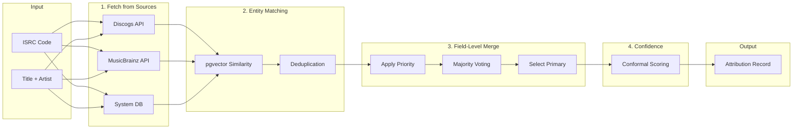
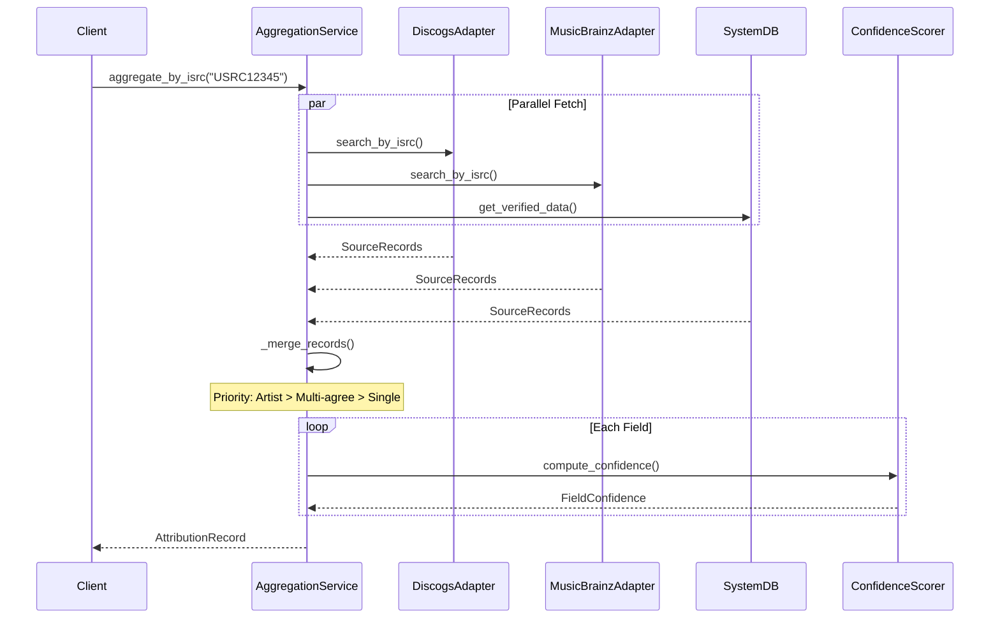

# Multi-Source Data Aggregation

**Purpose**: Aggregate attribution data from multiple sources into unified, confidence-scored records

**Foundation**: This is the first capability to implement - all other attribution features depend on it

**Key Sources**: Discogs, MusicBrainz, system own data (artist-confirmed)

---

## For Domain Experts

**What This Does**: The system pulls your attribution data from multiple music databases (Discogs, MusicBrainz, and others) and combines them into one unified record. Instead of you having to check each database separately, we do the cross-referencing automatically.

**Why This Matters for Artists**:
- Your credits are often scattered across different databases with inconsistencies
- Each database may have partial information - one knows your producer, another knows your session musicians
- When databases agree, we can be more confident the data is correct
- When they disagree, we flag the conflict for you to resolve

**How It Works in Plain Terms**:
1. You give us a song identifier (like an ISRC code) or title/artist name
2. We search Discogs, MusicBrainz, and any data you have already confirmed
3. We compare what each source says for each field (producer, songwriter, etc.)
4. If sources agree, we auto-populate with high confidence
5. If sources disagree, we show you the options and ask which is correct
6. Your confirmed data becomes the highest-priority source for the future

---

## Executive Decision Impact

How technical choices in this document affect business outcomes:

| Technical Choice | Business Impact | Trade-off |
|-----------------|-----------------|-----------|
| **Field-level (not record-level) matching** | More complete data: can use producer from Discogs + songwriter from MusicBrainz | More complex merging logic; potential for mismatched records |
| **Artist-confirmed data has highest priority** | Artists are always the ultimate authority on their own work | Requires UI for verification; initial cold-start problem |
| **Parallel API fetching** | Faster response times (sub-5 second target) | Higher API costs; more complex error handling |
| **pgvector for fuzzy matching** | Works even without ISRC codes (common for older releases) | PostgreSQL dependency; embedding model costs |
| **Graceful degradation** | System works even if one source is down | May serve partial data; need clear UX for partial results |

**Key Business Questions This Answers**:
- *"What if my music is not in MusicBrainz?"* - We use multiple sources; if any has data, we find it
- *"What if databases have my information wrong?"* - You verify once, your data is highest priority forever
- *"How fast can I get my attribution data?"* - Target: under 5 seconds for complete aggregation

**Cost Considerations**:
- Discogs API: Free tier limited to 60 requests/minute
- MusicBrainz API: Rate-limited to 1 request/second (free)
- pgvector embeddings: One-time compute cost per record
- Data storage: ~1KB per aggregated record

---

## Quick Reference

| Aspect | Value |
|--------|-------|
| **Primary Sources** | Discogs, MusicBrainz, the system |
| **Matching Strategy** | Field-level, not record-level |
| **Priority Order** | Artist-confirmed > Multi-source agreement > Single source |
| **Storage** | PostgreSQL with pgvector for similarity matching |
| **Output** | Per-field values with source contributions |

---

## Source Hierarchy

Per Imogen's guidance: "Artists are the experts on their work."

| Priority | Source Type | Trust Level | Example |
|----------|------------|-------------|---------|
| 1 | **Artist-confirmed** | Highest | Artist verifies in the system |
| 2 | **Multi-source agreement** | High | Discogs AND MusicBrainz agree |
| 3 | **Single authoritative** | Medium | MusicBrainz official release |
| 4 | **Single community** | Lower | Discogs user contribution |
| 5 | **Inferred** | Lowest | AI-extracted from liner notes |

---

## Data Model

### Core Attribution Record

```python
from pydantic import BaseModel, Field
from typing import Optional
from datetime import datetime, timezone
from enum import Enum

class SourceType(str, Enum):
    ATTRIBUTION = "attribution"      # Artist-confirmed
    MUSICBRAINZ = "musicbrainz"
    DISCOGS = "discogs"
    INFERRED = "inferred"      # AI extraction

class SourceRecord(BaseModel):
    """Data from a single source for a field."""
    source: SourceType
    value: str
    source_id: Optional[str] = None  # External ID (MB UUID, Discogs ID)
    fetched_at: datetime = Field(default_factory=lambda: datetime.now(timezone.utc))
    source_url: Optional[str] = None

    # Source-specific quality signals
    edit_count: Optional[int] = None       # MusicBrainz edit history
    voter_count: Optional[int] = None      # Discogs votes
    is_official: bool = False              # Official vs community data

class AggregatedField(BaseModel):
    """A single field aggregated from multiple sources."""
    field_name: str
    primary_value: str                     # Best-guess value
    source_records: list[SourceRecord]     # All source data

    # Computed by confidence-scoring.md
    confidence_score: Optional[float] = None

    def sources_agree(self) -> bool:
        """Check if all sources report the same value."""
        values = {r.value.lower().strip() for r in self.source_records}
        return len(values) == 1

    def get_source_breakdown(self) -> dict[str, str]:
        """Get value per source for UI display."""
        return {r.source.value: r.value for r in self.source_records}

class AttributionRecord(BaseModel):
    """Complete attribution for a musical work."""
    work_id: str                           # the system internal ID
    title: AggregatedField
    artists: list[AggregatedField]         # Primary artists
    contributors: list[AggregatedField]    # Session musicians, producers, etc.
    release_date: Optional[AggregatedField] = None
    isrc: Optional[AggregatedField] = None
    iswc: Optional[AggregatedField] = None
    duration_seconds: Optional[AggregatedField] = None

    # Metadata
    created_at: datetime = Field(default_factory=lambda: datetime.now(timezone.utc))
    last_aggregated: datetime = Field(default_factory=lambda: datetime.now(timezone.utc))

    def get_all_fields(self) -> list[AggregatedField]:
        """Get all fields for confidence scoring."""
        fields = [self.title] + self.artists + self.contributors
        for opt in [self.release_date, self.isrc, self.iswc, self.duration_seconds]:
            if opt:
                fields.append(opt)
        return fields
```

### Contributor Roles

```python
class ContributorRole(str, Enum):
    """Standard contributor roles for attribution."""
    # Primary
    ARTIST = "artist"
    FEATURED = "featured"

    # Production
    PRODUCER = "producer"
    ENGINEER = "engineer"
    MIXER = "mixer"
    MASTERING = "mastering"

    # Composition
    COMPOSER = "composer"
    LYRICIST = "lyricist"
    ARRANGER = "arranger"

    # Performance
    VOCALIST = "vocalist"
    INSTRUMENTALIST = "instrumentalist"
    SESSION_MUSICIAN = "session_musician"

    # Other
    PROGRAMMER = "programmer"
    REMIXER = "remixer"
    OTHER = "other"

class Contributor(BaseModel):
    """A contributor to a musical work."""
    name: AggregatedField
    role: ContributorRole
    instrument: Optional[str] = None       # For instrumentalists
    artist_id: Optional[str] = None       # Link to verified the system identity
```

---

## Aggregation Pipeline

### Overview

```
┌─────────────────────────────────────────────────────────────────┐
│                    AGGREGATION PIPELINE                          │
├─────────────────────────────────────────────────────────────────┤
│                                                                 │
│  1. FETCH           2. MATCH           3. MERGE           4. SCORE
│  ──────────        ─────────          ─────────          ───────
│                                                                 │
│  ┌─────────┐       ┌─────────────┐    ┌─────────────┐   ┌─────────┐
│  │ Discogs │──┐    │   Entity    │    │   Field-    │   │Conformal│
│  └─────────┘  │    │   Matching  │    │   Level     │   │Predict  │
│               ├───►│  (pgvector) │───►│   Merge     │──►│         │
│  ┌─────────┐  │    │             │    │             │   └────┬────┘
│  │MusicBrz │──┤    └─────────────┘    └─────────────┘        │
│  └─────────┘  │                                              │
│               │                                              ▼
│  ┌─────────┐  │                                     ┌─────────────┐
│  │System  │──┘                                     │ Attribution │
│  │  Own    │                                        │   Record    │
│  └─────────┘                                        └─────────────┘
│                                                                 │
└─────────────────────────────────────────────────────────────────┘
```

### Implementation

```python
from typing import Protocol
from abc import abstractmethod

class DataSourceAdapter(Protocol):
    """Protocol for external data source adapters."""

    @abstractmethod
    async def search_by_isrc(self, isrc: str) -> list[SourceRecord]:
        """Search for records by ISRC."""
        ...

    @abstractmethod
    async def search_by_title_artist(
        self,
        title: str,
        artist: str
    ) -> list[SourceRecord]:
        """Search by title and artist name."""
        ...

    @abstractmethod
    async def get_credits(self, source_id: str) -> list[Contributor]:
        """Get contributor credits for a release."""
        ...

class AggregationService:
    """
    Aggregates attribution data from multiple sources.

    This is the core service that powers the attribution engine.
    """

    def __init__(
        self,
        adapters: dict[SourceType, DataSourceAdapter],
        similarity_threshold: float = 0.85
    ):
        self.adapters = adapters
        self.similarity_threshold = similarity_threshold

    async def aggregate_by_isrc(self, isrc: str) -> AttributionRecord:
        """
        Aggregate attribution data for a work identified by ISRC.

        ISRC is the most reliable identifier for matching across sources.
        """
        all_records: dict[str, list[SourceRecord]] = {}

        # Fetch from all sources in parallel
        for source_type, adapter in self.adapters.items():
            try:
                records = await adapter.search_by_isrc(isrc)
                for record in records:
                    field = record.field_name if hasattr(record, 'field_name') else 'title'
                    if field not in all_records:
                        all_records[field] = []
                    all_records[field].append(record)
            except Exception as e:
                # Log but don't fail - partial data is better than none
                logger.warning(f"Failed to fetch from {source_type}: {e}")

        return self._merge_records(isrc, all_records)

    async def aggregate_by_fuzzy_match(
        self,
        title: str,
        artist: str
    ) -> list[AttributionRecord]:
        """
        Aggregate using fuzzy title/artist matching.

        Uses pgvector for similarity search when ISRC unavailable.
        """
        candidates = []

        for source_type, adapter in self.adapters.items():
            records = await adapter.search_by_title_artist(title, artist)
            candidates.extend(records)

        # Group by similarity using pgvector embeddings
        grouped = await self._group_by_similarity(candidates)

        return [
            self._merge_records(f"fuzzy_{i}", group)
            for i, group in enumerate(grouped)
        ]

    def _merge_records(
        self,
        work_id: str,
        records_by_field: dict[str, list[SourceRecord]]
    ) -> AttributionRecord:
        """
        Merge source records into aggregated fields.

        Priority: Artist-confirmed > Multi-agreement > Single source
        """
        aggregated_fields = {}

        for field_name, records in records_by_field.items():
            # Sort by priority
            sorted_records = sorted(
                records,
                key=lambda r: self._source_priority(r),
                reverse=True
            )

            # Select primary value
            primary = self._select_primary_value(sorted_records)

            aggregated_fields[field_name] = AggregatedField(
                field_name=field_name,
                primary_value=primary,
                source_records=sorted_records
            )

        return AttributionRecord(
            work_id=work_id,
            title=aggregated_fields.get('title', self._empty_field('title')),
            artists=self._extract_artists(aggregated_fields),
            contributors=self._extract_contributors(aggregated_fields)
        )

    def _source_priority(self, record: SourceRecord) -> int:
        """Get priority score for a source record."""
        base_priority = {
            SourceType.ATTRIBUTION: 100,      # Artist-confirmed is highest
            SourceType.MUSICBRAINZ: 50,
            SourceType.DISCOGS: 40,
            SourceType.INFERRED: 10
        }.get(record.source, 0)

        # Boost for official data
        if record.is_official:
            base_priority += 20

        # Boost for community validation
        if record.voter_count and record.voter_count > 10:
            base_priority += 5

        return base_priority

    def _select_primary_value(self, records: list[SourceRecord]) -> str:
        """
        Select the primary value from sorted records.

        If top sources agree, use that value.
        Otherwise, use highest priority source.
        """
        if not records:
            return ""

        # Check for agreement among top sources
        top_values = [r.value for r in records[:3]]
        value_counts = {}
        for v in top_values:
            normalized = v.lower().strip()
            value_counts[normalized] = value_counts.get(normalized, 0) + 1

        # If majority agrees, use that
        for value, count in value_counts.items():
            if count >= 2:
                # Return the original case version
                for r in records:
                    if r.value.lower().strip() == value:
                        return r.value

        # Otherwise use highest priority
        return records[0].value

    def _empty_field(self, field_name: str) -> AggregatedField:
        """Create an empty aggregated field."""
        return AggregatedField(
            field_name=field_name,
            primary_value="",
            source_records=[]
        )

    def _extract_artists(
        self,
        fields: dict[str, AggregatedField]
    ) -> list[AggregatedField]:
        """Extract artist fields from aggregated data."""
        return [
            f for name, f in fields.items()
            if name.startswith('artist') or name == 'primary_artist'
        ]

    def _extract_contributors(
        self,
        fields: dict[str, AggregatedField]
    ) -> list[AggregatedField]:
        """Extract contributor fields from aggregated data."""
        return [
            f for name, f in fields.items()
            if name.startswith('contributor') or name.startswith('credit')
        ]

    async def _group_by_similarity(
        self,
        candidates: list[SourceRecord]
    ) -> list[list[SourceRecord]]:
        """
        Group candidates by similarity using pgvector.

        This handles cases where the same work has slightly
        different titles across sources.
        """
        # Implementation uses pgvector similarity search
        # See data-layer/postgresql-unified.md for details
        raise NotImplementedError("Requires pgvector integration")
```

---

## Source Adapters

### Discogs Adapter

```python
import httpx
from typing import Optional

class DiscogsAdapter:
    """
    Adapter for Discogs API.

    Rate limits: 60 requests/minute (authenticated)
    """

    BASE_URL = "https://api.discogs.com"

    def __init__(self, token: str):
        self.token = token
        self.client = httpx.AsyncClient(
            headers={"Authorization": f"Discogs token={token}"}
        )

    async def search_by_isrc(self, isrc: str) -> list[SourceRecord]:
        """Search Discogs by ISRC (via track search)."""
        # Discogs doesn't directly support ISRC search
        # Use barcode or title+artist instead
        return []

    async def search_by_title_artist(
        self,
        title: str,
        artist: str
    ) -> list[SourceRecord]:
        """Search Discogs database."""
        resp = await self.client.get(
            f"{self.BASE_URL}/database/search",
            params={
                "track": title,
                "artist": artist,
                "type": "release"
            }
        )
        resp.raise_for_status()

        results = []
        for item in resp.json().get("results", []):
            results.append(SourceRecord(
                source=SourceType.DISCOGS,
                value=item.get("title", ""),
                source_id=str(item.get("id")),
                source_url=item.get("uri"),
                is_official=False  # Discogs is community-sourced
            ))

        return results

    async def get_credits(self, release_id: str) -> list[Contributor]:
        """Get credits for a Discogs release."""
        resp = await self.client.get(
            f"{self.BASE_URL}/releases/{release_id}"
        )
        resp.raise_for_status()

        data = resp.json()
        contributors = []

        for credit in data.get("extraartists", []):
            role = self._map_role(credit.get("role", ""))
            contributors.append(Contributor(
                name=AggregatedField(
                    field_name="contributor_name",
                    primary_value=credit.get("name", ""),
                    source_records=[SourceRecord(
                        source=SourceType.DISCOGS,
                        value=credit.get("name", ""),
                        source_id=str(credit.get("id"))
                    )]
                ),
                role=role
            ))

        return contributors

    def _map_role(self, discogs_role: str) -> ContributorRole:
        """Map Discogs role strings to standard roles."""
        role_map = {
            "producer": ContributorRole.PRODUCER,
            "engineer": ContributorRole.ENGINEER,
            "mixed by": ContributorRole.MIXER,
            "mastered by": ContributorRole.MASTERING,
            "written-by": ContributorRole.COMPOSER,
            "lyrics by": ContributorRole.LYRICIST,
            "vocals": ContributorRole.VOCALIST,
        }
        return role_map.get(discogs_role.lower(), ContributorRole.OTHER)
```

### MusicBrainz Adapter

```python
class MusicBrainzAdapter:
    """
    Adapter for MusicBrainz API.

    Rate limits: 1 request/second
    MusicBrainz has official data and community edits.
    """

    BASE_URL = "https://musicbrainz.org/ws/2"

    def __init__(self, app_name: str, app_version: str, contact: str):
        self.client = httpx.AsyncClient(
            headers={
                "User-Agent": f"{app_name}/{app_version} ({contact})"
            }
        )

    async def search_by_isrc(self, isrc: str) -> list[SourceRecord]:
        """Search MusicBrainz by ISRC - most reliable method."""
        resp = await self.client.get(
            f"{self.BASE_URL}/isrc/{isrc}",
            params={"fmt": "json", "inc": "artists+recordings"}
        )

        if resp.status_code == 404:
            return []

        resp.raise_for_status()
        data = resp.json()

        results = []
        for recording in data.get("recordings", []):
            results.append(SourceRecord(
                source=SourceType.MUSICBRAINZ,
                value=recording.get("title", ""),
                source_id=recording.get("id"),
                source_url=f"https://musicbrainz.org/recording/{recording.get('id')}",
                is_official=True  # MB has editorial review
            ))

        return results

    async def get_credits(self, recording_id: str) -> list[Contributor]:
        """Get artist credits and relationships for a recording."""
        resp = await self.client.get(
            f"{self.BASE_URL}/recording/{recording_id}",
            params={
                "fmt": "json",
                "inc": "artist-credits+artist-rels+work-rels"
            }
        )
        resp.raise_for_status()

        data = resp.json()
        contributors = []

        # Artist credits
        for credit in data.get("artist-credit", []):
            artist = credit.get("artist", {})
            contributors.append(Contributor(
                name=AggregatedField(
                    field_name="artist_name",
                    primary_value=artist.get("name", ""),
                    source_records=[SourceRecord(
                        source=SourceType.MUSICBRAINZ,
                        value=artist.get("name", ""),
                        source_id=artist.get("id"),
                        is_official=True
                    )]
                ),
                role=ContributorRole.ARTIST
            ))

        # Relationships (producers, engineers, etc.)
        for rel in data.get("relations", []):
            if rel.get("type") in ["producer", "engineer", "mix", "mastering"]:
                artist = rel.get("artist", {})
                contributors.append(Contributor(
                    name=AggregatedField(
                        field_name="contributor_name",
                        primary_value=artist.get("name", ""),
                        source_records=[SourceRecord(
                            source=SourceType.MUSICBRAINZ,
                            value=artist.get("name", ""),
                            source_id=artist.get("id"),
                            is_official=True
                        )]
                    ),
                    role=self._map_mb_role(rel.get("type", ""))
                ))

        return contributors

    def _map_mb_role(self, mb_type: str) -> ContributorRole:
        """Map MusicBrainz relationship types to standard roles."""
        role_map = {
            "producer": ContributorRole.PRODUCER,
            "engineer": ContributorRole.ENGINEER,
            "mix": ContributorRole.MIXER,
            "mastering": ContributorRole.MASTERING,
            "composer": ContributorRole.COMPOSER,
            "lyricist": ContributorRole.LYRICIST,
            "arranger": ContributorRole.ARRANGER,
            "vocal": ContributorRole.VOCALIST,
            "instrument": ContributorRole.INSTRUMENTALIST,
            "programming": ContributorRole.PROGRAMMER,
            "remixer": ContributorRole.REMIXER,
        }
        return role_map.get(mb_type.lower(), ContributorRole.OTHER)
```

---

## Integration Points

| Component | Integration |
|-----------|-------------|
| **Confidence Scoring** | `AggregatedField.source_records` → `FieldConfidence` |
| **Source Attribution** | `SourceRecord.source` tracks per-source contribution |
| **Conflict Resolution** | `AggregatedField.sources_agree()` triggers resolution |
| **Gap Analysis** | Empty `source_records` triggers gap-filling |
| **Chat Interface** | Low-confidence fields → conversational prompts |

---

## Monitoring

Track in Langfuse:

| Metric | Description |
|--------|-------------|
| `aggregation_sources_count` | Average sources per field |
| `aggregation_agreement_rate` | % of fields where sources agree |
| `aggregation_latency_ms` | Time to aggregate from all sources |
| `source_availability` | % uptime per source API |

---

## Mermaid Diagram: Aggregation Pipeline





---

## When to Reconsider

| Trigger | Action |
|---------|--------|
| New major data source | Add adapter, update priority logic |
| Agreement rate < 50% | Review source quality weights |
| Latency > 5s | Consider caching, parallel optimization |

---

## Known Unknowns

Questions requiring domain expert input:

| Question | Context | Who Should Answer |
|----------|---------|-------------------|
| What other data sources should we integrate? | Spotify, Apple Music, DDEX feeds? | Music Industry Experts |
| How should we handle sources that charge per API call? | Discogs free tier has limits | Product + Engineering |
| Should we cache external API responses? For how long? | Data freshness vs. cost/performance | Engineering + Product |
| What is the right similarity threshold for fuzzy matching? | Currently 0.85; may vary by field type | Data Science |
| How do we handle sources in different languages? | Japanese artist names in English DB | Internationalization Expert |
| What happens when a source deprecates an API? | Need graceful degradation strategy | Engineering |

---

## Technical Deep Dive

### Source Priority Algorithm

The priority function considers:

1. **Source Type Weight**: The system (100) > MusicBrainz (50) > Discogs (40) > Inferred (10)
2. **Official Data Bonus**: +20 for verified official releases
3. **Community Validation**: +5 for >10 community votes

```python
final_priority = base_weight + official_bonus + validation_bonus
```

### Fuzzy Matching with pgvector

For title/artist matching without ISRC:

1. Generate text embeddings using sentence-transformers
2. Store in PostgreSQL with pgvector extension
3. Similarity search with cosine distance
4. Cluster candidates above threshold (0.85)

### Rate Limiting Strategy

| Source | Rate Limit | Strategy |
|--------|------------|----------|
| Discogs | 60/min authenticated | Queue with backoff |
| MusicBrainz | 1/second | Sequential with delay |
| System DB | Unlimited | Direct query |

### Data Staleness Handling

- Source records include `fetched_at` timestamp
- Staleness threshold: 90 days for external, never for artist-verified
- Background refresh job for high-traffic records

---

## Related Documents

- [confidence-scoring.md](confidence-scoring.md) - Scoring aggregated fields
- [source-attribution.md](source-attribution.md) - Per-source tracking
- [conflict-resolution.md](conflict-resolution.md) - Handling disagreements
- [data-layer/postgresql-unified.md](../data-layer/postgresql-unified.md) - Storage layer
