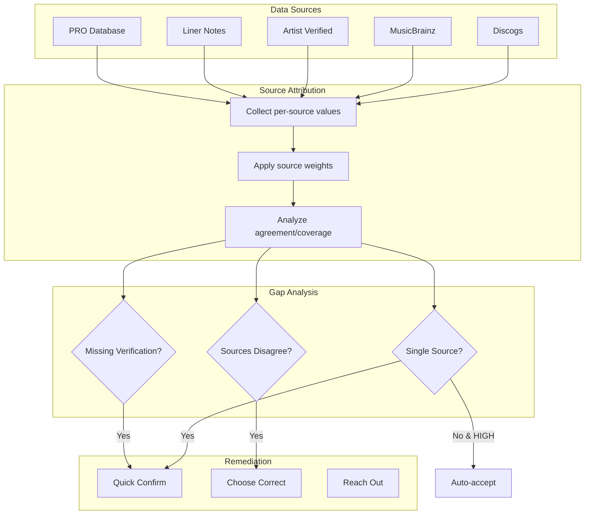
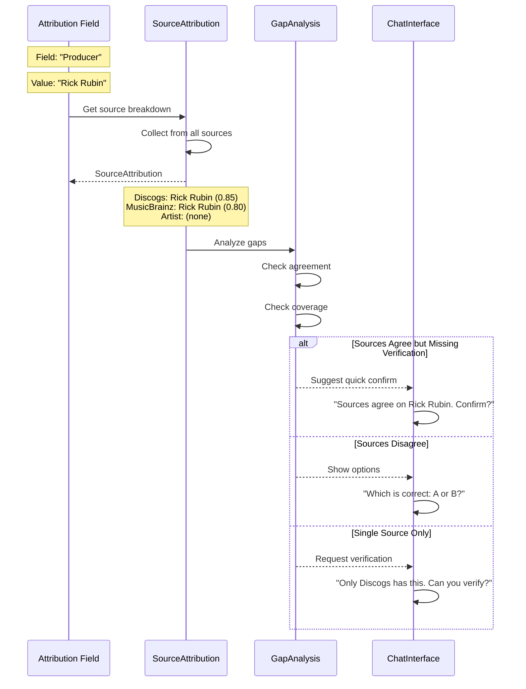

# Source Attribution

**Purpose**: Track which sources contribute to each confidence score, enabling identification of systematic gaps.

**Key Insight from Andy**: "We could analyse and see that the low confidence data all relates to a particular source (credit or dataset), so it could suggest reaching out to the relevant people."

---

## For Domain Experts

**What This Does**: For every piece of attribution data, The system tracks exactly which sources provided that information. This is not just about knowing "where the data came from" - it helps identify patterns. For example, if all your low-confidence production credits come from one particular database, we can suggest specific actions to fix the problem.

**Why This Matters for Artists**:
- Transparency: You always know where your data originated
- Actionable insights: "Your session musician credits are weak because only Discogs has them"
- Targeted fixes: "Reach out to your producer to verify these 5 albums at once"
- Source quality tracking: Over time, we learn which sources are reliable for which types of data

**Real-World Example**:
- Field: "Producer" for your 2020 album
- Discogs says: "Rick Rubin" (community-submitted)
- MusicBrainz says: "Rick Rubin" (official release data)
- Artist-verified: (not yet confirmed)
- Result: HIGH confidence because two sources agree, but flagged for your quick confirmation

---

## Executive Decision Impact

How technical choices in this document affect business outcomes:

| Technical Choice | Business Impact | Trade-off |
|-----------------|-----------------|-----------|
| **Per-source tracking** | Can identify systematic problems ("all producer credits from X are unreliable") | More metadata to store and display; more complex analytics |
| **Tiered source quality** | Artist data always wins; community data treated appropriately | May frustrate contributors; requires clear communication of hierarchy |
| **Gap detection automation** | Proactive suggestions rather than passive data display | May feel intrusive to some artists; requires thoughtful UX |
| **Source quality drift monitoring** | Early warning when a source degrades | Requires analytics pipeline; data science resources |
| **Remediation suggestions** | Artists know exactly how to fix problems | Suggestions may be wrong; need fallback for edge cases |

**Key Business Questions This Answers**:
- *"Why is my data confidence low?"* - Specific diagnosis: "Only one source, and they disagree"
- *"What can I do about it?"* - Actionable: "Confirm this field" or "Reach out to your producer"
- *"Can I trust the sources?"* - Transparent quality tracking visible to artists

**Strategic Value**:
- Source attribution enables **network effects**: as more artists verify data, all artists benefit
- Pattern detection enables **proactive outreach**: "Your label has 50 albums with missing mastering credits"
- Transparency builds **trust**: artists understand exactly why the system says what it says

---

## Overview

Source Attribution extends confidence scoring to track **per-source contributions**. This enables:

1. **Gap Identification**: Know WHICH source is causing low confidence
2. **Actionable Remediation**: Suggest contacting specific people/sources
3. **Source Quality Tracking**: Over time, identify consistently unreliable sources
4. **Transparent Provenance**: Show users exactly where data comes from

## Data Model

```python
from dataclasses import dataclass
from enum import Enum

class SourceType(Enum):
    DISCOGS = "discogs"
    MUSICBRAINZ = "musicbrainz"
    ARTIST_VERIFIED = "artist_verified"
    LINER_NOTES = "liner_notes"
    COLLABORATOR = "collaborator"
    PRO_DATABASE = "pro_database"  # ASCAP, BMI, etc.
    ATTRIBUTION_COMMUNITY = "system_community"


@dataclass
class SourceContribution:
    """Single source's contribution to a field."""
    source: SourceType
    value: str | None
    confidence: float  # Source's own confidence (0-1)
    last_updated: str  # ISO timestamp
    metadata: dict  # Source-specific metadata


@dataclass
class SourceAttribution:
    """Aggregated source tracking for a field."""

    field_name: str
    final_value: str | None
    final_confidence: float

    # Per-source breakdown
    sources: dict[SourceType, SourceContribution]

    # Analysis
    agreement_score: float  # How much sources agree (0-1)
    coverage_score: float   # How many sources have data (0-1)
    sole_source: SourceType | None  # If only one source has data

    @property
    def is_single_source_only(self) -> bool:
        """True if only one source has data for this field."""
        return len([s for s in self.sources.values() if s.value]) == 1

    @property
    def sources_disagree(self) -> bool:
        """True if sources have conflicting values."""
        values = [s.value for s in self.sources.values() if s.value]
        return len(set(values)) > 1

    def get_missing_sources(self) -> list[SourceType]:
        """Sources that could have data but don't."""
        return [s for s, c in self.sources.items() if c.value is None]
```

## Confidence-Source Matrix

```
┌─────────────────────────────────────────────────────────────────────┐
│                    SOURCE ATTRIBUTION MATRIX                         │
├─────────────────────────────────────────────────────────────────────┤
│                                                                     │
│  Field: "Producer"                                                  │
│  Final Value: "Rick Rubin"                                          │
│  Final Confidence: 0.72 (MEDIUM)                                    │
│                                                                     │
│  ┌─────────────────┬──────────────────┬────────────┬─────────────┐ │
│  │     Source      │      Value       │ Confidence │   Status    │ │
│  ├─────────────────┼──────────────────┼────────────┼─────────────┤ │
│  │ Discogs         │ "Rick Rubin"     │    0.85    │ ✓ Match     │ │
│  │ MusicBrainz     │ "Rick Rubin"     │    0.80    │ ✓ Match     │ │
│  │ Artist Verified │ (none)           │    ---     │ ⚠ Missing   │ │
│  │ Liner Notes     │ (none)           │    ---     │ ⚠ Missing   │ │
│  └─────────────────┴──────────────────┴────────────┴─────────────┘ │
│                                                                     │
│  Analysis:                                                          │
│  • Agreement: HIGH (Discogs + MusicBrainz agree)                    │
│  • Coverage: MEDIUM (2/4 potential sources)                         │
│  • Gap: Artist has not verified, no liner notes scanned            │
│                                                                     │
│  Suggested Action:                                                  │
│  "Sources agree on Rick Rubin. Would you like to confirm this?"    │
│                                                                     │
└─────────────────────────────────────────────────────────────────────┘
```

## Source Quality Tiers

| Tier | Sources | Weight | Rationale |
|------|---------|--------|-----------|
| **Tier 1: Artist** | `artist_verified` | 1.0 | Artist is ultimate authority |
| **Tier 2: Primary** | `liner_notes`, `collaborator` | 0.9 | Direct first-party sources |
| **Tier 3: Databases** | `discogs`, `musicbrainz`, `pro_database` | 0.7 | Curated but may have errors |
| **Tier 4: Community** | `system_community` | 0.5 | Helpful but unverified |

## Gap Detection Algorithm

```python
def analyze_source_gaps(attribution: SourceAttribution) -> GapAnalysis:
    """Identify what's missing and why."""

    gaps = []

    # Single source warning
    if attribution.is_single_source_only:
        gaps.append(Gap(
            type=GapType.SINGLE_SOURCE,
            severity="medium",
            message=f"Only {attribution.sole_source.value} has this data",
            suggestion="Can you verify this information?"
        ))

    # Missing artist verification
    if SourceType.ARTIST_VERIFIED not in attribution.sources:
        gaps.append(Gap(
            type=GapType.NO_ARTIST_VERIFICATION,
            severity="low" if attribution.final_confidence > 0.9 else "medium",
            message="Artist hasn't verified this field",
            suggestion="Would you like to confirm this is correct?"
        ))

    # Source disagreement
    if attribution.sources_disagree:
        gaps.append(Gap(
            type=GapType.SOURCE_CONFLICT,
            severity="high",
            message=format_disagreement(attribution),
            suggestion="Which source is correct?"
        ))

    return GapAnalysis(field=attribution.field_name, gaps=gaps)
```

## Remediation Suggestions

Based on gap analysis, generate actionable suggestions:

| Gap Type | Suggestion Pattern |
|----------|-------------------|
| Single source | "Only [source] has this. Can you verify?" |
| Source conflict | "Discogs says X, MusicBrainz says Y. Which is correct?" |
| No data | "We don't have [field] info. Do you know?" |
| Missing collaborator | "Could [collaborator name] verify their role?" |
| Low confidence | "We're [X]% sure about this. Is it correct?" |

## Integration with Chat Interface

```
Chat Flow:
1. Attribution Engine detects: producer field has single-source data
2. Source Attribution provides: "Only Discogs has producer credit"
3. Gap Analysis suggests: "Reach out to verify"
4. Chat Interface prompts: "I see Discogs lists Rick Rubin as producer.
   Can you confirm this, or was there someone else involved?"
5. Artist confirms → Confidence jumps to 1.0 (artist_verified)
```

## Metrics to Track

| Metric | Purpose |
|--------|---------|
| Single-source field count | How much data relies on one source |
| Source disagreement rate | How often sources conflict |
| Artist verification coverage | % of fields artist has confirmed |
| Gap fill success rate | How often suggestions lead to data |
| Source quality drift | Per-source error rate over time |

---

## Mermaid Diagram: Source Attribution Flow





---

## Known Unknowns

| Question | Context | Who Should Answer |
|----------|---------|-------------------|
| What source quality tiers should PRO databases have? | ASCAP/BMI data reliability varies | Music Industry Experts |
| How do we attribute data from liner notes scans? | OCR quality varies significantly | Engineering + Product |
| Should collaborator-provided data be trusted equally? | Risk of biased contributions | Product + Legal |
| How do we handle pseudonyms and stage names? | Same person, different source names | Data Modeling Expert |
| What is the statute of limitations on source data? | How old is too old to trust? | Product + Industry |
| Should we weight recent edits higher than original entries? | MusicBrainz edit history | Data Science |

---

## Technical Deep Dive

### Source Contribution Calculation

Each source contributes to final confidence based on:

```python
contribution = source_weight * recency_factor * agreement_factor
```

Where:
- `source_weight`: Tier-based (1.0, 0.9, 0.7, 0.5)
- `recency_factor`: Decays for data older than 2 years
- `agreement_factor`: Boosted when multiple sources agree

### Agreement Score Calculation

```python
def calculate_agreement(sources: list[SourceContribution]) -> float:
    values = [s.value.lower().strip() for s in sources if s.value]
    if not values:
        return 0.0

    # Most common value
    most_common = Counter(values).most_common(1)[0]
    agreement_ratio = most_common[1] / len(values)

    return agreement_ratio
```

### Source Quality Tracking Over Time

We maintain per-source accuracy metrics:

| Source | Historical Accuracy | Trend |
|--------|---------------------|-------|
| MusicBrainz | 94% | Stable |
| Discogs | 87% | Improving |
| Liner Notes OCR | 72% | Variable |

These metrics inform dynamic weight adjustments.

### Handling Source Conflicts

Conflict resolution priority:
1. Artist-verified always wins
2. Multi-source agreement over single source
3. Higher-tier source over lower-tier
4. More recent data over older (within same tier)

---

## Related Documents

- [gap-analysis.md](gap-analysis.md) - What to do with identified gaps
- [confidence-scoring.md](confidence-scoring.md) - How confidence is calculated
- [multi-source-aggregation.md](multi-source-aggregation.md) - How sources are combined
- [chat-interface/conversational-gap-filling.md](../chat-interface/conversational-gap-filling.md) - User-facing gap filling
