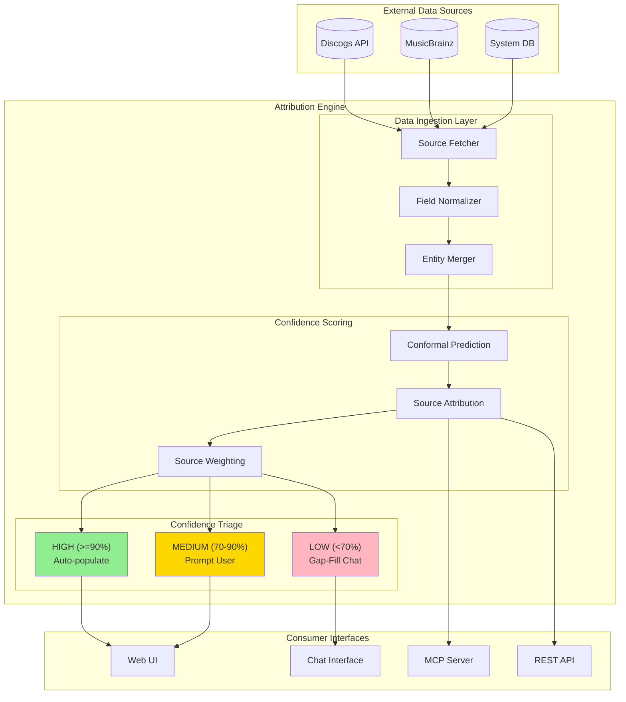

# Attribution Engine

**Purpose**: Core engine for multi-source music attribution with confidence scoring

**Key Insight from Andy**: "How we deal with the other stuff - low confidence data all relates to a particular source, so suggest reaching out to relevant people"

---

## System Architecture



---

## For Domain Experts (Imogen/Andy)

### Why This Matters

The Attribution Engine is the **heart of the system**. It directly addresses the core problem you identified: artists don't know what data exists about them across multiple sources, and when they do find discrepancies, they have no way to resolve them efficiently.

**Business Value:**
- **For Rights Organizations**: Accurate attribution means correct royalty distribution. A 2% error rate across millions of streams represents significant misallocated revenue.
- **For Artists**: Confidence scoring with source attribution means artists finally understand *why* data might be wrong and *who to contact* to fix it.
- **For the Industry**: Standardized, machine-readable attribution data (via MCP) enables AI platforms to respect artist permissions programmatically.

### Key Decisions Requiring Your Input

1. **Confidence Thresholds**: We've proposed 90%/70% cutoffs. Are these right for your user research? Should different field types (e.g., producer vs. session musician) have different thresholds?

2. **Source Weighting**: Should artist-confirmed data always override external sources? What about label-confirmed data?

3. **Gap-Fill Priority**: When multiple fields are uncertain, which should the chat interface ask about first? Most revenue-impacting? Most recently created work?

---

## Known Unknowns

> Questions requiring domain expertise or further research before implementation.

| Question | Impact | Suggested Owner |
|----------|--------|-----------------|
| What confidence threshold makes data "trustworthy" for royalty distribution? | High - affects auto-populate behavior | Imogen (user research) |
| How do rights orgs currently resolve conflicting credits between PROs? | High - informs conflict resolution | Andy (industry contacts) |
| Should geographic metadata affect source weighting (e.g., Discogs stronger for UK releases)? | Medium - affects scoring algorithm | Engineering + Domain |
| What's the acceptable latency for real-time attribution queries? | Medium - affects architecture choices | Product |
| How should we handle "disputed" credits where artists disagree? | High - legal/UX implications | Legal + Imogen |
| What's the minimum viable set of credit types for MVP? | High - scoping decision | Imogen |

---

## Overview

The Attribution Engine aggregates data from multiple sources (Discogs, MusicBrainz, system own data) and presents artists with confidence-scored attribution records. Per Imogen's guidance, data "90 to 100% confident" should be auto-populated, while lower confidence data triggers conversational gap-filling.

## Core Capabilities

| Capability | Description | PRD |
|------------|-------------|-----|
| **Multi-Source Aggregation** | Combine Discogs, MusicBrainz, attribution data | [multi-source-aggregation.md](multi-source-aggregation.md) |
| **Confidence Scoring** | Formal uncertainty quantification (conformal prediction) | [confidence-scoring.md](confidence-scoring.md) |
| **Source Attribution** | Per-source confidence breakdown (Andy's insight) | [source-attribution.md](source-attribution.md) |
| **Gap Analysis** | Actionable suggestions for missing data | [gap-analysis.md](gap-analysis.md) |
| **Conflict Resolution** | Handle disagreements between sources | [conflict-resolution.md](conflict-resolution.md) |

## Architecture

```
┌─────────────────────────────────────────────────────────────────┐
│                    ATTRIBUTION ENGINE                            │
├─────────────────────────────────────────────────────────────────┤
│                                                                 │
│  Data Sources              Aggregation         Confidence       │
│  ─────────────            ───────────         ──────────       │
│                                                                 │
│  ┌─────────┐                                                    │
│  │ Discogs │────┐                                               │
│  └─────────┘    │         ┌─────────────┐    ┌─────────────┐   │
│                 ├────────►│   Multi-    │───►│ Conformal   │   │
│  ┌─────────┐    │         │   Source    │    │ Prediction  │   │
│  │MusicBrz │────┤         │ Aggregator  │    └──────┬──────┘   │
│  └─────────┘    │         └─────────────┘           │          │
│                 │                                    ▼          │
│  ┌─────────┐    │                           ┌─────────────┐    │
│  │System  │────┘                           │  Confidence │    │
│  │  Own    │                                │   Triage    │    │
│  └─────────┘                                └──────┬──────┘    │
│                                                    │           │
│                     ┌──────────────────────────────┼───────┐   │
│                     │                              │       │   │
│                     ▼                              ▼       ▼   │
│              ┌──────────┐                   ┌──────────┐  ┌───────┐
│              │  HIGH    │                   │  MEDIUM  │  │  LOW  │
│              │  (≥90%)  │                   │ (70-90%) │  │ (<70%)│
│              │Auto-fill │                   │  Prompt  │  │ Chat  │
│              └──────────┘                   └──────────┘  └───────┘
│                                                                 │
└─────────────────────────────────────────────────────────────────┘
```

## Confidence Triage (Andy's Architecture)

Per Andy's insight, the engine must track **per-source contributions** to confidence:

```
Artist queries discography
    ↓
┌─────────────────────────────────────────────────────────────┐
│ CONFIDENCE TRIAGE                                           │
├─────────────────────────────────────────────────────────────┤
│                                                             │
│  HIGH (≥90%)           MEDIUM (70-90%)      LOW (<70%)     │
│  ────────────          ──────────────       ─────────      │
│  • Auto-populate       • Show warning       • Gap marker   │
│  • Green check         • Source breakdown   • Source issue │
│  • Sources agree       • "Which is right?"  • "Reach out?" │
│                                                             │
│  Example:              Example:             Example:        │
│  "Producer: X"         "Discogs: X"         "Only Discogs" │
│  [✓] confirmed         "MusicBrainz: Y"     has this data  │
│                        [?] verify           [!] suggest    │
│                                                             │
└─────────────────────────────────────────────────────────────┘
```

## Data Flow

1. **Query**: Artist requests attribution for a work
2. **Fetch**: Pull data from all connected sources
3. **Aggregate**: Merge fields using field-level matching
4. **Score**: Apply conformal prediction for uncertainty
5. **Attribute**: Track which sources contributed to each field
6. **Triage**: Route to auto-fill, prompt, or chat based on confidence
7. **Present**: Show to artist with appropriate UX treatment

## Cross-Cutting Dependencies

| Concern | Integration Point |
|---------|-------------------|
| **Uncertainty** | Conformal prediction provides formal guarantees for "90% confident" |
| **Observability** | Langfuse tracks confidence scores, source contributions |
| **Chat Interface** | Low-confidence triggers conversational gap-filling |
| **MCP Server** | Exposes attribution via API for AI platforms |

## Implementation Priority

Per Imogen/Andy guidance, implement in this order:

1. **multi-source-aggregation.md** - Foundation for all else
2. **confidence-scoring.md** - "90-100% confident" requirement
3. **source-attribution.md** - Andy's key insight
4. **gap-analysis.md** - Actionable suggestions
5. **conflict-resolution.md** - Handle disagreements

## Related Documents

- [vision-v1.md](../vision-v1.md) - Product vision
- [uncertainty/toc-uncertainty.md](../uncertainty/toc-uncertainty.md) - Conformal prediction details
- [chat-interface/toc-chat-interface.md](../chat-interface/toc-chat-interface.md) - Gap-filling UX
- [llm-context.md](../llm-context.md) - System prompt for AI assistants
