# the system Vision PRD v1

## Metadata

- **Version**: 0.8.0
- **Status**: Draft
- **Created**: 2026-02-03
- **Updated**: 2026-02-03
- **Author**: Claude Code (with Imogen Heap's vision)
- **Lineage**: Synthesizes original-prompt.md, PLAN.md, Imogen Heap Medium articles

## Executive Summary

- **What**: Autonomous artist identity and data hub for music attribution with AI-ready permissions
- **Why**:
  - 40%+ of music metadata contains incorrect attribution
  - Major label AI deals exclude independent artists
  - No machine-readable permissions standard exists for AI training
- **Investment**: Sprint MVP (4-6 weeks), full platform (6-12 months)
- **Confidence**: High for core attribution engine, medium for AI ecosystem adoption

## Table of Contents

1. [Problem Statement](#1-problem-statement)
2. [Product Vision](#2-product-vision)
3. [User Stories](#3-user-stories)
4. [Technical Architecture](#4-technical-architecture)
5. [Data Model](#5-data-model)
6. [Implementation Roadmap](#6-implementation-roadmap)
7. [Success Metrics](#7-success-metrics)
8. [Risks & Dependencies](#8-risks--dependencies)
9. [Cross-References](#9-cross-references)

## 1. Problem Statement

### 1.1 Current State

The music industry operates on fragmented, incomplete attribution data scattered across multiple databases (Discogs, MusicBrainz, proprietary label systems). Each source contains partial truths, and no single authority can verify all claims.

#### Industry Ecosystem Map

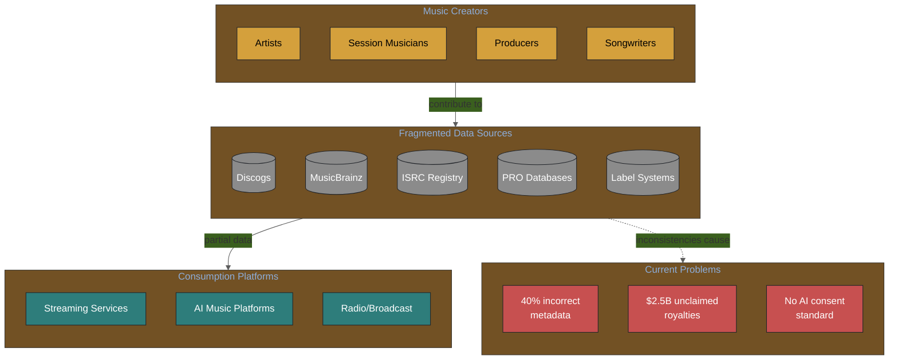

**For Stakeholders**: This diagram shows how music attribution data is currently scattered across multiple incompatible systems, leading to massive value leakage.

**For Engineers**: Each data source has different APIs, schemas, and update frequencies. The system must reconcile these into a unified model.

### 1.2 Pain Points

| Pain Point | Impact | Who Suffers |
|------------|--------|-------------|
| **Incorrect credits** | Lost royalties, misattribution | Composers, session musicians |
| **Data silos** | Duplicate effort, inconsistency | Labels, distributors, platforms |
| **No AI permissions** | Unauthorized training, no compensation | Independent artists |
| **Manual verification** | Expensive, slow, doesn't scale | Rights organizations |

### 1.3 Market Opportunity

The rise of generative AI in music creates urgent demand for:

1. **Machine-readable permissions**: AI companies need to know who consents to training
2. **Attribution provenance**: AI outputs need traceable credit chains
3. **Independent artist representation**: 80% of music is independent, but AI deals favor majors

#### Market Forces Driving Adoption

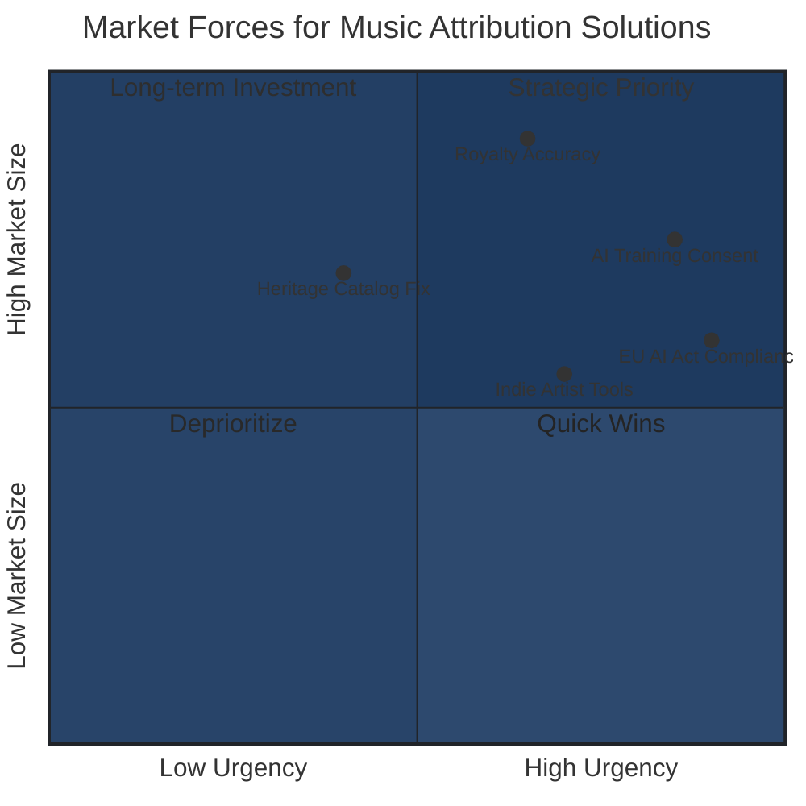

**For Stakeholders**: AI training consent and EU AI Act compliance are high-urgency drivers. Royalty accuracy represents the largest market but slightly lower urgency.

**For Engineers**: Priority implementation order should follow the urgency axis. Phase 1 focuses on compliance-critical features.

### 1.4 Regulatory Drivers

- EU AI Act transparency requirements
- Potential US legislation on AI training data consent
- Industry pressure for "ethical AI" standards

### Visual: EU AI Act Compliance Timeline


*EU AI Act timeline for music AI: GPAI obligations (training data transparency) active from August 2025. The system provides L3 traceability for compliance. Non-compliance penalties up to [€35M or 7% turnover](https://www.dlapiper.com/en-us/insights/publications/2025/08/latest-wave-of-obligations-under-the-eu-ai-act-take-effect).*

## 2. Product Vision

### 2.1 Vision Statement

> Artists are the experts on their work. The system enables them to control their digital identity and do business with AI and third-party platforms on their own terms.

### 2.2 Target Users

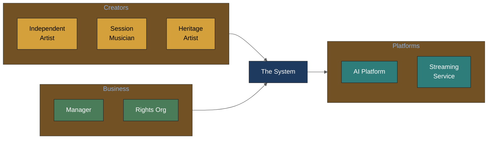

| Persona | Need | Attribution Solution |
|---------|------|-------------------|
| **Independent Artist** | Catalog works, set AI permissions | Artist ID + permission dashboard |
| **Session Musician** | Prove contributions | Verified credit claims |
| **Manager** | Manage multiple artists | Multi-artist data hub |
| **AI Platform** | Licensed training data | MCP API with consent verification |
| **Rights Organization** | Accurate attribution | Cross-referenced data feeds |

### 2.3 Success Definition

The system succeeds when:

1. Artists can create verified identities in < 5 minutes
2. Attribution confidence reaches 90%+ for cross-referenced claims
3. AI platforms prefer attribution data over scraping due to quality and licensing clarity

## 3. User Stories

### Artist Stories

- **As an independent artist**, I want to catalog my discography with proper credits so that streaming platforms and AI systems attribute me correctly.
- **As a session musician**, I want to claim my contributions to recordings so that I receive proper recognition even without formal contracts.
- **As a heritage artist**, I want to verify historical credits album-by-album so that decades of misattribution can be corrected.

### Platform Stories

- **As an AI music platform**, I want to query artist permissions via API so that I can train models only on consented works.
- **As a streaming service**, I want high-confidence attribution data so that royalty payments go to the right people.

### Manager Stories

- **As a manager**, I want to manage multiple artists' data in one place so that I can ensure consistency across their catalogs.

## 4. Technical Architecture

### 4.1 System Design

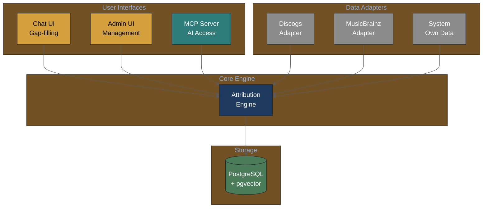

### 4.2 Technology Stack

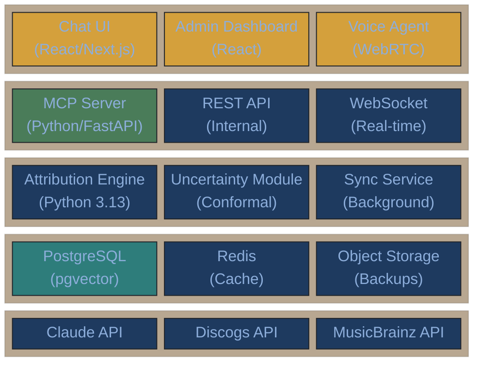

**For Stakeholders**: Each layer has a specific responsibility. The presentation layer serves users; the API layer connects to AI platforms; the core services handle business logic; the data layer persists everything.

**For Engineers**: All components use Python except the presentation layer. The MCP Server is the primary integration point for external AI platforms.

| Component | Technology | Rationale |
|-----------|------------|-----------|
| Language | Python 3.13 | Team expertise, AI ecosystem |
| Database | PostgreSQL + pgvector | Relational + vector search |
| API | MCP Protocol | AI-native, tool-use friendly |
| AI | Claude API (Pydantic) | No framework lock-in |
| Infrastructure | Render + Neon | Serverless, low ops |

### 4.3 Integration Points

- **Discogs API**: Artist, release, label data
- **MusicBrainz API**: Artist, recording, work data
- **MCP Protocol**: AI agent access (Claude, ChatGPT, Mogen)
- **OAuth 2.0**: Third-party authentication

### 4.4 Decision Log

| Decision | Options | Chosen | Rationale |
|----------|---------|--------|-----------|
| Database | Postgres/Neo4j | Postgres | ACID, pgvector, simpler ops |
| AI Framework | LangChain/Pure Python | Pure Python | Debuggability, no lock-in |
| UQ Approach | Logits/Conformal | Conformal | API-compatible, formal guarantees |
| Docs Format | LaTeX/Markdown | Markdown | Claude Code native |

## 5. Data Model

### 5.1 Core Entities

- **ArtistID**: Verified artist identity (permanent, portable)
- **Work**: A musical composition or recording
- **Credit**: A claim of contribution (role, confidence, sources)
- **Permission**: AI training consent (per-work or catalog-wide)

### 5.2 Relationships

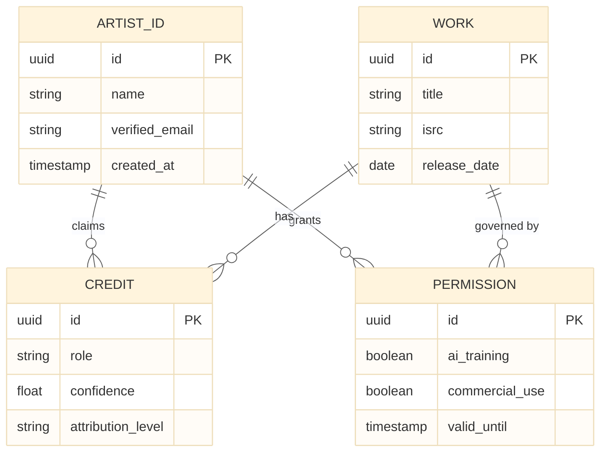

### 5.3 Confidence Scoring

See [attribution-engine-prd.md](attribution-engine-prd.md) Section 5.3 for full confidence scoring algorithm.

## 6. Implementation Roadmap

### Strategic Roadmap Timeline

```mermaid
%%{init: {'theme': 'base', 'themeVariables': {'background': '#fcfaf5', 'primaryColor': '#1E3A5F', 'lineColor': '#5C5C5C'}}}%%
timeline
    title the system Development Roadmap 2026
    section Phase 1: Sprint MVP
        Weeks 1-2 : Attribution Engine Core
                  : Multi-source data adapters
                  : Entity resolution foundation
        Weeks 3-4 : MCP Server v1
                  : Read-only API
                  : Heuristic confidence scoring
    section Phase 2: Identity
        Weeks 5-6 : ArtistID System
                  : Artist verification flow
                  : Chat interface launch
        Weeks 7-8 : Permission Management
                  : Write operations
                  : Consent dashboard
    section Phase 3: Ecosystem
        Weeks 9-12 : Partner Integrations
                   : Mogen integration
                   : Platform onboarding
        Weeks 13-16 : Calibration & Scale
                    : Conformal prediction
                    : Heritage program launch
```

**For Stakeholders**: Each phase has clear success criteria. Phase 1 delivers a working proof-of-concept; Phase 2 enables artist control; Phase 3 builds the ecosystem.

**For Engineers**: Dependencies flow left-to-right. Attribution Engine is the critical path for Phase 1.

### Phase 1: Sprint MVP (Weeks 1-4)

- [ ] Attribution engine with multi-source aggregation
- [ ] Confidence scoring (heuristic, not calibrated)
- [ ] MCP server with read-only access
- [ ] Basic chat interface for gap-filling

**Success criteria**: Can query artist attribution via MCP with confidence scores

### Phase 2: Identity & Permissions (Weeks 5-8)

- [ ] ArtistID creation and verification
- [ ] Permission management dashboard
- [ ] Write operations via MCP (Tier 2)

**Success criteria**: Artists can claim identities and set AI permissions

### Phase 3: Ecosystem Growth (Weeks 9-16)

- [ ] Partner API integrations (Mogen, verified platforms)
- [ ] Calibrated confidence scoring (100+ validation examples)
- [ ] Heritage artist onboarding program

**Success criteria**: 1000+ verified ArtistIDs, 10+ platform integrations

### Value Delivery Curve

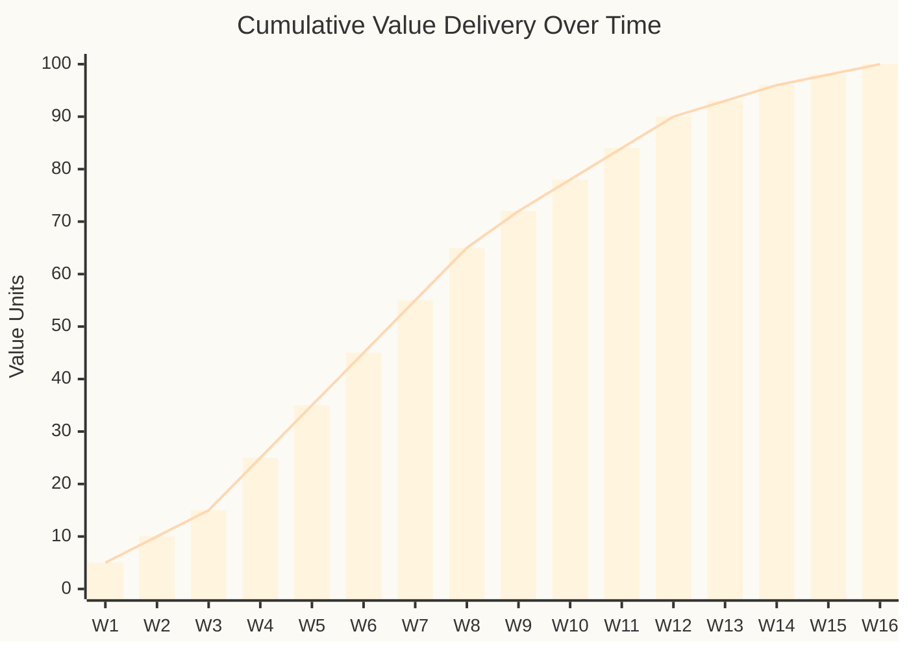

**For Stakeholders**: The steepest value growth occurs in Phases 1-2 (weeks 1-8). Phase 3 delivers diminishing returns per week but critical ecosystem scale.

**For Engineers**: Front-load architectural decisions. Technical debt accumulated in Phase 1 compounds in later phases.

## 7. Success Metrics

| Metric | Target | Measurement |
|--------|--------|-------------|
| Attribution accuracy | 90% | Cross-source validation |
| ArtistID creation time | < 5 min | User analytics |
| API response time | < 500ms | P95 latency |
| AI platform adoption | 10+ partners | Contract count |
| Artist satisfaction | 8/10 | NPS survey |

## 8. Risks & Dependencies

### Risk Heat Map

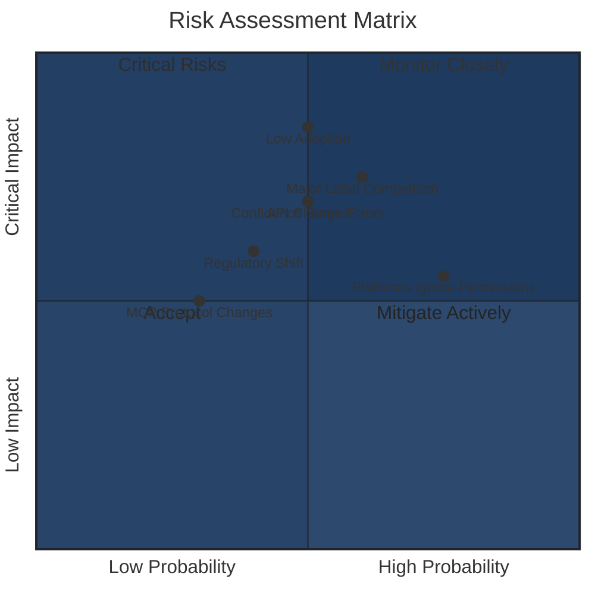

**For Stakeholders**: "Low Artist Adoption" is the highest-impact risk. Mitigation requires community partnerships and frictionless onboarding.

**For Engineers**: "API Changes" and "Confidence Score Errors" are technical risks that require defensive architecture (abstraction layers, validation frameworks).

| Risk | Probability | Impact | Mitigation |
|------|-------------|--------|------------|
| Data source API changes | Medium | High | Abstraction layer, caching |
| Low artist adoption | Medium | Critical | Partner with FAC, Imogen Heap network |
| AI platforms ignore permissions | High | Medium | Legal framework, industry pressure |
| Incorrect confidence scores | Medium | High | Validation set, calibration metrics |

## 8.1 Research-Informed Risk Analysis

Per research synthesis ([music-attribution-research-2026-02-03.md](../knowledge-base/domain/music-industry/music-attribution-research-2026-02-03.md)):

### The Oracle Problem (Technical Limits)

**Three things The system CANNOT prove:**
1. A model trained *only* on consented data
2. Output resemblance is causal (not coincidental)
3. A model did *not* learn from a specific work

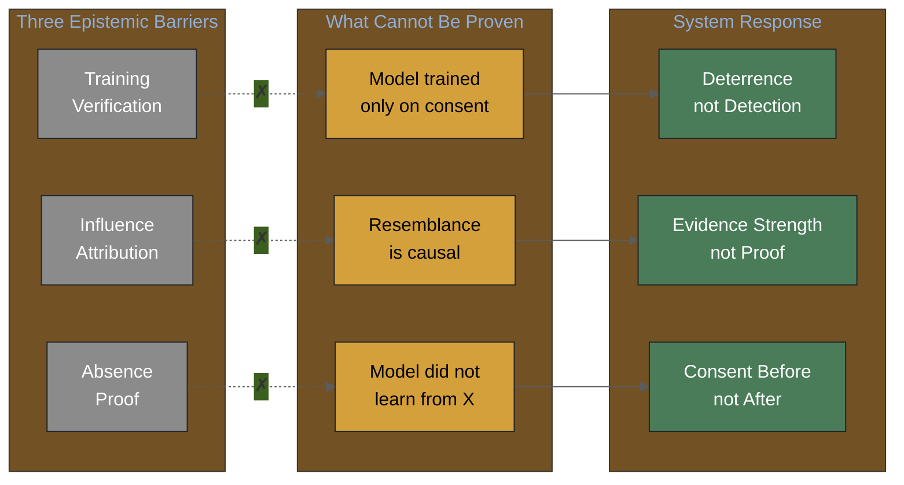

**Research basis**: [Morreale et al. (2025)](https://arxiv.org/abs/2510.08062) "Attribution-by-design: Ensuring Inference-Time Provenance in Generative Music Systems" — similarity does not imply causation.

**Mitigation**: Position confidence as "evidence strength for compliant participants"—deterrence-based, not detection-based.

### Three Market Failures the system Addresses

| Market Failure | Research Basis | System Response |
|----------------|----------------|-------------------|
| **Incomplete Property Rights** | "Style" isn't copyrightable (Teikari, 2026) | Create tradable permission bundles |
| **Information Asymmetry** | Artists don't know if they're in training sets (Longpre, 2024) | Transparent provenance tracking |
| **Market Power** | Major labels negotiate, independents don't (Heap, 2025) | MCP enables direct artist-platform negotiation |

### The "Slop" Opportunity

Per Madsen & Puyt (2025): When AI content floods markets, verified human provenance becomes a **market differentiator**. The system provides this costly signal.

## 9. Cross-References

### Related PRDs

- [attribution-engine-prd.md](attribution-engine-prd.md) - Core engine details
- [chat-interface-prd.md](chat-interface-prd.md) - Conversational UX
- [mcp-server-prd.md](mcp-server-prd.md) - API specification

### Knowledge Base

- [domain/attribution/](../knowledge-base/domain/attribution/) - A0-A3 framework
- [technical/uncertainty/](../knowledge-base/technical/uncertainty/) - UQ approaches

### External References

- [Imogen Heap: What Do Musicians Do About GenAI?](https://medium.com/@imogenheap/what-do-musicians-do-about-genai-3ff458f955f0)
- [MCP Specification](https://modelcontextprotocol.io/)
- [Creative Passport (predecessor)](https://www.creativepassport.net/)

### Research Synthesis

- [music-attribution-research-2026-02-03.md](../knowledge-base/domain/music-industry/music-attribution-research-2026-02-03.md) - 200+ paper synthesis with actionable insights

## 10. Unknown Unknowns

### What We Don't Know We Don't Know

This section captures areas where our assumptions may be fundamentally wrong, beyond the known risks above.

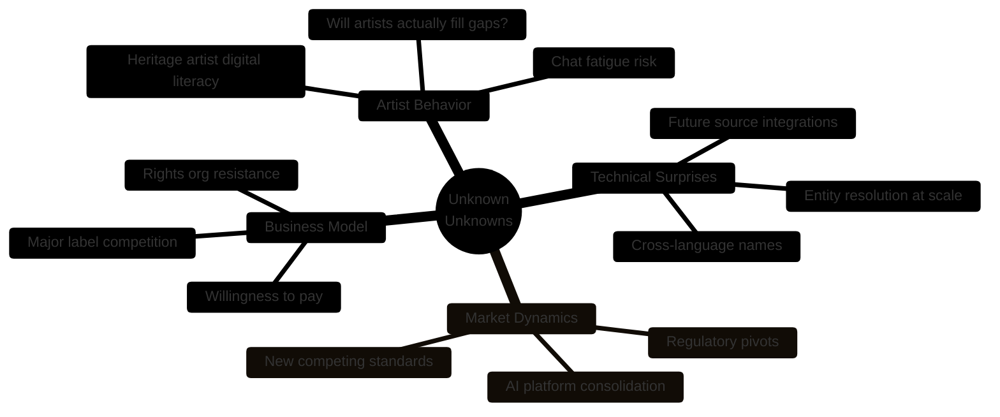

#### Areas of Deep Uncertainty

| Domain | Unknown Unknown | Mitigation Approach |
|--------|-----------------|---------------------|
| **User Adoption** | Artists may find even chat-based data entry tedious | A/B test engagement; consider voice-first interface |
| **Data Quality** | Entity resolution may fail for non-Western names | Partner with international music communities early |
| **Market Timing** | AI regulation may shift faster than we can adapt | Build flexible permission model, monitor policy closely |
| **Competition** | Major labels may build their own systems | Focus on indie artist value proposition |
| **Technical Debt** | MCP protocol may evolve incompatibly | Abstract protocol layer, stay close to spec committee |

#### Questions for Domain Experts

See [UNKNOWNS-FOR-DOMAIN-EXPERTS.md](UNKNOWNS-FOR-DOMAIN-EXPERTS.md) for structured questions that only Imogen, Andy, and industry insiders can answer.

---

## 11. Hierarchical PRD Navigation

### PRD Ecosystem

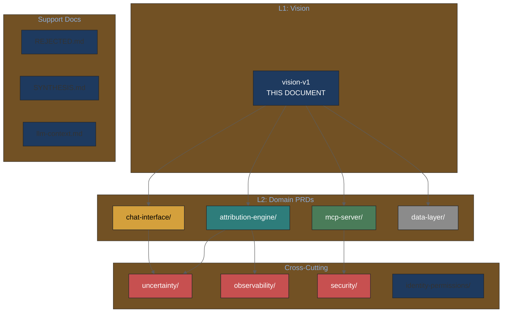

### Navigation Guide

| Level | Documents | Purpose |
|-------|-----------|---------|
| **L1** | This document | Master vision, stakeholder alignment |
| **L2** | Domain TOCs | Component-specific requirements |
| **L3** | Feature PRDs | Detailed implementation specs |
| **Cross** | Uncertainty, Observability, Security | Shared concerns across domains |

**Start Here**:
- New to project? Read [llm-context.md](llm-context.md) first
- Technical deep-dive? Start with [attribution-engine/toc-attribution-engine.md](attribution-engine/toc-attribution-engine.md)
- UX focus? Start with [chat-interface/toc-chat-interface.md](chat-interface/toc-chat-interface.md)
- API integration? Start with [mcp-server/toc-mcp-server.md](mcp-server/toc-mcp-server.md)

---

## Appendices

### A. Glossary

| Term | Definition |
|------|------------|
| **ArtistID** | Verified artist identity in the system system |
| **MCP** | Model Context Protocol - AI agent communication standard |
| **A0-A3** | Attribution assurance levels (Unknown → Verified) |
| **pgvector** | PostgreSQL extension for vector similarity search |
| **Conformal Prediction** | Statistical method for providing formal confidence guarantees |
| **ITA** | Inference-Time Attribution - attribution applied at generation, not training |

### B. Open Questions

1. How to handle disputed credits between artists?
2. What's the minimum validation set size for calibrated confidence?
3. Should permissions be transferable with catalog sales?
4. What is the optimal confidence threshold for auto-population vs. manual review?
5. How do we handle non-Latin character names in entity resolution?

### C. Stakeholder Map

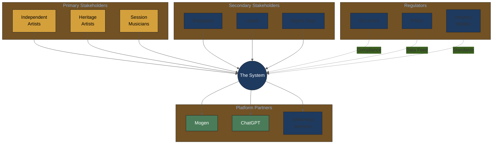

### D. Reviewer Feedback Log

| Date | Reviewer | Feedback | Resolution |
|------|----------|----------|------------|
| 2026-02-03 | Initial draft | - | - |
| 2026-02-04 | Structure review | Add unknown unknowns, hierarchical navigation | Added sections 10-11 |
