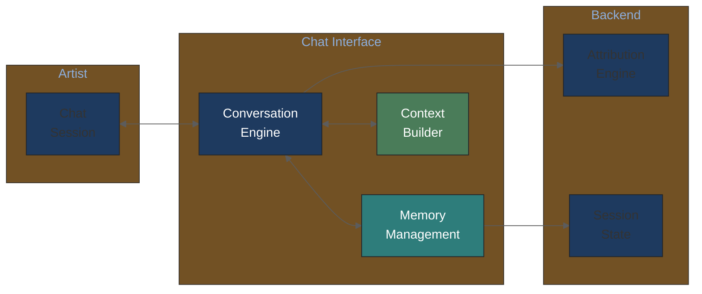
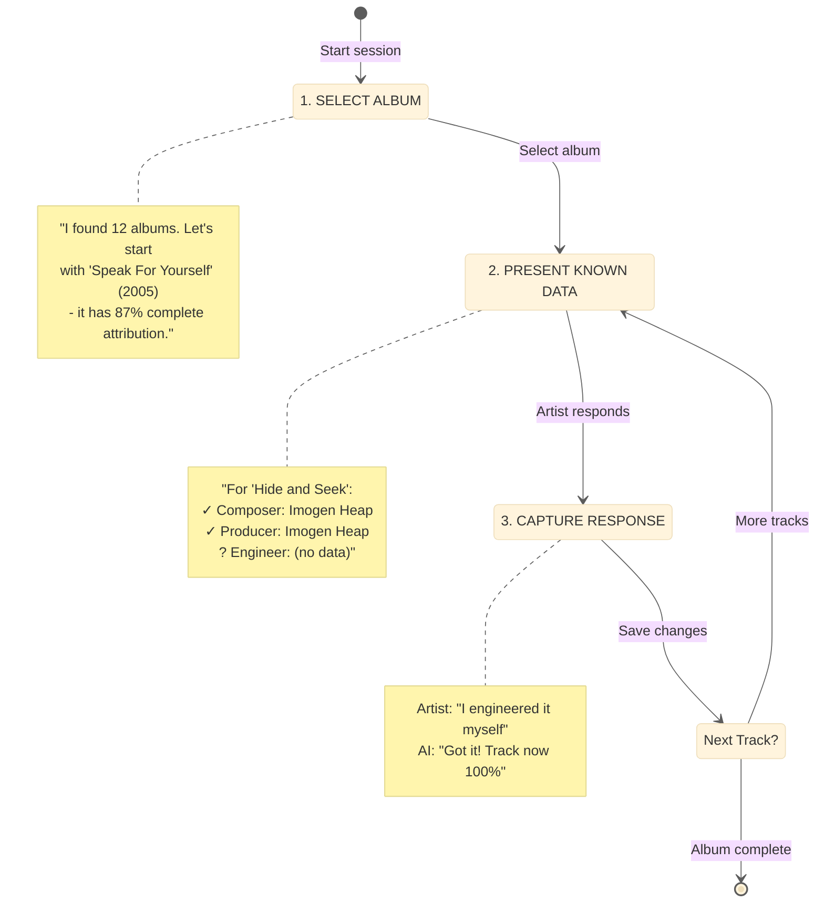
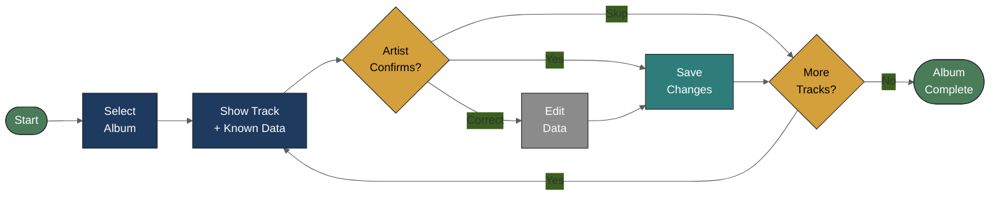
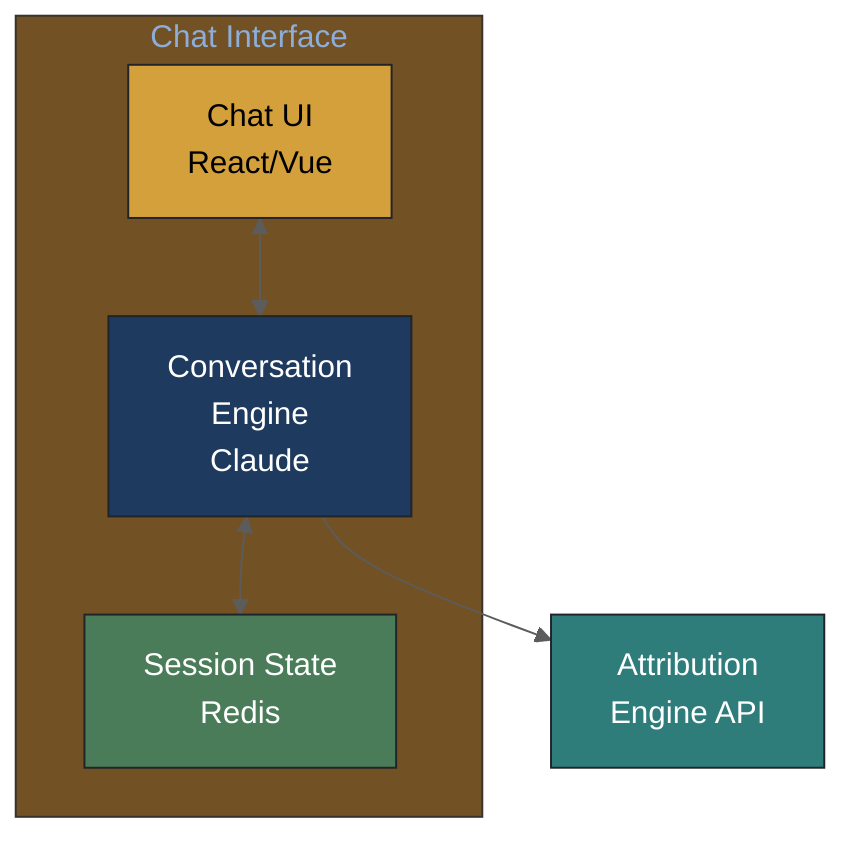
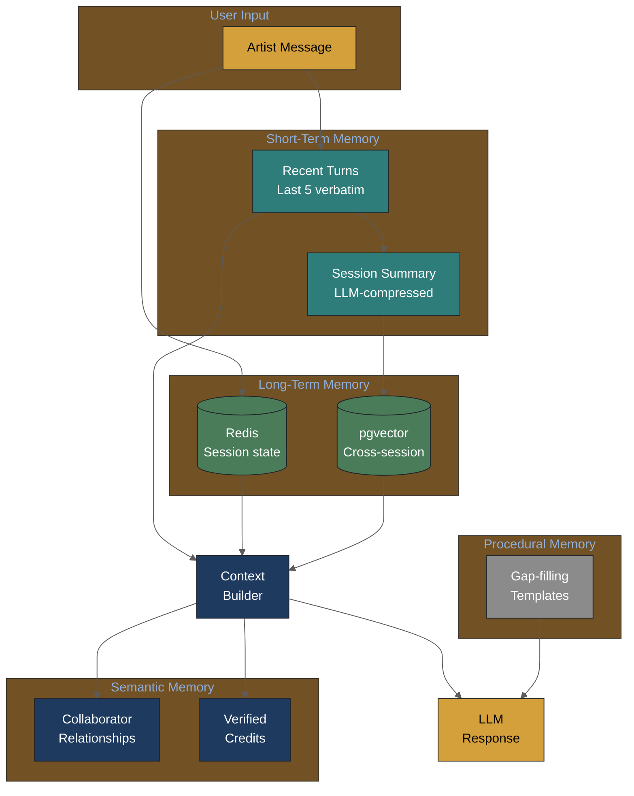
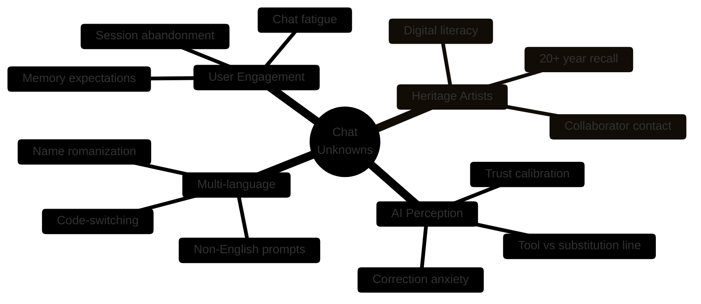
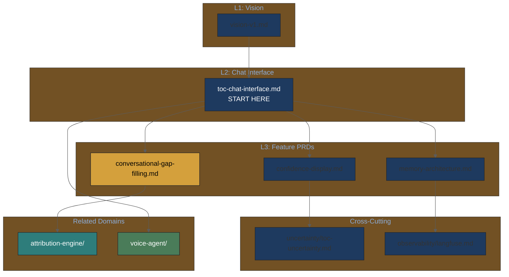

# Chat Interface PRD v1

> **Navigation Note**: This is a legacy flat PRD. For the new hierarchical structure with granular feature PRDs, see [chat-interface/toc-chat-interface.md](chat-interface/toc-chat-interface.md).

---

## For Domain Experts

**What this document covers**: Conversational AI interface for attribution gap-filling.

**Key decisions needing domain input**:
- Optimal session length before artist fatigue (Q2 in [UNKNOWNS-FOR-DOMAIN-EXPERTS.md](UNKNOWNS-FOR-DOMAIN-EXPERTS.md))
- Memory aids for heritage artists recalling 20+ year old sessions
- Framing AI assistance as "tool" vs. "substitution" to preserve artist agency

**Quick architecture overview**:



---

## Metadata

- **Version**: 0.8.0
- **Status**: Draft
- **Created**: 2026-02-03
- **Updated**: 2026-02-03
- **Author**: Claude Code
- **Lineage**: PLAN.md, original-prompt.md (gap-filling vision)

## Executive Summary

- **What**: Conversational AI interface for attribution gap-filling
- **Why**:
  - Data entry is boring; conversation makes it engaging
  - Artists know their work; AI should ask, not assume
  - Album-at-a-time workflow matches artist mental model
- **Investment**: 2-3 weeks for MVP
- **Confidence**: High for UX concept, medium for AI interaction quality

## 1. Problem Statement

### 1.1 Current State

Attribution data entry is tedious:

- Spreadsheet-based tools feel like homework
- Artists have the knowledge but lack motivation to enter it
- Incomplete data stays incomplete

### 1.2 Vision (From Original Prompt)

> "Easiest ones first, biggest gaps later. Make it fun through conversation."

The chat interface transforms data entry into a dialogue where:

1. AI presents what it knows with confidence indicators
2. Artist confirms, corrects, or fills gaps
3. Progress feels like completing a puzzle, not filling forms

## 2. User Stories

### Primary Stories

- **As an artist**, I want to verify my credits conversationally so that I don't feel like I'm doing data entry.
- **As an artist**, I want to work album-by-album so that I can focus on one project at a time.
- **As an artist**, I want to see what the system already knows so that I only fill in what's missing.

### Secondary Stories

- **As a manager**, I want to delegate verification to artists while reviewing results.
- **As a heritage artist**, I want help remembering credits from decades ago.

## 3. Conversation Design

### 3.1 Workflow



**Conversation Flow:**



### 3.2 Confidence Display Patterns

| Level | Score | Display | Interaction |
|-------|-------|---------|-------------|
| **verified** | 0.8+ (with artist confirm) | Green checkmark | No action needed |
| **high** | 0.8+ | Gray checkmark | "This look right?" |
| **medium** | 0.7-0.8 | Yellow question | "Can you confirm?" |
| **low** | <0.7 | Red gap | "Who was...?" |

### 3.3 Conversation Principles

1. **Progressive disclosure**: Show summary first, details on request
2. **Confirmation bias avoidance**: Present options, don't lead
3. **Memory aids**: "This was released in 2005, around the same time as..."
4. **Escape hatches**: "Skip this for now" always available

### 3.4 Research-Informed Positioning: Tool, Not Substitution

Per Kawakami & Venkatagiri (2024), artists accept AI when used as tool, reject it as substitution.

**System Chat Interface MUST**:

| Do | Don't |
|----|-------|
| "Help me remember who played drums" | "I'll fill in your credits automatically" |
| "Can you confirm this credit?" | "Based on my analysis, the producer was..." |
| "What gaps exist in this album?" | "I've completed your attribution data" |
| Present options for artist decision | Make decisions for the artist |

**Conversation Starters (Gap-Filling Mode)**:

```python
GAP_FILLING_PROMPTS = [
    "I found some credits from MusicBrainz. Can you verify these?",
    "There's a gap for the engineer on track 3. Do you remember who that was?",
    "Discogs lists you as producer, but MusicBrainz says co-producer. Which is correct?",
    "This session was 20 years ago—any memory aids I can help with?",
]
```

**Heritage Artist Support**:

Per research, heritage artists need memory aids more than gap-filling automation:

```python
MEMORY_AIDS = {
    "timeline": "This was recorded in 1998, around the time you were working with [collaborator]",
    "context": "The studio was [Studio Name]—does that help remember the session players?",
    "cross_reference": "Your 1999 album had [Musician] on drums. Same person here?",
}
```

## 4. Technical Architecture

### 4.1 Components



### 4.2 Conversation State

```python
from pydantic import BaseModel
from typing import Literal

class ConversationState(BaseModel):
    """Tracks current conversation context."""
    session_id: str
    artist_id: str
    current_album_id: str | None
    current_track_index: int
    mode: Literal["album_select", "track_verify", "gap_fill", "complete"]
    pending_confirmations: list[str]
    completed_tracks: list[str]

class GapFillRequest(BaseModel):
    """Request for gap-filling assistance."""
    track_id: str
    field: str  # 'composer', 'producer', 'engineer', etc.
    current_value: str | None
    confidence: float
    sources: list[str]
```

### 4.3 Claude Integration

```python
SYSTEM_PROMPT = """
You are helping an artist verify their music credits. Your role is to:

1. Present what the database knows with appropriate confidence
2. Ask clarifying questions for gaps or conflicts
3. Confirm understanding before recording changes
4. Keep the conversation friendly and efficient

IMPORTANT: Never assume or guess credits. Always ask the artist.

Current context:
- Artist: {artist_name}
- Album: {album_title} ({year})
- Track: {track_title}
- Known credits: {known_credits}
- Gaps: {gaps}
"""
```

## 4.4 Memory Architecture (Research-Informed)

Per 2026 industry trend toward agentic memory over pure RAG (see [agentic-systems-research-2026-02-03.md](../knowledge-base/technical/agentic-systems-research-2026-02-03.md)):

### Memory Types

| Memory Type | Purpose | Implementation | Retention |
|-------------|---------|----------------|-----------|
| **Short-term** | Current session context | Redis | Session duration |
| **Long-term** | Cross-session artist history | pgvector | Persistent |
| **Semantic** | Collaborator relationships | Knowledge graph extraction | Persistent |
| **Procedural** | Gap-filling patterns | Prompt templates | Static |

### Memory Flow Diagram



**Research basis**: Industry trend toward agentic memory over pure RAG; conversational amnesia mitigation via hybrid memory patterns. *[Note: Specific source links pending verification]*

### Conversation Amnesia Mitigation

LLMs lose context beyond 10-15 turns. The system mitigates this via:

```python
class ConversationMemory(BaseModel):
    """Hybrid memory for multi-turn artist verification."""

    # Short-term: recent exchanges (raw)
    recent_turns: list[Turn]  # Last 5 turns verbatim

    # Summary: older exchanges (compressed)
    session_summary: str  # LLM-generated summary of earlier turns

    # Long-term: previous sessions (retrieved)
    past_sessions: list[SessionSummary]  # Vector-retrieved relevant history

    # Semantic: extracted facts
    known_collaborators: dict[str, str]  # name -> relationship
    verified_credits: list[Credit]  # Confirmed in this session

async def build_context(artist_id: str, current_turn: int) -> ConversationMemory:
    """Build context using Summary Buffer Memory pattern."""
    memory = ConversationMemory()

    # Always include recent turns
    memory.recent_turns = await get_recent_turns(limit=5)

    # Summarize older turns if conversation > 5 turns
    if current_turn > 5:
        memory.session_summary = await summarize_turns(
            start=0, end=current_turn - 5
        )

    # Retrieve relevant past sessions via vector similarity
    memory.past_sessions = await vector_search(
        query=memory.recent_turns[-1].content,
        filter={"artist_id": artist_id},
        limit=3
    )

    return memory
```

### Target Metrics

| Metric | Target | Rationale |
|--------|--------|-----------|
| Context retention accuracy | >90% | Validation set measurement |
| Mean conversation length | >10 turns | Industry benchmark for engagement |
| Cross-session recall | >80% | Artist should not repeat information |

## 5. MCP Integration Points

The chat interface connects to Mogen and other AI platforms via MCP:

### 5.1 Permission Verification Hook

When an AI platform queries artist data:

```python
async def handle_mcp_query(request: ArtistAttributionRequest) -> Response:
    # Check if artist has set permissions
    permissions = await get_artist_permissions(request.artist_id)

    if not permissions.allows_ai_access(request.client_id):
        return Response(
            status="denied",
            message="Artist has not granted access to this client"
        )

    return await fetch_attribution(request)
```

### 5.2 Data Contribution Hook

When artist contributes data via chat, notify subscribed platforms:

```python
async def on_attribution_update(artist_id: str, changes: list[Change]):
    # Notify Mogen and other subscribers
    for subscriber in get_mcp_subscribers(artist_id):
        await notify_subscriber(subscriber, changes)
```

## 6. Implementation Roadmap

### Phase 1: MVP (Post-Sprint)

- [ ] Basic chat UI (text-based)
- [ ] Album selection workflow
- [ ] Track-by-track verification
- [ ] Simple gap-filling prompts

### Phase 2: Enhancement

- [ ] Rich UI with visual confidence indicators
- [ ] Bulk operations ("all tracks by this producer")
- [ ] Memory/suggestion features
- [ ] Mobile-friendly interface

## 7. Success Metrics

| Metric | Target | Measurement |
|--------|--------|-------------|
| Session completion rate | 70% | % of started albums completed |
| Time per track | < 2 min | Average verification time |
| Artist satisfaction | 8/10 | Post-session survey |
| Data quality improvement | +20% | Confidence score increase |

## 8. Research-Informed Design Decisions

### 8.1 The "Slop" Problem Creates Market Opportunity

Per Madsen & Puyt (2025):

> "Creativity thrives on scarcity; slop thrives on glut."

**Implication**: Verified human provenance (via the system) becomes a market differentiator when AI-generated content floods platforms. The chat interface helps artists claim and verify their human-created work.

### 8.2 Artist Agency Preservation

Per artist survey research (337 artworks analyzed):

- Artists use AI for **co-composition** and **sound design** (tool mode)
- Only a few use AI for full-song **AI-composition** (substitution mode)
- Artists seek to **retain creative control**

**Design Principle**: Chat interface should feel like a research assistant, not an automation system.

## 9. Unknown Unknowns

### Conversational UX Uncertainties



| Unknown | Potential Impact | Discovery Plan |
|---------|------------------|----------------|
| **Chat fatigue** | Artists abandon after 5-10 tracks | A/B test voice-first alternative |
| **Heritage recall accuracy** | 20+ year memories may be unreliable | Cross-reference with session logs, contracts |
| **"Too much AI" perception** | Artists may feel data is being extracted | User research on framing and agency |
| **Non-English sessions** | Prompts optimized for English may not translate | Partner with international artists for testing |
| **Collaborator contact info** | "Reach out to X" requires contact data we may not have | Consider social graph integration |

### Questions Only Domain Experts Can Answer

See [UNKNOWNS-FOR-DOMAIN-EXPERTS.md](UNKNOWNS-FOR-DOMAIN-EXPERTS.md) for structured questions, particularly:
- Q1.1: What confidence level makes you trust automated data?
- Q2.1: Walk us through how you currently track credits for a release
- Q4.4: AI-generated contributions - how should they be credited?

---

## 10. Hierarchical PRD Navigation

### Chat Interface Ecosystem



### Detailed PRD Index

| PRD | Purpose | Status |
|-----|---------|--------|
| [toc-chat-interface.md](chat-interface/toc-chat-interface.md) | Domain overview | Active |
| [conversational-gap-filling.md](chat-interface/conversational-gap-filling.md) | Album-at-a-time workflow | Active |
| [voice-agent/toc-voice-agent.md](voice-agent/toc-voice-agent.md) | Voice-first alternative | Active |

---

## 11. Cross-References

- [vision-v1.md](vision-v1.md) - Product vision
- [attribution-engine-prd.md](attribution-engine-prd.md) - Data layer
- [mcp-server-prd.md](mcp-server-prd.md) - Platform integration
- [chat-interface/toc-chat-interface.md](chat-interface/toc-chat-interface.md) - Hierarchical detail
- [voice-agent/toc-voice-agent.md](voice-agent/toc-voice-agent.md) - Voice interface PRDs
- [../knowledge-base/domain/music-industry/music-attribution-research-2026-02-03.md](../knowledge-base/domain/music-industry/music-attribution-research-2026-02-03.md) - Music domain research
- [../knowledge-base/technical/agentic-systems-research-2026-02-03.md](../knowledge-base/technical/agentic-systems-research-2026-02-03.md) - Technical architecture research
- [UNKNOWNS-FOR-DOMAIN-EXPERTS.md](UNKNOWNS-FOR-DOMAIN-EXPERTS.md) - Questions for domain experts
