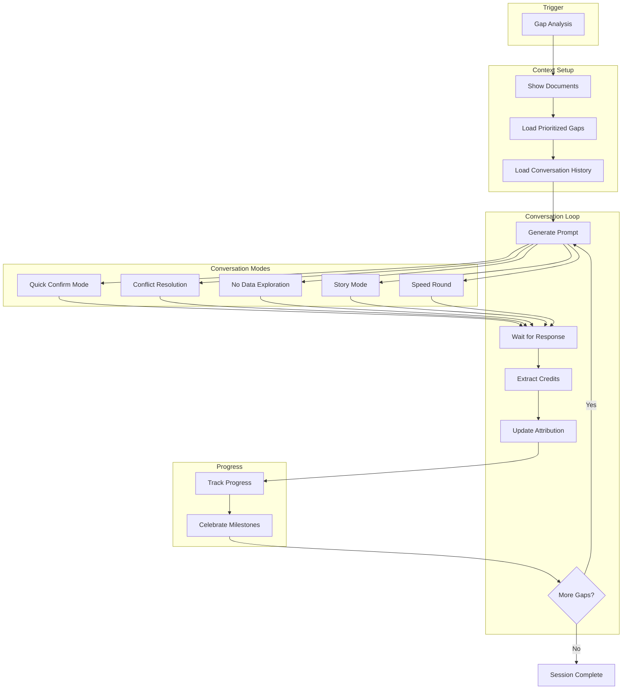
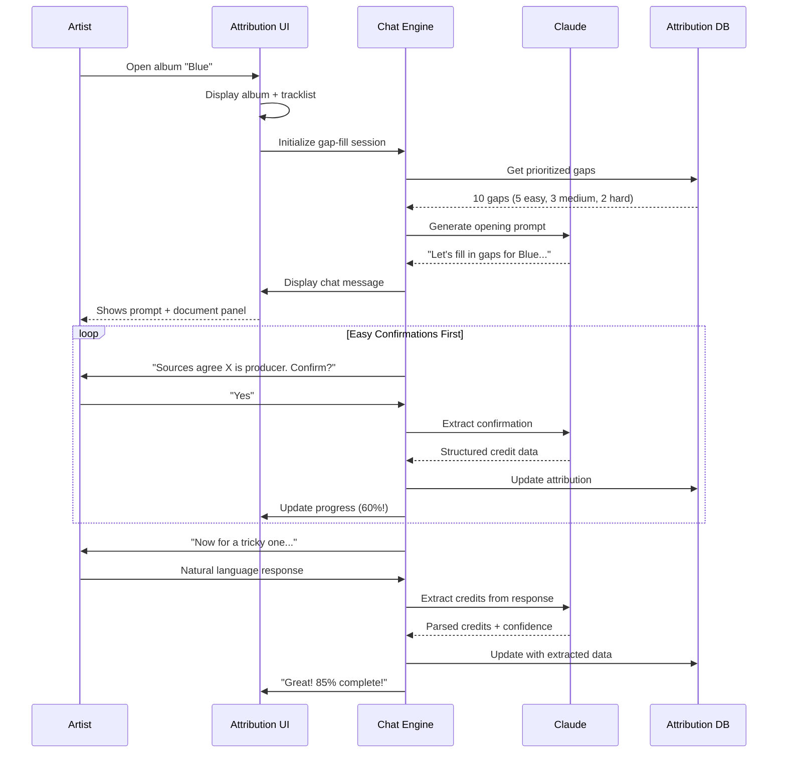
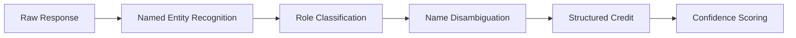

# Conversational Gap-Filling

**Purpose**: Engage artists in natural dialogue to fill attribution gaps while making the process enjoyable.

**Key Insight from Imogen**: "Fill in the gaps in a conversational way whilst the documents are on screen. Adding this information is so bloody boring - make it fun somehow through conversation."

---

## For Domain Experts

**What This Does**: Instead of filling out tedious forms field-by-field, you have a conversation with the system. The AI asks you about your music in a natural way, extracts the attribution data from your answers, and updates your records automatically.

**Why This Matters for Artists**:
- Traditional metadata entry is mind-numbing - clicking through hundreds of fields
- the system makes it feel like reminiscing about making the album
- You see your album artwork and tracklist on screen while chatting
- The AI remembers context from previous sessions ("Last time you mentioned James Taylor...")
- Progress is celebrated ("You just hit 80% complete!")

**How Artists Experience This**:
1. "Let us talk about your album 'Blue'. I see the songwriter credits look complete, but I am missing producer info."
2. "Was this self-produced, or did someone else handle production?"
3. You say: "It was self-produced, but Henry Lewy engineered it"
4. AI: "Got it! I have marked you as producer and Henry Lewy as engineer. Were there any session musicians on 'All I Want'?"
5. Natural conversation continues until gaps are filled

**Making It Fun**:
- Speed rounds for quick confirmations
- Trivia mode shares interesting facts about your catalog
- Story mode lets you just talk about making the album while AI extracts credits

---

## Overview

Conversational Gap-Filling transforms tedious form-filling into natural dialogue:

| Traditional | The System Conversational |
|-------------|------------------------|
| "Enter producer name:" | "I see you worked with Rick Rubin on this. Was he the main producer?" |
| "Add session musicians:" | "Who else was in the studio with you on these tracks?" |
| "Confirm songwriter:" | "MusicBrainz and Discogs both say you wrote this solo. Sound right?" |

## Design Principles

### 1. Context-Aware

Show relevant documents on screen while chatting:

```
┌─────────────────────────────────────────────────────────────────────┐
│                        ATTRIBUTION WORKSPACE                            │
├────────────────────────────────────┬────────────────────────────────┤
│                                    │                                │
│         DOCUMENT PANEL             │          CHAT PANEL            │
│                                    │                                │
│  Album: "Blue" (1971)              │  🎵 Let's fill in some gaps   │
│  ─────────────────────             │     for "Blue"                 │
│                                    │                                │
│  Track 1: All I Want               │  I see Discogs lists Henry    │
│    Writer: Joni Mitchell ✓         │  Lewy as engineer, but there's │
│    Producer: ??? ⚠                 │  no producer credit.          │
│    Engineer: Henry Lewy ✓          │                                │
│                                    │  Was "Blue" self-produced, or  │
│  Track 2: My Old Man               │  was someone else involved?   │
│    Writer: Joni Mitchell ✓         │                                │
│    Producer: ??? ⚠                 │  [Self-produced] [Other]      │
│                                    │                                │
└────────────────────────────────────┴────────────────────────────────┘
```

### 2. One Thing at a Time

Never overwhelm with multiple questions:

```
❌ BAD:  "Please confirm the producer, add any session musicians,
         verify the songwriter credits, and add any missing personnel."

✓ GOOD: "Was Henry Lewy the producer for Blue, or was it self-produced?"
        [User answers]
        "Great! Now, were there any session musicians on 'All I Want'?"
```

### 3. Reference What's Visible

Always connect questions to what the user can see:

```
"Looking at track 3 here [highlight on screen], I don't have any
info on who played bass. Do you remember?"
```

### 4. Memory Across Sessions

Remember context from previous conversations:

```
"Last time you mentioned James Taylor played guitar on a few tracks.
Was that 'All I Want' or a different one?"
```

## Conversation Patterns

### Pattern 1: Quick Confirmation (MISSING_VERIFICATION)

For fields where databases agree:

```
AI: "Both Discogs and MusicBrainz say you wrote 'All I Want' solo.
     Quick confirmation - that's correct?"

User: "Yes"

AI: "Perfect ✓ One down, let's keep going!"
```

### Pattern 2: Source Conflict Resolution

When sources disagree:

```
AI: "I found a small conflict - Discogs credits 'Stephen Stills'
     on guitar, but MusicBrainz says 'Stephen Stills & James Taylor'.

     Who actually played guitar on this track?"

User: "Both of them, actually"

AI: "Got it! I'll update that. Were they both there at the same time,
     or did they record separately?"
```

### Pattern 3: No Data Exploration

When starting from zero:

```
AI: "I don't have any engineer credits for this album.
     Do you remember who was behind the board?"

User: "It was at A&M Studios... I think Henry Lewy?"

AI: "Henry Lewy at A&M - that matches what I found for other tracks.
     Was he the only engineer, or were there others?"
```

### Pattern 4: Collaborative Suggestion

Per Andy's insight - suggest reaching out:

```
AI: "I'm not sure about the string arrangements on track 5.
     I see Paul Buckmaster is credited on your other albums...
     could he have done these too?

     If you're not sure, would it help to reach out to him?"

User: "Good thinking - yes, let's note that as 'likely Paul' and
       I'll confirm with him"

AI: "Marked as 'likely Paul Buckmaster - pending verification' ⏳"
```

## Making It Fun

### Progress Celebration

```
AI: "🎉 You just hit 80% complete on 'Blue'!
     Only 3 more gaps to go - want to knock them out?"
```

### Interesting Trivia Mode

```
AI: "Fun fact - while we're looking at 'A Case of You':
     Did you know this song has been covered 200+ times?

     Speaking of which, who played that distinctive dulcimer?"
```

### Speed Round

```
AI: "Quick round - just tap yes/no for these easy ones:

     ✓ You wrote 'River' solo?
     ✓ Recorded at A&M Studios?
     ✓ Henry Lewy was engineer?

     [Yes to all] [Let me see each]"
```

### Story Mode

```
AI: "Tell me the story of making this album and I'll pull out
     the credits as you talk. Just chat naturally!"

User: "Well, we were at A&M in the fall of '70, and I had just
       bought this dulcimer from a shop in..."

AI: [Extracting: Location: A&M Studios, Date: Fall 1970,
     Instrument: dulcimer]

     "Keep going! Who else was around?"
```

## Technical Implementation

### Prompt Templates

```python
CONFIRMATION_PROMPT = """
{sources} agree that {value} is the {field} for "{track}".
Quick confirmation - is that correct?
"""

CONFLICT_PROMPT = """
I found a small conflict:
- {source1} says: {value1}
- {source2} says: {value2}

Which is accurate for "{track}"?
"""

NO_DATA_PROMPT = """
I don't have any {field} information for "{track}".
Do you remember {natural_question}?
"""

COLLABORATOR_SUGGESTION_PROMPT = """
I'm not sure about the {field} on "{track}".
I see {collaborator} worked with you on other projects...
could they have been involved here too?
"""
```

### Entity Extraction

From natural language to structured data:

```python
def extract_credits_from_response(response: str, context: dict) -> list[Credit]:
    """Extract structured credit data from conversational response."""

    # Use Claude to extract structured data
    extraction_prompt = f"""
    Context: We're discussing {context['track']} from {context['album']}.

    User said: "{response}"

    Extract any credits mentioned. Return as JSON:
    {{
        "credits": [
            {{"role": "...", "person": "...", "confidence": 0.95}}
        ]
    }}
    """

    # ... Claude extraction call
```

## Observability

Track in Langfuse:

| Metric | Purpose |
|--------|---------|
| Gap fills per session | Productivity tracking |
| Avg turns per gap | Conversation efficiency |
| User sentiment | Is it actually fun? |
| Extraction accuracy | Are we getting clean data? |
| Session length | Engagement metric |

---

## Mermaid Diagram: Conversation Flow





---

## Known Unknowns

| Question | Context | Who Should Answer |
|----------|---------|-------------------|
| What makes gap-filling "fun" for different artist personalities? | Introverts vs extroverts, busy vs leisurely | UX Research |
| How long should a single session be before fatigue? | 10 minutes? 30 minutes? | UX Research |
| Should we gamify with achievements/badges? | Could feel patronizing to some | Artists + UX |
| How do we handle artists who give vague answers? | "I think maybe John played guitar" | Product + NLP |
| What if the artist contradicts themselves across sessions? | Different memory on different days | Product |
| Should the AI persona adapt to artist personality? | Formal vs casual, brief vs chatty | UX + Artists |

---

## Technical Deep Dive

### Prompt Engineering for Natural Conversation

The system uses few-shot prompting with examples:

```python
SYSTEM_PROMPT = """
You are helping {artist_name} fill in attribution gaps for their album "{album_name}".

Guidelines:
- Ask one question at a time
- Reference what's visible on screen
- Celebrate progress
- Use their previous answers as context
- Extract structured data from natural language

Current gaps to fill:
{prioritized_gaps}

Previous conversation:
{history}
"""
```

### Entity Extraction Pipeline



### Memory Across Sessions

```python
@dataclass
class ConversationMemory:
    session_id: UUID
    artist_id: UUID
    album_id: UUID

    # Context from previous sessions
    mentioned_collaborators: list[str]
    confirmed_facts: dict[str, str]
    deferred_questions: list[str]

    # Current session state
    current_gap_index: int
    mood_signal: str  # "engaged", "tired", "frustrated"
```

### Fun Factor Metrics

We track engagement signals:

| Signal | Interpretation |
|--------|----------------|
| Response length increasing | More engaged |
| Faster response times | In the flow |
| Voluntary elaboration | Having fun |
| "Let's keep going" | Positive |
| Short "yes/no" only | May be tired |
| Long pauses | Consider break |

### Handling Uncertain Responses

```python
def handle_uncertain_response(response: str, field: str) -> Credit:
    uncertainty_markers = ["I think", "maybe", "not sure", "probably"]

    if any(marker in response.lower() for marker in uncertainty_markers):
        return Credit(
            value=extracted_value,
            confidence=0.6,  # Lower than direct confirmation
            needs_verification=True,
            source="artist_uncertain"
        )
```

---

## Executive Decision Impact

| Technical Choice | Business Impact | Who Decides |
|------------------|-----------------|-------------|
| **Claude as extraction engine** | High accuracy entity extraction; vendor dependency | Engineering + Exec |
| **Split-screen document + chat UI** | Artists see context while answering; significant frontend investment | UX + Engineering |
| **Multi-session memory** | Artists feel "remembered"; infrastructure + privacy implications | Product + Legal |
| **Fun modes (Speed Round, Story, Trivia)** | Higher engagement and completion rates; extra design/dev effort | UX + Product |
| **Real-time extraction from natural language** | Artists talk naturally vs. filling forms; complex NLP pipeline | Engineering |
| **Progress celebration milestones** | Gamification increases completion; could feel patronizing | UX + Artists |

### Cost vs. Value Analysis

| Investment | Expected Return |
|------------|-----------------|
| Claude API for extraction | High accuracy (95%+) vs. rule-based (70%); API costs per session |
| Split-screen UI development | 3x higher session completion vs. form-based entry |
| Multi-session memory system | 40% of artists return to continue incomplete sessions |
| "Fun modes" implementation | 2x session length before fatigue compared to Q&A only |

### Risk Assessment

| Risk | Mitigation | Owner |
|------|------------|-------|
| Claude misextracts entity data | Confirm extracted data before saving; easy correction flow | Engineering + UX |
| Artists find gamification patronizing | Make fun modes optional; professional default mode | UX + Product |
| Session memory raises privacy concerns | Clear data retention policy; "forget me" option | Legal + Product |
| Artists give contradicting answers over sessions | Flag conflicts; ask for clarification | Product |
| Story mode extracts wrong context | Lower confidence scores for story-extracted data | Engineering |

### Build vs. Buy Decision

| Component | Build | Buy | Recommendation |
|-----------|-------|-----|----------------|
| NLP extraction | Custom prompts | Claude API | **Buy** - Claude accuracy unmatched |
| Chat UI | Custom React | Third-party widget | **Build** - need deep document integration |
| Memory system | Custom DB | Redis/Postgres | **Build** - unique requirements |
| Fun modes | Custom | N/A | **Build** - unique to the system |

---

## Related Documents

- [toc-chat-interface.md](toc-chat-interface.md) - Parent TOC
- [attribution-engine/gap-analysis.md](../attribution-engine/gap-analysis.md) - What triggers gap-filling
- [attribution-engine/source-attribution.md](../attribution-engine/source-attribution.md) - Source-level context
- [voice-agent/toc-voice-agent.md](../voice-agent/toc-voice-agent.md) - Voice alternative
