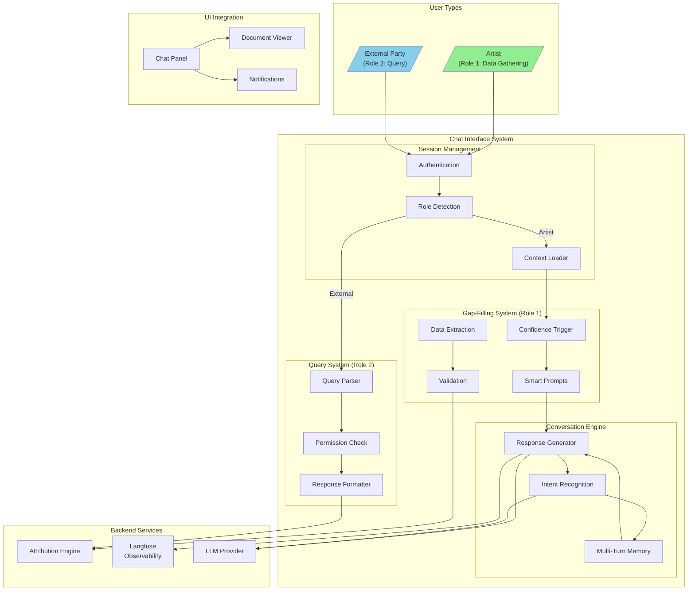
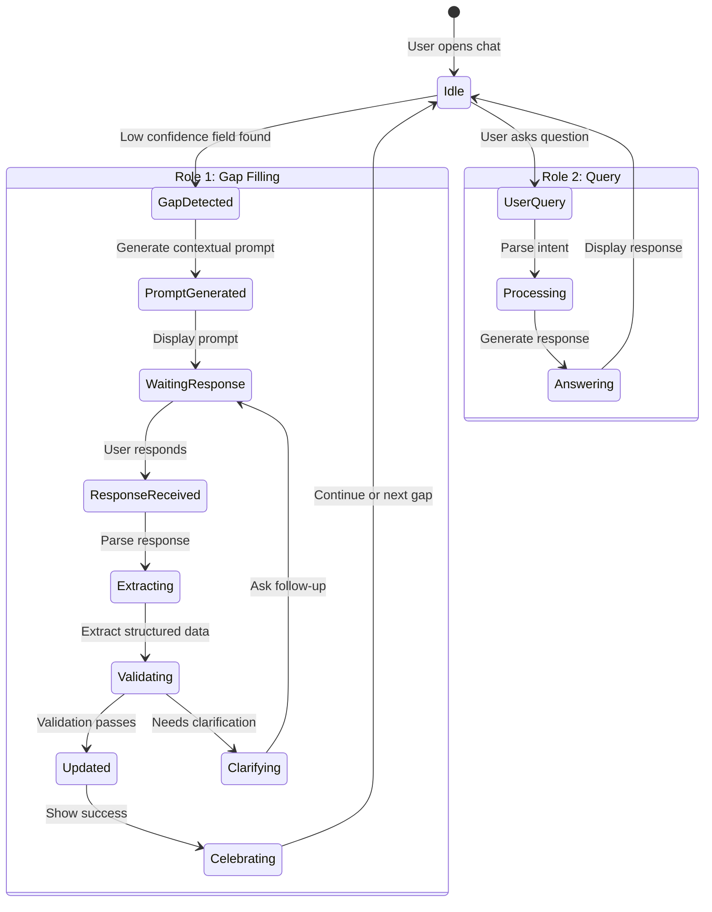

# Chat Interface

**Purpose**: Conversational interface for attribution gap-filling and data exploration

**Key Insight from Imogen**: "Fill in the gaps in a conversational way whilst the documents are on screen. Adding this information is so bloody boring - make it fun through conversation."

---

## System Architecture



### Conversation State Flow



---

## For Domain Experts (Imogen/Andy)

### Why This Matters

The Chat Interface is where The system transforms from a database into an **engaging experience**. Your insight that "adding this information is so bloody boring" is the core design challenge we're solving.

**Business Value:**
- **Completion Rates**: Conversational interfaces typically see 3-5x higher data completion rates than forms. For the system, this means dramatically more complete attribution data.
- **Artist Retention**: A chat that feels helpful rather than demanding keeps artists coming back. This is your primary engagement touchpoint.
- **Data Quality**: Natural language responses often contain richer context than form fields. "Dave mixed it at Electric Lady, we spent three weeks there" gives us location, duration, and relationship data.

### Key Decisions Requiring Your Input

1. **Tone & Personality**: Should the chat agent have a distinct personality? Warm and encouraging? Professional and efficient? Should it adapt to the artist's style?

2. **Progressive Disclosure**: How many gaps should we address per session? One at a time? Batch related questions? Let the artist choose?

3. **Context Presentation**: When chatting about a track, how much of the document should be visible? Full credits? Just the gaps? Should we highlight what we're asking about?

4. **Celebration Design**: What makes "filling a gap" feel rewarding? Animations? Progress meters? Gamification elements?

---

## Known Unknowns

> Questions requiring domain expertise or further research before implementation.

| Question | Impact | Suggested Owner |
|----------|--------|-----------------|
| What conversation length is optimal before artists disengage? | High - affects prompt batching | Imogen (user research) |
| Should external parties (Role 2) see confidence scores, or just answers? | Medium - affects trust/UX | Product + Legal |
| How do we handle artists who want to dispute existing data? | High - workflow design | Imogen |
| What's the escalation path when chat can't resolve a gap? | Medium - voice agent integration | Engineering |
| Should we allow artists to "skip" certain gap types permanently? | Medium - data completeness tradeoff | Product |
| How do we handle multilingual artists? | Medium - internationalization | Engineering + Domain |
| What happens when an artist provides contradictory information across sessions? | High - data integrity | Engineering |

---

## Overview

The Chat Interface serves two distinct roles per Imogen's guidance:

| Role | Purpose | User |
|------|---------|------|
| **Role 1: Data Gathering** | Gather and edit attribution data | Artist filling gaps |
| **Role 2: Data Exploration** | Allow queries against attribution data | External parties |

## Core Capabilities

| Capability | Description | PRD |
|------------|-------------|-----|
| **Conversational Gap-Filling** | Engage artist in natural dialogue to fill attribution gaps | [conversational-gap-filling.md](conversational-gap-filling.md) |
| **Confidence-Driven Prompts** | Trigger chat from medium/low confidence fields | [confidence-driven-prompts.md](confidence-driven-prompts.md) |
| **Document-Aware Context** | Chat while documents are visible on screen | [document-aware-context.md](document-aware-context.md) |
| **Multi-Turn Memory** | Remember context across conversation | [multi-turn-memory.md](multi-turn-memory.md) |
| **External Query Interface** | Role 2: Let others query artist's data | [external-query-interface.md](external-query-interface.md) |

## Architecture

```
┌─────────────────────────────────────────────────────────────────┐
│                      CHAT INTERFACE                              │
├─────────────────────────────────────────────────────────────────┤
│                                                                 │
│  Role 1: Data Gathering          Role 2: Data Exploration       │
│  ──────────────────────          ────────────────────────       │
│                                                                 │
│  ┌─────────────┐                 ┌─────────────┐               │
│  │   Artist    │                 │  External   │               │
│  │   Session   │                 │   Query     │               │
│  └──────┬──────┘                 └──────┬──────┘               │
│         │                               │                       │
│         ▼                               ▼                       │
│  ┌─────────────┐                 ┌─────────────┐               │
│  │ Gap-Filling │                 │   Read-Only │               │
│  │   Prompts   │                 │   Answers   │               │
│  └──────┬──────┘                 └──────┬──────┘               │
│         │                               │                       │
│         ▼                               ▼                       │
│  ┌──────────────────────────────────────────────┐              │
│  │              Attribution Engine               │              │
│  │         (Confidence-Scored Data)              │              │
│  └──────────────────────────────────────────────┘              │
│                                                                 │
└─────────────────────────────────────────────────────────────────┘
```

## Gap-Filling Flow (Role 1)

Per Andy's insight, chat prompts are triggered by confidence levels:

```
Attribution Engine detects LOW confidence field
    ↓
┌─────────────────────────────────────────────────────────────┐
│ CHAT PROMPT GENERATION                                       │
├─────────────────────────────────────────────────────────────┤
│                                                             │
│  Source Analysis                 Prompt Generation          │
│  ───────────────                ─────────────────          │
│                                                             │
│  "Only Discogs has      →      "I see you worked with      │
│   producer credit"              [name] on this track.       │
│                                 Can you tell me about       │
│  "Sources disagree"     →       their role?"                │
│                                                             │
│  "No data available"    →      "Who produced this track?"  │
│                                                             │
└─────────────────────────────────────────────────────────────┘
    ↓
Artist responds naturally
    ↓
Extract structured data from response
    ↓
Update attribution with artist-confirmed data (highest confidence)
```

## Making It Fun

Per Imogen: "Adding this information is so bloody boring - make it fun"

| Strategy | Implementation |
|----------|----------------|
| **Conversational tone** | Natural dialogue, not form filling |
| **Progressive disclosure** | Ask about one thing at a time |
| **Context awareness** | Reference what's visible on screen |
| **Memory** | "Last time you mentioned..." |
| **Celebrate wins** | Acknowledge when gaps are filled |

## Implementation Priority

1. **conversational-gap-filling.md** - Core functionality
2. **confidence-driven-prompts.md** - Integration with attribution engine
3. **document-aware-context.md** - Screen context awareness
4. **multi-turn-memory.md** - Conversation state
5. **external-query-interface.md** - Role 2 (later phase)

## Cross-Cutting Dependencies

| Concern | Integration Point |
|---------|-------------------|
| **Attribution Engine** | Confidence scores trigger prompts |
| **Voice Agent** | Chat can escalate to voice for complex gaps |
| **Observability** | Track gap-fill success rates in Langfuse |
| **MCP Server** | Expose Role 2 queries via MCP |

## Related Documents

- [vision-v1.md](../vision-v1.md) - Product vision
- [attribution-engine/confidence-scoring.md](../attribution-engine/confidence-scoring.md) - What triggers chat
- [voice-agent/toc-voice-agent.md](../voice-agent/toc-voice-agent.md) - Voice alternative
- [observability/langfuse.md](../observability/langfuse.md) - Conversation tracking
