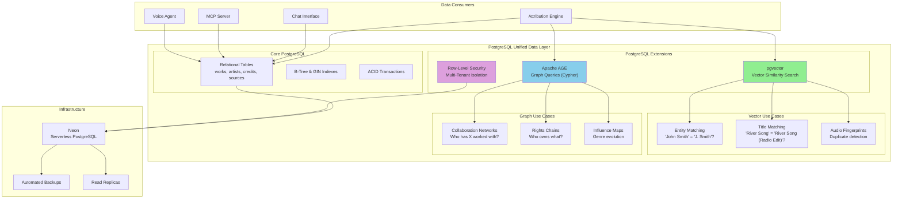
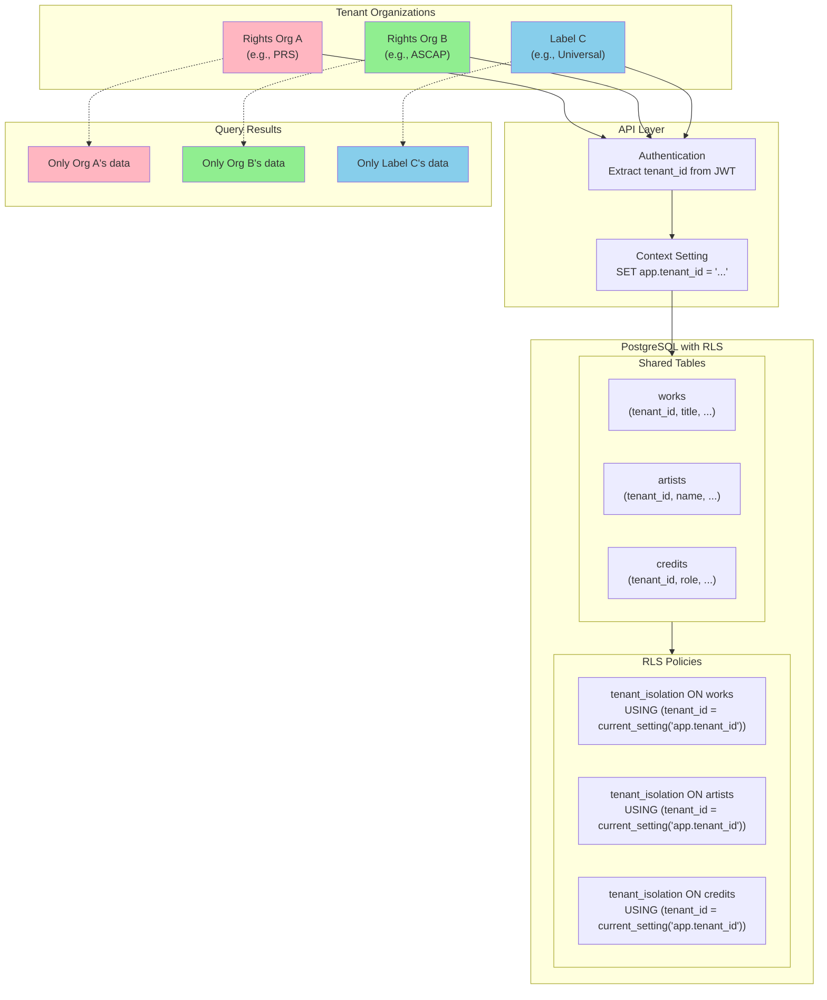
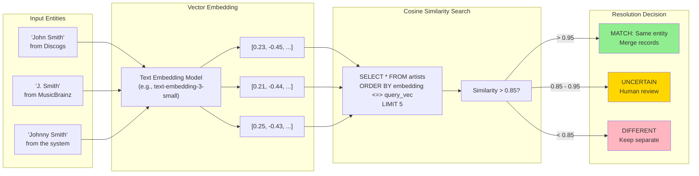

# Data Layer

**Purpose**: Unified data infrastructure using PostgreSQL with extensions for vector and graph capabilities

**Key Decision**: PostgreSQL + pgvector + Apache AGE (NOT Neo4j or separate vector DBs)

---

## System Architecture



### Multi-Tenant Data Isolation



### Entity Resolution with pgvector



---

## For Domain Experts (Imogen/Andy)

### Why This Matters

The Data Layer is the **foundation everything else builds on**. Every confidence score, every MCP query, every chat interaction reads from and writes to this layer. Getting it right means the system can scale; getting it wrong means rebuilding later.

**Business Value:**
- **Rights Org Trust**: Multi-tenant isolation means PRS data is completely separate from ASCAP data. This isn't just a feature - it's a legal requirement for partnerships.
- **Entity Resolution**: The music industry's #1 data problem is "Is this the same John Smith?" pgvector enables similarity-based matching that works even with typos, aliases, and variations.
- **Collaboration Discovery**: Graph queries let artists discover connections ("You've worked with 3 people who also worked with X") - a powerful networking and validation feature.
- **Operational Simplicity**: One database (PostgreSQL) instead of three (relational + Neo4j + Pinecone) means lower cost, simpler ops, and faster development.

### Key Decisions Requiring Your Input

1. **Tenant Boundaries**: What constitutes a tenant? Individual artists? Labels? Rights organizations? A combination with hierarchy?

2. **Data Sharing**: Can an artist in Rights Org A share specific records with Label B? How granular is cross-tenant sharing?

3. **Entity Resolution Confidence**: When we match "J. Smith" to "John Smith" with 87% confidence, should we auto-merge or flag for review? Who reviews?

4. **Historical Data**: When attribution data changes (e.g., a credit is corrected), do we keep history? For how long? Is there an "undo"?

---

## Known Unknowns

> Questions requiring domain expertise or further research before implementation.

| Question | Impact | Suggested Owner |
|----------|--------|-----------------|
| What's the expected data volume? (works per tenant, credits per work) | High - capacity planning | Product |
| Are there regulatory requirements for data residency (EU data stays in EU)? | High - infrastructure | Legal |
| How do we handle GDPR deletion requests for artists with cross-tenant credits? | High - compliance | Legal + Engineering |
| What's the acceptable latency for entity matching queries? | Medium - UX | Product |
| Should we pre-compute collaboration graphs, or compute on-demand? | Medium - performance | Engineering |
| How do we migrate existing data from partner systems (Discogs, MusicBrainz)? | High - onboarding | Engineering |
| What's the backup/recovery SLA? | Medium - ops | Engineering |
| Should audit logs be in the same database or separate for compliance? | Medium - architecture | Engineering + Legal |

---

## Overview

The system uses a PostgreSQL-centric architecture that provides:
- Relational data (attribution records)
- Vector similarity search (entity matching via pgvector)
- Graph queries (relationship traversal via Apache AGE)

This approach minimizes operational complexity while meeting all data requirements.

## Core Capabilities

| Capability | Description | PRD |
|------------|-------------|-----|
| **PostgreSQL Unified** | Core database architecture | [postgresql-unified.md](postgresql-unified.md) |
| **pgvector Integration** | Vector similarity for entity matching | [pgvector/pgvector-integration.md](pgvector/pgvector-integration.md) |
| **Apache AGE Graphs** | Graph queries for relationships | [apache-age/graph-queries.md](apache-age/graph-queries.md) |
| **Multi-Tenant Isolation** | Data isolation for rights orgs | [multi-tenant.md](multi-tenant.md) |
| **Migration Strategy** | Schema versioning and migrations | [migrations.md](migrations.md) |

## Architecture

```
┌─────────────────────────────────────────────────────────────────┐
│                        DATA LAYER                                │
├─────────────────────────────────────────────────────────────────┤
│                                                                 │
│                    PostgreSQL (Unified)                         │
│  ┌──────────────────────────────────────────────────────────┐  │
│  │                                                          │  │
│  │  ┌────────────────┐  ┌────────────────┐  ┌────────────┐ │  │
│  │  │   Relational   │  │    pgvector    │  │ Apache AGE │ │  │
│  │  │     Tables     │  │   (Vectors)    │  │  (Graphs)  │ │  │
│  │  │                │  │                │  │            │ │  │
│  │  │ • works        │  │ • title_embed  │  │ • artist   │ │  │
│  │  │ • artists      │  │ • name_embed   │  │   -[CREATED]│ │  │
│  │  │ • credits      │  │ • audio_embed  │  │   ->work   │ │  │
│  │  │ • sources      │  │                │  │            │ │  │
│  │  └────────────────┘  └────────────────┘  └────────────┘ │  │
│  │                                                          │  │
│  │  ┌──────────────────────────────────────────────────────┐│  │
│  │  │              Row-Level Security (Multi-Tenant)       ││  │
│  │  └──────────────────────────────────────────────────────┘│  │
│  │                                                          │  │
│  └──────────────────────────────────────────────────────────┘  │
│                                                                 │
│  Deployment: Neon (serverless PostgreSQL)                      │
│                                                                 │
└─────────────────────────────────────────────────────────────────┘
```

## Why Not Neo4j?

See [REJECTED.md#neo4j](../REJECTED.md#neo4j) for full rationale.

**Summary**:
- Operational complexity (separate DB, JVM, licensing)
- Apache AGE provides Cypher queries within PostgreSQL
- The system relationship depth is shallow (artist→work→contributor)
- pgvector handles similarity matching without separate DB

**When to Reconsider**: If we need 6+ hop graph traversals or native Cypher algorithms at scale.

## Use Cases by Extension

| Use Case | Extension | Example |
|----------|-----------|---------|
| Entity matching | pgvector | "Is 'John Smith' the same as 'J. Smith'?" |
| Collaboration networks | Apache AGE | "Who has artist X worked with?" |
| Attribution records | Relational | CRUD for credits, works, artists |
| Multi-tenant isolation | RLS | Rights org A can't see rights org B data |

## Multi-Tenant Strategy

Per project requirements, rights orgs and labels need data isolation:

```sql
-- Row-level security for multi-tenant isolation
CREATE POLICY tenant_isolation ON works
    USING (tenant_id = current_setting('app.tenant_id')::uuid);

-- Each query sets tenant context
SET app.tenant_id = 'rights-org-uuid';
SELECT * FROM works;  -- Only sees own data
```

## Implementation Priority

1. **postgresql-unified.md** - Core schema design
2. **multi-tenant.md** - Tenant isolation (critical for rights orgs)
3. **pgvector/pgvector-integration.md** - Entity matching
4. **apache-age/graph-queries.md** - Relationship queries
5. **migrations.md** - Schema evolution

## Cross-Cutting Dependencies

| Concern | Integration Point |
|---------|-------------------|
| **Attribution Engine** | Primary consumer of data layer |
| **Uncertainty** | Confidence scores stored per field |
| **Observability** | Query performance tracked |
| **Security** | RLS enforcement, encryption at rest |

## Related Documents

- [REJECTED.md#neo4j](../REJECTED.md#neo4j) - Why not Neo4j
- [REJECTED.md#pinecone-weaviate](../REJECTED.md#pinecone-weaviate) - Why not separate vector DBs
- [attribution-engine/multi-source-aggregation.md](../attribution-engine/multi-source-aggregation.md) - Primary consumer
- [infrastructure/neon.md](../infrastructure/neon.md) - Deployment platform
