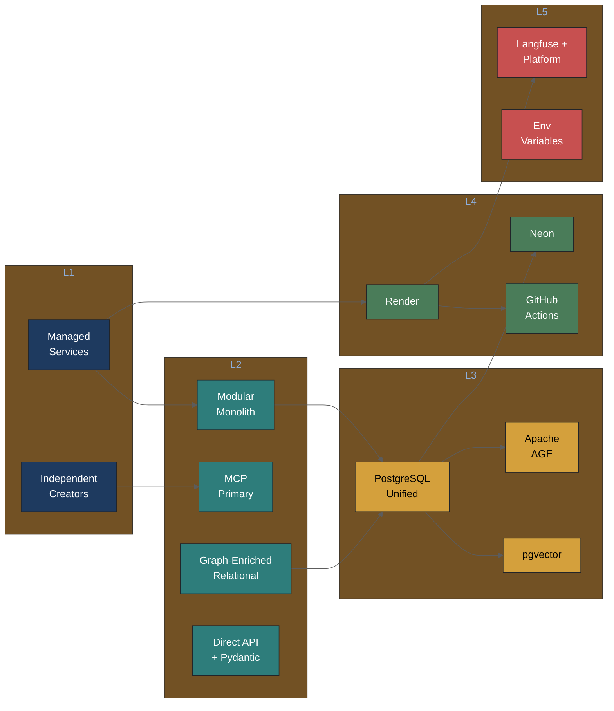
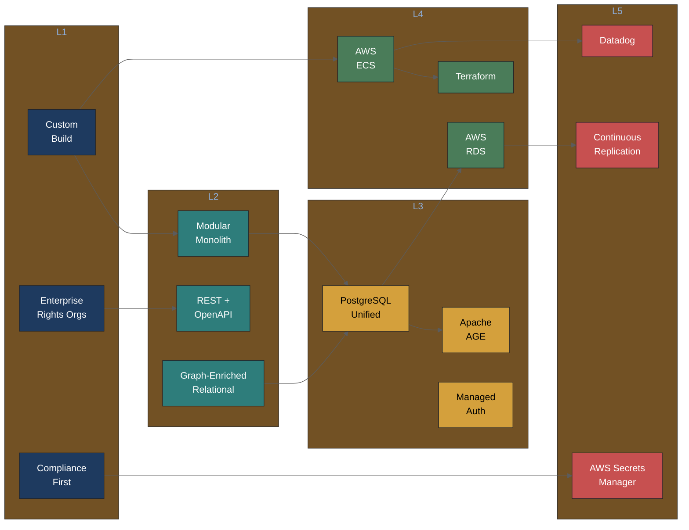
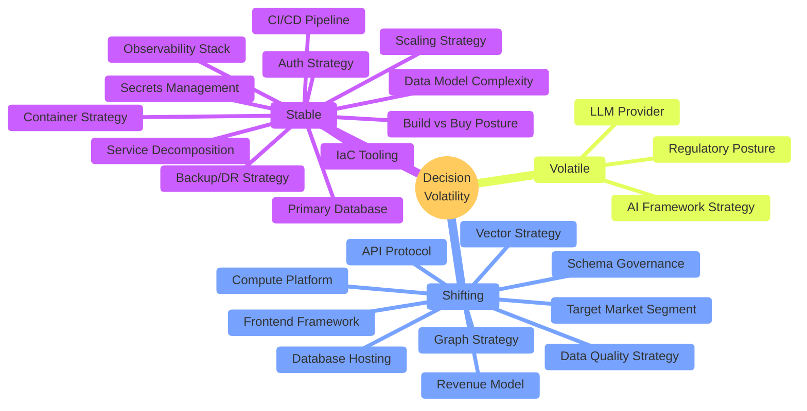

# Probabilistic PRD Decision Network — Report

Human-readable synthesis of the Bayesian decision network with mermaid visualizations.

---

## Network Topology

The complete decision network: 25 nodes across 5 levels with conditional probability edges.

```mermaid
%%{init: {'theme': 'base', 'themeVariables': {'background': '#fcfaf5', 'primaryColor': '#1E3A5F', 'lineColor': '#5C5C5C'}}}%%
flowchart TB
    subgraph L1["L1: Business Decisions"]
        BVB[Build vs Buy<br/>Posture]
        TMS[Target Market<br/>Segment]
        RM[Revenue<br/>Model]
        RP[Regulatory<br/>Posture]
    end

    subgraph L2["L2: Architecture Decisions"]
        DMC[Data Model<br/>Complexity]
        AP[API<br/>Protocol]
        SD[Service<br/>Decomposition]
        AFS[AI Framework<br/>Strategy]
    end

    subgraph L3["L3: Implementation Decisions"]
        PD[Primary<br/>Database]
        GS[Graph<br/>Strategy]
        VS[Vector<br/>Strategy]
        LLM[LLM<br/>Provider]
        FF[Frontend<br/>Framework]
        AS[Auth<br/>Strategy]
        DQS[Data Quality<br/>Strategy]
    end

    subgraph L4["L4: Deployment Decisions"]
        CP[Compute<br/>Platform]
        DH[Database<br/>Hosting]
        CI[CI/CD<br/>Pipeline]
        IAC[IaC<br/>Tooling]
        CS[Container<br/>Strategy]
    end

    subgraph L5["L5: Operations Decisions"]
        OS[Observability<br/>Stack]
        SS[Scaling<br/>Strategy]
        BDR[Backup &<br/>DR Strategy]
        SM[Secrets<br/>Management]
        SG[Schema<br/>Governance]
    end

    %% L1 → L1
    TMS --> RM
    TMS --> RP

    %% L1 → L2
    BVB --> DMC
    BVB --> SD
    BVB --> AFS
    TMS --> AP
    TMS --> FF

    %% L1 → L3 skip
    BVB --> PD
    BVB --> AS
    BVB --> LLM
    BVB --> DQS
    TMS --> AS

    %% L2 → L3
    DMC --> PD
    DMC --> GS
    DMC --> DQS
    PD --> GS
    PD --> VS
    AFS --> LLM
    AFS --> VS
    SD --> FF

    %% L1 → L4 skip
    BVB --> CP
    BVB --> IAC
    BVB --> CI

    %% L2 → L4
    SD --> CP
    SD --> CS

    %% L3 → L4
    PD --> DH
    PD --> BDR

    %% L4 → L4
    CP --> DH
    CP --> CS
    CP --> IAC

    %% L4 → L5
    CP --> OS
    CP --> SS
    CP --> SM
    DH --> BDR

    %% L3 → L5
    DQS --> SG

    %% L1 → L5 skip
    BVB --> OS
    BVB --> SG
    RP --> SM
    RP --> SG
    TMS --> SS

    %% L2 → L5 skip
    AFS --> OS

    style BVB fill:#1E3A5F,color:#fff
    style TMS fill:#1E3A5F,color:#fff
    style RM fill:#1E3A5F,color:#fff
    style RP fill:#1E3A5F,color:#fff
    style DMC fill:#2E7D7B,color:#fff
    style AP fill:#2E7D7B,color:#fff
    style SD fill:#2E7D7B,color:#fff
    style AFS fill:#2E7D7B,color:#fff
    style PD fill:#D4A03C,color:#000
    style GS fill:#D4A03C,color:#000
    style VS fill:#D4A03C,color:#000
    style LLM fill:#D4A03C,color:#000
    style FF fill:#D4A03C,color:#000
    style AS fill:#D4A03C,color:#000
    style DQS fill:#D4A03C,color:#000
    style CP fill:#4A7C59,color:#fff
    style DH fill:#4A7C59,color:#fff
    style CI fill:#4A7C59,color:#fff
    style IAC fill:#4A7C59,color:#fff
    style CS fill:#4A7C59,color:#fff
    style OS fill:#C75050,color:#fff
    style SS fill:#C75050,color:#fff
    style BDR fill:#C75050,color:#fff
    style SM fill:#C75050,color:#fff
    style SG fill:#C75050,color:#fff
```

**Reading the graph**: Arrows indicate conditional probability dependencies. An arrow from A to B means "the choice made at A shifts the probability distribution at B." Thick conceptual clusters exist within levels, but skip-connections (e.g., L1 Build-vs-Buy directly to L3 Primary Database) represent strong cross-level influences.

---

## Archetype Comparison: Primary Database Decision

How four team archetypes distribute probability across the same decision:

```mermaid
%%{init: {'theme': 'base'}}%%
xychart-beta
    title "Primary Database — Archetype Probability Comparison"
    x-axis ["PostgreSQL Unified", "Supabase", "SQLite/Turso", "CockroachDB"]
    y-axis "Probability" 0 --> 0.7
    bar [0.60, 0.10, 0.05, 0.25]
    bar [0.20, 0.55, 0.20, 0.05]
    bar [0.15, 0.40, 0.40, 0.05]
    bar [0.45, 0.15, 0.05, 0.35]
```

| Color | Archetype |
|-------|-----------|
| Bar 1 | Engineer-Heavy Startup |
| Bar 2 | Musician-First Team |
| Bar 3 | Solo Hacker |
| Bar 4 | Well-Funded Startup |

The same decision, four fundamentally different probability landscapes. Engineers favor PostgreSQL (0.60); musicians favor Supabase (0.55); solos split between Supabase and SQLite (0.40/0.40); well-funded teams plan for scale (CockroachDB at 0.35).

---

## Archetype Comparison: Build vs Buy Posture

```mermaid
%%{init: {'theme': 'base'}}%%
xychart-beta
    title "Build vs Buy — Archetype Probability Comparison"
    x-axis ["Custom Build", "Managed Services", "SaaS Maximalist"]
    y-axis "Probability" 0 --> 0.7
    bar [0.60, 0.30, 0.10]
    bar [0.05, 0.35, 0.60]
    bar [0.10, 0.30, 0.60]
    bar [0.45, 0.40, 0.15]
```

| Color | Archetype |
|-------|-----------|
| Bar 1 | Engineer-Heavy Startup |
| Bar 2 | Musician-First Team |
| Bar 3 | Solo Hacker |
| Bar 4 | Well-Funded Startup |

The foundational split: engineers and well-funded teams lean custom; musicians and solos lean SaaS.

---

## Scenario Path: Music Attribution MVP

The "golden path" through the network for the reference implementation:

**Joint probability**: ~0.0012. This is the product of archetype-adjusted probabilities for each chosen option. Low absolute values are normal — any specific path through 23 decisions is statistically unlikely. The value is meaningful for comparing scenarios.

---

## Scenario Path: DPP Enterprise

The enterprise path for Digital Product Passport traceability:

Same scaffold architecture, dramatically different instantiation. REST instead of MCP, AWS instead of Render, Datadog instead of Langfuse, compliance-first instead of best-effort.

---

## Volatility Heatmap

Decision stability across the network:

**Interpretation**:
- **Stable** (12 decisions): Core architectural choices unlikely to change within 6 months. Review quarterly.
- **Shifting** (10 decisions): Actively evolving areas where market or technology changes may shift probabilities. Review monthly. Includes the new data quality strategy and schema governance nodes.
- **Volatile** (3 decisions): High uncertainty zones — regulatory posture (EU AI Act timeline), AI framework strategy (ecosystem consolidation), and LLM provider (model capability leaps). Review biweekly.

---

## Complete Database Decision Path (L1 → L5 Walkthrough)

Following the "primary database" thread through all levels with conditional probabilities:

### L1: Build vs Buy Posture → Database (Skip-Connection)

The foundational choice. If the team chooses **Custom Build** (P=0.40):
- P(PostgreSQL Unified | Custom Build) = **0.60** (strong preference)
- P(CockroachDB | Custom Build) = 0.25 (enterprise path open)
- P(Supabase | Custom Build) = 0.05 (unlikely — why use Supabase if building custom?)

If **SaaS Maximalist** (P=0.25):
- P(Supabase | SaaS Maximalist) = **0.50** (natural fit)
- P(SQLite/Turso | SaaS Maximalist) = 0.30 (zero-ops alternative)
- P(PostgreSQL Unified | SaaS Maximalist) = 0.15 (only if extensions needed)

### L2: Data Model Complexity → Database

If the team needs **Graph-Enriched Relational** (P=0.45):
- P(PostgreSQL Unified | Graph-Enriched) = **0.65** (AGE extension requires PostgreSQL)
- P(CockroachDB | Graph-Enriched) = 0.15 (limited graph support)
- P(SQLite/Turso | Graph-Enriched) = 0.05 (no graph extensions)

### L3: Database → Graph Strategy, Vector Strategy

Given **PostgreSQL Unified** (P=0.45):
- P(Apache AGE | PostgreSQL) = **0.65** (natural fit, same process)
- P(pgvector | PostgreSQL) = **0.70** (built-in vector support)

### L4: Database → Hosting

Given **PostgreSQL Unified** (P=0.45):
- P(Neon | PostgreSQL) = **0.40** (serverless PostgreSQL, good DX)
- P(AWS RDS | PostgreSQL) = 0.20 (enterprise path)
- P(Self-Managed | PostgreSQL) = 0.15 (Hetzner path)

### L5: Hosting → Backup/DR

Given **Neon** hosting (P=0.40):
- P(Managed Provider Backups | Neon) = **0.55** (Neon PITR built-in)
- P(Automated Snapshots | Neon) = 0.20 (belt and suspenders)

---

## Cross-Archetype Comparison Tables

### L1 Decisions

| Decision | Engineer-Heavy | Musician-First | Solo Hacker | Well-Funded |
|----------|---------------|----------------|-------------|-------------|
| Build vs Buy | Custom Build (0.60) | SaaS Maximalist (0.60) | SaaS Maximalist (0.60) | Custom Build (0.45) |
| Target Market | Mid-tier Labels (0.30) | Indie Creators (0.60) | Indie Creators (0.55) | Enterprise (0.30) |
| Revenue Model | Open Core (0.35) | Freemium SaaS (0.55) | Freemium SaaS (0.40) | Enterprise Licensing (0.30) |
| Regulatory | Compliance Aware (0.45) | Best Effort (0.45) | Best Effort (0.60) | Compliance First (0.55) |

### L3 Decisions (Technology Choices)

| Decision | Engineer-Heavy | Musician-First | Solo Hacker | Well-Funded |
|----------|---------------|----------------|-------------|-------------|
| Database | PostgreSQL (0.60) | Supabase (0.55) | Supabase/SQLite (0.40/0.40) | PostgreSQL (0.45) |
| Graph | AGE (0.45) | SQL Joins (0.40) | NetworkX (0.40) | AGE (0.40) |
| Vector | pgvector (0.45) | No Vector (0.40) | No Vector (0.40) | pgvector (0.40) |
| LLM | Anthropic (0.30) | OpenAI (0.40) | Anthropic (0.35) | Multi-Provider (0.25) |
| Frontend | Next.js (0.35) | Next.js (0.45) | No Frontend (0.35) | Next.js (0.45) |
| Auth | Custom JWT (0.40) | Supabase Auth (0.40) | API Key (0.40) | Managed Service (0.35) |
| Data Quality | Composite (0.40) | Pandera (0.40) | Composite (0.35) | GX/Composite (0.35) |

### L4-L5 Decisions (Infrastructure)

| Decision | Engineer-Heavy | Musician-First | Solo Hacker | Well-Funded |
|----------|---------------|----------------|-------------|-------------|
| Compute | AWS ECS (0.30) | Render (0.35) | Railway (0.30) | AWS ECS (0.35) |
| DB Hosting | Neon (0.25) | Supabase (0.40) | Turso (0.30) | AWS RDS (0.35) |
| CI/CD | GitHub Actions (0.40) | Auto-Deploy (0.50) | Auto-Deploy (0.45) | GitHub Actions (0.45) |
| IaC | Terraform (0.40) | None (0.45) | Platform Native (0.35) | Terraform (0.40) |
| Observability | Grafana (0.40) | Minimal (0.50) | Minimal (0.65) | Datadog (0.35) |
| Scaling | Vertical (0.30) | Vertical (0.60) | Vertical (0.70) | Horizontal (0.30) |
| Schema Gov. | DVC+JSON (0.35) | Minimal (0.40) | Git Versioning (0.35) | OpenMetadata (0.45) |

---

## Network Statistics

| Metric | Value |
|--------|-------|
| Total nodes | 25 |
| L1 Business nodes | 4 |
| L2 Architecture nodes | 4 |
| L3 Implementation nodes | 7 |
| L4 Deployment nodes | 5 |
| L5 Operations nodes | 5 |
| Total edges | 43 |
| Same-level edges | 3 |
| Adjacent-level edges | 22 |
| Skip-connection edges | 18 |
| Team archetypes | 4 |
| Domain overlays | 2 (+ 1 planned) |
| Scenario compositions | 3 |
| Stable decisions | 12 (48%) |
| Shifting decisions | 10 (40%) |
| Volatile decisions | 3 (12%) |

---

## See Also

- [`_network.yaml`](_network.yaml) — Machine-readable DAG topology
- [`_schema.yaml`](_schema.yaml) — JSON Schema for decision nodes
- [`../archetypes/`](../archetypes/) — Team archetype profiles
- [`../scenarios/`](../scenarios/) — Composed decision paths
- [`../domains/`](../domains/) — Domain overlay system
- [`../../planning/probabilistic-prd-design.md`](../../planning/probabilistic-prd-design.md) — Design rationale
- [`../../planning/quality-tooling-contextualization.md`](../../planning/quality-tooling-contextualization.md) — Quality tooling analysis with conditional probabilities
