# Probabilistic PRD Decision Network — Report

Human-readable synthesis of the Bayesian decision network with mermaid visualizations.

---

## Network Topology

The complete decision network: 78 nodes across 5 levels with conditional probability edges.

### Core Infrastructure (50 nodes)

```mermaid
%%{init: {'theme': 'base', 'themeVariables': {'background': '#fcfaf5', 'primaryColor': '#1E3A5F', 'lineColor': '#5C5C5C'}}}%%
flowchart TB
    subgraph L1["L1: Business Decisions"]
        BVB[Build vs Buy<br/>Posture]
        TMS[Target Market<br/>Segment]
        RM[Revenue<br/>Model]
        RP[Regulatory<br/>Posture]
    end

    subgraph L2["L2: Architecture Decisions"]
        DMC[Data Model<br/>Complexity]
        AP[API<br/>Protocol]
        SD[Service<br/>Decomposition]
        AFS[AI Framework<br/>Strategy]
        ADS[Artifact<br/>Decoupling]
        UAS[UI Adaptation<br/>Strategy]
        PRS[Provenance<br/>Strategy]
    end

    subgraph L3["L3: Implementation Decisions"]
        PD[Primary<br/>Database]
        GS[Graph<br/>Strategy]
        VS[Vector<br/>Strategy]
        LLM[LLM<br/>Provider]
        FF[Frontend<br/>Framework]
        AS[Auth<br/>Strategy]
        DQS[Data Quality<br/>Strategy]
        AUF[Agentic UI<br/>Framework]
        VAS[Voice Agent<br/>Stack]
        GRE[Graph RAG<br/>Engine]
        MSS[MCP Security<br/>Strategy]
        MPD[MCP Production<br/>Deployment]
        LRS[LLM Routing<br/>Strategy]
        AML[Audio Metadata<br/>Library]
    end

    subgraph L3C["L3: Component Decisions"]
        TAI[Training Attribution<br/>Integration]
        RMS[Rights Management<br/>Scope]
        PV[Provenance<br/>Verification]
        ERI[External Registry<br/>Integration]
        CFM[Compliance Framework<br/>Mapping]
        TDM[TDM Rights<br/>Reservation]
    end

    subgraph L4["L4: Deployment Decisions"]
        CP[Compute<br/>Platform]
        DH[Database<br/>Hosting]
        CI[CI/CD<br/>Pipeline]
        IAC[IaC<br/>Tooling]
        CS[Container<br/>Strategy]
        ORC[Pipeline<br/>Orchestrator]
        OBJ[Object<br/>Storage]
        MIV[MCP Input<br/>Validation]
        CDS[CD<br/>Strategy]
    end

    subgraph L5["L5: Operations Decisions"]
        OS[Observability<br/>Stack]
        SS[Scaling<br/>Strategy]
        BDR[Backup &<br/>DR Strategy]
        SM[Secrets<br/>Management]
        SG[Schema<br/>Governance]
        MLM[ML<br/>Monitoring]
        DOC[Documentation<br/>Tooling]
        PAC[Policy as<br/>Code]
        FIN[FinOps<br/>Strategy]
        ETH[Ethics<br/>Governance]
    end

    %% L1 → L1
    TMS --> RM
    TMS --> RP

    %% L1 → L2
    BVB --> DMC
    BVB --> SD
    BVB --> AFS
    TMS --> AP
    TMS --> FF
    BVB --> ADS
    AFS --> ADS
    TMS --> UAS
    BVB --> PRS
    RP --> PRS

    %% L2 → L2
    AFS --> UAS
    DMC --> PRS

    %% L1 → L3 skip
    BVB --> PD
    BVB --> AS
    BVB --> LLM
    BVB --> DQS
    TMS --> AS
    BVB --> VAS
    TMS --> VAS
    BVB --> LRS
    BVB --> AML

    %% L2 → L3
    DMC --> PD
    DMC --> GS
    DMC --> DQS
    ADS --> DQS
    PD --> GS
    PD --> VS
    AFS --> LLM
    AFS --> VS
    SD --> FF
    UAS --> AUF
    AP --> AUF
    AFS --> AUF
    AP --> MSS
    AP --> MPD
    RP --> MSS
    AFS --> LRS
    DMC --> AML

    %% L3 → L3
    FF --> AUF
    AUF --> VAS
    GS --> GRE
    VS --> GRE
    LLM --> GRE
    PD --> GRE
    LLM --> LRS
    MSS --> AS

    %% L2 → L3C
    AFS --> TAI
    BVB --> TAI
    DMC --> RMS
    RP --> RMS
    PRS --> PV
    RP --> PV
    DMC --> ERI
    BVB --> ERI
    RP --> CFM
    RP --> TDM
    PRS --> TDM
    RMS --> TDM

    %% L1 → L4 skip
    BVB --> CP
    BVB --> IAC
    BVB --> CI

    %% L2 → L4
    SD --> CP
    SD --> CS
    ADS --> CI
    SD --> ORC

    %% L3 → L4
    PD --> DH
    PD --> BDR
    MSS --> MIV
    MPD --> CS
    MPD --> CP

    %% L4 → L4
    CP --> DH
    CP --> CS
    CP --> IAC
    CP --> ORC
    CP --> OBJ
    CI --> CDS
    CP --> CDS
    CS --> CDS

    %% L4 → L5
    CP --> OS
    CP --> SS
    CP --> SM
    DH --> BDR
    CP --> FIN
    OBJ --> FIN
    SS --> FIN
    DH --> FIN
    IAC --> FIN
    CDS --> OS

    %% L3 → L5
    DQS --> SG
    MSS --> OS
    AUF --> OS
    LRS --> OS
    DQS --> MLM
    AFS --> MLM
    CFM --> ETH
    CFM --> PAC
    DQS --> ETH
    AFS --> ETH

    %% L5 → L5
    OS --> MLM

    %% L1 → L5 skip
    BVB --> OS
    ADS --> SG
    ADS --> OS
    BVB --> SG
    RP --> SM
    RP --> SG
    TMS --> SS
    AFS --> OS
    PRS --> SG
    RP --> PAC
    RP --> ETH
    BVB --> DOC
    CI --> DOC
    IAC --> PAC
    CS --> PAC

    style MSS fill:#D4A03C,color:#000
    style MPD fill:#D4A03C,color:#000
    style MIV fill:#4A7C59,color:#fff
    style UAS fill:#2E7D7B,color:#fff
    style AUF fill:#D4A03C,color:#000
    style VAS fill:#D4A03C,color:#000
    style GRE fill:#D4A03C,color:#000
    style LRS fill:#D4A03C,color:#000
    style AML fill:#D4A03C,color:#000
    style PRS fill:#2E7D7B,color:#fff
    style BVB fill:#1E3A5F,color:#fff
    style TMS fill:#1E3A5F,color:#fff
    style RM fill:#1E3A5F,color:#fff
    style RP fill:#1E3A5F,color:#fff
    style DMC fill:#2E7D7B,color:#fff
    style AP fill:#2E7D7B,color:#fff
    style SD fill:#2E7D7B,color:#fff
    style AFS fill:#2E7D7B,color:#fff
    style ADS fill:#2E7D7B,color:#fff
    style PD fill:#D4A03C,color:#000
    style GS fill:#D4A03C,color:#000
    style VS fill:#D4A03C,color:#000
    style LLM fill:#D4A03C,color:#000
    style FF fill:#D4A03C,color:#000
    style AS fill:#D4A03C,color:#000
    style DQS fill:#D4A03C,color:#000
    style TAI fill:#D4A03C,color:#000
    style RMS fill:#D4A03C,color:#000
    style PV fill:#D4A03C,color:#000
    style ERI fill:#D4A03C,color:#000
    style CFM fill:#D4A03C,color:#000
    style TDM fill:#D4A03C,color:#000
    style CP fill:#4A7C59,color:#fff
    style DH fill:#4A7C59,color:#fff
    style CI fill:#4A7C59,color:#fff
    style IAC fill:#4A7C59,color:#fff
    style CS fill:#4A7C59,color:#fff
    style ORC fill:#4A7C59,color:#fff
    style OBJ fill:#4A7C59,color:#fff
    style CDS fill:#4A7C59,color:#fff
    style OS fill:#C75050,color:#fff
    style SS fill:#C75050,color:#fff
    style BDR fill:#C75050,color:#fff
    style SM fill:#C75050,color:#fff
    style SG fill:#C75050,color:#fff
    style MLM fill:#C75050,color:#fff
    style DOC fill:#C75050,color:#fff
    style PAC fill:#C75050,color:#fff
    style FIN fill:#C75050,color:#fff
    style ETH fill:#C75050,color:#fff
```

The ecosystem integration subgraph extends the core infrastructure with 28 new decision nodes covering platform strategy, industry partnerships, compliance automation, and operational intelligence.

### Ecosystem Integration (28 nodes)

```mermaid
%%{init: {'theme': 'base', 'themeVariables': {'background': '#fcfaf5', 'primaryColor': '#1E3A5F', 'lineColor': '#5C5C5C'}}}%%
flowchart TB
    subgraph L1_REF["L1: Business (reference)"]
        BVB[Build vs Buy<br/>Posture]
        TMS[Target Market<br/>Segment]
        RM[Revenue<br/>Model]
        RP[Regulatory<br/>Posture]
    end

    subgraph L2_ECO["L2: Platform & Partnership"]
        PS[Platform<br/>Strategy]
        PM[Partnership<br/>Model]
    end

    subgraph L3_CAT["L3: Ecosystem Categories"]
        TDA[TDA<br/>Provider]
        CMO[CMO<br/>Licensing]
        CID[Content ID<br/>System]
        AIPC[AI Music Platform<br/>Connector]
        MRI[Metadata Registry<br/>Integration]
        WD[Watermark<br/>Detection]
        AIP[Agent Interop<br/>Protocol]
        EIS[Edge Inference<br/>Strategy]
        AEF[Attribution Eval<br/>Framework]
        AOT[Agent Observability<br/>OTel]
        ACP[Agentic Commerce<br/>Protocol]
        KGB[Knowledge Graph<br/>Backend]
    end

    subgraph L3_CO["L3: Strategic Partners"]
        MAI[Musical AI]
        SAI[Sureel AI]
        STIM[STIM CMO<br/>Pilot]
        SX[SoundExchange]
        FT[Fairly Trained]
        SUL[Suno/Udio<br/>Licensing]
    end

    subgraph L4_ECO["L4: Compliance & Edge"]
        CRP[Compliance<br/>Reporting]
        TDPS[Training Data<br/>Provenance]
        GDM[Golden Dataset<br/>Mgmt]
        EDT[Edge Deploy<br/>Target]
    end

    subgraph L5_ECO["L5: Intelligence & Monitoring"]
        RGM[Regulatory<br/>Monitoring]
        MKI[Market<br/>Intelligence]
        AAM[Attribution Accuracy<br/>Monitor]
        PHM[Partnership<br/>Health]
    end

    %% L1 → L2_ECO
    BVB --> PS
    TMS --> PS
    RM --> PS
    TMS --> PM
    RM --> PM
    RP --> PM

    %% L2_ECO → L3_CAT
    PS --> AIPC
    PS --> ACP
    PS --> AIP
    PM --> CMO
    PM --> TDA

    %% L3_CAT → L3_CO (category → company)
    TDA --> MAI
    CMO --> SAI
    CMO --> STIM
    CID --> SAI
    MRI --> SX
    AIPC --> SUL
    AEF --> AAM

    %% L3_CAT → L4_ECO
    EIS --> EDT
    AEF --> GDM

    %% L1/L2 → L4_ECO
    RP --> CRP
    RP --> RGM

    %% L2_ECO → L5_ECO
    PS --> MKI
    PM --> MKI
    PM --> PHM

    style BVB fill:#1E3A5F,color:#fff
    style TMS fill:#1E3A5F,color:#fff
    style RM fill:#1E3A5F,color:#fff
    style RP fill:#1E3A5F,color:#fff
    style PS fill:#3A9D9B,color:#fff
    style PM fill:#3A9D9B,color:#fff
    style TDA fill:#E8B64C,color:#000
    style CMO fill:#E8B64C,color:#000
    style CID fill:#E8B64C,color:#000
    style AIPC fill:#E8B64C,color:#000
    style MRI fill:#E8B64C,color:#000
    style WD fill:#E8B64C,color:#000
    style AIP fill:#E8B64C,color:#000
    style EIS fill:#E8B64C,color:#000
    style AEF fill:#E8B64C,color:#000
    style AOT fill:#E8B64C,color:#000
    style ACP fill:#E8B64C,color:#000
    style KGB fill:#E8B64C,color:#000
    style MAI fill:#D4A03C,color:#000
    style SAI fill:#D4A03C,color:#000
    style STIM fill:#D4A03C,color:#000
    style SX fill:#D4A03C,color:#000
    style FT fill:#D4A03C,color:#000
    style SUL fill:#D4A03C,color:#000
    style CRP fill:#5A9C69,color:#fff
    style TDPS fill:#5A9C69,color:#fff
    style GDM fill:#5A9C69,color:#fff
    style EDT fill:#5A9C69,color:#fff
    style RGM fill:#D06060,color:#fff
    style MKI fill:#D06060,color:#fff
    style AAM fill:#D06060,color:#fff
    style PHM fill:#D06060,color:#fff
```

**Reading the graph**: Arrows indicate conditional probability dependencies. An arrow from A to B means "the choice made at A shifts the probability distribution at B." Thick conceptual clusters exist within levels, but skip-connections (e.g., L1 Build-vs-Buy directly to L3 Primary Database) represent strong cross-level influences.

---

## Archetype Comparison: Primary Database Decision

How four team archetypes distribute probability across the same decision:

```mermaid
%%{init: {'theme': 'base'}}%%
xychart-beta
    title "Primary Database — Archetype Probability Comparison"
    x-axis ["PostgreSQL Unified", "Supabase", "SQLite/Turso", "CockroachDB"]
    y-axis "Probability" 0 --> 0.7
    bar [0.60, 0.10, 0.05, 0.25]
    bar [0.20, 0.55, 0.20, 0.05]
    bar [0.15, 0.40, 0.40, 0.05]
    bar [0.45, 0.15, 0.05, 0.35]
```

| Color | Archetype |
|-------|-----------|
| Bar 1 | Engineer-Heavy Startup |
| Bar 2 | Musician-First Team |
| Bar 3 | Solo Hacker |
| Bar 4 | Well-Funded Startup |

The same decision, four fundamentally different probability landscapes. Engineers favor PostgreSQL (0.60); musicians favor Supabase (0.55); solos split between Supabase and SQLite (0.40/0.40); well-funded teams plan for scale (CockroachDB at 0.35).

---

## Archetype Comparison: Build vs Buy Posture

```mermaid
%%{init: {'theme': 'base'}}%%
xychart-beta
    title "Build vs Buy — Archetype Probability Comparison"
    x-axis ["Custom Build", "Managed Services", "SaaS Maximalist"]
    y-axis "Probability" 0 --> 0.7
    bar [0.60, 0.30, 0.10]
    bar [0.05, 0.35, 0.60]
    bar [0.10, 0.30, 0.60]
    bar [0.45, 0.40, 0.15]
```

| Color | Archetype |
|-------|-----------|
| Bar 1 | Engineer-Heavy Startup |
| Bar 2 | Musician-First Team |
| Bar 3 | Solo Hacker |
| Bar 4 | Well-Funded Startup |

The foundational split: engineers and well-funded teams lean custom; musicians and solos lean SaaS.

---

## Scenario Path: Music Attribution MVP

The "golden path" through the network for the reference implementation:

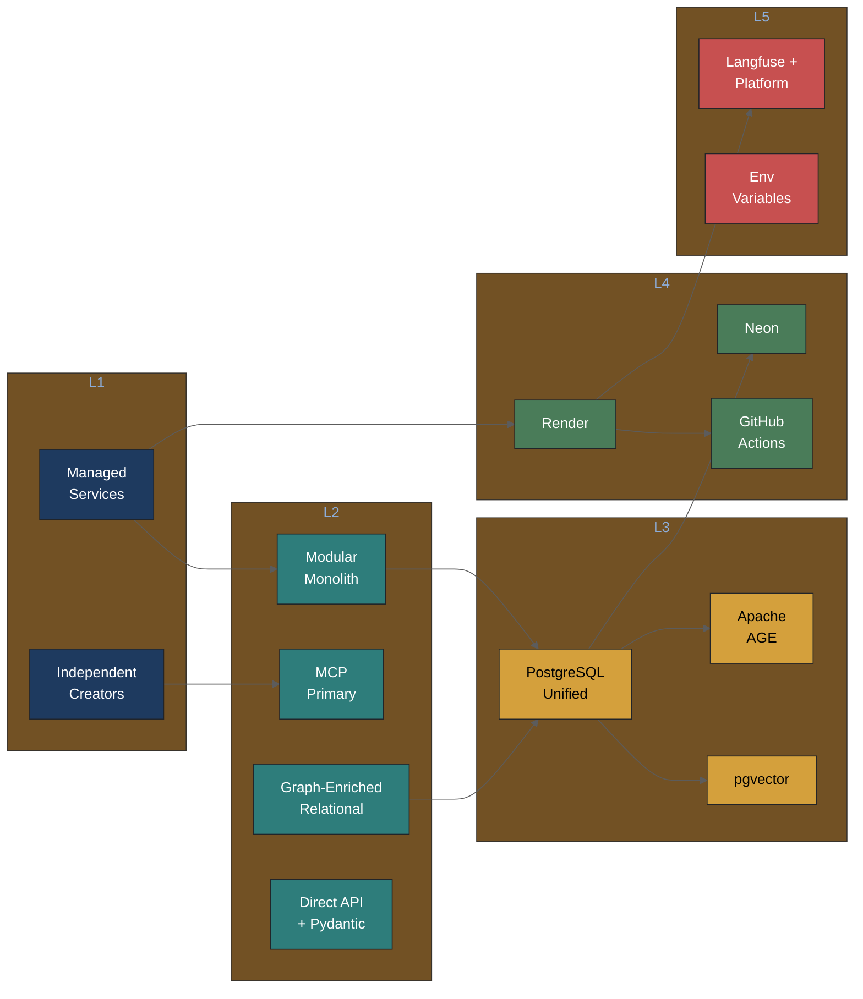

**Joint probability**: ~0.0012. This is the product of archetype-adjusted probabilities for each chosen option. Low absolute values are normal — any specific path through 23 decisions is statistically unlikely. The value is meaningful for comparing scenarios.

---

## Scenario Path: DPP Enterprise

The enterprise path for Digital Product Passport traceability:

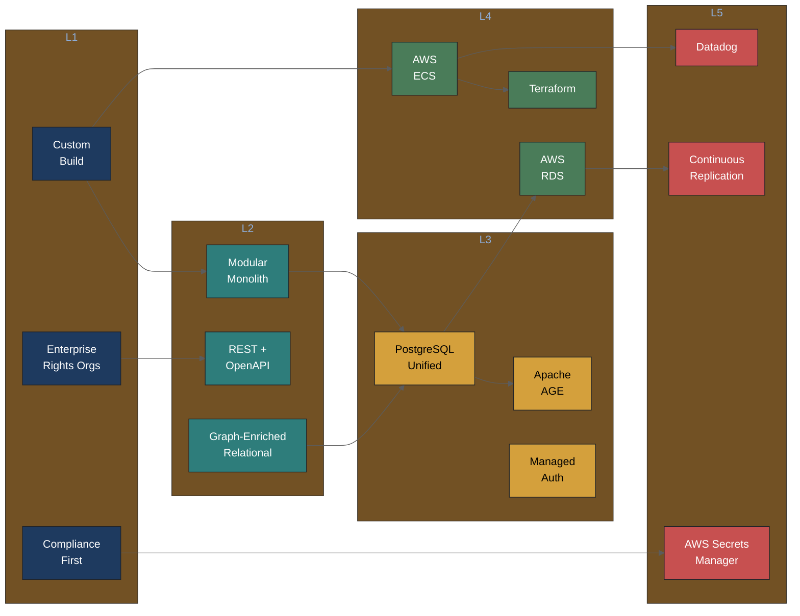

Same scaffold architecture, dramatically different instantiation. REST instead of MCP, AWS instead of Render, Datadog instead of Langfuse, compliance-first instead of best-effort.

---

## Archetype Comparison: Agentic UI Framework

How four team archetypes distribute probability across the agentic UI decision:

```mermaid
%%{init: {'theme': 'base'}}%%
xychart-beta
    title "Agentic UI Framework — Archetype Probability Comparison"
    x-axis ["CopilotKit+AG-UI", "Vercel AI SDK", "Custom Agent UI", "No Agentic UI"]
    y-axis "Probability" 0 --> 0.5
    bar [0.35, 0.25, 0.20, 0.20]
    bar [0.40, 0.30, 0.05, 0.25]
    bar [0.30, 0.20, 0.10, 0.40]
    bar [0.40, 0.25, 0.20, 0.15]
```

| Color | Archetype |
|-------|-----------|
| Bar 1 | Engineer-Heavy Startup |
| Bar 2 | Musician-First Team |
| Bar 3 | Solo Hacker |
| Bar 4 | Well-Funded Startup |

CopilotKit dominates across all archetypes due to open-source governance and MCP integration. Solo hackers are most likely to skip agentic UI entirely (0.40). Musician-first teams favor turnkey solutions — CopilotKit (0.40) or Vercel AI SDK (0.30).

---

## Scenario Path: Agentic Music Attribution Demo

The "golden path" for the frontend mockup with agentic UI, voice agent, and graph RAG:

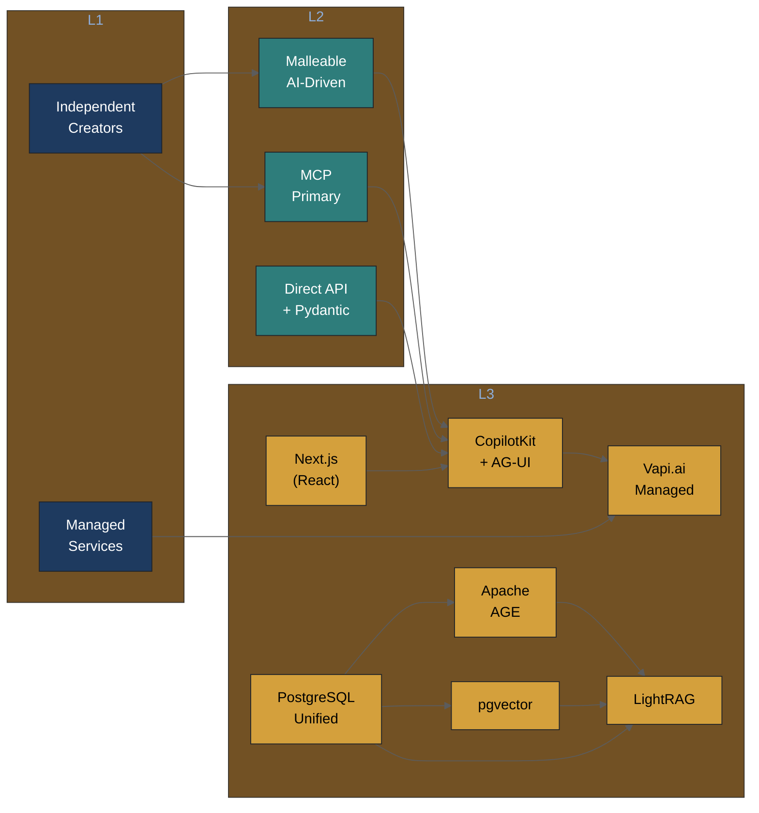

This scenario extends the Music Attribution MVP path with four new nodes. CopilotKit (AG-UI) provides the agentic UI layer on top of Next.js, Vapi.ai adds voice agent capability, and LightRAG powers graph-augmented retrieval using the existing PostgreSQL + AGE + pgvector infrastructure. The malleable UI strategy drives confidence-based field prioritization and co-evolutionary adaptation.

---

## Scenario Path: Partnership-Focused

The ecosystem partnership path through the network — from platform positioning to partner health monitoring:

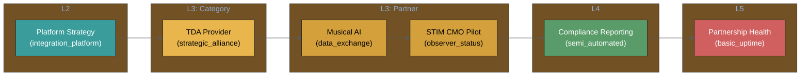

This scenario traces the partnership-first path: begin with platform positioning (integration platform over standalone tool), select a strategic TDA provider alliance, engage Musical AI for training data exchange, run a STIM CMO observer pilot for Nordic licensing, automate compliance reporting, and monitor partnership health metrics.

---

## Scenario Path: Compliance-First

The regulatory compliance path through the network — from compliance posture to automated monitoring:

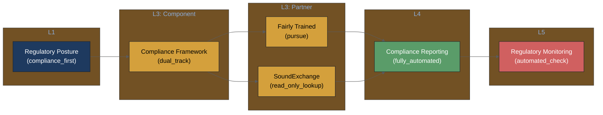

This scenario traces the compliance-first path: start from a compliance-first regulatory posture, adopt a dual-track compliance framework (ISO 42001 + EU AI Act), pursue Fairly Trained certification for market signaling, integrate SoundExchange for registry lookups, build a fully automated compliance reporting pipeline, and establish automated regulatory monitoring.

---

## Volatility Heatmap

Decision stability across the network:

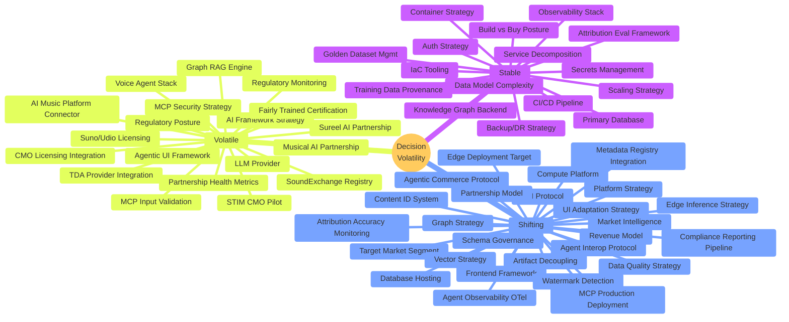

**Interpretation**:
- **Stable** (16 decisions, 21%): Core architectural choices unlikely to change within 6 months. Review quarterly. Includes new infrastructure-layer nodes (attribution eval framework, knowledge graph backend, training data provenance store, golden dataset management) whose technical fundamentals are well-established.
- **Shifting** (25 decisions, 32%): Actively evolving areas where market or technology changes may shift probabilities. Review monthly. Includes ecosystem category decisions (platform strategy, agent interop, edge inference, content ID) where the capability landscape is maturing but not settled, plus operational nodes (compliance reporting, attribution accuracy monitoring, market intelligence) that depend on regulatory timeline clarity.
- **Volatile** (11 decisions, 14%): High uncertainty zones. Includes all company-specific partnership nodes (Musical AI, Sureel AI, STIM, SoundExchange, Fairly Trained, Suno/Udio) whose viability depends on external business decisions and negotiation outcomes, plus regulatory monitoring and partnership health metrics that track inherently unpredictable external signals. Also retains original volatile nodes: regulatory posture (EU AI Act timeline), AI framework strategy (ecosystem consolidation), LLM provider (model capability leaps), agentic UI framework (AG-UI protocol evolving), voice agent stack (platform consolidation), and graph RAG engine (new frameworks emerging weekly). Review biweekly.
- **Ecosystem stub nodes** (28 new in v3.0.0): Not yet classified in the traditional stable/shifting/volatile framework — these are expansion stubs representing the full discussion-paper scope. The 26 nodes shown above in shifting + volatile categories are the initial volatility assessments; 2 additional nodes overlap with existing core classifications.

---

## Complete Database Decision Path (L1 → L5 Walkthrough)

Following the "primary database" thread through all levels with conditional probabilities:

### L1: Build vs Buy Posture → Database (Skip-Connection)

The foundational choice. If the team chooses **Custom Build** (P=0.40):
- P(PostgreSQL Unified | Custom Build) = **0.60** (strong preference)
- P(CockroachDB | Custom Build) = 0.25 (enterprise path open)
- P(Supabase | Custom Build) = 0.05 (unlikely — why use Supabase if building custom?)

If **SaaS Maximalist** (P=0.25):
- P(Supabase | SaaS Maximalist) = **0.50** (natural fit)
- P(SQLite/Turso | SaaS Maximalist) = 0.30 (zero-ops alternative)
- P(PostgreSQL Unified | SaaS Maximalist) = 0.15 (only if extensions needed)

### L2: Data Model Complexity → Database

If the team needs **Graph-Enriched Relational** (P=0.45):
- P(PostgreSQL Unified | Graph-Enriched) = **0.65** (AGE extension requires PostgreSQL)
- P(CockroachDB | Graph-Enriched) = 0.15 (limited graph support)
- P(SQLite/Turso | Graph-Enriched) = 0.05 (no graph extensions)

### L3: Database → Graph Strategy, Vector Strategy

Given **PostgreSQL Unified** (P=0.45):
- P(Apache AGE | PostgreSQL) = **0.65** (natural fit, same process)
- P(pgvector | PostgreSQL) = **0.70** (built-in vector support)

### L4: Database → Hosting

Given **PostgreSQL Unified** (P=0.45):
- P(Neon | PostgreSQL) = **0.40** (serverless PostgreSQL, good DX)
- P(AWS RDS | PostgreSQL) = 0.20 (enterprise path)
- P(Self-Managed | PostgreSQL) = 0.15 (Hetzner path)

### L5: Hosting → Backup/DR

Given **Neon** hosting (P=0.40):
- P(Managed Provider Backups | Neon) = **0.55** (Neon PITR built-in)
- P(Automated Snapshots | Neon) = 0.20 (belt and suspenders)

---

## Cross-Archetype Comparison Tables

### L1 Decisions

| Decision | Engineer-Heavy | Musician-First | Solo Hacker | Well-Funded |
|----------|---------------|----------------|-------------|-------------|
| Build vs Buy | Custom Build (0.60) | SaaS Maximalist (0.60) | SaaS Maximalist (0.60) | Custom Build (0.45) |
| Target Market | Mid-tier Labels (0.30) | Indie Creators (0.60) | Indie Creators (0.55) | Enterprise (0.30) |
| Revenue Model | Open Core (0.35) | Freemium SaaS (0.55) | Freemium SaaS (0.40) | Enterprise Licensing (0.30) |
| Regulatory | Compliance Aware (0.45) | Best Effort (0.45) | Best Effort (0.60) | Compliance First (0.55) |

### L3 Decisions (Technology Choices)

| Decision | Engineer-Heavy | Musician-First | Solo Hacker | Well-Funded |
|----------|---------------|----------------|-------------|-------------|
| Database | PostgreSQL (0.60) | Supabase (0.55) | Supabase/SQLite (0.40/0.40) | PostgreSQL (0.45) |
| Graph | AGE (0.45) | SQL Joins (0.40) | NetworkX (0.40) | AGE (0.40) |
| Vector | pgvector (0.45) | No Vector (0.40) | No Vector (0.40) | pgvector (0.40) |
| LLM | Anthropic (0.30) | OpenAI (0.40) | Anthropic (0.35) | Multi-Provider (0.25) |
| Frontend | Next.js (0.35) | Next.js (0.45) | No Frontend (0.35) | Next.js (0.45) |
| Auth | Custom JWT (0.40) | Supabase Auth (0.40) | API Key (0.40) | Managed Service (0.35) |
| Data Quality | Composite (0.40) | Pandera (0.40) | Composite (0.35) | GX/Composite (0.35) |
| Agentic UI | CopilotKit (0.35) | CopilotKit (0.40) | No Agentic (0.40) | CopilotKit (0.40) |
| Voice Agent | LiveKit (0.35) | Vapi/None (0.40/0.45) | None (0.60) | Vapi/LiveKit (0.30) |
| Graph RAG | LightRAG (0.35) | None (0.40) | None (0.55) | MS GraphRAG (0.30) |

### L4-L5 Decisions (Infrastructure)

| Decision | Engineer-Heavy | Musician-First | Solo Hacker | Well-Funded |
|----------|---------------|----------------|-------------|-------------|
| Compute | AWS ECS (0.30) | Render (0.35) | Railway (0.30) | AWS ECS (0.35) |
| DB Hosting | Neon (0.25) | Supabase (0.40) | Turso (0.30) | AWS RDS (0.35) |
| CI/CD | GitHub Actions (0.40) | Auto-Deploy (0.50) | Auto-Deploy (0.45) | GitHub Actions (0.45) |
| IaC | Terraform (0.40) | None (0.45) | Platform Native (0.35) | Terraform (0.40) |
| Observability | Grafana (0.40) | Minimal (0.50) | Minimal (0.65) | Datadog (0.35) |
| Scaling | Vertical (0.30) | Vertical (0.60) | Vertical (0.70) | Horizontal (0.30) |
| Schema Gov. | DVC+JSON (0.35) | Minimal (0.40) | Git Versioning (0.35) | OpenMetadata (0.45) |

---

## Network Statistics

| Metric | Value |
|--------|-------|
| Total nodes | 78 |
| L1 Business nodes | 4 |
| L2 Architecture nodes | 9 |
| L3 Implementation nodes | 14 |
| L3 Components nodes | 24 |
| L4 Deployment nodes | 13 |
| L5 Operations nodes | 14 |
| Total edges | 181 |
| Team archetypes | 4 |
| Domain overlays | 2 (+ 1 planned) |
| Scenario compositions | 6 |
| Stable decisions | 16 (21%) |
| Shifting decisions | 25 (32%) |
| Volatile decisions | 11 (14%) |
| Ecosystem stub nodes | 28 (new in v3.0.0) |

---

## Research Influences

Academic grounding for UI/UX decision nodes. Full details in [`../research-influences/agentic-ux-research.md`](../research-influences/agentic-ux-research.md).

### Concept → Library → PRD Node Matrix

| Concept | Paper | Library | Maturity | PRD Node(s) |
|---------|-------|---------|----------|-------------|
| Bidirectional Context Loop | DuetUI (2509.13444) | CopilotKit shared state + AG-UI | HIGH | `agentic_ui_framework` |
| Cognitive Oversight | Deep Cognition (2507.15759) | LangGraph `interrupt()` + CoAgents | HIGH | `agentic_ui_framework` |
| Preference-Aligned UI | AlignUI (2601.17614) | None (research frontier) | LOW | `ui_adaptation_strategy` |
| Specification-Driven UI | SpecifyUI (2509.07334) | Google A2UI (v0.9) | HIGH | `ui_adaptation_strategy`, `agentic_ui_framework` |
| Just-in-Time Objectives | Poppins (Stanford) | None (research frontier) | LOW | `ui_adaptation_strategy` |
| Progressive Scaffolding | DuetUI + SpecifyUI | CopilotKit tiers | MEDIUM | `ui_adaptation_strategy`, `agentic_ui_framework` |
| Transparent Reasoning | Deep Cognition (2507.15759) | Vercel AI SDK + assistant-ui | HIGH | `agentic_ui_framework` |
| Real-Time Guidance | ICIS 2025 (Grau & Blohm) | Design principles | MEDIUM | `voice_agent_stack` |
| Malleable Browser Spaces | Orca (UCSD) | Research prototype | LOW | `agentic_ui_framework` |

**4 of 9 concepts** have production-ready library support. **3 concepts** are research frontiers tracked on the watchlist. This ratio ensures the PRD is grounded in what's buildable today while keeping aspirational concepts visible for future iterations.

---

## See Also

- [`_network.yaml`](_network.yaml) — Machine-readable DAG topology
- [`_schema.yaml`](_schema.yaml) — JSON Schema for decision nodes
- [`../archetypes/`](../archetypes/) — Team archetype profiles
- [`../scenarios/`](../scenarios/) — Composed decision paths
- [`../domains/`](../domains/) — Domain overlay system
- [`../../planning/probabilistic-prd-design.md`](../../planning/probabilistic-prd-design.md) — Design rationale
- [`../../planning/quality-tooling-contextualization.md`](../../planning/quality-tooling-contextualization.md) — Quality tooling analysis with conditional probabilities
- [`../../planning/artifact-decoupling-contextualization.md`](../../planning/artifact-decoupling-contextualization.md) — 4-artifact decoupling (code/config/data/prompts) for reproducibility
- [`../research-influences/agentic-ux-research.md`](../research-influences/agentic-ux-research.md) — Academic UX research mapped to PRD nodes
- [`../../planning/expand-probabilistic-prd-to-discussion.md`](../../planning/expand-probabilistic-prd-to-discussion.md) — PRD expansion strategy (MVP → Discussion)
- [`../../planning/tech-trends-agentic-infrastructure-2026.md`](../../planning/tech-trends-agentic-infrastructure-2026.md) — Technology trends research
