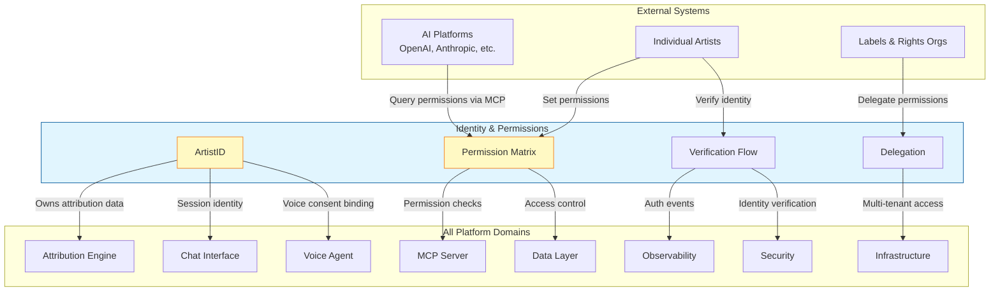
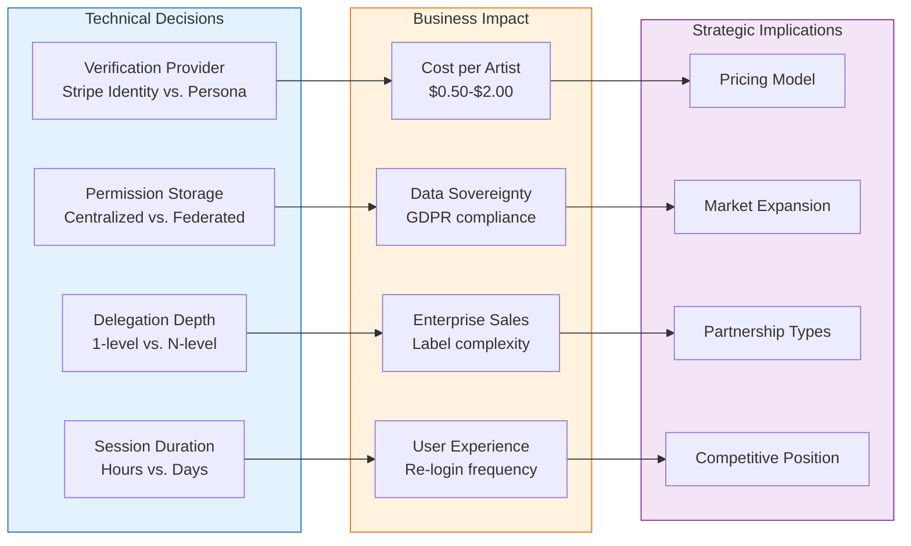

# Identity & Permissions

**Purpose**: Artist identity verification and AI permission management

**Key Concept**: ArtistID - A verified artist identity that controls attribution data and AI permissions

---

## Overview

Identity & Permissions enables artists to:
1. Establish verified digital identity (ArtistID)
2. Control how their work is used by AI platforms
3. Set granular permissions per work, per platform, per use case

## Core Capabilities

| Capability | Description | PRD |
|------------|-------------|-----|
| **ArtistID** | Verified artist identity system | [artist-id.md](artist-id.md) |
| **AI Permissions** | Granular AI training/use permissions | [ai-permissions.md](ai-permissions.md) |
| **Verification Flow** | Identity verification process | [verification-flow.md](verification-flow.md) |
| **Permission Dashboard** | UI for managing permissions | [permission-dashboard.md](permission-dashboard.md) |
| **Delegation** | Manager/label delegation support | [delegation.md](delegation.md) |

## Architecture

```
┌─────────────────────────────────────────────────────────────────┐
│                   IDENTITY & PERMISSIONS                         │
├─────────────────────────────────────────────────────────────────┤
│                                                                 │
│  ┌─────────────────────────────────────────────────────────┐   │
│  │                      ArtistID                           │   │
│  │  ┌─────────────┐  ┌─────────────┐  ┌─────────────┐     │   │
│  │  │ Verification│  │  Identity   │  │ Delegation  │     │   │
│  │  │   Status    │  │   Claims    │  │   Tree      │     │   │
│  │  └─────────────┘  └─────────────┘  └─────────────┘     │   │
│  └─────────────────────────────────────────────────────────┘   │
│                              │                                  │
│                              ▼                                  │
│  ┌─────────────────────────────────────────────────────────┐   │
│  │                   Permission Matrix                      │   │
│  │                                                         │   │
│  │         │ AI Training │ AI Output │ Sampling │ Remix   │   │
│  │  ───────┼─────────────┼───────────┼──────────┼─────────│   │
│  │  Work A │     ✓       │     ✓     │    ✗     │   ✓     │   │
│  │  Work B │     ✗       │     ✗     │    ✗     │   ✗     │   │
│  │  All    │   Default   │  Default  │ Default  │ Default │   │
│  │                                                         │   │
│  └─────────────────────────────────────────────────────────┘   │
│                              │                                  │
│                              ▼                                  │
│  ┌─────────────────────────────────────────────────────────┐   │
│  │              Exposed via MCP Server                      │   │
│  │       (AI platforms query permissions before use)        │   │
│  └─────────────────────────────────────────────────────────┘   │
│                                                                 │
└─────────────────────────────────────────────────────────────────┘
```

## Permission Types

| Permission | Description | Default |
|------------|-------------|---------|
| `ai_training` | Allow use in AI model training | Opt-in |
| `ai_generation` | Allow AI to generate content in style | Opt-in |
| `ai_sampling` | Allow AI to sample/reference work | Opt-in |
| `ai_remix` | Allow AI-assisted remixes | Opt-in |
| `data_sharing` | Share attribution data publicly | Opt-in (basic) |
| `voice_clone` | Allow voice synthesis | Opt-in |

## Verification Levels

| Level | Requirements | Unlocks |
|-------|--------------|---------|
| **Basic** | Email verification | View/edit own data |
| **Verified** | ID + existing catalog link | Set AI permissions, MCP exposure |
| **Pro** | Contracts, label verification | Multi-artist management, API access |

## Implementation Priority

1. **artist-id.md** - Core identity system
2. **ai-permissions.md** - Permission framework
3. **verification-flow.md** - Verification process
4. **permission-dashboard.md** - User interface
5. **delegation.md** - Manager/label support

## Cross-Cutting Dependencies

| Concern | Integration Point |
|---------|-------------------|
| **MCP Server** | Exposes permissions to AI platforms |
| **Voice Agent** | Voice consent ties to identity |
| **Security** | Authentication, authorization |
| **Attribution Engine** | Artist-confirmed data tied to identity |

## Related Documents

- [vision-v1.md](../vision-v1.md) - Product vision
- [mcp-server/permission-verification.md](../mcp-server/permission-verification.md) - How MCP checks permissions
- [voice-agent/voice-consent.md](../voice-agent/voice-consent.md) - Voice-specific consent
- [security/toc-security.md](../security/toc-security.md) - Security requirements

---

## Cross-Domain Impact Diagram

Identity & Permissions is a foundational cross-cutting concern that affects every domain in the system platform.



### Domain-by-Domain Impact

| Domain | How Identity & Permissions Affects It |
|--------|---------------------------------------|
| **Attribution Engine** | All attribution data is tied to a verified ArtistID; confidence scoring considers verification level |
| **Chat Interface** | Session context includes artist identity; prompts can request permission changes |
| **Voice Agent** | Voice consent creates legally-binding permission records tied to ArtistID |
| **MCP Server** | Every API request is validated against the permission matrix before data is returned |
| **Data Layer** | Row-level security policies enforce ArtistID-based access control |
| **Observability** | Verification events, permission changes, and delegation actions are all logged |
| **Security** | Authentication and authorization are built on ArtistID verification levels |
| **Infrastructure** | Multi-tenant isolation maps directly to delegation hierarchies |

---

## For Domain Experts (Imogen/Andy)

### Business Impact Summary

**Why This Matters for Artist Relations (Imogen):**
- ArtistID is how artists "own" their data on the system - it's their identity in the music metadata ecosystem
- Permission controls give artists unprecedented agency over how AI uses their work
- Delegation allows managers and labels to act on behalf of artists without full account access
- Verification levels create trust tiers that can unlock premium features or partnerships

**Why This Matters for Strategy (Andy):**
- AI platforms (OpenAI, Anthropic, Google) need a standardized way to check permissions - ArtistID + MCP is our moat
- Permission granularity (per-work, per-platform, per-use-case) is a competitive differentiator
- Enterprise deals with labels require delegation and multi-tenant support
- Verification levels can tier pricing and access

### Business Metrics Tied to Identity

| Metric | Business Meaning |
|--------|------------------|
| Verified artists | Market penetration among established artists |
| Permission opt-in rates | Artist trust in platform |
| Delegation chains | Label/management partnerships |
| MCP permission queries | AI platform integration adoption |

---

## Known Unknowns

These are identified gaps requiring research or executive decisions:

| Unknown | Impact | Research Needed |
|---------|--------|-----------------|
| **Identity verification cost** | Per-artist verification via ID services has real costs ($0.50-$2/verification) | Need to model break-even at different artist counts |
| **Permission inheritance rules** | When labels delegate, do sub-permissions propagate? How deep? | Legal review of standard management contracts |
| **Cross-platform identity linking** | Can an ArtistID link to Spotify for Artists, Apple Music for Artists, etc.? | API access negotiations with DSPs |
| **Permission revocation latency** | How fast must AI platforms honor permission changes? Real-time? Daily? | Industry standard research, legal requirements |
| **International ID verification** | ID verification services vary by country - coverage gaps? | Market analysis for target regions |
| **Deceased artist handling** | Who controls permissions for estates? How is this verified? | Legal consultation required |

---

## Executive Decision Impact

Technical choices in Identity & Permissions directly affect business strategy.



### Decision Matrix

| Technical Choice | Options | Business Trade-off |
|------------------|---------|-------------------|
| **Verification provider** | Stripe Identity, Persona, Jumio | Cost vs. coverage vs. integration complexity |
| **Permission model** | Opt-in default vs. opt-out default | Artist trust vs. AI platform adoption |
| **Delegation depth** | Single-level vs. hierarchical | Simplicity vs. enterprise label structures |
| **Permission granularity** | Per-catalog vs. per-work vs. per-platform | UX simplicity vs. artist control |
| **Verification tiers** | 2-tier vs. 3-tier vs. continuous | Onboarding friction vs. security |

### Recommendations for Executive Review

1. **Start with opt-in default** for AI permissions - builds artist trust, differentiates from competitors who assume consent
2. **Two-level delegation** (artist -> manager/label -> the system) covers 90% of use cases without complexity
3. **Per-catalog permissions** as default, with per-work override for power users - balances UX and control
4. **Stripe Identity** for verification - already integrated, good international coverage, known costs
