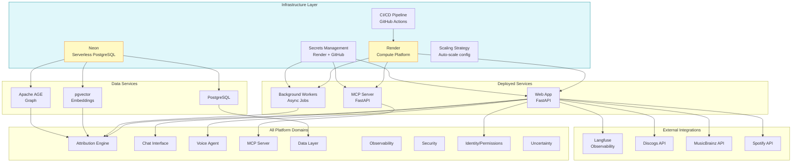
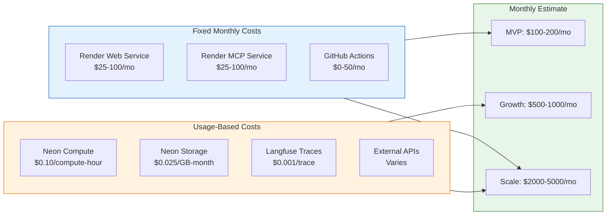
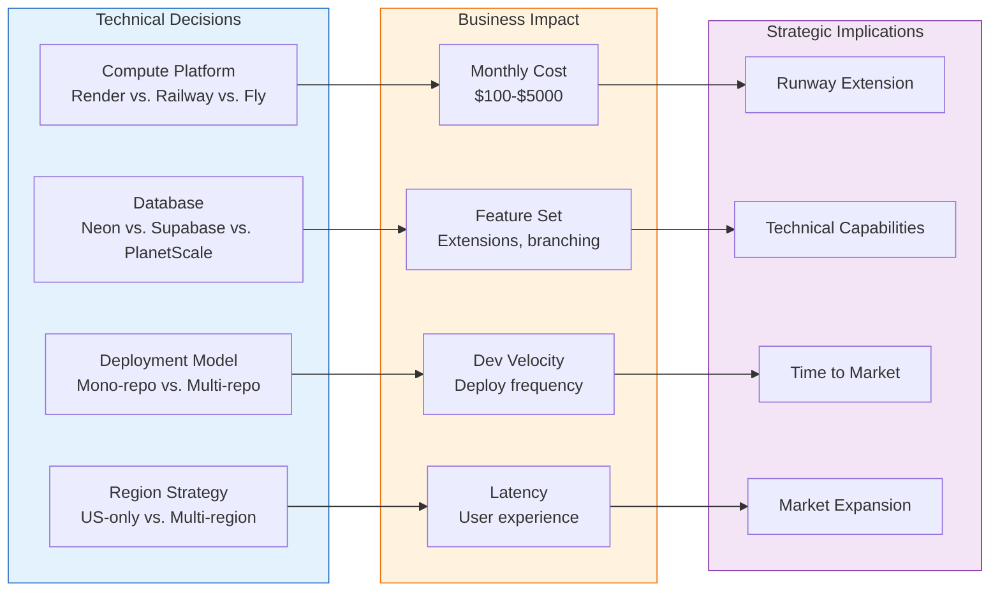

# Infrastructure

**Purpose**: Deployment, hosting, and operational infrastructure

**Philosophy**: Simple deployment, low ops burden - we're a startup, not a cloud provider

**Primary Platforms**: Render (compute), Neon (database)

---

## Overview

The system infrastructure prioritizes:
1. **Simplicity**: Managed services over DIY
2. **Low Ops**: Minimal maintenance burden
3. **Cost Efficiency**: Pay-per-use where possible
4. **Scalability**: Can grow without re-architecture

## Core Capabilities

| Capability | Description | PRD |
|------------|-------------|-----|
| **Render Deployment** | Application hosting | [render.md](render.md) |
| **Neon PostgreSQL** | Serverless database | [neon.md](neon.md) |
| **CI/CD Pipeline** | Automated deployment | [ci-cd.md](ci-cd.md) |
| **Secrets Management** | Secure configuration | [secrets.md](secrets.md) |
| **Scaling Strategy** | Growth planning | [scaling.md](scaling.md) |

## Architecture

```
┌─────────────────────────────────────────────────────────────────┐
│                      INFRASTRUCTURE                              │
├─────────────────────────────────────────────────────────────────┤
│                                                                 │
│  ┌─────────────────────────────────────────────────────────┐   │
│  │                       Render                             │   │
│  │                                                         │   │
│  │  ┌─────────────┐  ┌─────────────┐  ┌─────────────┐     │   │
│  │  │  Web App    │  │  MCP Server │  │   Workers   │     │   │
│  │  │  (FastAPI)  │  │             │  │  (bg jobs)  │     │   │
│  │  └─────────────┘  └─────────────┘  └─────────────┘     │   │
│  │                                                         │   │
│  └─────────────────────────────────────────────────────────┘   │
│                              │                                  │
│                              ▼                                  │
│  ┌─────────────────────────────────────────────────────────┐   │
│  │                        Neon                              │   │
│  │                                                         │   │
│  │  ┌─────────────────────────────────────────────────┐   │   │
│  │  │  PostgreSQL + pgvector + Apache AGE             │   │   │
│  │  │  (Serverless, auto-scaling, branching)          │   │   │
│  │  └─────────────────────────────────────────────────┘   │   │
│  │                                                         │   │
│  └─────────────────────────────────────────────────────────┘   │
│                                                                 │
│  External Services:                                             │
│  ┌─────────────┐  ┌─────────────┐  ┌─────────────┐            │
│  │  Langfuse   │  │  Discogs    │  │ MusicBrainz │            │
│  │ (observ.)   │  │   (API)     │  │   (API)     │            │
│  └─────────────┘  └─────────────┘  └─────────────┘            │
│                                                                 │
└─────────────────────────────────────────────────────────────────┘
```

## Why Not Kubernetes?

See [REJECTED.md#kubernetes](../REJECTED.md#kubernetes) for full rationale.

**Summary**:
- Over-engineering for startup scale
- Render provides enough containerization
- We're not running 10+ microservices
- Ops burden too high for small team

**When to Reconsider**: Multi-region deployment, >10 services, dedicated ops team.

## Why Not AWS/GCP Direct?

See [REJECTED.md#aws-gcp-direct](../REJECTED.md#aws-gcp-direct) for full rationale.

**Summary**:
- Configuration complexity
- Managed services (Render, Neon) abstract this
- No need for bare infrastructure

## Environment Strategy

| Environment | Purpose | Database |
|-------------|---------|----------|
| `development` | Local development | Neon branch |
| `staging` | Pre-production testing | Neon branch |
| `production` | Live system | Neon main |

Neon branching enables instant database copies for testing.

## Implementation Priority

1. **render.md** - Core deployment
2. **neon.md** - Database setup
3. **ci-cd.md** - Automated pipeline
4. **secrets.md** - Configuration management
5. **scaling.md** - Future growth planning

## Cross-Cutting Dependencies

| Domain | Infrastructure Integration |
|--------|---------------------------|
| **Data Layer** | Neon database hosting |
| **Security** | TLS, secrets management |
| **Observability** | Metrics, logging |
| **All Services** | Render deployment |

## Related Documents

- [REJECTED.md#kubernetes](../REJECTED.md#kubernetes) - Why not K8s
- [REJECTED.md#aws-gcp-direct](../REJECTED.md#aws-gcp-direct) - Why not bare cloud
- [data-layer/toc-data-layer.md](../data-layer/toc-data-layer.md) - Database requirements
- [defaults.yaml](../defaults.yaml) - Current infrastructure choices

---

## Cross-Domain Impact Diagram

Infrastructure is the foundation that hosts and connects all domains in the system.



### Domain-by-Domain Infrastructure Support

| Domain | Infrastructure Requirements |
|--------|----------------------------|
| **Attribution Engine** | pgvector for embeddings, AGE for graph queries, Workers for async aggregation |
| **Chat Interface** | Web app hosting, WebSocket support for real-time, session storage |
| **Voice Agent** | Low-latency compute, audio processing capability |
| **MCP Server** | Dedicated service, rate limiting at infrastructure level |
| **Data Layer** | Neon PostgreSQL with extensions, connection pooling |
| **Observability** | Langfuse integration, log aggregation |
| **Security** | TLS termination, secrets injection, network isolation |
| **Identity/Permissions** | Auth0 integration, session management |
| **Uncertainty** | Compute for calibration pipeline, calibration data storage |

---

## For Domain Experts (Imogen/Andy)

### Business Impact Summary

**Why This Matters for Artist Relations (Imogen):**
- Infrastructure reliability = artists can always access and update their data
- Fast response times = good user experience during data entry
- Auto-scaling = no degradation during high-traffic events (awards season, major releases)
- Neon branching = safe testing of new features without risking artist data

**Why This Matters for Strategy (Andy):**
- Render + Neon = predictable, manageable costs vs. AWS/GCP complexity
- No Kubernetes = faster development velocity, smaller team can ship
- Serverless database = costs scale with usage, not provisioned capacity
- Simple infrastructure = faster time to market

### Cost Model



### Why Not Kubernetes?

**For Non-Technical Stakeholders:**

| Kubernetes | Render |
|------------|--------|
| Like building your own car factory | Like leasing a car |
| Needs dedicated ops engineers | Push code, it deploys |
| Months to set up properly | Days to be production-ready |
| Great for 100+ services | Perfect for 3-10 services |
| $10K+/month minimum | $100-500/month to start |

**Bottom Line**: Kubernetes is the right choice when you have a dedicated platform team. We don't, and won't for 2+ years.

---

## Known Unknowns

These are identified gaps requiring research or executive decisions:

| Unknown | Impact | Research Needed |
|---------|--------|-----------------|
| **Multi-region latency** | Are EU artists getting acceptable latency from US-hosted services? | Latency testing from EU/UK endpoints |
| **Neon extension support** | Can we run Apache AGE (graph) on Neon, or need separate DB? | Neon roadmap / support inquiry |
| **Render scaling limits** | At what scale does Render become limiting? | Scale testing, Render enterprise features |
| **Cost at 100K artists** | What's the infrastructure cost at scale? | Capacity modeling |
| **Backup and disaster recovery** | What's our RTO/RPO? Is Neon sufficient? | DR planning exercise |
| **Data residency** | Will EU customers require EU-hosted data? | GDPR legal review |

---

## Executive Decision Impact

Infrastructure choices affect cost, speed, and future options.



### Decision Matrix

| Technical Choice | Options | Business Trade-off |
|------------------|---------|-------------------|
| **Compute platform** | Render, Railway, Fly.io, Vercel | Cost vs. features vs. support |
| **Database provider** | Neon, Supabase, PlanetScale, AWS RDS | Extensions vs. serverless vs. cost |
| **CI/CD pipeline** | GitHub Actions, GitLab CI, CircleCI | Integration vs. cost vs. features |
| **CDN / Edge** | Cloudflare, Vercel Edge, none | Performance vs. complexity |
| **Secrets management** | Platform-native, Vault, AWS Secrets Manager | Simplicity vs. enterprise features |

### Recommendations for Executive Review

1. **Render for compute** - best balance of simplicity, cost, and features for our stage
2. **Neon for database** - serverless PostgreSQL with branching is perfect for fast iteration
3. **Mono-repo with GitHub Actions** - simplifies deployment, one source of truth
4. **US-only initially** - add EU region when we have significant EU customer base
5. **Platform-native secrets** - Render environment variables sufficient for MVP

### Infrastructure Evolution Roadmap

| Phase | Infrastructure | Triggers to Evolve |
|-------|----------------|-------------------|
| **MVP** | Render + Neon (US) | Launch |
| **Growth** | Add CDN, optimize queries | Latency complaints, $1K+/month |
| **Scale** | Multi-region, dedicated resources | EU customers, 10K+ artists |
| **Enterprise** | Consider AWS/GCP, compliance needs | $100K+ ARR enterprise deals |

### Migration Paths (If Needed)

| From | To | Difficulty | When to Consider |
|------|-----|------------|------------------|
| Render | AWS ECS | Medium | Need AWS-specific services |
| Neon | AWS RDS | Low | Compliance requires AWS |
| Single region | Multi-region | High | EU data residency required |
| Render | Kubernetes | High | Need 10+ microservices, dedicated ops |
