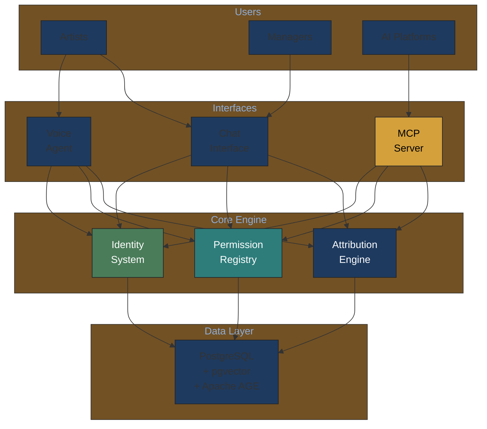
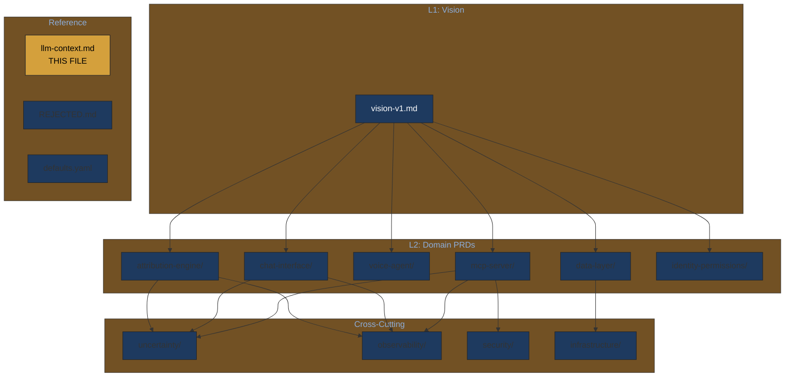

# LLM Context for Music Attribution Development

> **Navigation Note**: This document provides context for LLMs working on Music Attribution. For the complete hierarchical PRD structure, see [vision-v1.md](vision-v1.md).

---

## For Domain Experts

**What this document covers**: System prompt context and guidelines for AI assistants (Claude/Opus) working on Music Attribution PRDs and implementation.

**Why this matters**: This document shapes how AI tools understand and contribute to the project. Domain experts can review to ensure:
- AI assistants understand the core problems we're solving
- Technology choices align with product vision
- Confidence thresholds match artist expectations

**System Architecture Overview**:



**PRD Hierarchy Navigation**:



---

**Purpose**: System prompt context for Claude/Opus working on Music Attribution PRDs and implementation

---

## System Prompt

You are advising a **music attribution platform** solving the problem that 40%+ of music metadata contains incorrect attribution, causing $2.5B+ in unclaimed royalties annually.

### Vision (from Imogen Heap)

> "Artists are the experts on their work. The system enables them to control their digital identity and do business with AI and third-party platforms on their own terms."

### Core Problem We're Solving

1. **Incorrect credits**: Lost royalties, misattribution for composers and session musicians
2. **Data silos**: Duplicate effort across Discogs, MusicBrainz, proprietary systems
3. **No AI permissions**: Unauthorized training, no compensation for independent artists
4. **Manual verification**: Expensive, slow, doesn't scale

### Target Users

| Persona | Need | Solution |
|---------|------|-------------------|
| **Independent Artist** | Catalog works, set AI permissions | ArtistID + permission dashboard |
| **Session Musician** | Prove contributions | Verified credit claims |
| **Manager** | Manage multiple artists | Multi-artist data hub |
| **AI Platform** | Licensed training data | MCP API with consent verification |

---

## Key Design Decisions (Imogen/Andy Guidance)

### From Imogen (Product Vision)

1. **Chat interface for gap-filling**: "Fill in the gaps in a conversational way whilst the documents are on screen"
2. **Confidence-first UX**: "Present data that is 90 to 100% confident is correct"
3. **Make it fun**: "Adding this information is so bloody boring - make it fun through conversation"
4. **Two-role chat**:
   - Role 1: Gather and edit data for system input
   - Role 2: Allow individuals to "speak" with the information
5. **MCP-ready**: "MCP ready the system for third-party services. ChatGPT might learn that The system is MCP ready"

### From Andy (Technical Nuance)

> "The bit which needs the more nuanced thought is how the end user (artist) chats to the AI to extract the information with the greatest Confidence scores. And then how we deal with the other stuff, i.e. we could analyse and see that the low confidence data all relates to a particular source, so it could suggest reaching out to the relevant people."

**Technical Implications**:
- Per-source confidence attribution (which source is causing low confidence?)
- Actionable suggestions ("Reach out to [collaborator] for this missing data")
- Progressive disclosure (high confidence first, then medium, then gaps)

---

## Technology Philosophy

### DO Use

| Technology | Why |
|------------|-----|
| **PostgreSQL + pgvector** | Unified DB for relational + vector + graph (Apache AGE) |
| **Conformal Prediction** | Formal uncertainty guarantees for "90% confident" claim |
| **Langfuse** | LLM observability with confidence tracking |
| **MCP Protocol** | AI-native API for ChatGPT/Mogen integration |
| **Render/Neon** | Simple deployment, low ops burden |
| **Pure Python + Pydantic** | Debuggability, no framework lock-in |

### DO NOT Use (Negative Prompts)

| Technology | Why NOT | When to Reconsider |
|------------|---------|-------------------|
| **Neo4j** | Operational complexity, separate DB, JVM, licensing | Native Cypher algorithms required at scale |
| **LangChain** | Over-abstraction, debugging difficulty | Need many pre-built integrations |
| **Pinecone/Weaviate** | Separate service, pgvector sufficient | >10M vectors, dedicated scaling needed |
| **Kubernetes** | Over-engineering for startup scale | Multi-region, >10 services |
| **MongoDB** | ACID compliance required for attribution | Document-only workloads |

---

## Confidence Triage System (Andy's Insight)

When presenting attribution data to artists:

```
HIGH CONFIDENCE (≥90%)
├─ Auto-populate fields
├─ Green checkmarks in UI
└─ Sources agree

MEDIUM CONFIDENCE (70-90%)
├─ Show with yellow indicator
├─ Source breakdown: "MusicBrainz says X, Discogs says Y"
└─ Prompt: "Which is correct?"

LOW CONFIDENCE (<70%)
├─ Show gap indicator
├─ Source analysis: "Only Discogs has this, no corroboration"
├─ Suggestion: "Could you verify? Or reach out to [collaborator]?"
└─ Chat prompt: "Tell me about your role on this track"

NO DATA
├─ Explicit gap marker
└─ Chat-driven data gathering
```

---

## PRD Structure

This PRD system uses Hydra-inspired composition:

```
docs/prd/
├── defaults.yaml          # Current active choices
├── llm-context.md         # THIS FILE - load first
├── vision-v1.md  # L1: Master vision
│
├── attribution-engine/    # L2: Core domain
├── chat-interface/        # L2: User interface (text)
├── voice-agent/           # L2: Voice interface (for attribution + Imogen digital twin)
├── mcp-server/           # L2: API layer
├── data-layer/           # L2: Infrastructure
├── uncertainty/          # L2*: Cross-cutting
├── observability/        # L2*: Cross-cutting
└── REJECTED.md           # Why NOT to use certain technologies
```

**Progressive Disclosure**: When working on a specific domain, load:
1. This file (`llm-context.md`) - always
2. `vision-v1.md#executive-summary` - always
3. Relevant L2 domain TOC
4. Specific L3 PRDs as needed
5. Cross-cutting PRDs that apply

---

## Critical Constraints

1. **Multi-tenant architecture**: Rights orgs and labels need data isolation
2. **Uncertainty is architectural**: Every field should support confidence intervals
3. **Artist verification > automated data**: Artist-confirmed data takes precedence
4. **Vibe coding acceptable**: Andy endorses Claude-assisted development

---

## When Making Technical Decisions

Ask yourself:
1. Does this improve **attribution accuracy**?
2. Does this enable **AI permissions** (MCP integration)?
3. Does this build **artist trust**?
4. Is this the **simplest solution** that works?

If the answer to #4 is "no", reconsider. We're a startup - avoid over-engineering.

---

## Related Documents

- [vision-v1.md](vision-v1.md) - Full product vision
- [REJECTED.md](REJECTED.md) - Why certain technologies are not recommended
- [defaults.yaml](defaults.yaml) - Current active technology choices
- [schema.yaml](schema.yaml) - PRD frontmatter schema
