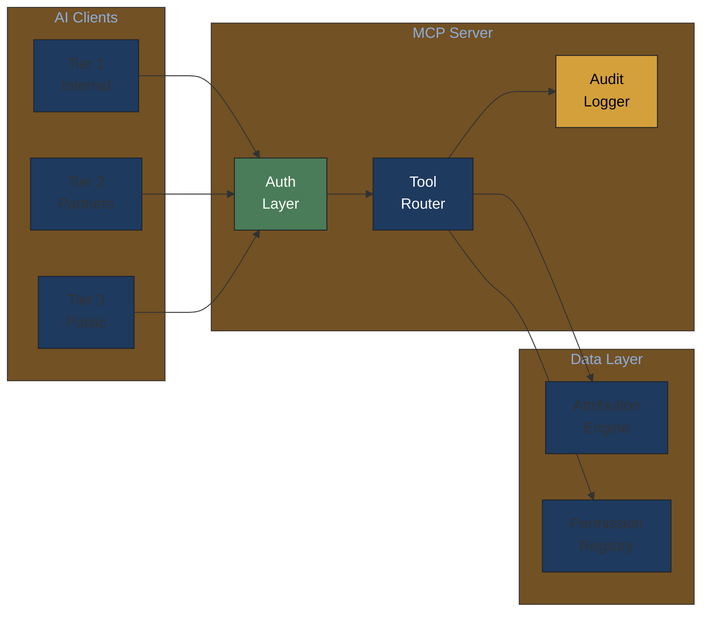
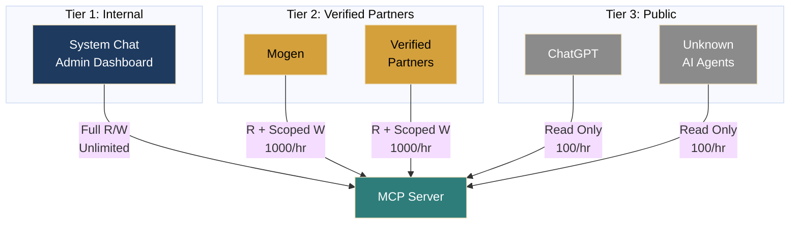
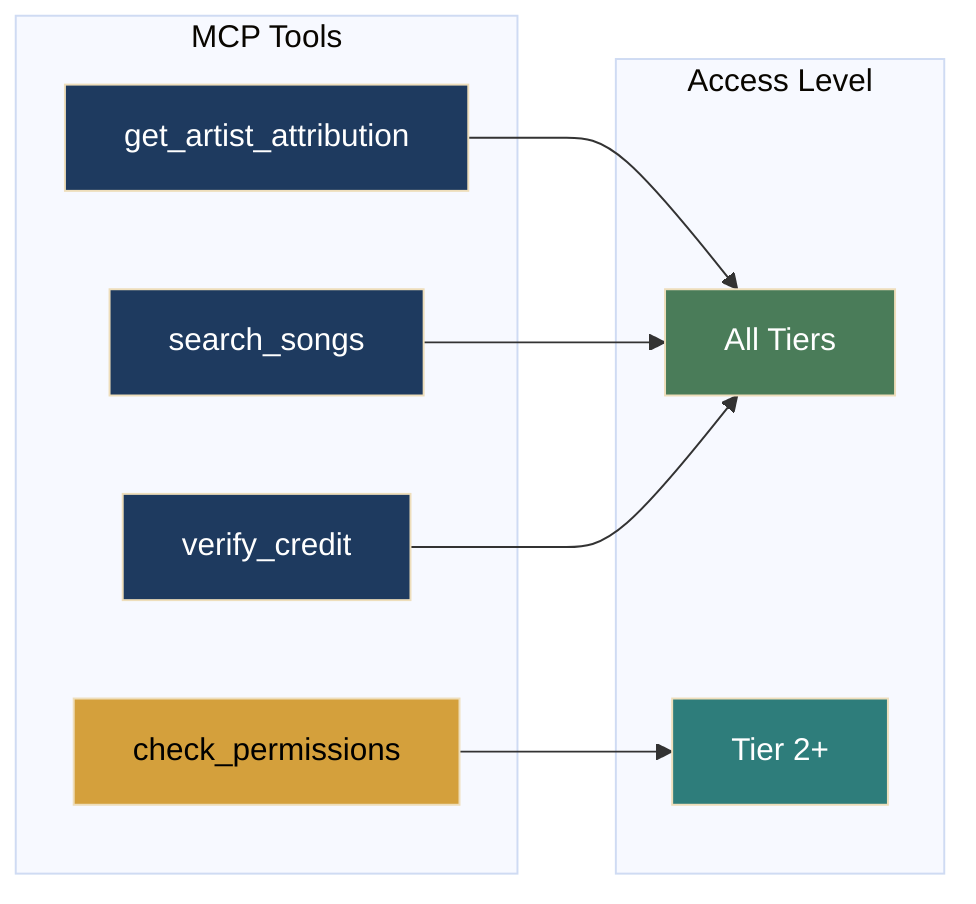
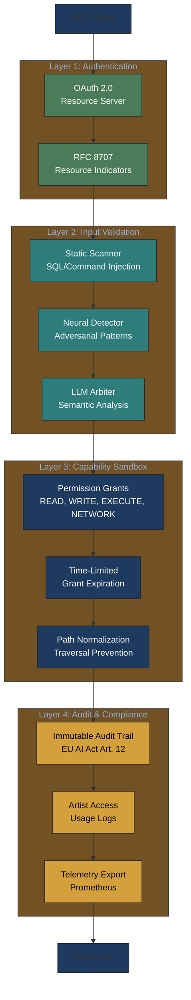
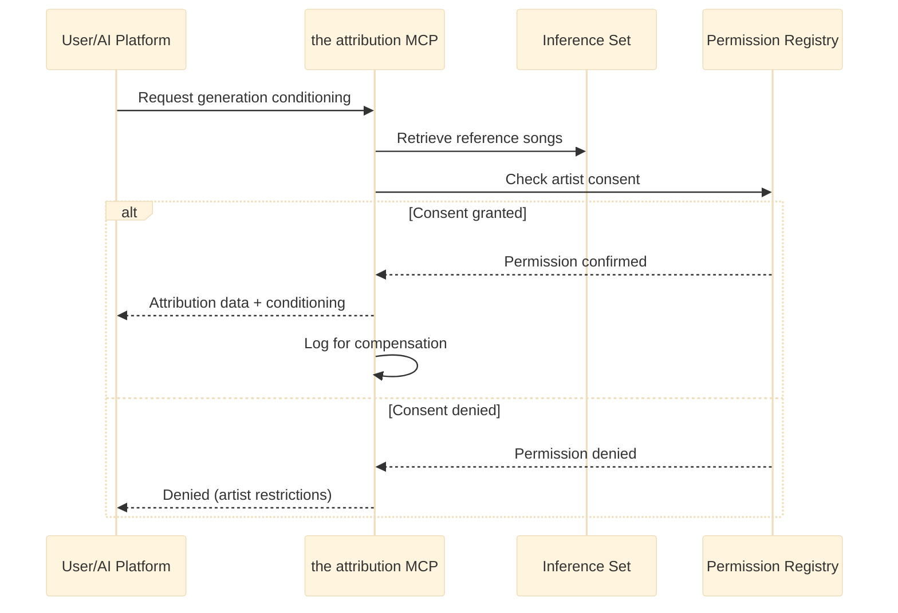
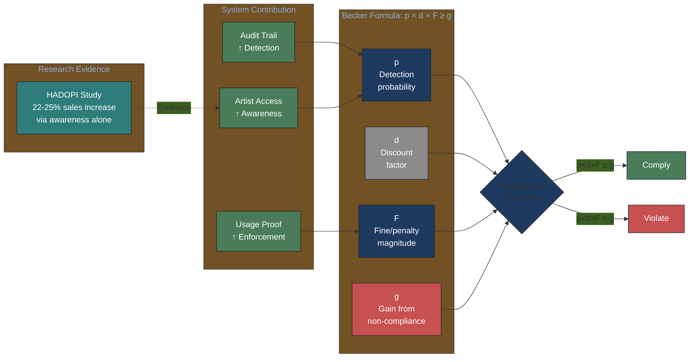
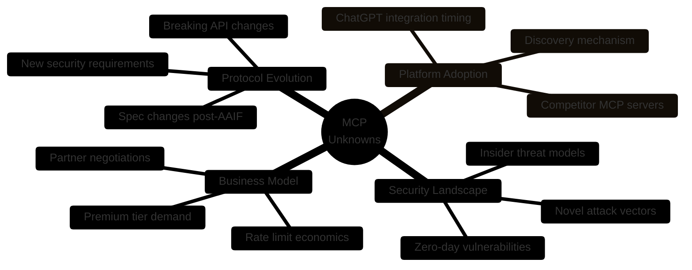
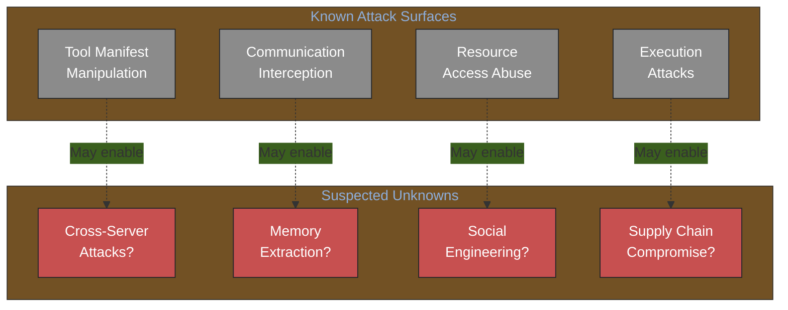
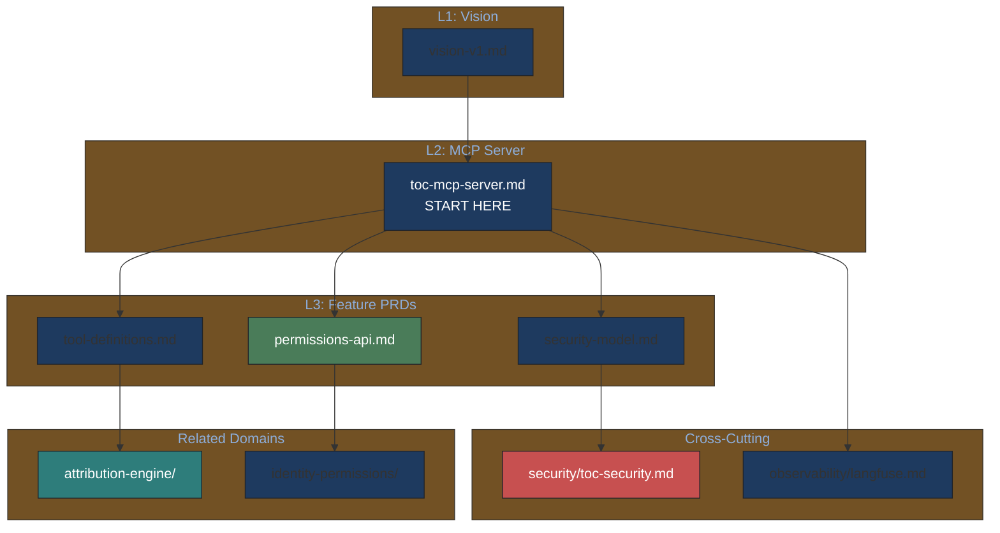

# MCP Server PRD v1

> **Navigation Note**: This is a legacy flat PRD. For the new hierarchical structure with granular feature PRDs, see [mcp-server/toc-mcp-server.md](mcp-server/toc-mcp-server.md).

---

## For Domain Experts

**What this document covers**: Model Context Protocol server exposing attribution data to AI agents.

**Key decisions needing domain input**:
- Permission granularity for AI training vs. generation vs. analysis
- Rate limit economics for partner tiers
- Audit trail access for artists (what should they see?)

**Quick architecture overview**:



---

## Metadata

- **Version**: 0.8.0
- **Status**: Draft
- **Created**: 2026-02-03
- **Updated**: 2026-02-03
- **Author**: Claude Code
- **Lineage**: PLAN.md Section 6.3, MCP Specification

## Executive Summary

- **What**: Model Context Protocol server exposing attribution data to AI agents
- **Why**:
  - AI platforms need machine-readable music attribution
  - MCP is the emerging standard for AI tool integration
  - Permission-aware access enables ethical AI training
- **Investment**: 1-2 weeks for MVP
- **Confidence**: High (MCP spec is stable, implementation is straightforward)

## 1. Problem Statement

### 1.1 Current State

AI music platforms face attribution challenges:

| Problem | Impact |
|---------|--------|
| No API for attribution queries | Must scrape or guess |
| No permission verification | Legal risk |
| No confidence metadata | Can't assess reliability |

### 1.2 Imogen Heap's Vision

From her Medium article:

> "Connecting models to the system.io through MCPs could revolutionise the system by maintaining a clear and fair line of attribution. How else can we let companies know who we are and what we are not willing to do with our IP?"

## 2. Three-Tier Trust Model



Access control based on client verification level:

| Tier | Access Level | Example Clients | Rate Limit |
|------|-------------|-----------------|------------|
| **Tier 1** (Internal) | Full read/write | System Chat, Admin | Unlimited |
| **Tier 2** (Verified) | Read + scoped write | Mogen, verified partners | 1000 req/hour |
| **Tier 3** (Public) | Read-only, rate-limited | ChatGPT, unknown agents | 100 req/hour |

### 2.1 Tier Determination

```python
from enum import Enum
from pydantic import BaseModel

class AccessTier(Enum):
    INTERNAL = 1
    VERIFIED = 2
    PUBLIC = 3

class ClientInfo(BaseModel):
    client_id: str
    tier: AccessTier
    scopes: list[str]
    rate_limit: int

def determine_tier(oauth_token: str) -> ClientInfo:
    """Determine client tier from OAuth token."""
    claims = validate_token(oauth_token)

    if claims.get("aud") == "system-internal":
        return ClientInfo(
            client_id=claims["sub"],
            tier=AccessTier.INTERNAL,
            scopes=["*"],
            rate_limit=float("inf")
        )

    if claims.get("verified_partner"):
        return ClientInfo(
            client_id=claims["sub"],
            tier=AccessTier.VERIFIED,
            scopes=claims.get("scopes", ["read"]),
            rate_limit=1000
        )

    return ClientInfo(
        client_id=claims.get("sub", "anonymous"),
        tier=AccessTier.PUBLIC,
        scopes=["read"],
        rate_limit=100
    )
```

## 3. MCP Tool Definitions



### 3.1 get_artist_attribution

Query attribution data for an artist.

```python
@mcp_tool(
    name="get_artist_attribution",
    description="Get complete attribution data for an artist"
)
async def get_artist_attribution(
    artist_id: str,
    include_sources: bool = True,
    confidence_threshold: float = 0.6
) -> ArtistAttributionResponse:
    """
    Retrieves attribution data for the specified artist.

    Args:
        artist_id: Artist ID or external identifier
        include_sources: Whether to include source provenance
        confidence_threshold: Minimum confidence for included data

    Returns:
        Complete attribution with confidence scores
    """
    ...
```

**Request Schema:**

```json
{
  "tool": "get_artist_attribution",
  "arguments": {
    "artist_id": "AURA01JE38RP4ES",
    "include_sources": true,
    "confidence_threshold": 0.7
  }
}
```

**Response Schema:**

```json
{
  "artist_id": "AURA01JE38RP4ES",
  "canonical_name": "Imogen Heap",
  "overall_confidence": 0.92,
  "confidence_level": "verified",
  "songs": [
    {
      "song_id": "song_123",
      "title": "Hide and Seek",
      "composers": [
        {"name": "Imogen Heap", "role": "composer", "confidence": 0.95, "sources": ["musicbrainz", "discogs"]}
      ],
      "field_confidence": {
        "title": 0.99,
        "composers": 0.95,
        "producers": 0.88
      }
    }
  ],
  "sources_consulted": ["musicbrainz", "discogs", "system_own"],
  "last_updated": "2026-02-03T12:00:00Z"
}
```

### 3.2 search_songs

Search for songs with confidence filtering.

```python
@mcp_tool(
    name="search_songs",
    description="Search for songs with attribution data"
)
async def search_songs(
    query: str,
    min_confidence: float = 0.6,
    limit: int = 10
) -> list[SongAttribution]:
    """
    Search for songs matching the query.

    Args:
        query: Search query (title, artist, etc.)
        min_confidence: Minimum overall confidence
        limit: Maximum results to return

    Returns:
        List of matching songs with attribution
    """
    ...
```

### 3.3 verify_credit

Verify if a specific credit claim is accurate.

```python
@mcp_tool(
    name="verify_credit",
    description="Verify if a credit claim is accurate"
)
async def verify_credit(
    song_id: str,
    credit_type: str,
    claimed_name: str
) -> CreditVerificationResult:
    """
    Verify a credit claim against known sources.

    Args:
        song_id: The system song identifier
        credit_type: Type of credit ('composer', 'producer', etc.)
        claimed_name: Name being verified

    Returns:
        Verification result with confidence and sources
    """
    ...
```

**Response Schema:**

```json
{
  "verified": true,
  "confidence": 0.87,
  "matching_credits": [
    {"name": "Imogen Heap", "role": "composer", "sources": ["musicbrainz"]}
  ],
  "conflicts": [],
  "recommendation": "high_confidence"
}
```

### 3.4 check_permissions (Tier 2+)

Check AI training permissions for an artist's works.

```python
@mcp_tool(
    name="check_permissions",
    description="Check AI training permissions for artist works",
    required_tier=AccessTier.VERIFIED
)
async def check_permissions(
    artist_id: str,
    usage_type: str  # 'training', 'generation', 'analysis'
) -> PermissionResult:
    """
    Check if the requesting client has permission for the specified usage.

    Args:
        artist_id: Artist ID
        usage_type: Type of AI usage being requested

    Returns:
        Permission status with any conditions
    """
    ...
```

## 4. Security Implementation

### 4.1 OAuth 2.0 Integration

```python
from fastapi import Depends, HTTPException
from fastapi.security import OAuth2PasswordBearer

oauth2_scheme = OAuth2PasswordBearer(tokenUrl="token")

async def verify_access(
    token: str = Depends(oauth2_scheme),
    required_tier: AccessTier = AccessTier.PUBLIC
) -> ClientInfo:
    """Verify OAuth token and check tier requirements."""
    client = determine_tier(token)

    if client.tier.value > required_tier.value:
        raise HTTPException(
            status_code=403,
            detail=f"Requires tier {required_tier.name} or higher"
        )

    return client
```

### 4.2 Rate Limiting

```python
from slowapi import Limiter
from slowapi.util import get_remote_address

limiter = Limiter(key_func=get_client_id)

@app.get("/mcp/tools/get_artist_attribution")
@limiter.limit(lambda: get_client_rate_limit())  # Dynamic based on tier
async def get_artist_attribution_endpoint(...):
    ...
```

### 4.3 Audit Logging

All write operations logged:

```python
async def log_mcp_operation(
    client_id: str,
    operation: str,
    resource: str,
    result: str
):
    """Log MCP operation for audit trail."""
    await db.execute("""
        INSERT INTO mcp_audit_log (client_id, operation, resource, result, timestamp)
        VALUES ($1, $2, $3, $4, NOW())
    """, client_id, operation, resource, result)
```

## 5. Resource Indicators (RFC 8707)

Granular access control per resource:

```python
class MCPResourceAccess(BaseModel):
    """Granular resource access control per RFC 8707."""
    resource: str  # e.g., "attribution://artists/{artist_id}"
    operations: list[Literal["read", "write", "delete"]]
    audience: str  # Specific client identifier
    scope: str     # OAuth-style scope string

# Example: Mogen gets read + scoped write for verified artists
mogen_access = MCPResourceAccess(
    resource="attribution://artists/*",
    operations=["read", "write"],
    audience="mogen-digital-twin",
    scope="artists:read artists:contribute"
)

# Example: ChatGPT gets read-only
chatgpt_access = MCPResourceAccess(
    resource="attribution://artists/*",
    operations=["read"],
    audience="openai-chatgpt",
    scope="artists:read"
)
```

## 5.1 November 2025 MCP Specification Compliance

Per MCP spec updates (see [agentic-systems-research-2026-02-03.md](../knowledge-base/technical/agentic-systems-research-2026-02-03.md)):

### Mandatory Requirements

| Requirement | Spec Reference | System Status |
|-------------|---------------|-----------------|
| OAuth Resource Server classification | November 2025 | Designed |
| Resource Indicators (RFC 8707) | SEP-8707 | Phase 3 |
| Client security requirements | SEP-1024 | Phase 2 |
| Default scopes definition | SEP-835 | Phase 2 |

### Security Threat Context

Industry benchmarks (MCPSecBench 2025):
- **40.71%** average attack success rate across MCP implementations
- **85%+** attacks compromise at least one major platform
- **22%** of servers have path traversal vulnerabilities

### Security Architecture (Four-Layer Defense)



**Research basis**: [MCP Security Bench (MSB)](https://arxiv.org/abs/2510.15994) found 40.71% average attack success rate; [MCPSecBench](https://arxiv.org/abs/2508.13220) found 85%+ attacks compromise at least one platform—necessitating defense-in-depth.

### Visual: MCP Security Threat Model

<!-- TODO: Generate fig-repo-17-mcp-security-threat-model.jpg via Nano Banana Pro -->


*Four attack surfaces (tool manifest, communication, resource access, execution) mitigated by four-layer defense. Based on [MCP Security Bench](https://arxiv.org/abs/2510.15994) finding 40.71% average attack success rate across nine models.*

### Governance Context

- December 2025: MCP donated to Agentic AI Foundation (AAIF) under Linux Foundation
- September 2025: MCP Registry preview launched as server discovery mechanism

**Recommendation**: Register the attribution tools in MCP Registry for partner discoverability.

## 6. Implementation Roadmap

### Phase 1: MVP (Week 1-2)

- [ ] MCP server skeleton
- [ ] `get_artist_attribution` tool
- [ ] `search_songs` tool
- [ ] Basic rate limiting (fixed limits)

### Phase 2: Security (Week 3-4)

- [ ] OAuth 2.0 integration (as Resource Server per Nov 2025 spec)
- [ ] Tier-based access control
- [ ] Audit logging (EU AI Act Art. 12 compliance)
- [ ] `check_permissions` tool
- [ ] SEP-1024 client security requirements
- [ ] SEP-835 default scopes

### Phase 3: Production (Week 5-6)

- [ ] Resource indicators (RFC 8707) - mandatory per November 2025 spec
- [ ] Dynamic rate limiting
- [ ] Partner onboarding (Mogen)
- [ ] MCP Registry submission

## 7. Success Metrics

| Metric | Target | Measurement |
|--------|--------|-------------|
| API uptime | 99.9% | Monitoring |
| Response latency (P95) | < 200ms | APM |
| Rate limit violations | < 1% | Log analysis |
| Partner integrations | 5+ | Contract count |

## 8. Research-Informed Design (Inference-Time Attribution)

### 8.1 Attribution-by-Design Framework

Per Morreale et al. (2025), the attribution MCP implements **inference-time attribution** (ITA):



**Key Distinction**:
- **Training-Time Attribution (TTA)**: Intractable—cannot prove what model learned
- **Inference-Time Attribution (ITA)**: Tractable—user selects references explicitly

### 8.2 Deterrence-Based Compliance

Per Becker (1968) and HADOPI evidence (Danaher, 2014):

```
Compliance when: p × d × F ≥ g
```

### Deterrence Economics Model



**Key Insight**: HADOPI research shows deterrence works through *awareness*, not enforcement. The system's audit logging increases perceived detection probability (p), shifting the compliance equation.

The system's audit logging creates deterrence value:

```python
async def log_mcp_operation(
    client_id: str,
    operation: str,
    resource: str,
    result: str,
    artist_id: str | None = None,  # Enable artist audit agents
):
    """Log MCP operation for deterrence-based compliance."""
    await db.execute("""
        INSERT INTO mcp_audit_log
        (client_id, operation, resource, result, artist_id, timestamp)
        VALUES ($1, $2, $3, $4, $5, NOW())
    """, client_id, operation, resource, result, artist_id)
```

### 8.3 Artist-Owned Audit Agents

Enable artists to deploy their own compliance monitoring:

```python
@mcp_tool(
    name="get_usage_audit",
    description="Get audit trail for artist's works",
    required_tier=AccessTier.VERIFIED
)
async def get_usage_audit(
    artist_id: str,
    start_date: str,
    end_date: str
) -> UsageAuditResult:
    """Enable artist-owned audit agents to monitor usage."""
    ...
```

**Research Basis**: HADOPI increased music sales 22-25% through *awareness* of monitoring, not actual enforcement.

## 9. Unknown Unknowns

### MCP and Platform Integration Uncertainties



| Unknown | Potential Impact | Discovery Plan |
|---------|------------------|----------------|
| **MCP spec evolution** | Breaking changes after AAIF donation | Stay close to governance, abstract protocol layer |
| **Platform adoption timeline** | ChatGPT/Mogen integration may take 6-12 months | Build for early adopters first, scale later |
| **Novel attack vectors** | MCP security research is nascent, new attacks will emerge | Continuous security audit, bug bounty program |
| **Rate limit economics** | Optimal rate limits unknown without usage data | A/B test, adjust based on actual patterns |
| **AI platform consolidation** | Market leaders may change, affecting integration priority | Build platform-agnostic, monitor market closely |

### Security Unknown Unknowns

The MCPSecBench research identified attack categories, but unknown attack vectors likely exist:



**Mitigation**: Defense-in-depth architecture with four-layer security (see Section 5.1) and continuous monitoring.

---

## 10. Hierarchical PRD Navigation

### MCP Server Ecosystem



### Detailed PRD Index

| PRD | Purpose | Status |
|-----|---------|--------|
| [toc-mcp-server.md](mcp-server/toc-mcp-server.md) | Domain overview | Active |
| [permissions-api.md](mcp-server/permissions-api.md) | Permission verification tools | Active |
| [security/toc-security.md](security/toc-security.md) | Security cross-cutting concerns | Active |
| [security/multi-tenancy.md](security/multi-tenancy.md) | Data isolation for partners | Active |

---

## 11. Cross-References

- [vision-v1.md](vision-v1.md) - Vision context
- [attribution-engine-prd.md](attribution-engine-prd.md) - Data layer
- [chat-interface-prd.md](chat-interface-prd.md) - Internal client
- [mcp-server/toc-mcp-server.md](mcp-server/toc-mcp-server.md) - Hierarchical detail
- [security/toc-security.md](security/toc-security.md) - Security PRDs
- [MCP Specification](https://modelcontextprotocol.io/specification/2025-11-25) - November 2025 spec
- [../knowledge-base/domain/music-industry/music-attribution-research-2026-02-03.md](../knowledge-base/domain/music-industry/music-attribution-research-2026-02-03.md) - Music domain research
- [../knowledge-base/technical/agentic-systems-research-2026-02-03.md](../knowledge-base/technical/agentic-systems-research-2026-02-03.md) - Technical architecture research
- [UNKNOWNS-FOR-DOMAIN-EXPERTS.md](UNKNOWNS-FOR-DOMAIN-EXPERTS.md) - Questions about AI permissions
