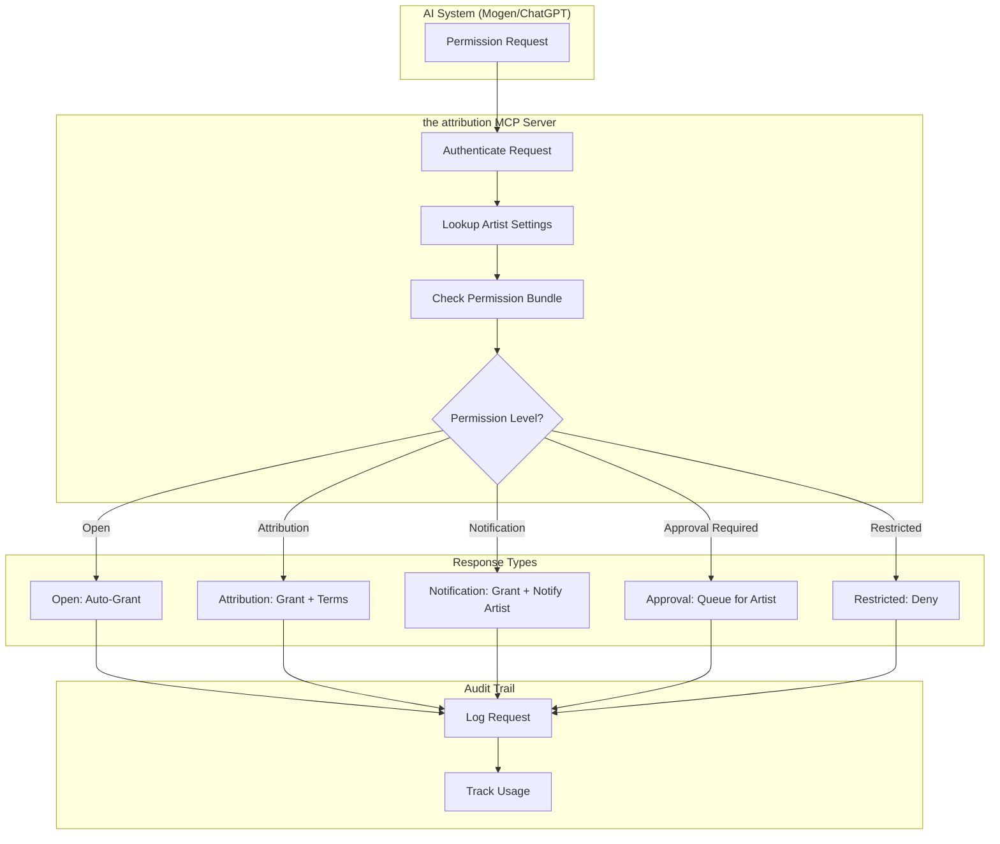
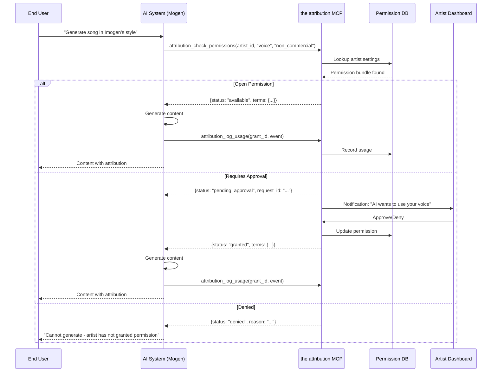
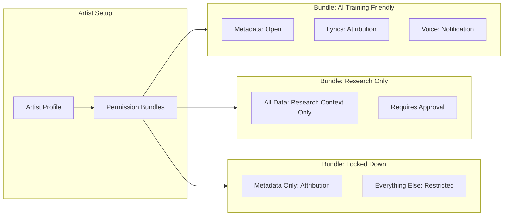
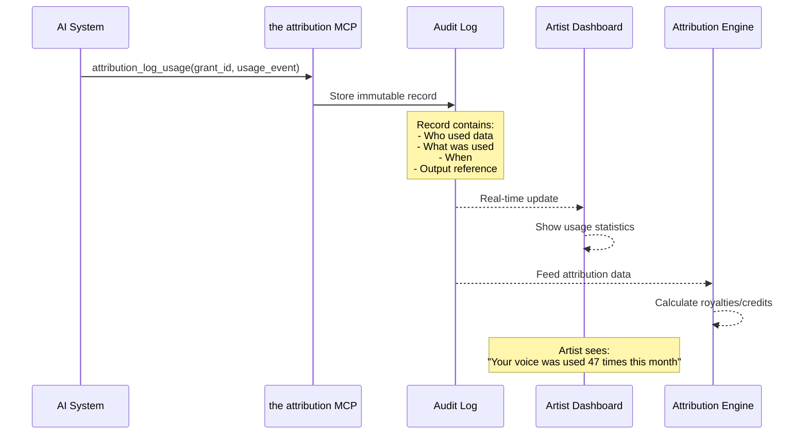

# MCP Permissions API

**Purpose**: Enable AI systems (like ChatGPT/Mogen) to request and receive permission to use artist data.

**Key Requirement from Imogen**: "How Mogen would get permission from the system to access artist data."

---

## For Domain Experts

**What This Does**: When an AI system (like ChatGPT or a voice-cloning service) wants to use your creative data - your voice, likeness, lyrics, or even just your metadata - it must first ask the system for permission. The system checks your settings and either grants permission (with your terms attached), denies it, or queues a request for your approval.

**Why This Matters for Artists**:
- You control how AI uses your creative work
- No more "opt-out after the fact" - permission is required upfront
- Your terms travel with the permission (credit required, non-commercial only, etc.)
- Every usage is logged so you know exactly how your data was used
- You can set "bundles" of permissions to auto-approve common requests

**Real-World Example**:
1. A fan asks an AI: "Generate a song in Imogen Heap's style"
2. The AI queries the system: "Can I use Imogen Heap's voice data for non-commercial use?"
3. The system checks your settings and responds: "Yes, with these terms: credit required, 30-second max"
4. The AI generates content and logs the usage
5. The output includes attribution: "Voice style inspired by Imogen Heap (the-attribution-system/imogen-heap)"
6. You can see a complete log of all such uses in your dashboard

---

## Overview

The Permissions API allows AI systems to:

1. **Discover** what data exists for an artist
2. **Request** permission to use specific data
3. **Receive** permission grants with terms
4. **Track** usage for attribution and compensation

```
┌─────────────────────────────────────────────────────────────────────┐
│                    AI PERMISSION FLOW                                │
├─────────────────────────────────────────────────────────────────────┤
│                                                                     │
│  AI System (Mogen)                  the system                        │
│  ─────────────────                  ────────                        │
│                                                                     │
│  1. "What data exists       →    Artist profile available           │
│      for artist X?"                                                  │
│                                                                     │
│  2. "I want to use         →    Permission request recorded         │
│      voice likeness"                                                 │
│                                                                     │
│  3.                        ←    "Permission granted with terms:     │
│                                   - Credit required                  │
│                                   - Non-commercial only              │
│                                   - Valid until 2027-01-01"          │
│                                                                     │
│  4. AI uses data with       →    Usage logged for attribution       │
│      proper attribution                                              │
│                                                                     │
└─────────────────────────────────────────────────────────────────────┘
```

## MCP Tools

### Tool: `attribution_check_permissions`

Check what permissions exist for an artist.

```json
{
  "name": "attribution_check_permissions",
  "description": "Check available permissions for artist data usage",
  "inputSchema": {
    "type": "object",
    "properties": {
      "artist_id": {
        "type": "string",
        "description": "Artist ID of the artist"
      },
      "data_type": {
        "type": "string",
        "enum": ["voice", "likeness", "lyrics", "compositions", "recordings", "metadata"],
        "description": "Type of data to check permissions for"
      },
      "usage_context": {
        "type": "string",
        "enum": ["commercial", "non_commercial", "educational", "research"],
        "description": "Intended use context"
      }
    },
    "required": ["artist_id"]
  }
}
```

**Response:**

```json
{
  "artist_id": "artist:imogen-heap",
  "artist_name": "Imogen Heap",
  "permissions": [
    {
      "data_type": "voice",
      "status": "available",
      "terms": {
        "commercial": false,
        "non_commercial": true,
        "requires_credit": true,
        "requires_notification": true,
        "expiry": "2027-01-01"
      }
    },
    {
      "data_type": "metadata",
      "status": "open",
      "terms": {
        "commercial": true,
        "requires_credit": true
      }
    }
  ]
}
```

### Tool: `attribution_request_permission`

Request permission to use specific data.

```json
{
  "name": "attribution_request_permission",
  "description": "Request permission to use artist data",
  "inputSchema": {
    "type": "object",
    "properties": {
      "artist_id": {
        "type": "string",
        "description": "Artist ID of the artist"
      },
      "data_type": {
        "type": "string",
        "enum": ["voice", "likeness", "lyrics", "compositions", "recordings", "metadata"]
      },
      "usage_description": {
        "type": "string",
        "description": "How the data will be used"
      },
      "usage_context": {
        "type": "string",
        "enum": ["commercial", "non_commercial", "educational", "research"]
      },
      "requester_id": {
        "type": "string",
        "description": "Identifier of the requesting system/user"
      }
    },
    "required": ["artist_id", "data_type", "usage_description", "usage_context", "requester_id"]
  }
}
```

**Response:**

```json
{
  "request_id": "req_abc123",
  "status": "pending_artist_approval",
  "estimated_response_time": "24-48 hours",
  "alternative_available": {
    "data_type": "metadata",
    "status": "available_now",
    "message": "Metadata is available immediately under open license"
  }
}
```

### Tool: `attribution_log_usage`

Log actual usage for attribution tracking.

```json
{
  "name": "attribution_log_usage",
  "description": "Log usage of artist data for attribution",
  "inputSchema": {
    "type": "object",
    "properties": {
      "permission_grant_id": {
        "type": "string",
        "description": "ID of the permission grant being used"
      },
      "usage_event": {
        "type": "object",
        "properties": {
          "action": {"type": "string"},
          "timestamp": {"type": "string"},
          "context": {"type": "string"},
          "output_reference": {"type": "string"}
        }
      }
    },
    "required": ["permission_grant_id", "usage_event"]
  }
}
```

## Permission Levels

| Level | Description | Auto-Grant? | Example |
|-------|-------------|-------------|---------|
| **Open** | Anyone can use | Yes | Basic metadata |
| **Attribution** | Use with credit | Yes | Discography, credits |
| **Notification** | Use after notifying | Auto with delay | Voice for non-commercial |
| **Approval** | Requires explicit OK | No | Commercial voice use |
| **Restricted** | Generally not available | No | Unreleased material |

## Permission Bundle Templates

Artists can set pre-approved bundles:

```yaml
# Example bundle: "AI Training Friendly"
bundle:
  name: "AI Training Friendly"
  description: "Allow AI training with attribution"

  permissions:
    - data_type: metadata
      commercial: true
      requires_credit: true

    - data_type: lyrics
      commercial: false
      requires_credit: true
      requires_notification: true

    - data_type: voice
      commercial: false
      requires_credit: true
      requires_approval: true
      max_duration_seconds: 30
```

## Integration Example: Mogen Flow

```
1. User asks Mogen: "Generate a song in Imogen Heap's style"

2. Mogen calls the attribution MCP:
   attribution_check_permissions(
     artist_id="artist:imogen-heap",
     data_type="voice",
     usage_context="non_commercial"
   )

3. The system returns:
   {
     "status": "available",
     "terms": {"requires_credit": true, "max_duration": 30}
   }

4. Mogen generates content, then logs:
   attribution_log_usage(
     permission_grant_id="grant_xyz",
     usage_event={"action": "voice_synthesis", ...}
   )

5. Output includes attribution:
   "Voice style inspired by Imogen Heap (the-attribution-system/imogen-heap)"
```

## Error Responses

| Code | Status | Message |
|------|--------|---------|
| 403 | `permission_denied` | "Artist has not granted permission for this use" |
| 404 | `artist_not_found` | "No Artist ID found for this artist" |
| 429 | `rate_limited` | "Too many requests, please slow down" |
| 402 | `payment_required` | "This usage requires licensing agreement" |

## Security Considerations

- All requests authenticated via API key + MCP session
- Rate limiting per requester
- Audit log of all permission checks
- Artist notifications for approval-level requests
- Usage logs immutable for attribution disputes

## Metrics to Track

| Metric | Purpose |
|--------|---------|
| Permission requests per artist | Demand signal |
| Grant rate by permission level | Artist engagement |
| Usage log completeness | Attribution accuracy |
| Time to approval | UX for AI systems |
| Denial reasons | Product feedback |

---

## Mermaid Diagrams

### Permission Check Flow



### Complete Permission Request Sequence



### Permission Bundle Configuration



### Usage Logging and Attribution



---

## Known Unknowns

| Question | Context | Who Should Answer |
|----------|---------|-------------------|
| How do we verify the AI system is actually following granted terms? | AI could claim non-commercial but use commercially | Legal + Engineering |
| What happens when an artist revokes permission mid-use? | Content already generated with prior permission | Legal + Product |
| How do we handle AI systems that do not support MCP? | Older systems, non-compliant actors | Product + Legal |
| Should permission grants be time-limited by default? | Annual renewal vs. perpetual | Product + Artists |
| How do we price commercial permissions? | Flat fee? Per-use? Revenue share? | Business + Artists |
| What is the SLA for approval-level requests? | 24 hours? 7 days? | Product + Artists |
| How do we handle impersonation (AI pretending to be the artist)? | Beyond style/voice - actual identity | Legal + Ethics |
| Should we support "negative permissions" (explicit denials)? | "Never allow X company" | Product + Legal |

---

## Executive Decision Impact

| Technical Choice | Business Impact | Who Decides |
|------------------|-----------------|-------------|
| **MCP as the API standard** | Interoperable with Claude, ChatGPT ecosystem; early mover advantage | Exec + Engineering |
| **Permission bundles vs. per-request** | Artists set once, AI gets fast responses; less granular control | Product + Artists |
| **Immutable usage logs** | Trustworthy attribution evidence; storage costs; legal defensibility | Legal + Engineering |
| **Rate limiting strategy** | Protects infrastructure; may frustrate high-volume AI partners | Engineering + Business |
| **Auto-grant for Open/Attribution levels** | Fast AI experience; artist loses some control | Product + Artists |
| **Notification delay for Notification-level** | Artist awareness vs. AI latency | Product + UX |

### Cost vs. Value Analysis

| Investment | Expected Return |
|------------|-----------------|
| MCP server infrastructure | First-to-market AI consent solution; potential licensing revenue |
| Immutable audit logging | Legal defensibility worth 10x cost in avoided disputes |
| Permission bundle system | 90% of requests auto-resolved; minimal artist burden |
| Real-time artist notifications | Artists feel in control; trust in platform |

### Risk Assessment

| Risk | Mitigation | Owner |
|------|------------|-------|
| AI systems ignore permission requirements | Legal terms; technical enforcement where possible | Legal |
| Permission system too slow for real-time AI | Generous caching; bundle pre-approval | Engineering |
| Artists overwhelmed by approval requests | Smart batching; suggest bundles based on patterns | UX |
| Competitor builds better permission system | First-mover advantage; artist relationships | Business |
| GDPR/privacy conflicts with logging | Privacy-preserving audit design; legal review | Legal |

### Build vs. Buy Decision

| Component | Build | Buy | Recommendation |
|-----------|-------|-----|----------------|
| MCP server framework | Custom | MCP SDK | **Buy** - use Anthropic's SDK |
| Permission database | Custom schema | Off-the-shelf | **Build** - unique requirements |
| Audit logging | Custom | DataDog/Splunk | **Hybrid** - custom schema, managed infra |
| Artist notifications | Custom | SendGrid/Twilio | **Buy** - commodity service |
| Rate limiting | Custom | API Gateway | **Buy** - standard infrastructure |

---

## Related Documents

- [toc-mcp-server.md](toc-mcp-server.md) - Parent TOC
- [identity-permissions/permission-bundles.md](../identity-permissions/permission-bundles.md) - Bundle configuration
- [identity-permissions/artist-id.md](../identity-permissions/artist-id.md) - Artist identity
- [security/multi-tenancy.md](../security/multi-tenancy.md) - Data isolation
