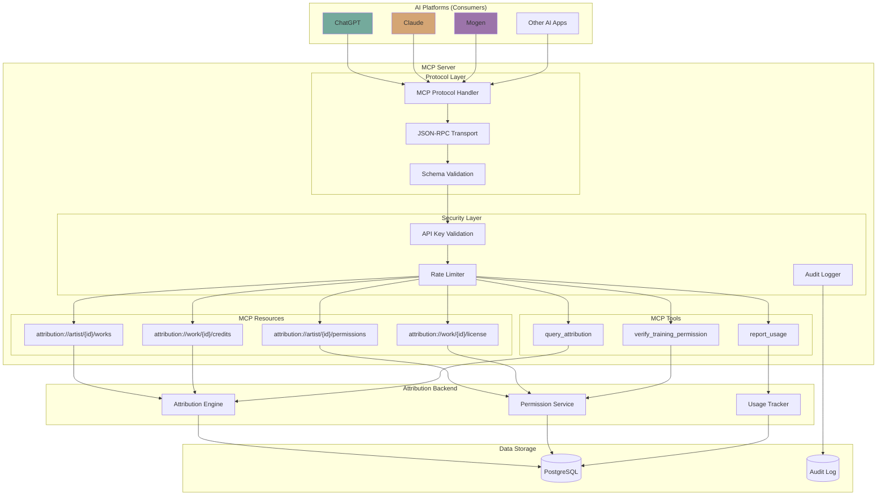
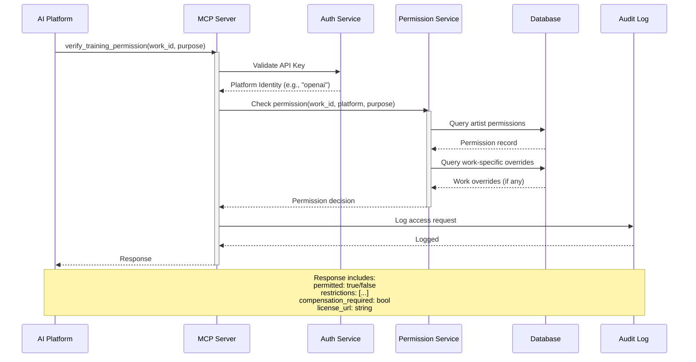
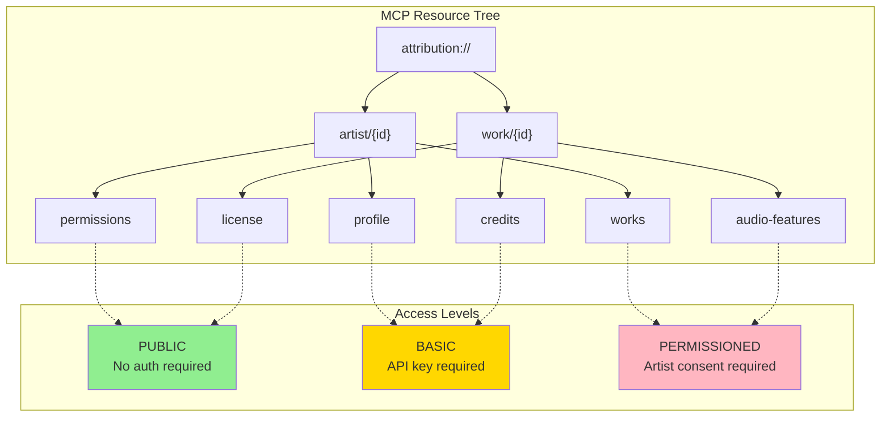

# MCP Server

**Purpose**: AI-native API layer for third-party platform integration via Model Context Protocol

**Key Insight from Imogen**: "MCP ready the system for third-party services. ChatGPT might learn that The system is MCP ready."

---

## System Architecture



### Permission Verification Flow



### MCP Resource Hierarchy



---

## For Domain Experts (Imogen/Andy)

### Why This Matters

The MCP Server is how the system becomes **the source of truth for AI platforms**. When ChatGPT wants to know who produced a track, or whether an artist allows AI training on their music, it asks the system via MCP.

**Business Value:**
- **Industry Standard**: MCP is emerging as the standard for AI-to-service communication. Being MCP-ready means The system is automatically discoverable by AI platforms.
- **Permission Enforcement**: This is the mechanism by which artists' "no AI training" preferences actually get enforced. Without it, permissions are just text on a webpage.
- **Usage Tracking**: Every MCP query is logged. This data becomes the foundation for AI usage compensation (if/when that becomes an industry standard).
- **Competitive Moat**: Being the authoritative, AI-queryable source of attribution data is a significant market position.

### Key Decisions Requiring Your Input

1. **What's Public?**: Should basic attribution (writer, producer) be freely queryable, or should everything require artist consent?

2. **Compensation Signaling**: When we respond "compensation_required: true", what does that mean practically? A placeholder for future negotiation? A link to a licensing portal?

3. **Usage Reporting Trust**: When an AI platform reports "we used this track for X", do we trust that? How do we verify?

4. **Platform Tiers**: Should some AI platforms get preferential treatment (lower rate limits, more data access)? Based on what criteria?

---

## Known Unknowns

> Questions requiring domain expertise or further research before implementation.

| Question | Impact | Suggested Owner |
|----------|--------|-----------------|
| How do we onboard new AI platforms? Self-service API keys or manual approval? | High - business process | Product + Legal |
| What's the response latency SLA for MCP queries? | Medium - infrastructure | Engineering |
| Should we support MCP subscriptions (push notifications) for permission changes? | Medium - protocol design | Engineering |
| How do we handle AI platforms that ignore permission responses? | High - enforcement/legal | Legal |
| What analytics should we expose to artists about MCP queries on their data? | Medium - artist UX | Imogen |
| Should rights organizations be able to set blanket permissions for their artists? | High - business model | Andy (industry) |
| How do we version the MCP schema as the system evolves? | Medium - API stability | Engineering |
| What happens if an AI platform's API key is compromised? | High - security | Engineering + Security |

---

## Overview

The MCP Server exposes attribution data and permissions to AI platforms (ChatGPT, Claude, Mogen) through the Model Context Protocol, enabling artists to control how their data is accessed and used.

## Core Capabilities

| Capability | Description | PRD |
|------------|-------------|-----|
| **MCP Protocol Implementation** | Core MCP server functionality | [mcp-protocol.md](mcp-protocol.md) |
| **Attribution Queries** | Query attribution data via MCP | [attribution-queries.md](attribution-queries.md) |
| **Permission Verification** | Verify AI training permissions | [permission-verification.md](permission-verification.md) |
| **Rate Limiting & Auth** | Secure access control | [auth-rate-limiting.md](auth-rate-limiting.md) |
| **Audit Logging** | Track all data access | [audit-logging.md](audit-logging.md) |

## Architecture

```
┌─────────────────────────────────────────────────────────────────┐
│                        MCP SERVER                                │
├─────────────────────────────────────────────────────────────────┤
│                                                                 │
│  External AI Platforms                                          │
│  ─────────────────────                                          │
│  ┌─────────┐  ┌─────────┐  ┌─────────┐  ┌─────────┐            │
│  │ ChatGPT │  │ Claude  │  │  Mogen  │  │ Others  │            │
│  └────┬────┘  └────┬────┘  └────┬────┘  └────┬────┘            │
│       │            │            │            │                  │
│       └────────────┴─────┬──────┴────────────┘                  │
│                          │                                      │
│                          ▼                                      │
│                   ┌─────────────┐                               │
│                   │  MCP Layer  │                               │
│                   │  (Protocol) │                               │
│                   └──────┬──────┘                               │
│                          │                                      │
│         ┌────────────────┼────────────────┐                     │
│         ▼                ▼                ▼                     │
│  ┌─────────────┐  ┌─────────────┐  ┌─────────────┐             │
│  │ Attribution │  │ Permission  │  │   Audit     │             │
│  │   Queries   │  │ Verification│  │  Logging    │             │
│  └──────┬──────┘  └──────┬──────┘  └──────┬──────┘             │
│         │                │                │                     │
│         └────────────────┴────────────────┘                     │
│                          │                                      │
│                          ▼                                      │
│                   ┌─────────────┐                               │
│                   │ Attribution │                               │
│                   │   Engine    │                               │
│                   └─────────────┘                               │
│                                                                 │
└─────────────────────────────────────────────────────────────────┘
```

## MCP Resources

The system exposes these MCP resources:

| Resource | Description | Access Level |
|----------|-------------|--------------|
| `attribution://artist/{id}/works` | Artist's complete discography | Permissioned |
| `attribution://work/{id}/credits` | Credits for a specific work | Public (basic) / Full (permissioned) |
| `attribution://artist/{id}/permissions` | AI training permissions | Public |
| `attribution://work/{id}/license` | License information | Public |

## MCP Tools

| Tool | Description | Use Case |
|------|-------------|----------|
| `verify_training_permission` | Check if work can be used for AI training | AI platforms pre-training |
| `query_attribution` | Get structured attribution data | Credit verification |
| `report_usage` | Report AI usage of artist's work | Compensation tracking |

## Permission Flow

```
AI Platform requests access to artist's work
    ↓
┌─────────────────────────────────────────────────────────────┐
│ PERMISSION VERIFICATION                                      │
├─────────────────────────────────────────────────────────────┤
│                                                             │
│  1. Verify platform identity (API key)                     │
│  2. Check artist's permission settings                      │
│  3. Verify specific work permissions                        │
│  4. Log access request                                      │
│                                                             │
│  Response:                                                  │
│  {                                                          │
│    "permitted": true/false,                                 │
│    "restrictions": ["no_derivative", "attribution_required"]│
│    "compensation_required": true/false,                     │
│    "license_url": "..."                                     │
│  }                                                          │
│                                                             │
└─────────────────────────────────────────────────────────────┘
```

## Implementation Priority

1. **mcp-protocol.md** - Core MCP implementation
2. **permission-verification.md** - Artist permission checks
3. **attribution-queries.md** - Data access
4. **auth-rate-limiting.md** - Security
5. **audit-logging.md** - Compliance

## Cross-Cutting Dependencies

| Concern | Integration Point |
|---------|-------------------|
| **Attribution Engine** | Data source for queries |
| **Identity/Permissions** | Permission verification |
| **Security** | Auth, rate limiting, audit |
| **Observability** | Request tracking in Langfuse |

## Related Documents

- [vision-v1.md](../vision-v1.md) - Product vision
- [identity-permissions/toc-identity-permissions.md](../identity-permissions/toc-identity-permissions.md) - Permission management
- [security/toc-security.md](../security/toc-security.md) - Security requirements
