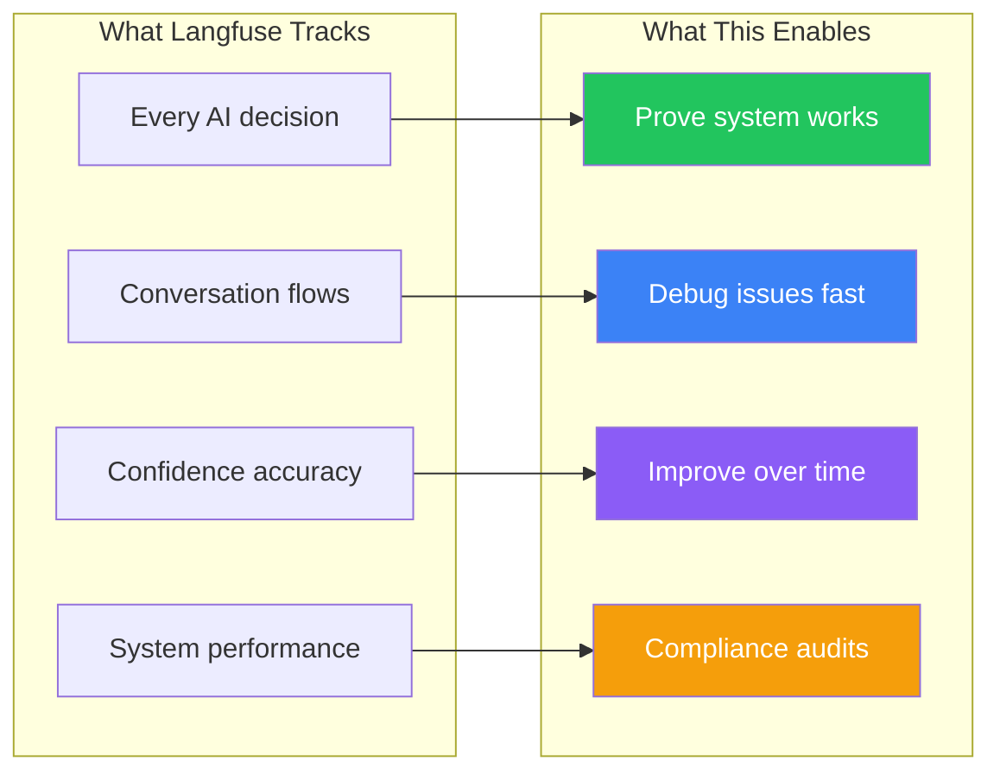
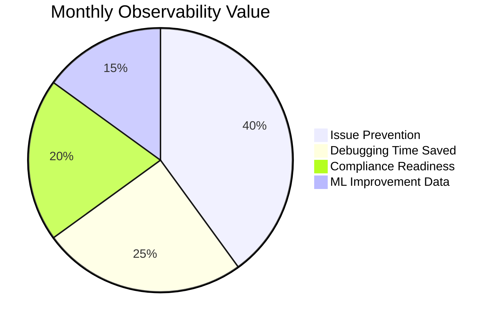
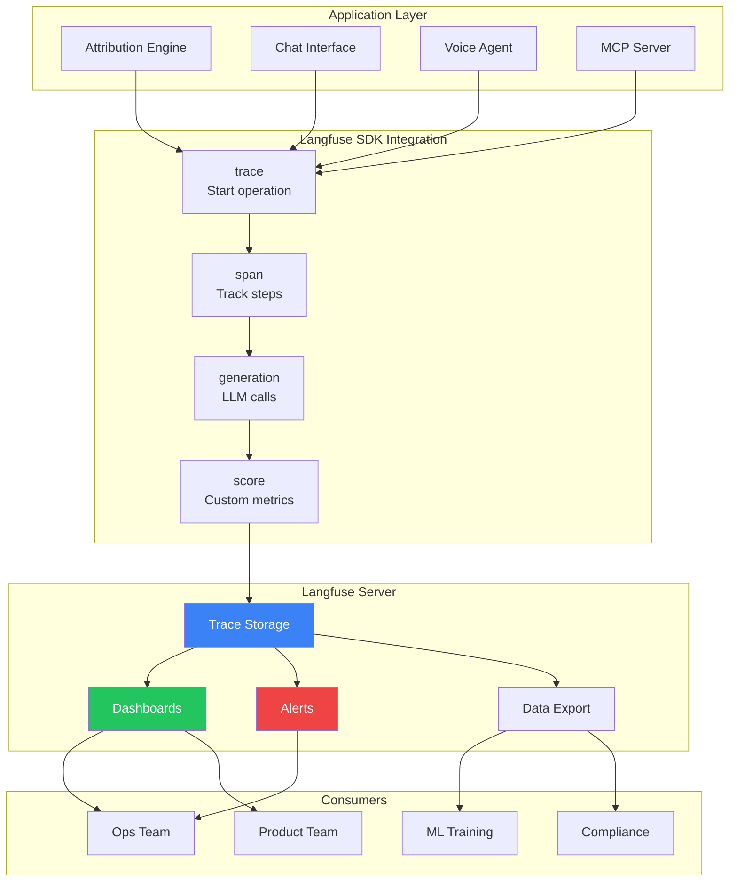
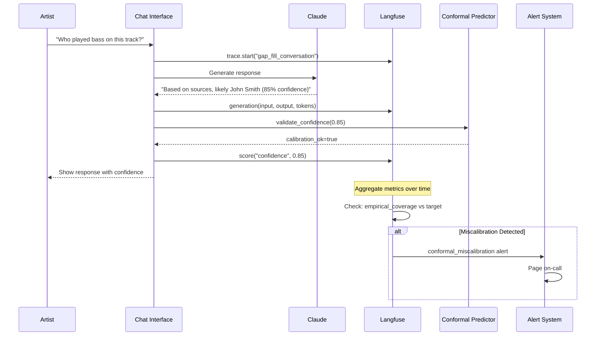

# Langfuse Integration

**Purpose**: Comprehensive LLM observability for attribution quality, conversation tracking, and confidence monitoring.

**Why Langfuse**: Open-source, self-hostable, purpose-built for LLM applications.

---

## For Domain Experts (Imogen/Andy)

### What This Means for You

Langfuse is our "flight recorder" that tracks everything the AI does. Think of it like the black box in an airplane - it records every decision, every conversation turn, and every confidence judgment so we can prove the system works and fix problems fast.

### Why You Should Care



### Key Takeaways

- **Transparency**: We can show exactly what happened with any attribution decision
- **Accountability**: If confidence says 90%, we verify it actually is 90%
- **Improvement**: We learn which gap-filling strategies work best
- **Not surveillance**: We track system performance, not your personal conversations

---

## Known Unknowns

Questions for domain experts that need answers:

| Question | Why It Matters | Who Should Answer |
|----------|----------------|-------------------|
| What metrics do rights orgs need for compliance reporting? | Dashboard design, data retention | Andy |
| Should artists have access to their own analytics? | Feature scoping, privacy | Imogen |
| How long should conversation traces be retained? | Storage costs, privacy compliance | Andy/Legal |
| What constitutes a "successful" gap-fill from user perspective? | Success metric definition | Imogen |
| Should we expose cost-per-query data to enterprise customers? | Pricing transparency | Business/Andy |
| What latency thresholds matter for voice vs chat? | Alert configuration | Imogen |

---

## Executive Decision Impact

### Business Implications

| Decision | If YES | If NO |
|----------|--------|-------|
| **Self-host Langfuse** | Full data control, GDPR friendly | Vendor dependency, but easier setup |
| **Share analytics with customers** | Transparency, trust building | Simpler product, less support burden |
| **Real-time alerting** | Fast problem detection | Lower ops complexity |
| **Long-term trace retention** | Better ML training data | Lower storage costs |

### Resource Requirements

- **Infrastructure**: Langfuse server (self-hosted) or cloud subscription (~$300-500/mo at scale)
- **Engineering**: 1-2 sprints for initial integration, ongoing dashboard development
- **Operations**: Alert monitoring requires on-call rotation
- **Storage**: ~100MB per 10K traces (scales with usage)

### Cost-Benefit Analysis



---

## System Integration Diagram



### Cross-System Data Flow



---

## Overview

Langfuse provides three core capabilities for the system:

| Capability | Application |
|------------|-------------|
| **Tracing** | Track every LLM call through attribution pipeline |
| **Scoring** | Custom metrics for confidence and gap-fill success |
| **Analytics** | Understand what's working, what's not |

## Architecture

```
┌─────────────────────────────────────────────────────────────────────┐
│                    LANGFUSE INTEGRATION                              │
├─────────────────────────────────────────────────────────────────────┤
│                                                                     │
│  Attribution Engine       Chat Interface       Voice Agent          │
│  ───────────────────      ──────────────       ───────────          │
│        │                        │                    │              │
│        ▼                        ▼                    ▼              │
│  ┌──────────────────────────────────────────────────────────┐      │
│  │                    LANGFUSE SDK                            │      │
│  │  • trace() - Start trace                                  │      │
│  │  • span() - Track operations                              │      │
│  │  • generation() - Track LLM calls                         │      │
│  │  • score() - Record metrics                               │      │
│  └──────────────────────────────────────────────────────────┘      │
│                              │                                      │
│                              ▼                                      │
│  ┌──────────────────────────────────────────────────────────┐      │
│  │                   LANGFUSE SERVER                          │      │
│  │  • Trace storage & visualization                          │      │
│  │  • Custom dashboards                                       │      │
│  │  • Alerts & exports                                        │      │
│  └──────────────────────────────────────────────────────────┘      │
│                                                                     │
└─────────────────────────────────────────────────────────────────────┘
```

## Custom Metrics

### Attribution Confidence Score

```python
from langfuse import Langfuse

langfuse = Langfuse()

def track_attribution(
    trace_id: str,
    field: str,
    predicted_value: str,
    confidence: float,
    source_count: int
) -> None:
    """Track attribution prediction with confidence score."""

    langfuse.score(
        trace_id=trace_id,
        name="attribution_confidence",
        value=confidence,
        data_type="NUMERIC",
        comment=f"Field: {field}, Sources: {source_count}"
    )

    # Additional categorical score for confidence tier
    tier = "HIGH" if confidence >= 0.9 else "MEDIUM" if confidence >= 0.7 else "LOW"
    langfuse.score(
        trace_id=trace_id,
        name="confidence_tier",
        value=tier,
        data_type="CATEGORICAL"
    )
```

### Gap-Fill Success Rate

```python
def track_gap_fill(
    trace_id: str,
    gap_type: str,
    action_taken: str,
    success: bool,
    turns_to_fill: int
) -> None:
    """Track gap-filling conversation outcome."""

    langfuse.score(
        trace_id=trace_id,
        name="gap_fill_success",
        value=1 if success else 0,
        data_type="NUMERIC",
        comment=f"Type: {gap_type}, Action: {action_taken}"
    )

    langfuse.score(
        trace_id=trace_id,
        name="turns_to_fill",
        value=turns_to_fill,
        data_type="NUMERIC"
    )
```

### Conformal Calibration Tracking

```python
def track_conformal_calibration(
    trace_id: str,
    predicted_set: set[str],
    true_value: str,
    target_coverage: float
) -> None:
    """Track whether conformal prediction contained true value."""

    in_set = true_value in predicted_set

    langfuse.score(
        trace_id=trace_id,
        name="conformal_coverage",
        value=1 if in_set else 0,
        data_type="NUMERIC",
        comment=f"Set size: {len(predicted_set)}, Target: {target_coverage}"
    )

    langfuse.score(
        trace_id=trace_id,
        name="prediction_set_size",
        value=len(predicted_set),
        data_type="NUMERIC"
    )
```

## Trace Structure

### Attribution Query Trace

```python
def trace_attribution_query(artist_id: str, album_id: str) -> str:
    """Create trace for full attribution query."""

    trace = langfuse.trace(
        name="attribution_query",
        user_id=artist_id,
        metadata={
            "album_id": album_id,
            "query_type": "full_album"
        }
    )

    # Span: Source aggregation
    with trace.span(name="source_aggregation") as span:
        # ... aggregate sources
        span.end(metadata={"sources_found": ["discogs", "musicbrainz"]})

    # Span: Confidence scoring
    with trace.span(name="confidence_scoring") as span:
        # ... compute confidence
        span.end(metadata={"avg_confidence": 0.85})

    # Generation: LLM call for gap analysis
    trace.generation(
        name="gap_analysis_prompt",
        model="claude-3-5-sonnet",
        input={"prompt": "..."},
        output={"response": "..."},
        usage={"prompt_tokens": 500, "completion_tokens": 200}
    )

    return trace.id
```

### Chat Conversation Trace

```python
def trace_chat_conversation(session_id: str, user_id: str) -> str:
    """Create trace for gap-filling conversation."""

    trace = langfuse.trace(
        name="gap_fill_conversation",
        session_id=session_id,
        user_id=user_id,
        metadata={
            "mode": "role_1_data_gathering"
        }
    )

    return trace.id

def track_chat_turn(trace_id: str, turn_number: int, user_message: str, ai_response: str) -> None:
    """Track individual conversation turn."""

    trace = langfuse.trace(id=trace_id)

    trace.generation(
        name=f"turn_{turn_number}",
        model="claude-3-5-sonnet",
        input={"user": user_message},
        output={"assistant": ai_response}
    )
```

## Voice Agent Integration

```python
def trace_voice_session(session_id: str, persona: str) -> str:
    """Create trace for voice agent session."""

    trace = langfuse.trace(
        name="voice_session",
        session_id=session_id,
        metadata={
            "persona": persona,
            "pipeline": "vapi"  # or "pipecat"
        }
    )

    return trace.id

def track_voice_turn(
    trace_id: str,
    turn_number: int,
    stt_result: str,
    llm_response: str,
    tts_latency_ms: float
) -> None:
    """Track voice conversation turn with latency."""

    trace = langfuse.trace(id=trace_id)

    # Track TTS latency
    langfuse.score(
        trace_id=trace_id,
        name="tts_latency_ms",
        value=tts_latency_ms,
        data_type="NUMERIC"
    )

    # Track turn
    trace.generation(
        name=f"voice_turn_{turn_number}",
        input={"transcript": stt_result},
        output={"response": llm_response}
    )
```

## Dashboards

### Attribution Quality Dashboard

| Panel | Metric | Alert Threshold |
|-------|--------|-----------------|
| Avg Confidence | Mean confidence across all fields | <0.7 |
| High Confidence % | % of fields at 90%+ | <60% |
| Conformal Coverage | Empirical coverage vs target | Outside 87-93% |
| Single Source % | Fields relying on one source | >30% |

### Gap-Filling Dashboard

| Panel | Metric | Alert Threshold |
|-------|--------|-----------------|
| Fill Rate | % of gaps successfully filled | <50% |
| Turns per Fill | Average conversation length | >5 |
| Success by Gap Type | Breakdown of fill rates | Any type <30% |
| User Satisfaction | Based on conversation signals | <3.5/5 |

### Cost Dashboard

| Panel | Metric | Alert Threshold |
|-------|--------|-----------------|
| Tokens per Query | Avg token usage | >2000 |
| Cost per Gap Fill | $ to fill one gap | >$0.10 |
| Daily Spend | Total LLM cost | Budget exceeded |

## Alerts

```yaml
alerts:
  - name: confidence_drop
    metric: attribution_confidence
    condition: avg < 0.7
    window: 1h
    action: slack_notify

  - name: conformal_miscalibration
    metric: conformal_coverage
    condition: abs(avg - 0.9) > 0.05
    window: 24h
    action: page_oncall

  - name: cost_spike
    metric: llm_cost
    condition: sum > daily_budget * 1.2
    window: 24h
    action: slack_notify
```

## Integration Code

```python
# langfuse_integration.py
from langfuse import Langfuse
from contextlib import contextmanager

langfuse = Langfuse(
    public_key=os.getenv("LANGFUSE_PUBLIC_KEY"),
    secret_key=os.getenv("LANGFUSE_SECRET_KEY"),
    host=os.getenv("LANGFUSE_HOST", "https://cloud.langfuse.com")
)


@contextmanager
def trace_operation(name: str, **metadata):
    """Context manager for tracing operations."""
    trace = langfuse.trace(name=name, metadata=metadata)
    try:
        yield trace
    finally:
        trace.end()


# Usage
with trace_operation("attribution_query", artist_id="...") as trace:
    result = attribution_engine.query(...)
    trace.score("confidence", result.confidence)
```

## Related Documents

- [toc-observability.md](toc-observability.md) - Parent TOC
- [attribution-engine/confidence-scoring.md](../attribution-engine/confidence-scoring.md) - What we're tracking
- [uncertainty/conformal-prediction.md](../uncertainty/conformal-prediction.md) - Calibration monitoring
- [voice-agent/toc-voice-agent.md](../voice-agent/toc-voice-agent.md) - Voice-specific metrics
