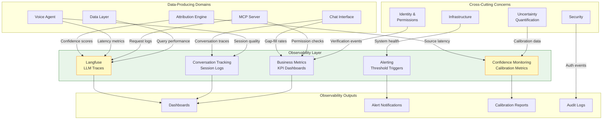
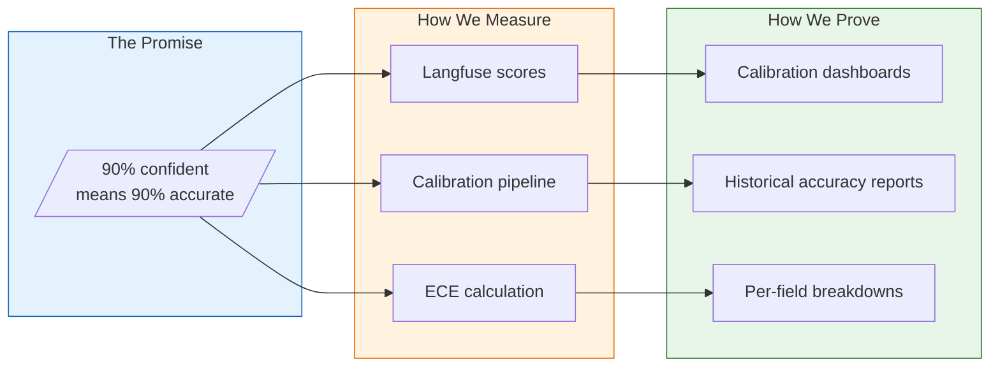
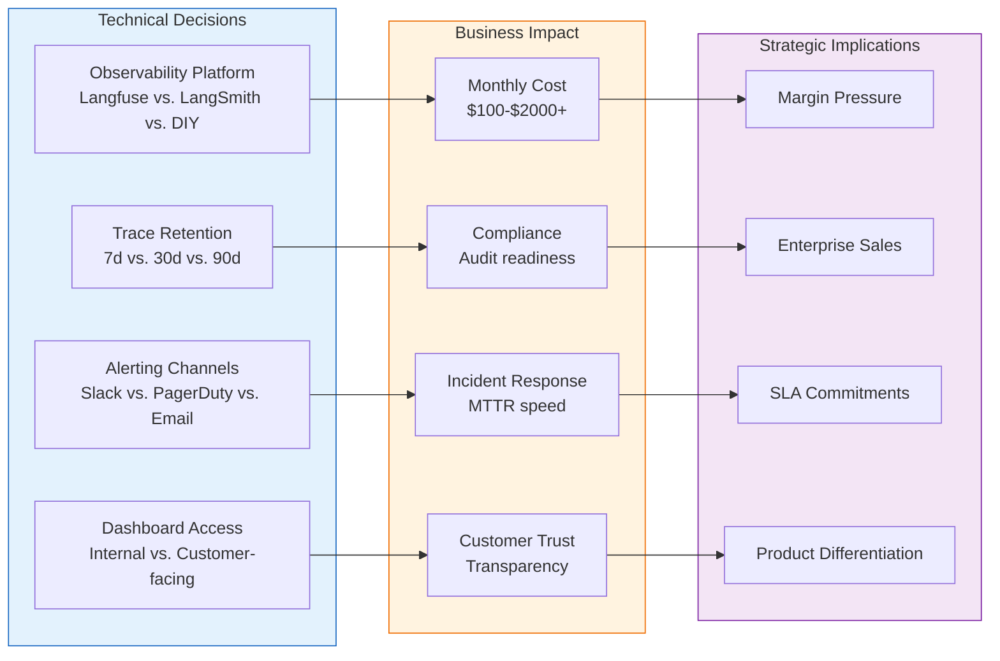

# Observability

**Purpose**: Comprehensive monitoring of LLM interactions, confidence calibration, and system health

**Primary Tool**: Langfuse for LLM observability

**Cross-Cutting**: This domain provides monitoring for all other domains

---

## Overview

Observability in the system focuses on:
1. **LLM Interactions**: Track chat/voice conversations, prompts, responses
2. **Confidence Calibration**: Verify "90% confident" actually means 90% accurate
3. **System Health**: Standard application monitoring
4. **Business Metrics**: Gap-fill rates, artist engagement, MCP usage

## Core Capabilities

| Capability | Description | PRD |
|------------|-------------|-----|
| **Langfuse Integration** | Core LLM observability | [langfuse.md](langfuse.md) |
| **Confidence Monitoring** | Track calibration metrics | [confidence-monitoring.md](confidence-monitoring.md) |
| **Conversation Tracking** | Chat and voice session logs | [conversation-tracking.md](conversation-tracking.md) |
| **Business Metrics** | KPIs and dashboards | [business-metrics.md](business-metrics.md) |
| **Alerting** | Threshold-based alerts | [alerting.md](alerting.md) |

## Architecture

```
┌─────────────────────────────────────────────────────────────────┐
│                      OBSERVABILITY                               │
├─────────────────────────────────────────────────────────────────┤
│                                                                 │
│  Data Sources                    Langfuse                       │
│  ────────────                    ────────                       │
│                                                                 │
│  ┌─────────────┐                 ┌─────────────────────────┐   │
│  │    Chat     │────traces──────►│                         │   │
│  │  Interface  │                 │      Langfuse           │   │
│  └─────────────┘                 │                         │   │
│                                  │  • Traces               │   │
│  ┌─────────────┐                 │  • Spans                │   │
│  │   Voice     │────traces──────►│  • Scores               │   │
│  │   Agent     │                 │  • Sessions             │   │
│  └─────────────┘                 │                         │   │
│                                  │  Custom Scores:         │   │
│  ┌─────────────┐                 │  • confidence_calibration│  │
│  │ Attribution │────scores──────►│  • gap_fill_rate        │   │
│  │   Engine    │                 │  • source_agreement     │   │
│  └─────────────┘                 │                         │   │
│                                  └───────────┬─────────────┘   │
│  ┌─────────────┐                             │                  │
│  │    MCP      │────metrics─────►            │                  │
│  │   Server    │                             │                  │
│  └─────────────┘                             ▼                  │
│                                  ┌─────────────────────────┐   │
│                                  │      Dashboards         │   │
│                                  │  • Calibration          │   │
│                                  │  • Conversation Quality │   │
│                                  │  • System Health        │   │
│                                  └─────────────────────────┘   │
│                                                                 │
└─────────────────────────────────────────────────────────────────┘
```

## Key Metrics

### Confidence Calibration (Critical)

Per Imogen's "90-100% confident" requirement:

| Metric | Target | Description |
|--------|--------|-------------|
| `coverage_at_90` | ≥90% | % of HIGH confidence fields confirmed correct |
| `expected_calibration_error` | <0.05 | Difference between predicted and actual accuracy |
| `auto_fill_rate` | >60% | % of fields auto-filled (HIGH confidence) |
| `gap_rate` | <20% | % of fields with NO_DATA |

### Conversation Quality

| Metric | Target | Description |
|--------|--------|-------------|
| `gap_fill_success_rate` | >70% | % of prompted gaps successfully filled |
| `conversation_length` | <5 turns | Average turns to fill a gap |
| `abandonment_rate` | <15% | % of conversations abandoned mid-gap |

### System Health

| Metric | Target | Description |
|--------|--------|-------------|
| `source_api_latency` | <2s | p95 latency for external source APIs |
| `aggregation_latency` | <5s | p95 time to aggregate all sources |
| `mcp_request_latency` | <500ms | p95 MCP response time |

## Langfuse Integration

```python
from langfuse import Langfuse
from langfuse.decorators import observe, langfuse_context

langfuse = Langfuse()

@observe(as_type="generation")
async def generate_gap_prompt(field: str, sources: list[str]) -> str:
    """Generate a chat prompt for gap-filling."""
    # LLM call is automatically traced
    ...

# Custom confidence score
langfuse_context.score_current_trace(
    name="confidence_calibration",
    value=0.92,
    comment="Expected: 0.90, Actual: 0.92"
)
```

## Implementation Priority

1. **langfuse.md** - Core integration
2. **confidence-monitoring.md** - Calibration tracking (critical for "90%" claim)
3. **conversation-tracking.md** - Chat/voice session logs
4. **business-metrics.md** - KPI dashboards
5. **alerting.md** - Threshold alerts

## Cross-Cutting Dependencies

Every domain integrates with observability:

| Domain | Observability Integration |
|--------|---------------------------|
| Attribution Engine | Confidence scores, source latency |
| Chat Interface | Conversation traces, gap-fill rates |
| Voice Agent | Session quality, latency |
| MCP Server | Request logs, permission checks |
| Data Layer | Query performance |

## Related Documents

- [uncertainty/conformal-prediction.md](../uncertainty/conformal-prediction.md) - What we're monitoring
- [attribution-engine/confidence-scoring.md](../attribution-engine/confidence-scoring.md) - Confidence metrics source
- [defaults.yaml](../defaults.yaml) - Langfuse configuration

---

## Cross-Domain Impact Diagram

Observability is the nervous system of the system - every domain emits telemetry, and observability provides the feedback loop.



### Domain-by-Domain Telemetry

| Domain | Metrics Emitted | Why It Matters |
|--------|-----------------|----------------|
| **Attribution Engine** | Confidence scores, source latency, aggregation time | Core product quality - is the data accurate? |
| **Chat Interface** | Conversation length, gap-fill success, abandonment | User engagement - are artists completing profiles? |
| **Voice Agent** | Latency, session duration, transcription quality | UX quality - is voice natural and responsive? |
| **MCP Server** | Request volume, permission check results, latency | API adoption - are AI platforms using us? |
| **Data Layer** | Query latency, connection pool usage, error rates | System health - is the database performing? |
| **Uncertainty** | ECE, calibration drift, coverage metrics | Trust metric - does "90% confident" mean 90%? |
| **Security** | Auth failures, suspicious patterns, audit events | Security posture - are we protected? |
| **Infrastructure** | CPU, memory, request counts, error rates | Operational health - is the system up? |

---

## For Domain Experts (Imogen/Andy)

### Business Impact Summary

**Why This Matters for Artist Relations (Imogen):**
- Observability is how we prove the "90% confident" claim is real, not marketing
- Gap-fill metrics show which parts of the artist experience need improvement
- Conversation tracking identifies where artists struggle or abandon the process
- Business metrics dashboards can show artist engagement and data completeness

**Why This Matters for Strategy (Andy):**
- Calibration reports are audit-ready proof of accuracy for enterprise deals
- MCP usage metrics demonstrate AI platform adoption for investor conversations
- Alerting catches problems before they become customer complaints
- Business dashboards provide the KPIs needed for board reporting

### Key Business Metrics

| Metric | What It Tells Us | Target |
|--------|------------------|--------|
| **coverage_at_90** | Are HIGH confidence fields actually 90%+ accurate? | >= 90% |
| **gap_fill_success_rate** | Are artists successfully completing their profiles? | >= 70% |
| **mcp_daily_requests** | How much are AI platforms using our data? | Growth metric |
| **artist_onboarding_completion** | What % of artists complete verification? | >= 80% |
| **abandonment_rate** | Where do artists give up? | < 15% |

### The "90% Confidence" Promise

Imogen's requirement that the system only auto-fills data when "90-100% confident" is enforced through observability:



---

## Known Unknowns

These are identified gaps requiring research or executive decisions:

| Unknown | Impact | Research Needed |
|---------|--------|-----------------|
| **Langfuse cost at scale** | Per-trace pricing may become significant at high volume | Model costs at 10K, 100K, 1M daily traces |
| **PII in traces** | Conversation content may contain sensitive data | Data retention and anonymization policies |
| **Real-time vs. batch calibration** | How often must we recalculate ECE? | Performance vs. accuracy trade-off analysis |
| **Alert fatigue thresholds** | Too many alerts = ignored alerts | Establish baseline, tune over time |
| **Cross-tenant metrics** | Can we aggregate metrics without revealing per-tenant data? | Privacy-preserving aggregation methods |
| **Calibration ground truth** | Need artist confirmations to calculate accuracy | Incentive design for artist feedback |

---

## Executive Decision Impact

Observability choices affect what we can measure, prove, and promise.



### Decision Matrix

| Technical Choice | Options | Business Trade-off |
|------------------|---------|-------------------|
| **Observability platform** | Langfuse, LangSmith, Helicone, DIY | Cost vs. features vs. integration effort |
| **Trace retention** | 7/30/90 days | Storage cost vs. historical analysis depth |
| **Calibration frequency** | Real-time / hourly / daily | Compute cost vs. accuracy freshness |
| **Dashboard scope** | Internal only / customer-facing | Development effort vs. customer trust |
| **Alert severity levels** | 2-tier / 3-tier / custom | Simplicity vs. nuanced response |

### Recommendations for Executive Review

1. **Langfuse for MVP** - best LLM observability features, reasonable cost, can migrate later if needed
2. **30-day trace retention** - balances cost with ability to investigate issues and prove calibration
3. **Daily calibration recalculation** - hourly is overkill, weekly misses drift
4. **Customer-facing accuracy dashboard** (Phase 2) - major trust differentiator, shows confidence in our own claims
5. **Slack + email alerts initially** - PagerDuty when we have 24/7 on-call
