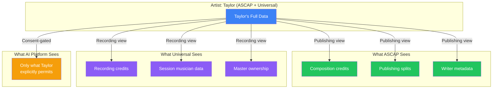
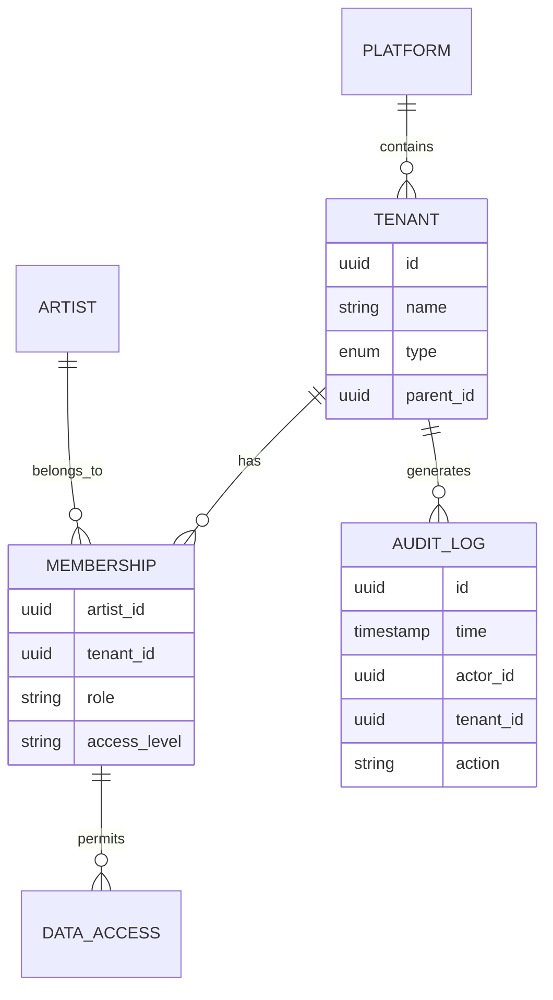
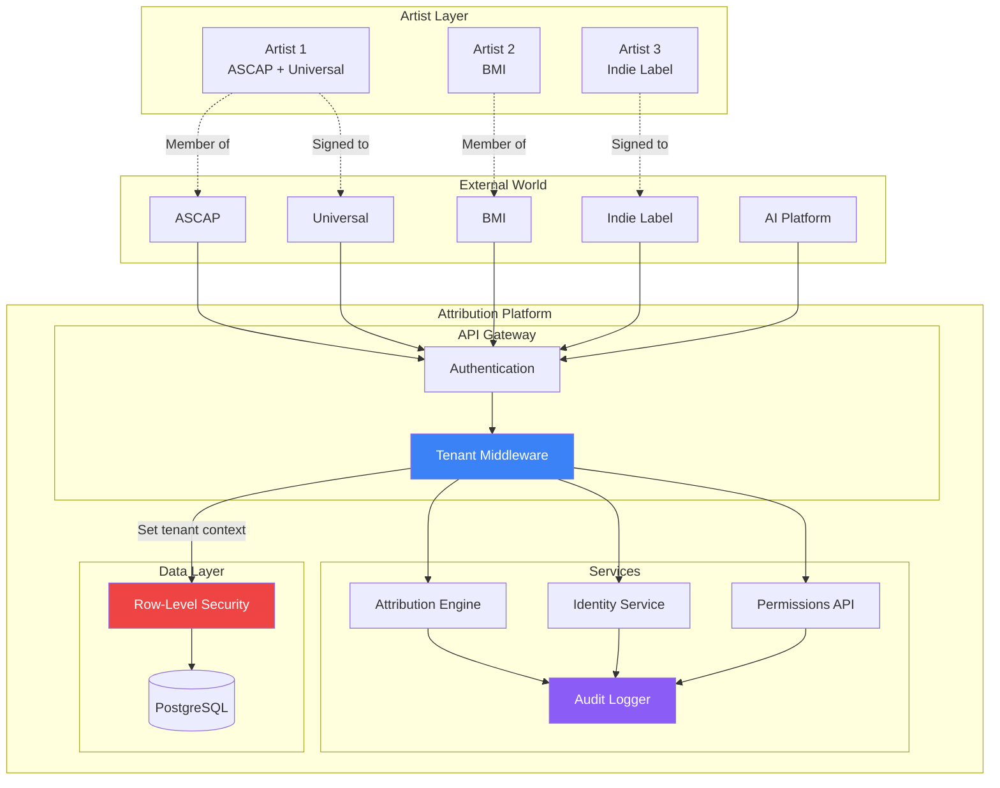
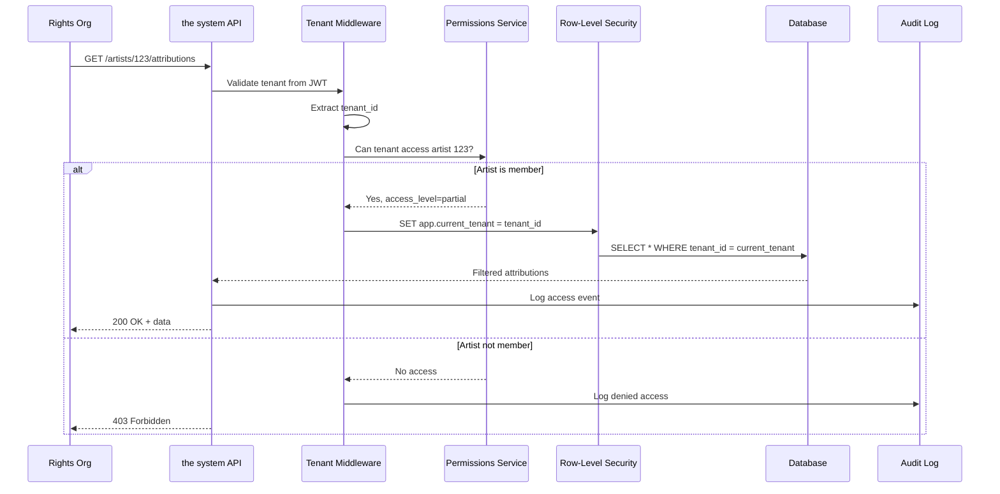

# Multi-Tenancy

**Purpose**: Secure data isolation for different organizations (rights orgs, labels, publishers) using the system platform.

**Confirmed Requirement**: Multi-tenant architecture planned for rights organizations and record labels.

---

## For Domain Experts (Imogen/Andy)

### What This Means for You

Multi-tenancy ensures that when different organizations (ASCAP, BMI, Universal, indie labels) use the system, their data is **completely isolated**. Your label cannot see another label's artists. Your PRO cannot access data from artists in a different PRO. This is not optional - it is fundamental to how the system works.

### How Data Flows Between Organizations



### Key Takeaways

- **Your organization only sees its members** - No peeking at competitors' data
- **Artists control their memberships** - They approve which orgs can access their data
- **Audit everything** - Every data access is logged and traceable
- **Non-exclusive by design** - Artists can belong to multiple organizations simultaneously

---

## Known Unknowns

Questions for domain experts that need answers:

| Question | Why It Matters | Who Should Answer |
|----------|----------------|-------------------|
| How do we verify organization legitimacy during onboarding? | Prevent fraudulent tenant creation | Andy/Legal |
| What happens when an artist disputes data an org has edited? | Conflict resolution process | Andy |
| Should orgs see aggregate (anonymized) industry benchmarks? | Feature scoping, competitive concerns | Business/Andy |
| How do we handle org mergers (e.g., label acquisition)? | Data migration policy | Andy/Legal |
| Can artists delegate data access approval to managers/admins? | Workflow efficiency vs. security | Imogen |
| What's the data retention policy when an artist leaves an org? | Compliance, legal requirements | Andy/Legal |
| Should there be different tenant tiers (basic vs. enterprise)? | Business model, feature gating | Business |

---

## Executive Decision Impact

### Business Implications

| Decision | If YES | If NO |
|----------|--------|-------|
| **Strict data isolation (RLS)** | Maximum security, compliance ready | Simpler architecture, but risk of data leaks |
| **Org admin can edit member data** | Faster corrections, less artist burden | Artists maintain full control |
| **Cross-org anonymized analytics** | Industry insights feature | Simpler, no privacy concerns |
| **Tenant hierarchy (sub-labels)** | Enterprise flexibility | Simpler tenant model |

### Resource Requirements

- **Engineering**: 3-4 sprints for core multi-tenancy, ongoing maintenance
- **Database**: PostgreSQL with RLS adds ~5-10% query overhead
- **Operations**: Tenant onboarding process requires manual verification
- **Compliance**: Audit log storage grows linearly with tenant count

### Tenant Relationships



---

## System Integration Diagram



### Permission Check Flow



---

## Overview

The system serves multiple organization types with different data access needs:

| Tenant Type | Data Access | Example |
|-------------|-------------|---------|
| **Rights Org** | Members' attribution data | ASCAP, BMI, PRS |
| **Label** | Signed artists' data | Universal, Indie labels |
| **Publisher** | Writers' catalog data | Sony/ATV, Kobalt |
| **Artist** | Own data only | Individual creators |
| **AI Platform** | Permitted data only | ChatGPT, Mogen |

## Isolation Model

### Row-Level Security (PostgreSQL)

```sql
-- Tenant isolation via RLS
CREATE POLICY tenant_isolation ON attributions
    USING (tenant_id = current_setting('app.current_tenant')::uuid);

-- Enable RLS
ALTER TABLE attributions ENABLE ROW LEVEL SECURITY;
```

### Tenant Hierarchy

```
┌─────────────────────────────────────────────────────────────────────┐
│                    TENANT HIERARCHY                                  │
├─────────────────────────────────────────────────────────────────────┤
│                                                                     │
│  Platform Level (the system)                                         │
│  ─────────────────────────                                         │
│  • System admins                                                    │
│  • Cross-tenant analytics (anonymized)                              │
│                                                                     │
│  Organization Level                                                │
│  ──────────────────                                                │
│  ┌─────────────┐  ┌─────────────┐  ┌─────────────┐                │
│  │   ASCAP     │  │  Universal  │  │   Kobalt    │                │
│  │  (PRO)      │  │  (Label)    │  │ (Publisher) │                │
│  └──────┬──────┘  └──────┬──────┘  └──────┬──────┘                │
│         │                │                │                        │
│  Artist Level                                                      │
│  ─────────────                                                     │
│  ┌───┴───┐      ┌───┴───┐       ┌───┴───┐                        │
│  │Artist1│      │Artist2│       │Writer1│                        │
│  │Artist2│      │Artist3│       │Writer2│                        │
│  └───────┘      └───────┘       └───────┘                        │
│                                                                     │
│  Note: Artist2 appears in both ASCAP and Universal                │
│        (membership is not exclusive)                               │
│                                                                     │
└─────────────────────────────────────────────────────────────────────┘
```

## Data Model

```python
from dataclasses import dataclass
from enum import Enum
from uuid import UUID

class TenantType(Enum):
    PLATFORM = "platform"
    RIGHTS_ORG = "rights_org"
    LABEL = "label"
    PUBLISHER = "publisher"
    ARTIST = "artist"
    AI_PLATFORM = "ai_platform"


@dataclass
class Tenant:
    """Organization tenant."""
    id: UUID
    name: str
    type: TenantType
    parent_id: UUID | None  # For hierarchical orgs

    # Permissions
    can_view_members: bool  # See member artist data
    can_edit_members: bool  # Edit member artist data
    can_invite_members: bool  # Add new artists
    can_export_data: bool  # Bulk data export


@dataclass
class TenantMembership:
    """Artist membership in a tenant."""
    artist_id: UUID  # ArtistID
    tenant_id: UUID
    role: str  # "member", "admin", etc.
    data_access_level: str  # "full", "partial", "metadata_only"
    granted_by: UUID  # Who added this membership
    granted_at: str  # ISO timestamp
```

## Access Control Matrix

| Actor | Own Data | Org Member Data | Public Data | Audit Logs |
|-------|----------|-----------------|-------------|------------|
| Artist | Full | - | Read | Own only |
| Org Admin | - | Full | Read | Org only |
| Org Member | - | Read | Read | - |
| AI Platform | Permitted | Permitted | Read | - |
| Platform Admin | Read | Read | Read | All |

## Implementation

### Middleware for Tenant Context

```python
from fastapi import Request, HTTPException
from contextvars import ContextVar

current_tenant: ContextVar[UUID] = ContextVar("current_tenant")


async def tenant_middleware(request: Request, call_next):
    """Extract and validate tenant from request."""

    # Get tenant from JWT or header
    tenant_id = extract_tenant_from_request(request)

    if not tenant_id:
        raise HTTPException(status_code=401, detail="Tenant not identified")

    # Validate tenant exists and user has access
    tenant = await get_tenant(tenant_id)
    if not tenant or not user_can_access_tenant(request.user, tenant):
        raise HTTPException(status_code=403, detail="Access denied")

    # Set context for RLS
    current_tenant.set(tenant_id)
    await set_postgres_tenant(tenant_id)

    response = await call_next(request)
    return response


async def set_postgres_tenant(tenant_id: UUID) -> None:
    """Set PostgreSQL session variable for RLS."""
    async with get_db_session() as session:
        await session.execute(
            f"SET app.current_tenant = '{tenant_id}'"
        )
```

### Cross-Tenant Data Sharing

When artists are members of multiple organizations:

```python
async def get_artist_data_for_tenant(
    artist_id: UUID,
    tenant_id: UUID
) -> dict:
    """Get artist data scoped to tenant permissions."""

    # Check membership
    membership = await get_membership(artist_id, tenant_id)
    if not membership:
        raise HTTPException(403, "Artist not in this organization")

    # Get data at permitted access level
    if membership.data_access_level == "full":
        return await get_full_artist_data(artist_id)
    elif membership.data_access_level == "partial":
        return await get_partial_artist_data(artist_id)
    else:
        return await get_metadata_only(artist_id)
```

## Tenant Onboarding Flow

```
1. Organization applies for tenant account
   ↓
2. The system validates organization (manual review)
   ↓
3. Tenant created with appropriate type and permissions
   ↓
4. Org admin receives credentials
   ↓
5. Org admin invites member artists
   ↓
6. Artists approve membership (consent required)
   ↓
7. Data access begins with audit logging
```

## Audit Requirements

All cross-tenant operations logged:

```python
@dataclass
class AuditEvent:
    """Audit log entry for data access."""
    id: UUID
    timestamp: str  # ISO
    actor_id: UUID  # Who did it
    actor_tenant: UUID  # Their organization
    action: str  # "view", "edit", "export", "share"
    resource_type: str  # "artist", "attribution", etc.
    resource_id: UUID
    resource_owner: UUID  # Artist who owns the data
    metadata: dict  # Additional context
```

## Security Boundaries

### What Tenants CAN See

- Their own organization's member data (at permitted level)
- Public/open attribution data
- Aggregate statistics (anonymized)

### What Tenants CANNOT See

- Other organizations' private data
- Non-member artist data
- Other tenants' audit logs
- Platform-wide raw data

### Special Cases

| Scenario | Handling |
|----------|----------|
| Artist in multiple orgs | Each org sees their permitted view |
| Artist leaves org | Access immediately revoked, data retained |
| Org disputes artist data | Flagged for platform review |
| Data correction request | Routed to artist for approval |

## API Considerations

### Tenant-Scoped Endpoints

```python
# All endpoints automatically scoped by middleware
@app.get("/api/v1/artists")
async def list_artists():
    """Returns only artists in current tenant."""
    tenant_id = current_tenant.get()
    return await get_tenant_artists(tenant_id)


# Explicit cross-tenant (requires special permission)
@app.get("/api/v1/public/artists/{artist_id}")
async def get_public_artist(artist_id: UUID):
    """Returns only public/open data for any artist."""
    return await get_public_artist_data(artist_id)
```

### MCP Integration

MCP tools automatically respect tenant boundaries:

```python
# In attribution_check_permissions tool
async def check_permissions(artist_id: str, requester_tenant: UUID) -> dict:
    """Check what permissions requester has for artist."""

    # Verify requester tenant can access this artist
    if not await can_access_artist(requester_tenant, artist_id):
        return {"status": "no_access", "reason": "Artist not in your organization"}

    # Return permissions scoped to tenant access level
    return await get_tenant_scoped_permissions(artist_id, requester_tenant)
```

## Metrics

| Metric | Purpose |
|--------|---------|
| Cross-tenant access attempts | Security monitoring |
| Membership changes | Org health |
| Data access patterns | Usage analytics |
| Audit log volume | Compliance tracking |

## Related Documents

- [toc-security.md](toc-security.md) - Parent TOC
- [identity-permissions/artist-id.md](../identity-permissions/artist-id.md) - Artist identity
- [mcp-server/permissions-api.md](../mcp-server/permissions-api.md) - Permission checking
- [data-layer/toc-data-layer.md](../data-layer/toc-data-layer.md) - Data storage
