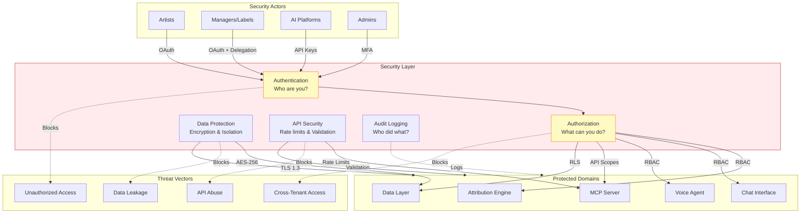
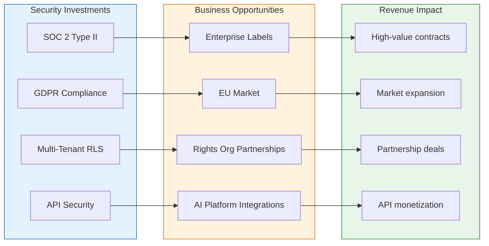
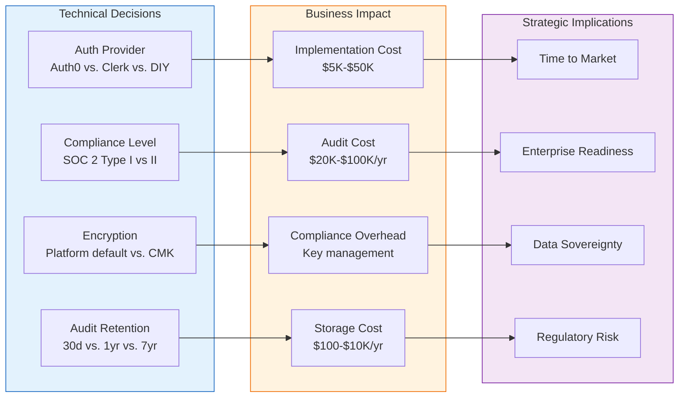

# Security

**Purpose**: Secure authentication, authorization, and data protection across the platform

**Key Requirements**: Artist data protection, multi-tenant isolation, API security

---

## Overview

Security in the system covers:
1. **Authentication**: Verify user/platform identity
2. **Authorization**: Control access to resources
3. **Data Protection**: Encryption, isolation, audit
4. **API Security**: MCP and external API protection

## Core Capabilities

| Capability | Description | PRD |
|------------|-------------|-----|
| **Authentication** | User and API authentication | [authentication.md](authentication.md) |
| **Authorization** | Role-based and attribute-based access | [authorization.md](authorization.md) |
| **Data Protection** | Encryption at rest and in transit | [data-protection.md](data-protection.md) |
| **API Security** | Rate limiting, input validation | [api-security.md](api-security.md) |
| **Audit Logging** | Security event tracking | [audit-logging.md](audit-logging.md) |

## Architecture

```
┌─────────────────────────────────────────────────────────────────┐
│                        SECURITY                                  │
├─────────────────────────────────────────────────────────────────┤
│                                                                 │
│  ┌─────────────────────────────────────────────────────────┐   │
│  │                   Authentication                         │   │
│  │  ┌─────────────┐  ┌─────────────┐  ┌─────────────┐     │   │
│  │  │    User     │  │    API      │  │   Service   │     │   │
│  │  │   (OAuth)   │  │   (Keys)    │  │  (mTLS)     │     │   │
│  │  └─────────────┘  └─────────────┘  └─────────────┘     │   │
│  └─────────────────────────────────────────────────────────┘   │
│                              │                                  │
│                              ▼                                  │
│  ┌─────────────────────────────────────────────────────────┐   │
│  │                   Authorization                          │   │
│  │                                                         │   │
│  │  ┌─────────────┐  ┌─────────────┐  ┌─────────────┐     │   │
│  │  │    RBAC     │  │    ABAC     │  │ Row-Level   │     │   │
│  │  │   (Roles)   │  │ (Attributes)│  │  Security   │     │   │
│  │  └─────────────┘  └─────────────┘  └─────────────┘     │   │
│  │                                                         │   │
│  │  Roles: artist, manager, rights_org, ai_platform, admin │   │
│  └─────────────────────────────────────────────────────────┘   │
│                              │                                  │
│                              ▼                                  │
│  ┌─────────────────────────────────────────────────────────┐   │
│  │                  Data Protection                         │   │
│  │  • TLS 1.3 in transit                                   │   │
│  │  • AES-256 at rest (Neon default)                       │   │
│  │  • Multi-tenant RLS isolation                           │   │
│  │  • Audit logging for all access                         │   │
│  └─────────────────────────────────────────────────────────┘   │
│                                                                 │
└─────────────────────────────────────────────────────────────────┘
```

## Access Control Model

### Roles

| Role | Description | Permissions |
|------|-------------|-------------|
| `artist` | Individual artist | Own data: read/write |
| `manager` | Artist manager | Delegated artist data: read/write |
| `rights_org` | Rights organization | Tenant data: read/write |
| `ai_platform` | AI platform (via MCP) | Permissioned data: read only |
| `admin` | System administrator | All: read/write/admin |

### Multi-Tenant Isolation

Critical for rights orgs and labels:

```
Tenant A (Rights Org)        Tenant B (Label)
┌────────────────────┐      ┌────────────────────┐
│  Artist 1 data     │      │  Artist 3 data     │
│  Artist 2 data     │      │  Artist 4 data     │
│                    │ ╳    │                    │
│  Cannot access ────┼──────┼──── Cannot access  │
│  Tenant B data     │      │  Tenant A data     │
└────────────────────┘      └────────────────────┘
```

Enforced via PostgreSQL Row-Level Security (see [data-layer/multi-tenant.md](../data-layer/multi-tenant.md)).

## API Security

| Control | Implementation |
|---------|---------------|
| **Rate Limiting** | Per-API-key, tiered by subscription |
| **Input Validation** | Pydantic models, strict parsing |
| **Output Sanitization** | No sensitive data in responses |
| **CORS** | Whitelist of allowed origins |
| **API Keys** | Rotatable, scoped, audited |

## Implementation Priority

1. **authentication.md** - User and API auth
2. **authorization.md** - RBAC + RLS
3. **data-protection.md** - Encryption
4. **api-security.md** - MCP and API protection
5. **audit-logging.md** - Security events

## Cross-Cutting Dependencies

| Domain | Security Integration |
|--------|---------------------|
| **Identity/Permissions** | Authentication basis |
| **MCP Server** | API key auth, rate limiting |
| **Data Layer** | RLS, encryption at rest |
| **All Domains** | Audit logging |

## Related Documents

- [identity-permissions/toc-identity-permissions.md](../identity-permissions/toc-identity-permissions.md) - Identity management
- [mcp-server/auth-rate-limiting.md](../mcp-server/auth-rate-limiting.md) - API security
- [data-layer/multi-tenant.md](../data-layer/multi-tenant.md) - Data isolation

---

## Cross-Domain Impact Diagram

Security is the protective layer that governs access across all domains in the system.



### Domain-by-Domain Security Integration

| Domain | Security Controls |
|--------|-------------------|
| **Attribution Engine** | RBAC - artists edit own data only; RLS enforces tenant isolation |
| **Chat Interface** | Session authentication; input sanitization; conversation audit logs |
| **Voice Agent** | Voice consent tied to verified identity; session encryption |
| **MCP Server** | API key authentication; rate limiting; scope-based authorization |
| **Data Layer** | Row-Level Security; encryption at rest; connection encryption |
| **Observability** | PII filtering in logs; access controls on dashboards |
| **Infrastructure** | TLS everywhere; secrets management; network isolation |
| **Identity/Permissions** | Foundation - authentication built on ArtistID verification |

---

## For Domain Experts (Imogen/Andy)

### Business Impact Summary

**Why This Matters for Artist Relations (Imogen):**
- Artists trust us with their career data - security breaches destroy that trust instantly
- Multi-tenant isolation means one label can never see another label's artist data
- Audit logging provides accountability - artists can see who accessed their data
- Delegation security ensures managers can't exceed their authorized permissions

**Why This Matters for Strategy (Andy):**
- Enterprise deals (labels, rights orgs) require SOC 2 / ISO 27001 compliance
- GDPR requires provable data protection for EU artists
- AI platform partnerships require secure API design - they're trusting us with their reputation
- Data breaches are existential for a music data company

### Security as Sales Enabler



### Compliance Requirements by Market

| Market | Requirements | Status |
|--------|--------------|--------|
| US Enterprise | SOC 2 Type II | Required for label deals |
| EU | GDPR, artist data protection | Required for EU expansion |
| UK | UK GDPR (post-Brexit) | Similar to EU |
| Major AI Platforms | Security questionnaire, pentesting | Required for partnership |

---

## Known Unknowns

These are identified gaps requiring research or executive decisions:

| Unknown | Impact | Research Needed |
|---------|--------|-----------------|
| **SOC 2 timeline** | When do we need compliance for enterprise deals? | Sales pipeline analysis |
| **Penetration testing scope** | External only? Internal? Red team? | Cost/benefit analysis |
| **Data residency requirements** | Do some markets require local data storage? | Legal review per target market |
| **API key rotation policy** | How often should AI platform keys rotate? | Industry best practice research |
| **Incident response plan** | Do we need 24/7 security response? | Risk assessment |
| **Insurance requirements** | Cyber liability insurance levels? | Enterprise contract requirements |

---

## Executive Decision Impact

Security decisions have direct cost, timeline, and market access implications.



### Decision Matrix

| Technical Choice | Options | Business Trade-off |
|------------------|---------|-------------------|
| **Authentication provider** | Auth0, Clerk, Supabase Auth, DIY | Cost vs. features vs. time to implement |
| **SOC 2 timing** | Pre-launch / Year 1 / When needed | Cost vs. enterprise deal velocity |
| **Encryption key management** | Platform-managed / Customer-managed keys | Simplicity vs. enterprise requirements |
| **Multi-tenant isolation** | Application-level / RLS / Separate databases | Dev effort vs. isolation strength |
| **API rate limits** | Fixed / Tiered by subscription / Usage-based | Simplicity vs. monetization flexibility |

### Recommendations for Executive Review

1. **Auth0 for authentication** - industry standard, SOC 2 compliant, reduces our audit scope
2. **PostgreSQL RLS for multi-tenancy** - strong isolation without database-per-tenant overhead
3. **SOC 2 Type I in Year 1** - enables enterprise conversations; Type II in Year 2
4. **Platform-managed encryption initially** - Neon handles this well; CMK when enterprise requires it
5. **90-day audit log retention** - covers most compliance requirements, manageable cost

### Security Investment Roadmap

| Phase | Investment | Unlocks |
|-------|------------|---------|
| **MVP** | Auth0, RLS, TLS, basic audit logging | Product launch |
| **Year 1** | SOC 2 Type I, API security hardening | Enterprise pilot deals |
| **Year 2** | SOC 2 Type II, penetration testing | Enterprise contracts |
| **Year 3** | ISO 27001, advanced threat detection | Global expansion |
