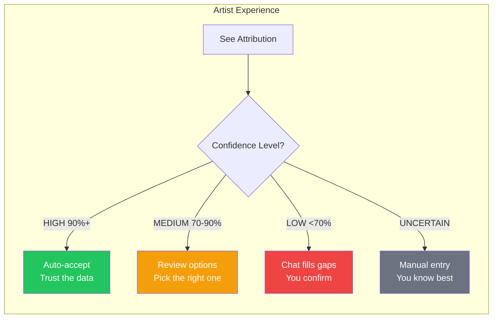
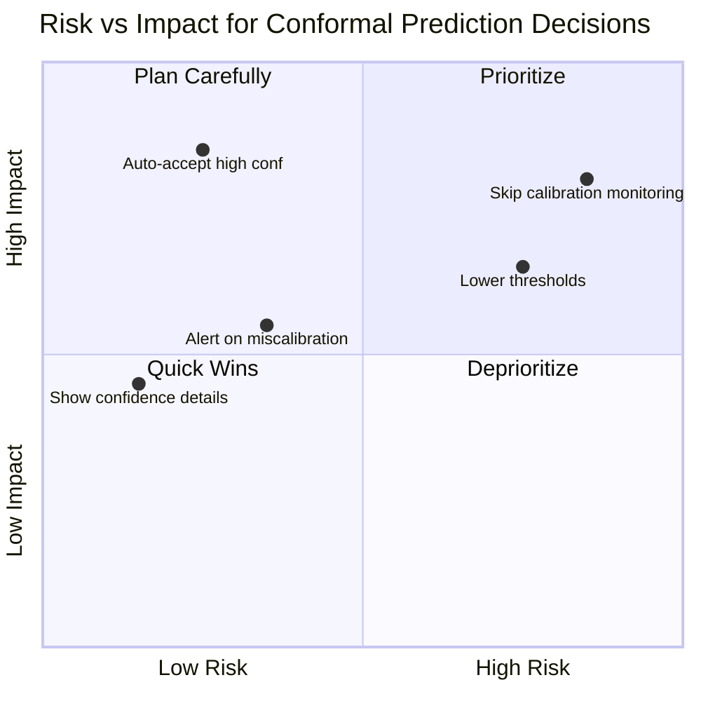
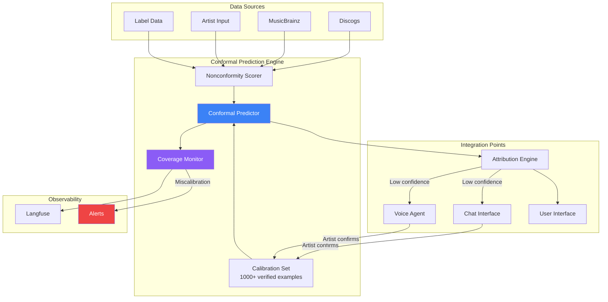

# Conformal Prediction

**Purpose**: Provide mathematically guaranteed confidence intervals for attribution data.

**Key Requirement from Imogen**: "Present data that is 90 to 100% confident" - this needs to MEAN something.

---

## For Domain Experts (Imogen/Andy)

### What This Means for You

When the system displays a confidence percentage, it is not a guess. Conformal prediction is a mathematical technique that ensures our confidence numbers are **calibrated** - if we say "90% confident," the data will be correct approximately 90% of the time. This is verified continuously.

### How This Affects Your Workflow



### Key Takeaways

- **Green checkmarks are trustworthy** - HIGH confidence means you can auto-approve
- **We never overstate certainty** - If we are not sure, we will tell you
- **The system self-corrects** - If calibration drifts, it automatically adjusts
- **You save time** - Focus review on genuinely uncertain fields, not everything

---

## Known Unknowns

Questions for domain experts that need answers:

| Question | Why It Matters | Who Should Answer |
|----------|----------------|-------------------|
| What confidence threshold feels "safe" for auto-acceptance? | Determines default UI behavior | Imogen/Andy |
| Are there field types that should NEVER be auto-accepted regardless of confidence? | Legal/contractual requirements | Andy/Legal |
| How should we display uncertainty for financial fields (royalty splits)? | Higher stakes = different presentation? | Imogen |
| Should confidence display differ between first-time and returning users? | UX customization | Imogen |
| What happens when multiple sources disagree but each has high individual confidence? | Conflict resolution policy | Andy |

---

## Executive Decision Impact

### Business Implications

| Decision | If YES | If NO |
|----------|--------|-------|
| **Auto-accept high-confidence data** | Faster onboarding, less artist friction | More review work, slower but "safer" feeling |
| **Show detailed confidence breakdowns** | Transparency, builds trust | Simpler UI, less cognitive load |
| **Alert artists to calibration issues** | Full transparency | Simpler experience, handle internally |

### Resource Requirements

- **Engineering**: 2-3 sprints for core implementation, ongoing calibration monitoring
- **Data Science**: Initial model calibration requires ~1000 verified attributions per field type
- **Infrastructure**: Minimal - conformal prediction is computationally lightweight

### Risk Assessment



---

## System Integration Diagram



---

## Overview

Conformal Prediction provides **distribution-free** uncertainty quantification with formal guarantees:

> If we say "90% confident", there's a 90% chance we're right.

This is NOT a heuristic - it's a mathematical guarantee.

## Why Conformal Prediction?

| Approach | Guarantee | Problem |
|----------|-----------|---------|
| Heuristic scores | None | "90% confidence" might be 60% accurate |
| Bayesian | Requires prior assumptions | Misspecified priors = wrong intervals |
| **Conformal** | Distribution-free | Works with any model, any data |

## Core Concept

```
┌─────────────────────────────────────────────────────────────────────┐
│                    CONFORMAL PREDICTION FLOW                         │
├─────────────────────────────────────────────────────────────────────┤
│                                                                     │
│  1. CALIBRATION SET (historical data with known labels)            │
│     ────────────────                                                │
│     • 1000 artist-verified attributions                             │
│     • Each has: source data → actual correct answer                 │
│                                                                     │
│  2. NONCONFORMITY SCORES                                           │
│     ─────────────────────                                           │
│     • For each calibration example:                                 │
│       score = how "strange" the prediction is                       │
│     • Sort scores to get distribution                               │
│                                                                     │
│  3. PREDICTION SET (for new data)                                  │
│     ──────────────                                                  │
│     • Include all values whose nonconformity score                  │
│       is below the 90th percentile threshold                        │
│     • Guaranteed to contain true value 90% of the time             │
│                                                                     │
└─────────────────────────────────────────────────────────────────────┘
```

## Implementation

### Basic Conformal Predictor

```python
from dataclasses import dataclass
import numpy as np
from typing import TypeVar

T = TypeVar('T')


@dataclass
class ConformalPredictor:
    """Split conformal predictor for attribution confidence."""

    calibration_scores: np.ndarray  # Nonconformity scores from calibration set
    alpha: float = 0.1  # 1 - confidence level (0.1 = 90% confidence)

    @classmethod
    def fit(
        cls,
        calibration_data: list[tuple[dict, str]],  # (features, true_label)
        model: "AttributionModel",
        alpha: float = 0.1
    ) -> "ConformalPredictor":
        """Fit conformal predictor on calibration data."""

        # Compute nonconformity scores for calibration set
        scores = []
        for features, true_label in calibration_data:
            pred_probs = model.predict_proba(features)
            # Nonconformity = 1 - probability assigned to true label
            score = 1 - pred_probs.get(true_label, 0)
            scores.append(score)

        return cls(
            calibration_scores=np.array(sorted(scores)),
            alpha=alpha
        )

    def get_threshold(self) -> float:
        """Get the conformal threshold for current alpha."""
        n = len(self.calibration_scores)
        # Quantile with finite-sample correction
        q = np.ceil((n + 1) * (1 - self.alpha)) / n
        return np.quantile(self.calibration_scores, min(q, 1.0))

    def predict_set(
        self,
        model: "AttributionModel",
        features: dict,
        candidates: list[str]
    ) -> dict[str, float]:
        """Return prediction set with coverage guarantee."""

        threshold = self.get_threshold()
        pred_probs = model.predict_proba(features)

        # Include candidates whose nonconformity is below threshold
        prediction_set = {}
        for candidate in candidates:
            prob = pred_probs.get(candidate, 0)
            nonconformity = 1 - prob
            if nonconformity <= threshold:
                prediction_set[candidate] = prob

        return prediction_set
```

### Multi-Source Conformal Aggregation

For combining multiple sources with conformal guarantees:

```python
@dataclass
class SourceAwareConformalPredictor:
    """Conformal prediction that accounts for source agreement."""

    per_source_predictors: dict[str, ConformalPredictor]
    aggregation_predictor: ConformalPredictor

    def predict_with_sources(
        self,
        sources: dict[str, dict],  # source_name -> features
        candidates: list[str]
    ) -> "ConformalPrediction":
        """Predict with per-source breakdown."""

        # Get prediction sets from each source
        source_sets = {}
        for source_name, features in sources.items():
            if source_name in self.per_source_predictors:
                predictor = self.per_source_predictors[source_name]
                source_sets[source_name] = predictor.predict_set(
                    model=...,
                    features=features,
                    candidates=candidates
                )

        # Aggregate with intersection/union strategies
        intersection = set.intersection(*[
            set(s.keys()) for s in source_sets.values()
        ])

        return ConformalPrediction(
            final_set=intersection,
            source_sets=source_sets,
            confidence_level=1 - self.aggregation_predictor.alpha
        )
```

## Attribution-Specific Nonconformity

For attribution data, define nonconformity as:

```python
def attribution_nonconformity(
    prediction: str,
    true_value: str,
    source_agreement: float,
    source_count: int
) -> float:
    """
    Nonconformity score for attribution predictions.

    Lower = more conforming (better)
    """
    # Base: edit distance normalized
    base_score = edit_distance(prediction, true_value) / max(
        len(prediction), len(true_value), 1
    )

    # Adjust for source agreement (higher agreement = lower nonconformity)
    agreement_factor = 1 - source_agreement

    # Adjust for number of sources (more sources = more confident)
    source_factor = 1 / np.sqrt(source_count)

    return base_score * (1 + agreement_factor) * source_factor
```

## Confidence Thresholds

Map conformal sets to user-facing confidence:

| Conformal Set Size | Confidence Display | Action |
|--------------------|--------------------|--------|
| 1 value | "HIGH (90%+)" | Auto-populate |
| 2-3 values | "MEDIUM (70-90%)" | Show options |
| 4+ values | "LOW (<70%)" | Ask artist |
| Empty set | "UNCERTAIN" | Manual entry needed |

## Adaptive Conformal Prediction

For real-time updates as artist provides feedback:

```python
class AdaptiveConformalPredictor:
    """Online conformal that updates with new labels."""

    def __init__(self, initial_calibration: list, alpha: float = 0.1):
        self.calibration_scores = list(initial_calibration)
        self.alpha = alpha

    def update(self, features: dict, true_label: str, model) -> None:
        """Add new calibration point and update threshold."""
        score = self.compute_nonconformity(features, true_label, model)
        self.calibration_scores.append(score)

        # Optional: sliding window to handle distribution shift
        if len(self.calibration_scores) > 10000:
            self.calibration_scores = self.calibration_scores[-10000:]
```

## Calibration Monitoring

Track that conformal guarantees hold:

```python
class ConformalMonitor:
    """Monitor conformal prediction coverage in production."""

    def __init__(self, target_coverage: float = 0.9):
        self.target = target_coverage
        self.predictions: list[bool] = []  # True if correct was in set

    def record(self, prediction_set: set, true_value: str) -> None:
        self.predictions.append(true_value in prediction_set)

    @property
    def empirical_coverage(self) -> float:
        if not self.predictions:
            return 0.0
        return sum(self.predictions) / len(self.predictions)

    def is_miscalibrated(self, tolerance: float = 0.03) -> bool:
        """Check if coverage is significantly off target."""
        return abs(self.empirical_coverage - self.target) > tolerance
```

## Integration Points

### With Attribution Engine

```python
# confidence-scoring.md integration
def get_confidence_score(field: str, sources: dict) -> ConfidenceResult:
    """Get conformal confidence score for a field."""

    predictor = load_conformal_predictor(field)
    prediction_set = predictor.predict_with_sources(sources)

    return ConfidenceResult(
        prediction_set=prediction_set.final_set,
        confidence_level=predictor.confidence_level,
        source_breakdown=prediction_set.source_sets,
        display_confidence=map_to_display(prediction_set)
    )
```

### With Chat Interface

```python
# Gap-filling triggers based on conformal set size
if len(prediction_set) > 3:
    trigger_chat_prompt(
        prompt_type="disambiguation",
        candidates=prediction_set,
        confidence="low"
    )
```

## Metrics

| Metric | Target | Alert If |
|--------|--------|----------|
| Empirical coverage | 90% ± 3% | Outside range |
| Avg prediction set size | <2 | >5 (too uncertain) |
| Miscalibration rate | <5% | >10% |
| Threshold drift | Stable | >10% change |

## Related Documents

- [toc-uncertainty.md](toc-uncertainty.md) - Parent TOC
- [attribution-engine/confidence-scoring.md](../attribution-engine/confidence-scoring.md) - User-facing confidence
- [attribution-engine/source-attribution.md](../attribution-engine/source-attribution.md) - Per-source tracking
- [observability/langfuse.md](../observability/langfuse.md) - Monitoring
