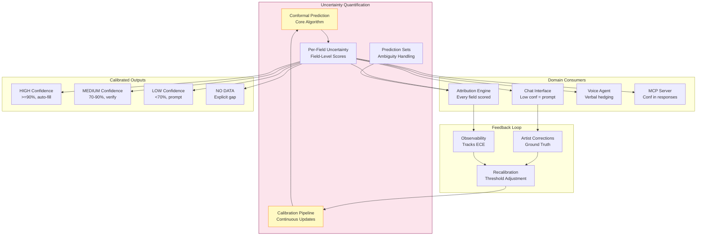
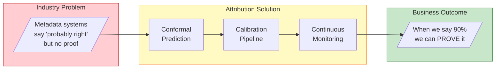
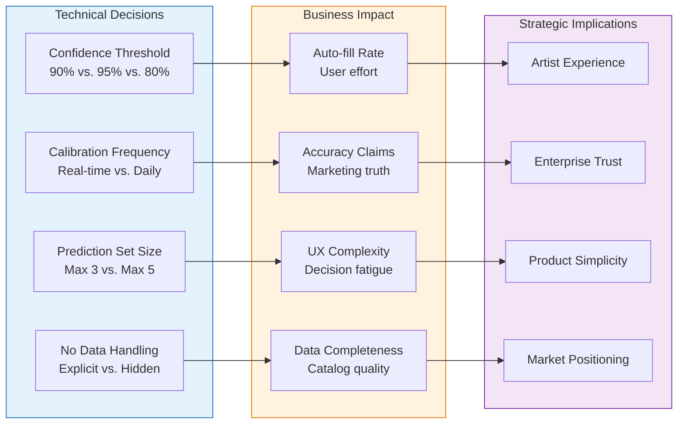

# Uncertainty Quantification

**Purpose**: Formal methods for calibrated confidence scores across the platform

**Key Requirement**: When the system says "90% confident", it must be accurate 90% of the time

**Method**: Conformal Prediction (distribution-free, formal guarantees)

**Cross-Cutting**: Uncertainty quantification applies to all data-producing components

---

## Overview

Traditional ML confidence scores are often poorly calibrated - a model saying "90% confident" might only be correct 70% of the time. The system uses conformal prediction to provide formal guarantees that confidence scores match actual accuracy.

## Core Capabilities

| Capability | Description | PRD |
|------------|-------------|-----|
| **Conformal Prediction** | Core uncertainty method | [conformal-prediction.md](conformal-prediction.md) |
| **Calibration Pipeline** | Maintain calibrated scores | [calibration-pipeline.md](calibration-pipeline.md) |
| **Per-Field Uncertainty** | Confidence for each attribution field | [per-field-uncertainty.md](per-field-uncertainty.md) |
| **Prediction Sets** | For ambiguous fields, return sets of possibilities | [prediction-sets.md](prediction-sets.md) |

## Why Conformal Prediction?

| Property | Benefit for the system |
|----------|---------------------|
| **Formal guarantee** | Coverage ≥ 1-α (90% confident → right 90%+ of time) |
| **Distribution-free** | No assumptions about data distribution |
| **Per-field intervals** | "GLA is 2080-2120 sqft with 90% confidence" |
| **Prediction sets** | "Artist could be: John Smith OR J. Smith" |

## Architecture

```
┌─────────────────────────────────────────────────────────────────┐
│                   UNCERTAINTY QUANTIFICATION                     │
├─────────────────────────────────────────────────────────────────┤
│                                                                 │
│  ┌─────────────────────────────────────────────────────────┐   │
│  │                 Conformal Prediction                     │   │
│  │                                                         │   │
│  │  Calibration Set              Prediction                │   │
│  │  ───────────────             ──────────                 │   │
│  │                                                         │   │
│  │  Historical data     →     Nonconformity scores         │   │
│  │  (artist corrections)      (calibration thresholds)     │   │
│  │                                                         │   │
│  │                              ↓                          │   │
│  │                                                         │   │
│  │  New prediction      →     Calibrated confidence        │   │
│  │                            OR prediction set            │   │
│  │                                                         │   │
│  └─────────────────────────────────────────────────────────┘   │
│                              │                                  │
│                              ▼                                  │
│  ┌─────────────────────────────────────────────────────────┐   │
│  │               Integration Points                         │   │
│  │                                                         │   │
│  │  Attribution Engine:  Per-field confidence scores       │   │
│  │  Chat Interface:      Trigger prompts from low scores   │   │
│  │  Voice Agent:         Verbalize uncertainty             │   │
│  │  MCP Server:          Include confidence in responses   │   │
│  │                                                         │   │
│  └─────────────────────────────────────────────────────────┘   │
│                                                                 │
└─────────────────────────────────────────────────────────────────┘
```

## Confidence Levels (System-Wide)

These levels are used consistently across all the system components:

| Level | Score | Source Requirement | UX Treatment |
|-------|-------|-------------------|--------------|
| **Verified** | ≥90% + artist confirm | Artist-confirmed | Green checkmark |
| **High** | ≥90% | Multi-source agreement | Auto-populate |
| **Medium** | 70-90% | Single source OR minor disagreement | Prompt for verification |
| **Low** | <70% | Sparse/conflicting data | Chat-driven gathering |
| **No Data** | N/A | No sources | Explicit gap marker |

## Calibration Loop

```
┌─────────────────────────────────────────────────────────────────┐
│                     CALIBRATION LOOP                             │
├─────────────────────────────────────────────────────────────────┤
│                                                                 │
│  1. Collect      →    2. Compute    →    3. Adjust             │
│     Feedback           ECE              Thresholds             │
│                                                                 │
│  Artist confirms      Compare           If ECE > 0.05,         │
│  or corrects          predicted vs      recalibrate using      │
│  HIGH confidence      actual accuracy   expanded validation    │
│  fields                                 set                     │
│                                                                 │
│                           ↓                                     │
│                                                                 │
│                    4. Monitor                                   │
│                       in Langfuse                               │
│                                                                 │
│                    Track:                                       │
│                    • coverage_at_90                             │
│                    • expected_calibration_error                 │
│                    • calibration_drift                          │
│                                                                 │
└─────────────────────────────────────────────────────────────────┘
```

## Implementation Priority

1. **conformal-prediction.md** - Core theory and implementation
2. **per-field-uncertainty.md** - Per-field scoring (used by attribution engine)
3. **calibration-pipeline.md** - Continuous calibration
4. **prediction-sets.md** - Ambiguous field handling

## Cross-Cutting Dependencies

| Domain | Uncertainty Integration |
|--------|------------------------|
| **Attribution Engine** | Primary consumer - every field gets a confidence score |
| **Chat Interface** | Low confidence triggers prompts |
| **Voice Agent** | Verbalizes uncertainty ("I'm not sure, but...") |
| **MCP Server** | Includes confidence in API responses |
| **Observability** | Tracks calibration metrics |

## Related Documents

- [attribution-engine/confidence-scoring.md](../attribution-engine/confidence-scoring.md) - Primary implementation
- [observability/confidence-monitoring.md](../observability/confidence-monitoring.md) - Calibration tracking
- [chat-interface/confidence-driven-prompts.md](../chat-interface/confidence-driven-prompts.md) - UX integration

---

## Cross-Domain Impact Diagram

Uncertainty Quantification is the mathematical foundation that makes the system's accuracy claims defensible.



### Domain-by-Domain Integration

| Domain | How Uncertainty Affects It |
|--------|---------------------------|
| **Attribution Engine** | Every field gets a calibrated confidence score; aggregation weights sources by reliability |
| **Chat Interface** | Low/Medium confidence triggers conversational prompts to fill gaps |
| **Voice Agent** | Uncertainty is verbalized naturally ("I'm fairly confident...", "I'm not sure about...") |
| **MCP Server** | API responses include confidence scores so AI platforms can make informed decisions |
| **Observability** | Tracks ECE (Expected Calibration Error) to ensure scores stay calibrated |
| **Data Layer** | Confidence scores stored per-field, enabling historical accuracy analysis |

---

## For Domain Experts (Imogen/Andy)

### Business Impact Summary

**Why This Matters for Artist Relations (Imogen):**
- Uncertainty quantification is HOW we deliver on the "only auto-fill when 90%+ confident" promise
- It protects artists from incorrect data being published without their knowledge
- Explicit "NO DATA" marking is more respectful than inventing data
- Medium confidence prompts engage artists in improving their own data

**Why This Matters for Strategy (Andy):**
- Calibrated confidence is a major differentiator - most metadata systems don't quantify uncertainty at all
- Formal mathematical guarantees (conformal prediction) are defensible to enterprise customers
- This enables tiered product offerings based on data quality/confidence levels
- AI platforms can trust our confidence scores, making MCP more valuable

### The "90% Confident" Business Promise



### Why Conformal Prediction?

| Alternative | Why Not |
|-------------|---------|
| LLM self-reported confidence | Notoriously uncalibrated; models say "95% confident" when they're wrong 30% of time |
| Simple heuristics | "3+ sources agree = HIGH" doesn't adapt to data quality differences |
| Bayesian methods | Require assumptions about data distributions that may not hold |
| **Conformal Prediction** | **Distribution-free, formal guarantees, adapts to actual accuracy** |

---

## Known Unknowns

These are identified gaps requiring research or executive decisions:

| Unknown | Impact | Research Needed |
|---------|--------|-----------------|
| **Calibration set size** | How many artist corrections needed before calibration is reliable? | Statistical analysis - likely 100-500 per field type |
| **Field-type stratification** | Should we calibrate separately for names vs. dates vs. numbers? | Analysis of error patterns by field type |
| **Temporal drift** | Does calibration degrade over time? How fast? | Long-term monitoring once system is live |
| **Source reliability weighting** | How to weight Discogs vs. MusicBrainz vs. Spotify differently? | Source-specific accuracy analysis |
| **Prediction set presentation** | When showing multiple possibilities, how many is too many? | UX research with artists |
| **LLM confidence integration** | Can LLM self-reported confidence be calibrated post-hoc? | Experimentation with calibration techniques |

---

## Executive Decision Impact

Uncertainty quantification choices affect product quality, trust, and competitive positioning.



### Decision Matrix

| Technical Choice | Options | Business Trade-off |
|------------------|---------|-------------------|
| **High confidence threshold** | 80% / 90% / 95% | More auto-fill vs. more accuracy |
| **Medium → High transition** | Artist confirm / 3+ source / time-based | Artist effort vs. automation |
| **Prediction set max size** | 2 / 3 / 5 options | Simplicity vs. coverage |
| **No data display** | Explicit "Unknown" / Hidden / Prompt-driven | Transparency vs. perceived completeness |
| **Calibration ground truth** | Artist corrections / Expert review / Both | Cost vs. accuracy |

### Recommendations for Executive Review

1. **90% threshold for HIGH confidence** - aligns with Imogen's requirement, industry-leading accuracy
2. **Artist confirmation upgrades to VERIFIED** - creates clear path from HIGH (machine) to VERIFIED (human)
3. **Max 3 options in prediction sets** - more than 3 creates decision fatigue
4. **Explicit "Unknown" for NO DATA** - transparency builds trust, hides nothing
5. **Daily calibration recalculation** - balances compute cost with drift detection

### The Competitive Moat

Uncertainty quantification creates defensible differentiation:

| Competitor | Uncertainty Approach |
|------------|---------------------|
| MusicBrainz | None - data is "correct" or "disputed" |
| Discogs | User voting only |
| Spotify | Internal quality scores, not exposed |
| **the system** | **Formal guarantees, exposed via MCP, continuously calibrated** |
