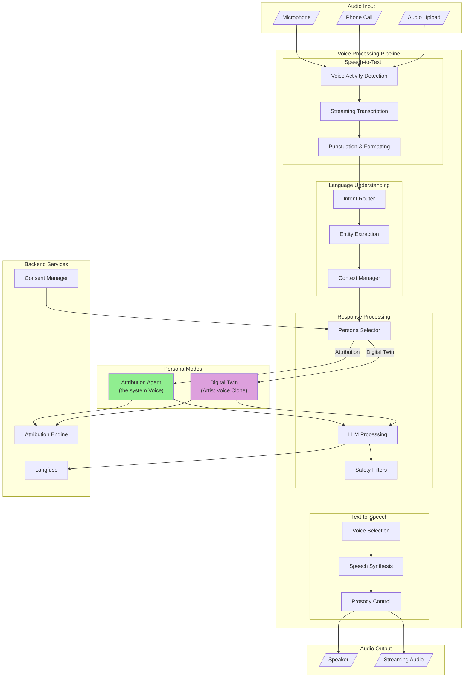
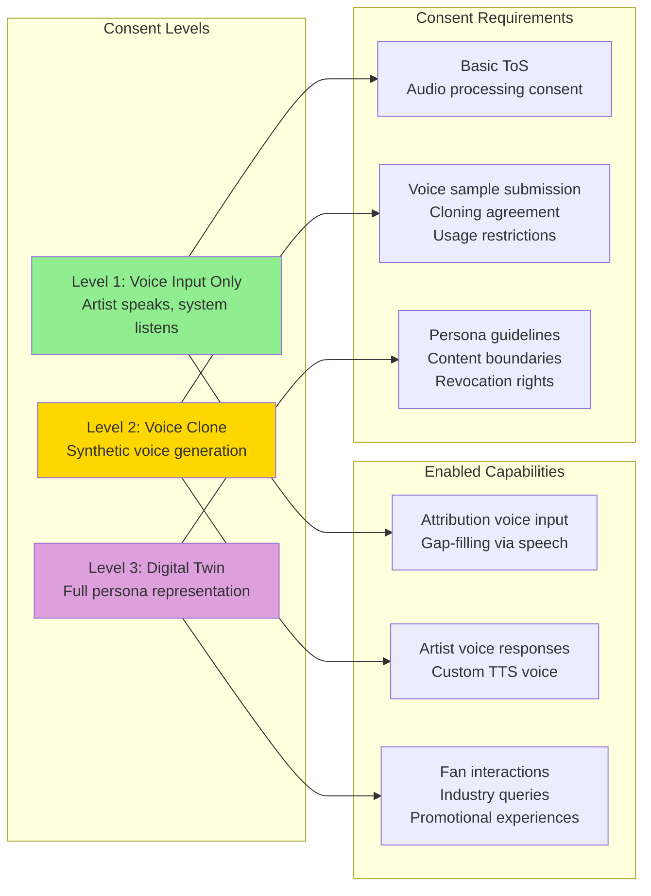
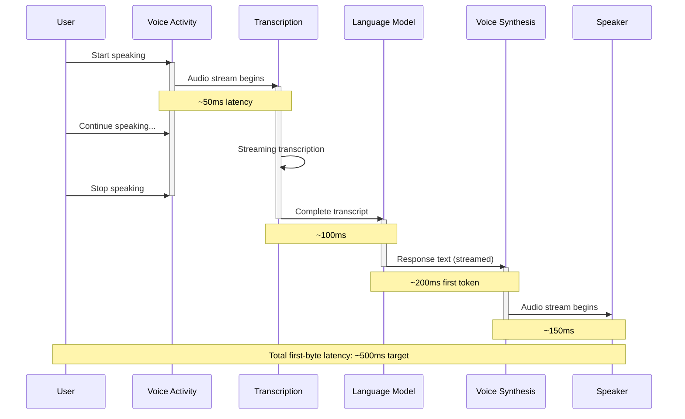

# Voice Agent

**Purpose**: Voice interface for attribution gathering AND artist digital twin experiences

**Dual Purpose**: The same voice agent system serves both the attribution workflows and the "digital twin" voice experience (e.g., Imogen's voice agent).

---

## System Architecture



### Voice Consent & Persona Flow



### Real-Time Processing Timeline



---

## For Domain Experts (Imogen/Andy)

### Why This Matters

The Voice Agent represents **two transformative opportunities** for the system:

1. **Attribution Gathering**: Many session musicians and collaborators find typing tedious. Voice input removes friction, especially for complex stories ("We recorded that in three sessions across two studios...").

2. **Digital Twin**: This is potentially the most visible, viral feature of the system. An artist's voice AI that can authentically discuss their work opens doors to fan engagement, industry demos, and media coverage.

**Business Value:**
- **Accessibility**: Voice input serves artists who struggle with typing, have disabilities, or are simply on the go.
- **Depth of Data**: Voice responses are typically 3-4x longer than typed responses, capturing more attribution context.
- **Artist Differentiation**: A digital twin voice agent is a powerful promotional tool. "Ask Imogen about her new album" is a headline-worthy feature.
- **Industry Positioning**: Being early with ethical voice cloning and consent frameworks positions the system as a leader in artist-controlled AI.

### Key Decisions Requiring Your Input

1. **Voice Clone Fidelity**: How accurate must the digital twin voice be? Is "recognizably similar" enough, or must it be indistinguishable?

2. **Persona Boundaries**: What topics should a digital twin refuse to discuss? Personal life? Other artists? Controversial topics?

3. **Consent Granularity**: Should artists be able to grant voice clone rights to specific platforms (e.g., "Allow on the system, not on external apps")?

4. **Failure Modes**: When STT mishears something, how should we handle it? Confirm every attribution? Only confirm low-confidence extractions?

---

## Known Unknowns

> Questions requiring domain expertise or further research before implementation.

| Question | Impact | Suggested Owner |
|----------|--------|-----------------|
| What voice latency is acceptable for natural conversation? (<500ms?) | High - technology choice | Engineering |
| How do we verify voice identity for high-stakes attribution changes? | High - security | Engineering + Legal |
| Should digital twins have "moods" or always maintain consistent personality? | Medium - UX design | Imogen |
| How do we handle accent/dialect variations in STT? | Medium - accuracy | Engineering |
| What's the consent revocation process? How quickly must voice data be deleted? | High - legal/compliance | Legal |
| Can artists set "office hours" for their digital twin availability? | Low - feature scoping | Product |
| How do we prevent voice deepfakes/misuse of cloned voices? | Critical - security/trust | Engineering + Legal |
| Should the attribution agent voice be gender-neutral, or should artists choose? | Low - UX preference | Imogen |

---

## Overview

The Voice Agent serves two interconnected business purposes:

| Purpose | Use Case | Example |
|---------|----------|---------|
| **Attribution Gathering** | Voice-based gap-filling for artists | "Tell me about who produced this track" |
| **Digital Twin** | Artist voice presence for fans/industry | "Ask Imogen about her creative process" |

These are "quite connected business-wise" - the same underlying system, different personas.

## Core Capabilities

| Capability | Description | PRD |
|------------|-------------|-----|
| **Voice Pipeline** | End-to-end voice processing architecture | [pipeline/voice-pipeline.md](pipeline/voice-pipeline.md) |
| **Real-Time STT** | Speech-to-text with low latency | [stt/real-time-stt.md](stt/real-time-stt.md) |
| **Natural TTS** | Text-to-speech with artist voice cloning | [tts/natural-tts.md](tts/natural-tts.md) |
| **Persona Management** | Switch between attribution agent and digital twin | [persona-management.md](persona-management.md) |
| **Voice Consent** | Artist consent for voice cloning/use | [voice-consent.md](voice-consent.md) |

## Architecture

```
┌─────────────────────────────────────────────────────────────────┐
│                        VOICE AGENT                               │
├─────────────────────────────────────────────────────────────────┤
│                                                                 │
│  ┌─────────────────────────────────────────────────────────┐   │
│  │                    VOICE PIPELINE                        │   │
│  │  ┌─────────┐    ┌─────────┐    ┌─────────┐    ┌──────┐ │   │
│  │  │  STT    │───►│ Intent  │───►│  LLM    │───►│ TTS  │ │   │
│  │  │(Deepgram│    │ Router  │    │ Process │    │      │ │   │
│  │  └─────────┘    └────┬────┘    └────┬────┘    └──────┘ │   │
│  │                      │              │                   │   │
│  └──────────────────────┼──────────────┼───────────────────┘   │
│                         │              │                       │
│         ┌───────────────┴───────┬──────┴───────┐               │
│         ▼                       ▼              ▼               │
│  ┌─────────────┐         ┌─────────────┐  ┌─────────────┐     │
│  │ Attribution │         │  Digital    │  │   Query     │     │
│  │  Gathering  │         │   Twin      │  │  External   │     │
│  │   Persona   │         │  Persona    │  │   Data      │     │
│  └──────┬──────┘         └──────┬──────┘  └──────┬──────┘     │
│         │                       │                │             │
│         ▼                       ▼                ▼             │
│  ┌──────────────────────────────────────────────────────┐     │
│  │              Attribution Engine                       │     │
│  │         (Shared Knowledge Base)                       │     │
│  └──────────────────────────────────────────────────────┘     │
│                                                                 │
└─────────────────────────────────────────────────────────────────┘
```

## Persona Modes

### Mode 1: Attribution Gathering (the system Agent)

Voice-driven gap-filling, particularly effective for:
- Complex collaboration details
- Session musicians who prefer talking to typing
- Mobile/on-the-go data entry

```
Artist: "Hey, I want to update credits for 'River Song'"
Agent: "Sure! I see we're missing the mixing engineer. Who mixed that track?"
Artist: "That was Dave at Electric Lady"
Agent: "Got it - Dave at Electric Lady Studios for mixing. Anyone else?"
```

### Mode 2: Digital Twin (Artist Persona)

Artist's voice AI presence for:
- Fan interactions
- Industry queries
- Promotional experiences

```
Fan: "What inspired 'River Song'?"
Imogen (Digital Twin): "That song came from a moment by the Thames..."
```

## Technology Stack

| Component | Primary Choice | Alternative |
|-----------|---------------|-------------|
| **Voice Pipeline** | Vapi | Custom |
| **STT** | Deepgram | Whisper |
| **TTS** | ElevenLabs / Inworld | PlayHT |
| **LLM** | Claude | GPT-4 |

See [defaults.yaml](../defaults.yaml) for current selections.

## Voice Consent Framework

Critical for digital twin use:

| Consent Level | Allows |
|---------------|--------|
| **Attribution Only** | Voice input for data gathering |
| **Voice Clone** | Synthetic voice generation |
| **Digital Twin** | Full persona representation |

All voice usage requires explicit artist consent per [voice-consent.md](voice-consent.md).

## Implementation Priority

1. **pipeline/voice-pipeline.md** - Core infrastructure
2. **stt/real-time-stt.md** - Input processing
3. **persona-management.md** - Mode switching
4. **voice-consent.md** - Consent framework
5. **tts/natural-tts.md** - Output synthesis

## Cross-Cutting Dependencies

| Concern | Integration Point |
|---------|-------------------|
| **Attribution Engine** | Both personas read/write attribution data |
| **Chat Interface** | Voice can fall back to chat for complex queries |
| **Identity/Permissions** | Voice consent ties to artist identity |
| **Observability** | Track voice session quality in Langfuse |

## Related Documents

- [vision-v1.md](../vision-v1.md) - Product vision
- [chat-interface/toc-chat-interface.md](../chat-interface/toc-chat-interface.md) - Text alternative
- [identity-permissions/toc-identity-permissions.md](../identity-permissions/toc-identity-permissions.md) - Consent management
- [observability/langfuse.md](../observability/langfuse.md) - Session tracking
