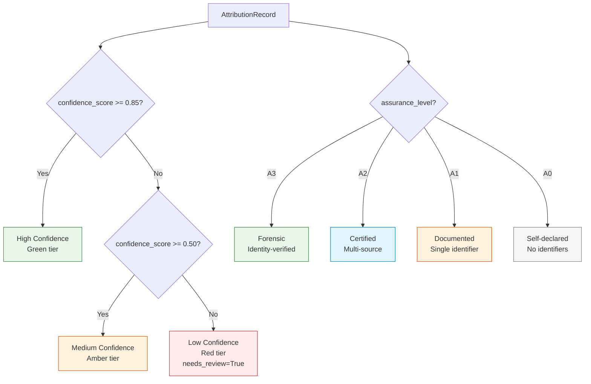

# Assurance Levels (A0--A3)

> Four tiers of verification depth -- from "someone said so" to "forensically verified with identity-checked sources."

---

## The Simple Version

Think of different forms of identification:

| Level | Real-World Analogy | Trust Level |
|-------|--------------------|-------------|
| **A0** | Someone tells you their name verbally | "I'll take your word for it" |
| **A1** | They show you a library card | "I see some documentation" |
| **A2** | They show a government-issued passport | "Multiple authorities agree" |
| **A3** | Passport + biometric scan + background check | "Forensically verified" |

Music attribution works the same way. When someone claims "I wrote this song," how much evidence backs that claim? A0 means no evidence at all -- just a claim in a file tag. A3 means multiple independent databases agree, and the person has a verified industry identity (ISNI).

**The higher the assurance level, the more sources agree and the harder the evidence is to forge.**

---

## For Music Industry Professionals

### What Each Level Means in Practice

=== "A0 -- Self-Declared"

    The attribution comes from a single, unverified source -- typically file metadata (ID3 tags) or a user's own claim.

    **Real-world example:** An MP3 file has "Artist: Imogen Heap" in its ID3 tag, but no ISRC, no MusicBrainz match, no Discogs entry. Someone typed that text -- it could be correct, or it could be a mislabeled file.

    **Trust signal:** None beyond the claim itself.

=== "A1 -- Documented"

    At least one standard industry identifier (ISRC, ISWC, or MBID) is present, but only from a single source.

    **Real-world example:** The track has a valid ISRC code (GBAYE0200774), which links to a single entry in a rights database. No second source confirms it.

    **Trust signal:** One identifier from one database.

=== "A2 -- Certified"

    Multiple independent sources agree on the attribution, and at least one standard identifier is present.

    **Real-world example:** MusicBrainz and Discogs both list Imogen Heap as the performer of "Hide and Seek" (ISRC: GBAYE0200774). The ISRC appears in both databases independently.

    **Trust signal:** Cross-source agreement plus identifiers.

=== "A3 -- Forensic"

    Everything in A2, plus the artist has a verified identity (ISNI) and multiple sources confirm it.

    **Real-world example:** Imogen Heap has ISNI 0000 0001 2140 6981. MusicBrainz, Discogs, and ISNI records all cross-reference consistently. The identity chain is verifiable.

    **Trust signal:** Identity-verified, multi-source, with standard identifiers.

### Industry Identifier Mapping

| Identifier | What It Identifies | Issuing Body | Assurance Contribution |
|-----------|-------------------|--------------|----------------------|
| **ISRC** | A specific recording | National ISRC agencies | A1+ (recording exists) |
| **ISWC** | A musical composition | CISAC | A1+ (work is registered) |
| **ISNI** | A person or organization | ISNI International Authority | A3 (identity verified) |
| **IPI** | An interested party (rights holder) | CISAC societies | A2+ (rights registered) |
| **MBID** | Any MusicBrainz entity | MusicBrainz community | A1+ (community-curated) |

!!! warning "Assurance Is Not Confidence"
    Assurance level measures **verification depth** (how many independent sources confirm it). Confidence score measures **statistical certainty** (how likely the attribution is correct). You can have high assurance with low confidence (three sources all disagree about roles) or high confidence with low assurance (one very reliable source).

---

## For Engineers

### Implementation in Schemas

The assurance level is computed at two points in the pipeline: entity resolution and credit aggregation.

**Entity Resolution** (`src/music_attribution/resolution/orchestrator.py`):

```python
def _compute_assurance_level(self, records: list[NormalizedRecord]) -> AssuranceLevelEnum:
    """Compute assurance level from available evidence."""
    sources = {r.source for r in records}
    has_isni = any(r.identifiers.isni for r in records)
    has_any_id = any(
        r.identifiers.isrc or r.identifiers.iswc or r.identifiers.mbid
        for r in records
    )

    if has_isni and len(sources) > 1:
        return AssuranceLevelEnum.LEVEL_3
    if len(sources) > 1 and has_any_id:
        return AssuranceLevelEnum.LEVEL_2
    if has_any_id:
        return AssuranceLevelEnum.LEVEL_1
    return AssuranceLevelEnum.LEVEL_0
```

**Credit Aggregation** (`src/music_attribution/attribution/aggregator.py`):

```python
def _compute_assurance(self, entities: list[ResolvedEntity]) -> AssuranceLevelEnum:
    """Compute minimum assurance level across all contributors."""
    levels = [e.assurance_level for e in entities]
    level_order = [
        AssuranceLevelEnum.LEVEL_0,
        AssuranceLevelEnum.LEVEL_1,
        AssuranceLevelEnum.LEVEL_2,
        AssuranceLevelEnum.LEVEL_3,
    ]
    min_idx = min(level_order.index(level) for level in levels)
    return level_order[min_idx]
```

!!! note "Conservative by Design"
    The aggregator takes the *minimum* assurance level across all contributors. If one credit in a song has A3 (verified artist) but another has A0 (unknown session musician), the overall record gets A0. This prevents a single high-assurance credit from masking gaps elsewhere.

### Threshold Logic

The scaffold uses confidence thresholds from `src/music_attribution/constants.py` to drive review decisions:

```python
CONFIDENCE_HIGH_THRESHOLD: float = 0.85   # Green tier
CONFIDENCE_MEDIUM_THRESHOLD: float = 0.50  # Amber tier
REVIEW_THRESHOLD: float = 0.50             # Below this -> needs_review=True
```

Assurance level and confidence score interact in the `AttributionRecord`:



### Sample Data Distribution

The 9 Imogen Heap works in the scaffold demonstrate the full assurance spectrum:

| Work | Confidence | Assurance | Review? | Why |
|------|-----------|-----------|---------|-----|
| Hide and Seek | 0.95 | A3 | No | MusicBrainz + Discogs + AcoustID + artist-confirmed |
| Tiny Human | 0.91 | A3 | No | MusicBrainz + Discogs + artist self-review |
| The Moment I Said It | 0.82 | A2 | No | MusicBrainz + Discogs + file metadata agree |
| Goodnight and Go | 0.72 | A2 | No | Two sources agree, partial producer credits |
| Headlock | 0.58 | A1 | Yes | Conflicting producer credits across sources |
| What Have You Done To Me? | 0.48 | A1 | Yes | Two sources, limited cross-verification |
| Just for Now | 0.35 | A1 | Yes | Single source (MusicBrainz only) |
| 2-1 | 0.28 | A1 | Yes | File metadata only, no external verification |
| Blanket | 0.00 | A0 | Yes | No data found in any source |

### Key Source Files

| File | Role |
|------|------|
| `src/music_attribution/schemas/enums.py` | `AssuranceLevelEnum` (LEVEL_0 through LEVEL_3) |
| `src/music_attribution/schemas/attribution.py` | `Credit.assurance_level`, `AttributionRecord.assurance_level` |
| `src/music_attribution/resolution/orchestrator.py` | `_compute_assurance_level()` logic |
| `src/music_attribution/attribution/aggregator.py` | `_compute_assurance()` minimum-across-credits logic |
| `src/music_attribution/constants.py` | Confidence tier thresholds |

---

## How This Maps to Code

The assurance level flows through the entire pipeline:

1. **ETL** collects identifiers into `IdentifierBundle` (ISRC, ISWC, ISNI, MBID, etc.)
2. **Entity Resolution** computes assurance from identifier presence and source count
3. **Attribution Engine** takes the minimum assurance across all credits
4. **API/MCP** exposes assurance level as a first-class field on every record
5. **Frontend** renders assurance as color-coded badges (green/blue/amber/gray for A3/A2/A1/A0)
