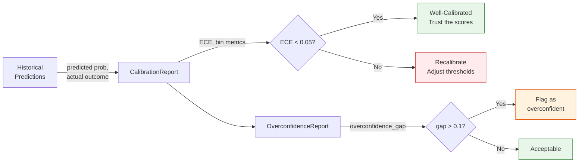

# Conformal Prediction

> When the system says "90% confident," it must actually be right 90% of the time -- not 60% with optimistic rounding.

---

## The Simple Version

Think about weather forecasts. A good forecaster does not just say "it will rain tomorrow." They say "there is a 70% chance of rain, and we are calibrated -- when we say 70%, it actually rains about 70% of the time."

A bad forecaster says "90% chance of sun!" every day, even when it rains half the time. They are **overconfident** -- their stated confidence does not match reality.

Music attribution has the same problem. A system might say "we are 85% confident Imogen Heap wrote this song," but if you checked all the claims it made at 85% confidence, only 60% would be correct. That 85% number would be meaningless.

**Conformal prediction fixes this.** Instead of giving a single confidence number, it gives a **prediction set** -- a list of possible answers that is guaranteed to contain the correct one at a specified rate. If you ask for 90% coverage, the set will contain the right answer at least 90% of the time. This guarantee holds regardless of the underlying model.

!!! example "The Forecast Analogy in Practice"
    Instead of "85% chance it's sunny," conformal prediction says: "Tomorrow's weather will be one of {sunny, partly cloudy} with 90% coverage." The set might be larger when the model is uncertain (more options) and smaller when it is confident (fewer options). But the coverage guarantee holds.

---

## For Music Industry Professionals

### Why Intervals Beat Point Estimates

When a rights manager sees "confidence: 0.72" on an attribution record, they need to know:

1. **Is 0.72 good enough to act on?** That depends on whether the system's 0.72 actually means 72% accuracy.
2. **What are the alternatives?** If the system is not sure about the songwriter role, what other roles are plausible?
3. **How much should I trust this number?** Has the system been calibrated against known-correct data?

Point estimates (a single number like 0.72) answer none of these questions. Conformal prediction answers all three:

=== "Prediction Sets"

    Instead of "this person is the songwriter (72% confidence)," the system says:

    > "At 90% coverage, the prediction set for this credit is {SONGWRITER, COMPOSER}. The set contains the correct role at least 90% of the time across all records."

    A small set (1--2 roles) means the system is confident. A large set (4+ roles) means the system is uncertain and the record needs human review.

=== "Coverage Guarantee"

    The 90% coverage level is a statistical guarantee, not an aspiration. If the system produces 1,000 prediction sets at 90% coverage, at least 900 of them will contain the correct answer. This is verifiable by auditing past predictions.

=== "Calibration Quality"

    The scaffold tracks **Expected Calibration Error (ECE)** -- how far off the system's confidence is from actual accuracy. An ECE of 0.02 means the system is well-calibrated. An ECE of 0.15 means stated confidence is unreliable.

### What This Means for Review Queues

Prediction set size directly drives the review queue:

| Set Size | Meaning | Action |
|----------|---------|--------|
| 1 role | System is highly confident | Auto-accept (with audit trail) |
| 2--3 roles | System has narrowed it down | Quick human review |
| 4+ roles | System is uncertain | Deep review needed |

!!! info "The Imogen Heap Example"
    For "Hide and Seek" (confidence 0.95, A3 assurance), the conformal set at 90% coverage is {PERFORMER} -- a single role, high certainty. For "Canvas" (confidence 0.10, A0 assurance), the set might be {PERFORMER, SONGWRITER, COMPOSER, PRODUCER} -- the system genuinely does not know.

---

## For Engineers

### Nonconformity Scores and APS

The scaffold implements the **Adaptive Prediction Sets (APS)** method in `src/music_attribution/attribution/conformal.py`. The core algorithm:

1. Sort candidate roles by confidence (descending)
2. Add roles to the prediction set until cumulative confidence reaches the target coverage
3. Compute marginal coverage and calibration error

```python
# From src/music_attribution/attribution/conformal.py
class ConformalScorer:
    def score(
        self,
        predictions: list[tuple[CreditRoleEnum, float]],
        coverage: float = 0.90,
    ) -> ConformalSet:
        # Sort by confidence descending
        sorted_preds = sorted(predictions, key=lambda x: x[1], reverse=True)

        # Build prediction set until cumulative >= coverage
        prediction_set: list[CreditRoleEnum] = []
        cumulative = 0.0
        for role, conf in sorted_preds:
            prediction_set.append(role)
            cumulative += conf
            if cumulative >= coverage:
                break

        # Calibration error = |achieved_coverage - target_coverage|
        marginal = min(cumulative / total_conf, 1.0)
        cal_error = abs(marginal - coverage)
        ...
```

### The ConformalSet Schema

The prediction set is stored as a first-class field on every `AttributionRecord`:

```python
# From src/music_attribution/schemas/attribution.py
class ConformalSet(BaseModel):
    coverage_level: float          # Target coverage (e.g., 0.90)
    prediction_sets: dict[str, list[CreditRoleEnum]]  # Named sets
    set_sizes: dict[str, int]      # Size of each set
    marginal_coverage: float       # Achieved coverage
    calibration_error: float       # |marginal - target|
    calibration_method: str        # "APS"
    calibration_set_size: int      # Number of calibration examples
```

### Calibration Pipeline



The `ConformalScorer.calibrate()` method produces a `CalibrationReport` with:

- **ECE (Expected Calibration Error):** Weighted average of |accuracy - confidence| across 10 bins
- **Per-bin metrics:** Accuracy and mean confidence for each decile
- **Marginal coverage:** What fraction of predictions were actually correct

### Uncertainty-Aware Provenance

The scaffold goes beyond simple conformal sets with a full uncertainty framework:

=== "UProp Decomposition (Duan 2025)"

    Each pipeline step decomposes uncertainty into intrinsic (data noise) and extrinsic (model/pipeline noise):

    ```python
    class StepUncertainty(BaseModel):
        intrinsic_uncertainty: float   # Aleatoric -- data noise
        extrinsic_uncertainty: float   # Epistemic -- model uncertainty
        total_uncertainty: float       # Combined
    ```

=== "4-D Framework (Liu 2025)"

    Optional fine-grained decomposition across four dimensions:

    ```python
    # Optional fields on StepUncertainty
    input_uncertainty: float | None      # Data quality issues
    reasoning_uncertainty: float | None  # Logic/inference errors
    parameter_uncertainty: float | None  # Model weight uncertainty
    prediction_uncertainty: float | None # Output variability
    ```

=== "Trajectory Calibration (Zhang 2026, HTC)"

    Tracks how confidence evolves across pipeline steps:

    ```python
    class TrajectoryCalibration(BaseModel):
        confidence_trend: ConfidenceTrendEnum  # INCREASING, DECREASING, STABLE, VOLATILE
        initial_confidence: float
        final_confidence: float
        htc_feature_vector: list[float] | None  # 48-dim feature vector
    ```

=== "Overconfidence Detection (Tripathi 2025)"

    Detects when stated confidence systematically exceeds actual accuracy:

    ```python
    class OverconfidenceReport(BaseModel):
        stated_confidence: float
        actual_accuracy: float
        overconfidence_gap: float  # Can be negative (underconfident)
        th_score: float | None     # TH-Score metric
        h_score: float | None      # H-Score metric
        eci: float | None          # Expected Calibration Integral
    ```

### SConU and Confidence Methods

The `ConfidenceMethodEnum` tracks how each confidence score was produced:

| Method | Description | Reliability |
|--------|-------------|-------------|
| `SELF_REPORT` | Model's own stated confidence | Low -- often overconfident |
| `MULTI_SAMPLE` | Agreement across multiple samplings | Medium |
| `LOGPROB` | Token log-probabilities | Medium (LLM-specific) |
| `ENSEMBLE` | Agreement across model ensemble | High |
| `CONFORMAL` | Conformal prediction calibrated | High -- coverage guarantee |
| `SOURCE_WEIGHTED` | Weighted by source reliability | Medium-High |
| `HUMAN_RATED` | Human expert assessment | Highest |
| `HTC` | Trajectory-level calibration (Zhang 2026) | High |

### Key Source Files

| File | Role |
|------|------|
| `src/music_attribution/attribution/conformal.py` | `ConformalScorer` with APS scoring and calibration |
| `src/music_attribution/schemas/attribution.py` | `ConformalSet` schema on every `AttributionRecord` |
| `src/music_attribution/schemas/uncertainty.py` | Full uncertainty framework (UProp, 4-D, HTC, overconfidence) |
| `src/music_attribution/schemas/enums.py` | `ConfidenceMethodEnum`, `CalibrationStatusEnum`, `ConfidenceTrendEnum` |
| `src/music_attribution/constants.py` | Confidence tier thresholds (0.85 high, 0.50 medium) |

---

## How This Maps to Code

Conformal prediction flows through the attribution pipeline:

1. **Entity Resolution** produces per-method confidence scores (string similarity, embedding, etc.)
2. **Credit Aggregation** computes weighted confidence from source reliabilities
3. **Conformal Scorer** wraps point estimates in calibrated prediction sets
4. **Uncertainty Summary** attaches step-level decomposition and overconfidence detection
5. **API/Frontend** exposes prediction set size as a visual signal (small set = confident, large set = uncertain)

!!! quote "Paper Citation"
    "A confidence score without calibration is a number without meaning. Conformal prediction provides the missing semantics: when the system says 90%, it means 90%." -- Teikari (2026), Section 4.2
