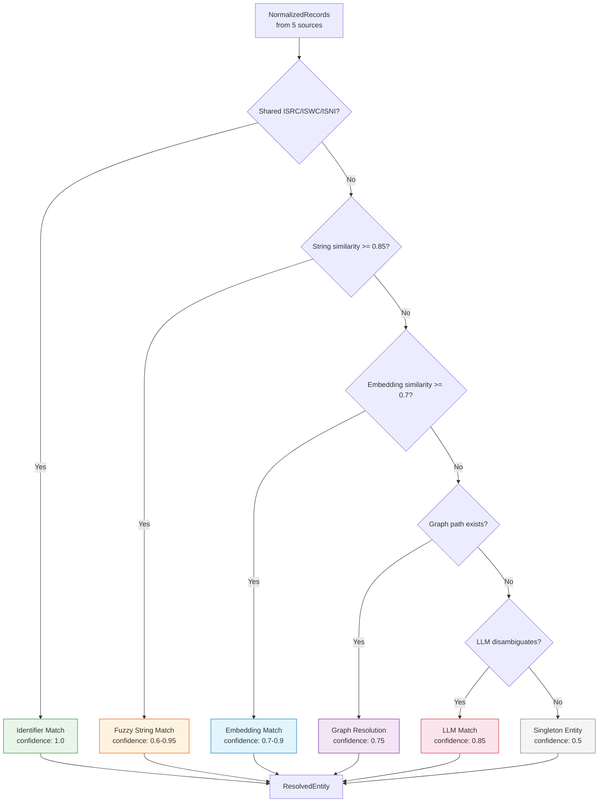

# Entity Resolution

> Is "Imogen Heap" on Discogs the same person as "Imogen J Heap" on MusicBrainz? Entity resolution figures it out -- and tells you how confident it is.

---

## The Simple Version

Imagine you have five different address books, and you need to figure out which entries refer to the same person:

- Address book 1: "Imogen Heap"
- Address book 2: "Imogen J. Heap"
- Address book 3: "Heap, Imogen"
- Address book 4: "I. Heap" (with a phone number matching book 1)
- Address book 5: "Imogen Heap" (but it is a different person with the same name)

**Entity resolution is the process of deciding which entries are the same person and which are different people.** It is harder than it sounds because:

- Names are spelled differently across sources
- The same name can refer to different people
- Some entries have ID numbers (like a phone number) that help, others do not
- Sources disagree with each other

The scaffold uses a **cascade of methods** -- starting with the most reliable (matching ID numbers) and falling back to fuzzier approaches (name similarity, AI-assisted disambiguation) only when needed.

!!! example "The Library Card Analogy"
    If two library cards have the same barcode, they are definitely the same person. If they have different barcodes but the same name and address, they are *probably* the same person. If they have different barcodes and only a similar name, you need to look more carefully. The cascade mirrors this logic.

---

## For Music Industry Professionals

### The 70% Problem

Industry research estimates that up to **70% of music credits have errors or omissions** in existing distribution chains. This is not an AI problem -- it is a data quality problem that has existed since the transition from physical to digital distribution:

- Session musicians are routinely omitted from digital credits
- Names are transliterated differently across territories
- Pseudonyms, stage names, and legal names create parallel identities
- Label mergers and catalog acquisitions scramble metadata

Entity resolution is the scaffold's answer to this problem. By cross-referencing five sources (MusicBrainz, Discogs, AcoustID, file metadata, and artist input), the system can catch errors that any single source would miss.

### The Five Sources

| Source | Strength | Weakness |
|--------|----------|----------|
| **MusicBrainz** | Community-curated, comprehensive, has MBIDs | Volunteer-edited, can have errors |
| **Discogs** | Strong for vinyl/physical releases, user-contributed | Less structured, marketplace-focused |
| **AcoustID** | Audio fingerprint matching -- content-based, not metadata-based | Only identifies recordings, not people |
| **File Metadata** | Available for any audio file, no API needed | Often incomplete or incorrect (ID3 tag quality) |
| **Artist Input** | Authoritative when available -- the artist knows best | Rare, subjective, may conflict with documentation |

### Source Reliability Weights

The scaffold assigns default reliability weights to each source:

| Source | Weight | Reasoning |
|--------|--------|-----------|
| MusicBrainz | 0.95 | Community-curated with structured identifiers |
| Discogs | 0.85 | Large catalog, user-contributed with moderation |
| AcoustID | 0.80 | Content-based (fingerprint), but limited metadata |
| File Metadata | 0.70 | Available everywhere, but often low quality |
| Artist Input | 0.60 | Authoritative but subjective and incomplete |

!!! note "Why Artist Input Has the Lowest Weight"
    This is counterintuitive -- the artist should know their own credits. But in practice, artist-submitted metadata is often incomplete (artists forget session musicians), uses informal names (nicknames instead of legal names), and may reflect the artist's *perception* rather than the *documentation*. The scaffold gives it lower weight by default but allows human reviewers to override.

---

## For Engineers

### The Resolution Cascade

Entity resolution follows a cascade strategy, starting with the highest-confidence method and falling back as needed:



### Signal Weights

The `ResolutionOrchestrator` combines scores from each method using configurable weights:

```python
# From src/music_attribution/resolution/orchestrator.py
_DEFAULT_WEIGHTS: dict[str, float] = {
    "identifier": 1.0,    # ISRC/ISWC/ISNI exact match
    "splink": 0.8,        # Probabilistic record linkage
    "string": 0.6,        # Fuzzy string similarity
    "embedding": 0.7,     # Vector embedding similarity
    "graph": 0.75,        # Graph path evidence
    "llm": 0.85,          # LLM disambiguation
}
```

The combined confidence is a weighted average:

```python
def _compute_confidence(self, details: ResolutionDetails) -> float:
    scores: list[tuple[float, float]] = []
    if details.matched_identifiers:
        scores.append((1.0, self._weights["identifier"]))
    if details.string_similarity is not None:
        scores.append((details.string_similarity, self._weights["string"]))
    # ... (embedding, graph, llm similarly)

    total_weight = sum(w for _, w in scores)
    weighted_sum = sum(s * w for s, w in scores)
    return min(weighted_sum / total_weight, 1.0)
```

### Identifier Matching with Union-Find

The first cascade step groups records by shared identifiers using a union-find algorithm:

```python
# From src/music_attribution/resolution/orchestrator.py
def _group_by_identifiers(self, records: list[NormalizedRecord]) -> list[list[int]]:
    """Group records by shared identifiers using union-find."""
    id_index: dict[str, list[int]] = defaultdict(list)
    for i, record in enumerate(records):
        for field in ("isrc", "iswc", "isni", "mbid", "acoustid_fingerprint"):
            val = getattr(record.identifiers, field, None)
            if val:
                id_index[f"{field}:{val}"].append(i)

    # Union records sharing any identifier
    for indices in id_index.values():
        for j in range(1, len(indices)):
            union(indices[0], indices[j])
```

If record A has ISRC X and record B has ISRC X, they are grouped together with confidence 1.0 regardless of name differences.

### Splink Probabilistic Linkage

For records that do not share identifiers, the scaffold uses [Splink](https://github.com/moj-analytical-services/splink) for Fellegi-Sunter probabilistic record linkage:

```python
# From src/music_attribution/resolution/splink_linkage.py
class SplinkMatcher:
    """Probabilistic record linkage using Splink.
    Uses Fellegi-Sunter model with configurable comparison
    columns and blocking rules."""

    def estimate_parameters(self, records: pd.DataFrame) -> None:
        """Estimate m/u parameters from data."""
        # Uses DuckDB backend for performance
        # Blocking rules reduce comparison space
        # EM algorithm estimates match probabilities

    def predict(self, records: pd.DataFrame) -> pd.DataFrame:
        """Returns: unique_id_l, unique_id_r, match_probability"""

    def cluster(self, predictions: pd.DataFrame, threshold: float = 0.85):
        """Union-find clustering above threshold."""
```

The Fellegi-Sunter model estimates two probability distributions:

- **m-probability:** P(fields agree | records are a true match)
- **u-probability:** P(fields agree | records are not a match)

The ratio m/u gives the likelihood ratio for each field comparison, and these are combined to produce an overall match probability.

### Conflict Detection

When sources disagree, the orchestrator detects and records conflicts:

```python
# From src/music_attribution/resolution/orchestrator.py
def _detect_conflicts(self, records: list[NormalizedRecord]) -> list[Conflict]:
    names = {r.canonical_name for r in records}
    if len(names) > 1:
        name_by_source = {r.source.value: r.canonical_name for r in records}
        conflicts.append(
            Conflict(
                field="canonical_name",
                values=name_by_source,
                severity=ConflictSeverityEnum.LOW,
            )
        )
```

Conflicts are surfaced in the `ResolvedEntity` and displayed in the review queue. Low-severity conflicts (name spelling differences) are informational; high-severity conflicts (different people with the same name) require human review.

### The ResolvedEntity Schema

The output of entity resolution is a `ResolvedEntity` that carries full resolution provenance:

```python
# From src/music_attribution/schemas/resolved.py
class ResolvedEntity(BaseModel):
    entity_type: EntityTypeEnum
    canonical_name: str                          # Chosen by frequency + source priority
    alternative_names: list[str]                 # All other names seen
    identifiers: IdentifierBundle                # Merged from all sources
    source_records: list[SourceReference]         # Which records contributed
    resolution_method: ResolutionMethodEnum       # EXACT_ID, FUZZY_STRING, etc.
    resolution_confidence: float                  # 0.0-1.0 weighted score
    resolution_details: ResolutionDetails         # Per-method breakdown
    assurance_level: AssuranceLevelEnum           # Computed from evidence
    conflicts: list[Conflict]                     # Unresolved disagreements
    needs_review: bool                            # True if confidence < 0.5
    review_reason: str | None
```

### Resolution Method Hierarchy

The primary method is determined by the highest-confidence signal available:

| Condition | Method | Typical Confidence |
|-----------|--------|-------------------|
| Shared ISRC/ISWC/ISNI/MBID | `EXACT_ID` | 1.0 |
| String similarity >= 0.85 | `FUZZY_STRING` | 0.85-0.95 |
| Embedding similarity >= 0.7 | `EMBEDDING` | 0.70-0.90 |
| Graph path evidence | `GRAPH` | 0.60-0.80 |
| LLM disambiguation | `LLM` | 0.70-0.95 |
| No match found | `EXACT_ID` (singleton) | 0.50 |

### Key Source Files

| File | Role |
|------|------|
| `src/music_attribution/resolution/orchestrator.py` | `ResolutionOrchestrator` -- the cascade coordinator |
| `src/music_attribution/resolution/identifier_match.py` | `IdentifierMatcher` -- ISRC/ISWC/ISNI exact matching |
| `src/music_attribution/resolution/string_similarity.py` | `StringSimilarityMatcher` -- fuzzy name matching |
| `src/music_attribution/resolution/embedding_match.py` | Embedding-based similarity matching |
| `src/music_attribution/resolution/embedding_service.py` | Embedding generation service |
| `src/music_attribution/resolution/splink_linkage.py` | `SplinkMatcher` -- Fellegi-Sunter probabilistic linkage |
| `src/music_attribution/resolution/graph_resolution.py` | Graph path-based resolution |
| `src/music_attribution/resolution/llm_disambiguation.py` | LLM-assisted disambiguation for hard cases |
| `src/music_attribution/schemas/resolved.py` | `ResolvedEntity`, `ResolutionDetails`, `Conflict` |
| `src/music_attribution/schemas/normalized.py` | `NormalizedRecord`, `IdentifierBundle` (input) |

---

## How This Maps to Code

Entity resolution is the second pipeline stage, consuming `NormalizedRecord` objects and producing `ResolvedEntity` objects:

1. **ETL** produces `NormalizedRecord` per source (one record per source per entity)
2. **Identifier Match** groups records sharing ISRC/ISWC/ISNI/MBID (union-find)
3. **String Similarity** matches ungrouped records by name (threshold: 0.85)
4. **Splink** handles ambiguous cases with probabilistic linkage (Fellegi-Sunter)
5. **Embedding Match** catches semantic similarity that string matching misses
6. **Graph Resolution** uses relationship paths (A performed on B, B produced by C)
7. **LLM Disambiguation** handles genuinely ambiguous cases requiring world knowledge
8. **Conflict Detection** flags disagreements for human review

!!! quote "Paper Citation"
    "Entity resolution is not a preprocessing step -- it is the core challenge. Accurate attribution is impossible without accurate identity, and accurate identity requires reconciling fundamentally messy data." -- Teikari (2026), Section 3.3
