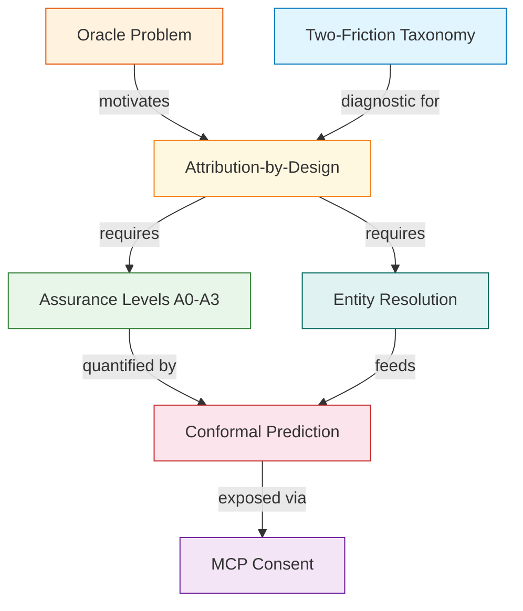

# Key Concepts

> Six foundational ideas that shape the scaffold's design -- from the Oracle Problem to conformal prediction.

---

Every design decision in this scaffold traces back to a small set of theoretical concepts from the [companion paper](https://papers.ssrn.com/sol3/papers.cfm?abstract_id=6109087). This section explains each one at three levels of depth: a plain-language analogy, a music-industry perspective, and an engineering deep-dive.

## The Concepts

## Reading Order

Each page uses the same three-tier structure:

| Section | Audience | What You Get |
|---------|----------|--------------|
| **The Simple Version** | Anyone | Plain-language analogy, zero jargon |
| **For Music Industry Professionals** | Label ops, rights managers | Real-world implications, industry context |
| **For Engineers** | Developers, ML engineers | Implementation details, code pointers, citations |

!!! tip "Start Where You Are"
    You do not need to read these in order. If you are an engineer wanting to understand the confidence system, jump straight to [Conformal Prediction](conformal-prediction.md). If you are a rights manager wondering how AI platforms query permissions, start with [MCP Consent](mcp-consent.md).

## Concept Map

| Concept | One-Line Summary | Key Question It Answers |
|---------|-----------------|------------------------|
| [Oracle Problem](oracle-problem.md) | Digital systems cannot fully verify physical reality | Why can't we just detect what was used to train a model? |
| [Assurance Levels](assurance-levels.md) | A0--A3 tiers of verification depth | How much should I trust this attribution? |
| [Two-Friction Taxonomy](two-friction-taxonomy.md) | Administrative friction vs. discovery friction | Which parts of music licensing should we automate? |
| [Conformal Prediction](conformal-prediction.md) | Calibrated confidence with statistical guarantees | What does "90% confident" actually mean? |
| [MCP Consent](mcp-consent.md) | Machine-readable permission queries for AI | How do AI platforms ask "can I use this music?" |
| [Entity Resolution](entity-resolution.md) | Matching messy records across sources | Is "Imogen Heap" on Discogs the same as on MusicBrainz? |

## How These Connect to the Pipeline

The scaffold's 5-pipeline architecture maps directly to these concepts:

| Pipeline | Primary Concept | Boundary Object |
|----------|----------------|-----------------|
| **ETL** (5 sources) | Entity Resolution | `NormalizedRecord` |
| **Entity Resolution** | Entity Resolution, Assurance Levels | `ResolvedEntity` |
| **Attribution Engine** | Conformal Prediction, Assurance Levels | `AttributionRecord` |
| **API / MCP Server** | MCP Consent, Two-Friction | `PermissionBundle` |
| **Chat Agent + Frontend** | Oracle Problem (transparency) | Human-readable UI |

!!! info "Paper Reference"
    All concepts are developed in detail in: Teikari, P. (2026). *Governing Generative Music: Attribution Limits, Platform Incentives, and the Future of Creator Income*. [SSRN No. 6109087](https://papers.ssrn.com/sol3/papers.cfm?abstract_id=6109087).
