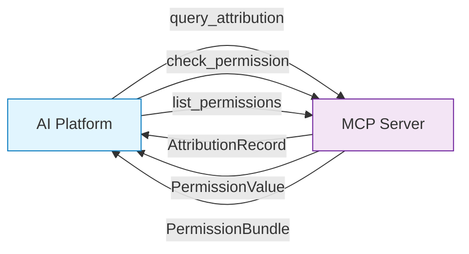
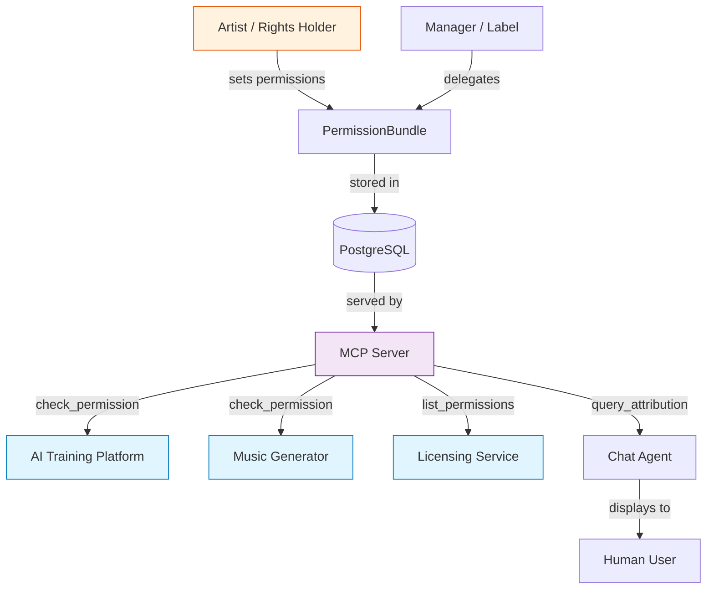

# MCP Consent Infrastructure

> Model Context Protocol as "robots.txt for AI" -- machine-readable permission queries that let AI platforms ask before using music.

---

## The Simple Version

You know how websites have a `robots.txt` file that tells search engines "you can index this page, but not that one"? It is a simple text file that machines read automatically, without any human needing to send an email or make a phone call.

Music needs the same thing for AI. Right now, if an AI company wants to know "can I use this song to train my model?", there is no machine-readable way to ask. They would have to email a label, wait weeks, and maybe get an answer. Or they just use the music without asking.

**MCP (Model Context Protocol) creates a machine-readable permission system for music.** An AI platform connects to a music catalog's MCP server and asks: "Can I use song X for AI training?" The server instantly replies with one of:

- **ALLOW** -- go ahead
- **DENY** -- no, do not use this
- **ASK** -- contact the rights holder
- **ALLOW_WITH_ATTRIBUTION** -- yes, but credit the artist
- **ALLOW_WITH_ROYALTY** -- yes, but pay this rate

No emails. No lawyers. No six-week delays. The answer is instant, machine-readable, and auditable.

!!! example "The Drive-Through Analogy"
    Instead of parking, walking into a restaurant, and waiting to be seated (current licensing), MCP is a drive-through window. You pull up, ask what you want, get an answer, and move on. The menu is posted (machine-readable), the prices are clear, and the transaction is fast.

---

## For Music Industry Professionals

### How Artists Declare Permissions

The scaffold implements a **Permission Patchbay** -- a structured way for artists and rights holders to declare their preferences for every type of use:

=== "Permission Types"

    Artists can set separate permissions for each use case:

    | Permission Type | What It Covers |
    |----------------|---------------|
    | `AI_TRAINING` | General AI model training |
    | `AI_TRAINING_COMPOSITION` | Training on the musical composition |
    | `AI_TRAINING_RECORDING` | Training on the specific recording |
    | `AI_TRAINING_STYLE` | Learning the artist's style |
    | `VOICE_CLONING` | Cloning the artist's voice |
    | `STYLE_LEARNING` | Learning stylistic patterns |
    | `LYRICS_IN_CHATBOTS` | Displaying lyrics in AI chatbots |
    | `DATASET_INCLUSION` | Including in research datasets |
    | `SAMPLE` | Sampling in new works |
    | `REMIX` | Remixing the work |
    | `SYNC_LICENSE` | Synchronization with video |
    | `DERIVATIVE_WORK` | Creating derivative works |

=== "Permission Values"

    Each permission can have one of five values:

    | Value | Meaning |
    |-------|---------|
    | `ALLOW` | Permitted, no conditions |
    | `DENY` | Not permitted under any circumstances |
    | `ASK` | Contact the rights holder for case-by-case approval |
    | `ALLOW_WITH_ATTRIBUTION` | Permitted if the artist is credited |
    | `ALLOW_WITH_ROYALTY` | Permitted if a royalty rate is paid |

=== "Scope Levels"

    Permissions can be set at different granularities:

    | Scope | Example |
    |-------|---------|
    | `CATALOG` | "All of Imogen Heap's works" |
    | `RELEASE` | "The album *Speak for Yourself*" |
    | `RECORDING` | "The recording of *Hide and Seek*" |
    | `WORK` | "The composition *Hide and Seek*" |

### Delegation Chains

In the music industry, permission decisions often flow through a chain: artist to manager to label to distributor. The scaffold tracks this with delegation entries:

```
Artist (Imogen Heap) → Manager (can_modify: true, can_delegate: true)
    → Label (can_modify: false, can_delegate: true)
        → Distributor (can_modify: false, can_delegate: false)
```

Each link in the chain specifies whether the delegate can modify permissions or further delegate authority.

!!! warning "The robots.txt Gap"
    Current rights reservation methods (robots.txt, LLMS_TXT) are web-only and do not cover audio content accessed via APIs or streaming platforms. The scaffold's `TdmReservationMethodEnum` includes `MCP_PERMISSION_QUERY` specifically to fill this gap.

### Why This Matters Now

The EU's DSM Directive Article 4 allows copyright holders to opt out of text-and-data mining via "machine-readable reservation." The GPAI Code of Practice (July 2025) requires AI providers to respect these reservations. But music has no standardized, machine-readable way to declare them. MCP provides the infrastructure.

---

## For Engineers

### MCP Server Implementation

The scaffold's MCP server is implemented in `src/music_attribution/mcp/server.py` using the FastMCP framework:

```python
# From src/music_attribution/mcp/server.py
class MCPAttributionServer:
    """MCP server for attribution and permission queries."""

    def __init__(self) -> None:
        self.name = "music-attribution"
        self._mcp = FastMCP(self.name)
        self._attributions: dict[uuid.UUID, AttributionRecord] = {}
        self._permissions: dict[uuid.UUID, PermissionBundle] = {}
        self._register_tools()
```

### Tool Definitions

The server exposes three tools that AI platforms can call:



=== "query_attribution"

    Retrieve the full attribution record for a work:

    ```python
    @self._mcp.tool()
    async def query_attribution(work_id: str) -> dict:
        """Query attribution by work entity ID."""
        # Returns full AttributionRecord with confidence, assurance,
        # credits, conformal set, and provenance chain
    ```

=== "check_permission"

    Check a specific permission for an entity:

    ```python
    @self._mcp.tool()
    async def check_permission(entity_id: str, permission_type: str) -> dict:
        """Check a specific permission for an entity."""
        # Returns: entity_id, permission_type, value (ALLOW/DENY/ASK/...),
        # and any conditions
    ```

    Example response:
    ```json
    {
        "entity_id": "550e8400-e29b-41d4-a716-446655440000",
        "permission_type": "AI_TRAINING",
        "value": "ALLOW_WITH_ATTRIBUTION",
        "conditions": [
            {"condition_type": "attribution_format", "value": "ISRC + artist name"}
        ]
    }
    ```

=== "list_permissions"

    List all permissions for an entity:

    ```python
    @self._mcp.tool()
    async def list_permissions(entity_id: str) -> dict:
        """List all permissions for an entity."""
        # Returns scope and all permission entries
    ```

### The PermissionBundle Schema

Each entity's permissions are stored as a `PermissionBundle`:

```python
# From src/music_attribution/schemas/permissions.py
class PermissionBundle(BaseModel):
    schema_version: str = "1.0.0"
    permission_id: uuid.UUID
    entity_id: uuid.UUID
    scope: PermissionScopeEnum           # CATALOG, RELEASE, RECORDING, WORK
    permissions: list[PermissionEntry]    # At least one entry
    effective_from: datetime              # When permissions become active
    effective_until: datetime | None      # Optional expiry
    delegation_chain: list[DelegationEntry]
    default_permission: PermissionValueEnum  # Fallback for unset types
```

Individual permission entries can carry conditions:

```python
class PermissionEntry(BaseModel):
    permission_type: PermissionTypeEnum       # AI_TRAINING, VOICE_CLONING, etc.
    value: PermissionValueEnum                # ALLOW, DENY, ASK, etc.
    conditions: list[PermissionCondition]     # Optional conditions
    royalty_rate: Decimal | None              # Required if ALLOW_WITH_ROYALTY
    attribution_requirement: str | None       # Required if ALLOW_WITH_ATTRIBUTION
    territory: list[str] | None              # Geographic restrictions
```

### Validation Rules

The schema enforces consistency through Pydantic validators:

- `ALLOW_WITH_ROYALTY` requires `royalty_rate > 0`
- `ALLOW_WITH_ATTRIBUTION` requires non-None `attribution_requirement`
- `CATALOG` scope requires `scope_entity_id` to be None
- Non-catalog scopes require `scope_entity_id` to be set
- All timestamps must be timezone-aware (UTC)
- `effective_from` must be before `effective_until`

### TDM Reservation Methods

The scaffold tracks how rights are reserved across different protocols:

```python
# From src/music_attribution/schemas/enums.py
class TdmReservationMethodEnum(StrEnum):
    ROBOTS_TXT = "ROBOTS_TXT"             # Web-only, text/data mining
    LLMS_TXT = "LLMS_TXT"                 # LLM-specific extension
    MACHINE_READABLE_TAG = "MACHINE_READABLE_TAG"  # HTML meta tags
    RIGHTS_RESERVATION_API = "RIGHTS_RESERVATION_API"  # Programmatic API
    MCP_PERMISSION_QUERY = "MCP_PERMISSION_QUERY"      # This scaffold's approach
```

!!! abstract "Design Principle"
    The scaffold positions MCP as the most complete reservation method because it is bidirectional (query and response), structured (typed permissions, not just allow/deny), and auditable (provenance chain on every query).

### Integration Architecture



### Key Source Files

| File | Role |
|------|------|
| `src/music_attribution/mcp/server.py` | `MCPAttributionServer` with three tools |
| `src/music_attribution/schemas/permissions.py` | `PermissionBundle`, `PermissionEntry`, `DelegationEntry` |
| `src/music_attribution/schemas/enums.py` | `PermissionTypeEnum`, `PermissionValueEnum`, `TdmReservationMethodEnum` |
| `src/music_attribution/schemas/compliance.py` | `ComplianceAttestation` for Fairly Trained, C2PA, EU AI Act |

---

## How This Maps to Code

The MCP consent infrastructure connects four layers of the scaffold:

1. **Schemas** define the permission vocabulary (16 permission types, 5 values, 4 scopes)
2. **MCP Server** exposes three tools for querying permissions and attribution
3. **API layer** serves the same data over REST for non-MCP consumers
4. **Frontend** displays permission status alongside attribution records

!!! quote "Paper Citation"
    "MCP transforms consent from a bilateral negotiation (email chains, PDF contracts) into a multilateral infrastructure (machine-readable, auditable, instant). This is the difference between a customs checkpoint and a free-trade zone." -- Teikari (2026), Section 5.3
