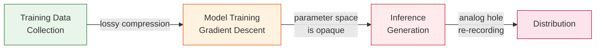

# The Oracle Problem

> Digital systems cannot fully verify what happened in the physical world -- so design for deterrence, not detection.

---

## The Simple Version


*Figure 1. The Oracle Problem explained through a paint-mixing analogy: once creative works are blended inside an AI model through gradient descent and weight averaging, separating individual contributions is fundamentally impossible -- motivating the attribution-by-design approach used in this scaffold.*

Imagine mixing red and blue paint together to get purple. Once the colors are blended, no amount of analysis can tell you the exact red and blue paints that went in, or their exact proportions. You can make educated guesses ("this looks like more blue than red"), but you can never be certain.

Generative AI models do something similar with music. During training, thousands of songs are blended into the model's parameters. After training, the original songs are not stored anywhere -- they have been dissolved into statistical weights. Asking "which songs influenced this output?" is like asking "which paints made this purple?"

**The Oracle Problem says: no external system can perfectly answer questions about what happened inside a process it did not witness.** For music attribution, this means we will never have a perfect detection system. Instead, we need to embed provenance *before* mixing happens.

!!! example "The Baking Analogy"
    Once you bake a cake, no laboratory can perfectly decompose it back into eggs, flour, and sugar with exact quantities. The heat of training (gradient descent) is irreversible, just like baking. Attribution-by-design means labeling each ingredient *before* it goes into the bowl.

---

## For Music Industry Professionals

### Why Post-Hoc Detection Fails


*Figure 2. The Oracle Problem at the technical level: attribution information is irreversibly destroyed through tokenization, gradient descent, and weight averaging during model training, while the analog hole further undermines provenance by allowing physical re-encoding to break digital identity chains.*

The music industry's current approach to AI attribution relies on **post-hoc detection**: analyze an AI-generated track and try to figure out what training data influenced it. This approach has three fundamental weaknesses:

1. **Style is not copyrightable.** If an AI produces something that "sounds like" an artist, that is not infringement under current law. Detection tools that find stylistic similarity are measuring something that is legally irrelevant.

2. **Training data is destroyed during training.** Modern generative models do not store songs -- they extract statistical patterns and discard the originals. There is no hidden database to subpoena.

3. **The analog hole persists.** Even with perfect watermarking, someone can always re-record audio through a microphone, degrading or removing any embedded signal. Digital rights management has never solved this in 30 years.

### The Industry Implication


*Figure 3. Attribution-by-design versus post-hoc detection: the left panel shows how the oracle problem blocks reverse engineering of AI-generated output, while the right panel shows how embedding provenance with industry identifiers (ISRC, ISWC, ISNI) before training preserves queryable attribution.*

Instead of investing in better detection, the paper argues for **attribution-by-design**: embedding machine-readable provenance at the moment of creation, not trying to reconstruct it afterward. This is analogous to how the food industry moved from "test for contamination" to "HACCP preventive controls."

!!! warning "The 70% Gap"
    Industry research estimates that up to 70% of music credits already have errors or omissions in *existing* (non-AI) distribution chains. The Oracle Problem is not a future concern about AI -- it is a present reality in traditional music metadata.

### Deterrence, Not Detection


*Figure 4. Deterrence economics applied to music attribution: the system does not need perfect detection to be effective, just as tax audits deter fraud at a 3% audit rate -- the expected penalty (p x d x F) need only exceed the expected gain (g) from infringement.*

The paper's position is that the correct framing is **deterrence economics**, not detection technology:

- Make unauthorized use expensive to hide (audit trails, transparency requirements)
- Make authorized use cheap to prove (machine-readable permissions, standardized metadata)
- Accept that some infringement will be undetectable, and price that into licensing models

### Commercial Attribution Approaches

Several companies are building attribution technology that operates within Oracle Problem constraints:

| Vendor | Approach | Oracle Limitation |
|--------|----------|-------------------|
| **Musical AI** | Training-time influence functions | Requires model cooperation; post-training analysis is approximate |
| **Sureel** | Unlearning-based attribution (patent pending) | Computationally expensive; approximation guarantees are weak |
| **Sony CSL** | Embedding similarity matching | Measures similarity, not causation -- stylistic overlap is not training proof |
| **ProRata** | Inference-time content attribution | Only works at generation time; cannot audit past outputs |

Each of these approaches is valuable but partial. The scaffold's `AttributionMethodEnum` enumerates them to track which method produced each attribution claim.

---

## For Engineers

### Three Destructive Stages

The Oracle Problem manifests at three stages in the generative AI pipeline, each progressively more destructive to provenance:



**Stage 1 -- Data Collection:** Training datasets are often assembled without systematic provenance tracking. Even when sources are logged, metadata may be incomplete or incorrect (the 70% gap).

**Stage 2 -- Model Training:** Gradient descent distributes information from individual training examples across billions of parameters. Influence function methods (e.g., Musical AI's approach) can estimate which training examples had the most impact, but these are approximations with their own confidence bounds.

**Stage 3 -- Inference + Distribution:** The generated output passes through the analog hole -- any physical re-capture (recording speakers, re-encoding) can strip watermarks and embedded metadata.

### Attribution-by-Design in the Scaffold

The scaffold addresses the Oracle Problem by embedding provenance at every pipeline step, not attempting post-hoc reconstruction:

=== "ProvenanceEvent Chain"

    Every `AttributionRecord` carries a full `provenance_chain` documenting each processing step:

    ```python
    # From src/music_attribution/schemas/attribution.py
    class ProvenanceEvent(BaseModel):
        event_type: ProvenanceEventTypeEnum  # FETCH, RESOLVE, SCORE, REVIEW
        timestamp: datetime
        agent: str                           # Which component acted
        details: EventDetails                # Discriminated union of detail types
        step_uncertainty: StepUncertainty | None  # Per-step uncertainty
    ```

=== "Uncertainty Tracking"

    Each step records its uncertainty decomposition (UProp, Duan 2025):

    ```python
    # From src/music_attribution/schemas/uncertainty.py
    class StepUncertainty(BaseModel):
        stated_confidence: float       # What the step claims
        calibrated_confidence: float   # After calibration correction
        intrinsic_uncertainty: float   # Data noise (aleatoric)
        extrinsic_uncertainty: float   # Model/pipeline noise (epistemic)
    ```

=== "Overconfidence Detection"

    The system actively flags when stated confidence exceeds actual accuracy:

    ```python
    # From src/music_attribution/schemas/uncertainty.py
    class OverconfidenceReport(BaseModel):
        stated_confidence: float
        actual_accuracy: float
        overconfidence_gap: float  # stated - actual, can be negative
        th_score: float | None     # Tian 2025 TH-Score
    ```

### The Analog Hole and Watermarking

The scaffold's `WatermarkTypeEnum` defines supported watermark types (SynthID, AudioSeal, WavMark, Digimarc), but the architecture assumes watermarks will be stripped. The design principle is:

!!! abstract "Design Principle"
    Watermarks are a *complement* to attribution-by-design, never a *substitute*. The scaffold treats watermark detection as one signal among many, weighted by its known fragility.

### Training Data Attribution Schemas

The scaffold includes stub schemas for commercial training data attribution, acknowledging the Oracle Problem while providing structure for partial answers:

```python
# From src/music_attribution/schemas/training_attribution.py
class TrainingInfluence(BaseModel):
    source_work_id: str              # Which song influenced the model
    target_model_id: str             # Which model was influenced
    method: AttributionMethodEnum    # How the influence was measured
    influence_percentage: float      # 0.0-100.0 (approximate)
    confidence: float                # 0.0-1.0 (how much to trust this)
    temporal_segments: list[TemporalSegment]  # Which parts of the song
    stem_influences: list[StemInfluence]      # Which stems (vocals, drums)
```

The `confidence` field on `TrainingInfluence` is critical: it acknowledges that influence measurements are always approximations. A `confidence: 0.3` on an `influence_percentage: 15.0` means "we think about 15% of the output was influenced by this song, but we are not very confident in that number."

### Key Source Files

| File | Role |
|------|------|
| `src/music_attribution/schemas/attribution.py` | `ProvenanceEvent`, `AttributionRecord` with provenance chain |
| `src/music_attribution/schemas/uncertainty.py` | `StepUncertainty`, `OverconfidenceReport`, `TrajectoryCalibration` |
| `src/music_attribution/schemas/enums.py` | `ProvenanceEventTypeEnum`, `WatermarkTypeEnum`, `UncertaintySourceEnum` |
| `src/music_attribution/attribution/aggregator.py` | Builds provenance chain during credit aggregation |

---

## How This Maps to Code

The Oracle Problem is not a single module -- it is the *reason* the scaffold exists. Every pipeline stage records provenance because we accept that perfect post-hoc attribution is impossible:

1. **ETL pipeline** records `FetchEventDetails` with source, timestamp, and record count
2. **Entity Resolution** records `ResolveEventDetails` with method and confidence range
3. **Attribution Engine** records `ScoreEventDetails` with scoring method and confidence delta
4. **Human Review** records `ReviewEventDetails` linking to feedback cards
5. **API/MCP** exposes provenance as first-class data, not hidden metadata

!!! quote "Paper Citation"
    "The Oracle Problem is not merely technical -- it is ontological. No amount of computational power can reconstruct information that was never recorded." -- Teikari (2026), Section 3.1
