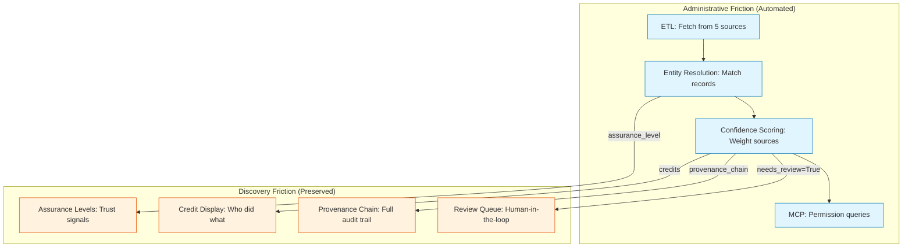

# Two-Friction Taxonomy

> Not all friction in music licensing is bad. The trick is knowing which kind to automate and which to preserve.

---

## The Simple Version


*Figure 8. The two-friction taxonomy: not all friction in music attribution is bad. Administrative friction (licensing forms, royalty calculations, multi-platform registration) should be automated, while discovery friction (DJ curation, artist collaboration, playlist taste-making) must be preserved because it creates cultural value.*

Think about airport security. There are two kinds of waiting:

1. **The security line** -- standing in queue, taking off your shoes, putting your laptop in a bin. This is *administrative friction*. It does not make you safer; it just costs everyone time. If we could automate it (like TSA PreCheck or biometric gates), we should.

2. **The flight departure board** -- scanning dozens of destinations, comparing prices, checking layover times. This is *discovery friction*. It takes effort, but it is the effort of finding the right choice. Removing it entirely (by just assigning you a random flight) would be worse.

Music licensing has both kinds:

- **Administrative friction:** Chasing down rights holders, filling out forms, waiting weeks for license approvals, manually typing ISRC codes. Automate all of it.
- **Discovery friction:** Browsing a record store, reading liner notes, exploring an artist's back catalog, understanding what makes a particular recording special. Preserve all of it.

**The two-friction taxonomy says: automate the paperwork, but protect the browsing.** Technology that cannot tell the difference will damage the culture it claims to serve.

---

## For Music Industry Professionals

### The Diagnostic Test


*Figure 9. The friction diagnostic test: three questions (Does it involve human agency? Does it build identity? Does it create community?) classify any friction point in the music attribution pipeline, using OR logic where any YES means discovery friction to preserve.*

When evaluating any new music technology, ask one question:

!!! tip "The Friction Diagnostic"
    "Does this technology reduce the **paperwork** of licensing, or does it reduce the **exploration** of music?" If the answer is paperwork, build it. If the answer is exploration, be very careful.

| Friction Type | Examples | Action |
|--------------|---------|--------|
| **Administrative** | License clearance, royalty splits, ISRC registration, contract routing | Automate aggressively |
| **Discovery** | Browsing record shops, reading liner notes, playlist curation, word-of-mouth | Preserve or enhance |

### Real-World Applications


*Figure 10. Real-world friction examples classified using the two-friction taxonomy: administrative friction involves compliance and process (licensing forms, ISRC assignment, royalty calculations), while discovery friction involves taste and relationships (DJ sets, co-writing sessions, editorial curation).*

=== "Administrative Friction (Automate)"

    - **Sync licensing clearance:** Currently takes 6-12 weeks for a simple sync license. MCP-based permission queries could reduce this to seconds.
    - **Royalty split disputes:** Session musician credits are often lost or incorrect. Automated cross-source verification (the scaffold's entity resolution) catches errors early.
    - **Rights holder identification:** Finding who owns what rights for a 1990s recording can require dozens of emails. A well-indexed permission patchbay answers this instantly.

=== "Discovery Friction (Preserve)"

    - **Algorithmic recommendation opacity:** When Spotify's algorithm surfaces a track, the listener has no idea *why*. This removes discovery friction in a way that makes music feel interchangeable.
    - **AI-generated "similar to" tracks:** Generating an AI track "in the style of" an artist removes the discovery friction of finding that artist's actual work. This devalues the original.
    - **Liner notes and credits:** Physical media forced listeners to engage with credits. Digital distribution stripped this away. The scaffold's frontend restores credit visibility.

### The Bourdieu Connection

The taxonomy draws on Pierre Bourdieu's concept of **cultural capital**. Discovery friction builds cultural capital -- the knowledge, taste, and context that makes music appreciation meaningful. When you discover a record by digging through crates at a shop, you acquire context (the label, the era, the other artists on the shelf) that enriches your understanding.

Administrative friction builds nothing. It is pure transaction cost. The two types of friction should never be conflated.

!!! info "Akerlof's Market for Lemons"
    Discovery friction also prevents George Akerlof's "market for lemons" problem. When listeners cannot distinguish high-quality music from low-quality AI-generated content (because discovery friction has been removed), the market collapses to the lowest common denominator. Some friction is a quality signal.

---

## For Engineers

### The Diagnostic in Code

The scaffold implicitly encodes the two-friction taxonomy through what it automates and what it surfaces for human decision:



### Review Threshold as Friction Boundary

The `REVIEW_THRESHOLD` in `src/music_attribution/constants.py` is the boundary between automated processing (administrative friction removed) and human review (discovery friction preserved):

```python
REVIEW_THRESHOLD: float = 0.50  # Below this -> needs_review=True
```

- **Above 0.50:** The system is confident enough to proceed without human input. Administrative friction (matching, scoring, querying) is fully automated.
- **Below 0.50:** The system flags the record for human review. This is *intentional* friction -- the human reviewer brings context, judgment, and cultural knowledge that the automated system cannot.

The `AttributionRecord.needs_review` flag and `review_priority` score work together:

```python
# From src/music_attribution/attribution/aggregator.py
needs_review=confidence < REVIEW_THRESHOLD,
review_priority=1.0 - confidence,  # Lower confidence = higher priority
```

### Priority Queue: Automated Triage, Human Decision

The `PriorityQueue` in `src/music_attribution/attribution/priority_queue.py` automates the *ordering* of review tasks (administrative friction) while preserving the *decision* for humans (discovery friction):

- Records are automatically ranked by `review_priority`
- Conflicts between sources are automatically detected and surfaced
- But the final accept/reject decision remains with a human reviewer
- The reviewer sees full provenance, not just a score

### Applying the Diagnostic to New Features

When adding a new feature to the scaffold, apply the two-friction test:

| Proposed Feature | Friction Type | Decision |
|-----------------|---------------|----------|
| Auto-match ISRC codes across sources | Administrative | Automate |
| Auto-resolve credit role disputes | Discovery | Flag for human review |
| Pre-fill form fields from metadata | Administrative | Automate |
| Auto-accept AI suggestions above threshold | Administrative | Automate (with audit trail) |
| Remove provenance chain from API response | Discovery | Never -- this destroys transparency |
| Generate attribution from AI analysis alone | Discovery | Always require human confirmation |

### Theoretical Grounding

The two-friction taxonomy maps to established economic theory:

| Theory | Friction Type | Application |
|--------|--------------|-------------|
| **Coase (1937)** -- Transaction costs | Administrative | Reduce transaction costs of licensing |
| **Bourdieu (1984)** -- Cultural capital | Discovery | Preserve the effort that builds taste and context |
| **Akerlof (1970)** -- Information asymmetry | Discovery | Maintain quality signals in the marketplace |
| **Arrow (1962)** -- Information economics | Both | Information wants to be free (admin) AND expensive (discovery) |

### The Feedback Loop

The scaffold's feedback schema (`src/music_attribution/schemas/feedback.py`) encodes the two-friction taxonomy in its reviewer roles:

```python
# From src/music_attribution/schemas/enums.py
class ReviewerRoleEnum(StrEnum):
    ARTIST = "ARTIST"          # Discovery friction: authoritative cultural context
    MANAGER = "MANAGER"        # Administrative friction: process + rights
    MUSICOLOGIST = "MUSICOLOGIST"  # Discovery friction: historical expertise
    PRODUCER = "PRODUCER"      # Discovery friction: creative knowledge
    FAN = "FAN"                # Discovery friction: community verification
```

Each role brings a different type of knowledge. **Manager** feedback reduces administrative friction (correct rights holder, proper splits). **Artist** and **Musicologist** feedback preserves discovery friction (creative context, historical accuracy). The scaffold weights these differently using `EvidenceTypeEnum`:

| Evidence Type | Friction Role | Weight Signal |
|--------------|--------------|---------------|
| `LINER_NOTES` | Documentary (admin) | High -- physical artifact |
| `SESSION_NOTES` | Documentary (admin) | High -- contemporaneous record |
| `DOCUMENT` | Documentary (admin) | Medium -- varies by document |
| `MEMORY` | Contextual (discovery) | Lower -- subjective but irreplaceable |
| `OTHER` | Varies | Case-by-case |

### Pipeline Feedback Signals

The `PipelineFeedbackTypeEnum` shows how the scaffold routes corrections:

```python
class PipelineFeedbackTypeEnum(StrEnum):
    REFETCH = "REFETCH"        # Admin: source data is stale, re-fetch
    RECALIBRATE = "RECALIBRATE"  # Admin: confidence scores need adjustment
    DISPUTE = "DISPUTE"        # Discovery: human disagrees with attribution
    STALE = "STALE"            # Admin: record has not been updated recently
```

`REFETCH` and `STALE` are administrative signals -- they trigger automated re-processing. `DISPUTE` is a discovery signal -- it routes to the human review queue.

### Key Source Files

| File | Role |
|------|------|
| `src/music_attribution/constants.py` | `REVIEW_THRESHOLD` -- the friction boundary |
| `src/music_attribution/attribution/aggregator.py` | `needs_review` and `review_priority` computation |
| `src/music_attribution/attribution/priority_queue.py` | Automated triage with human decision preserved |
| `src/music_attribution/schemas/attribution.py` | `AttributionRecord.needs_review`, `review_priority` fields |
| `src/music_attribution/schemas/feedback.py` | Human feedback schemas for review decisions |

---

## How This Maps to Code

The two-friction taxonomy is a design principle, not a single module. It manifests as:

1. **Automated pipelines** (ETL, resolution, scoring) handle administrative friction
2. **Review queue** preserves discovery friction -- humans decide, machines triage
3. **Provenance chains** are always exposed, never hidden -- transparency is discovery friction
4. **Confidence thresholds** define the boundary between "automate" and "ask a human"
5. **The frontend** restores credit visibility that digital distribution stripped away
