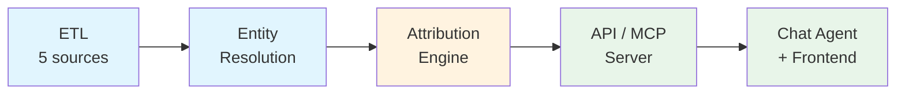

# Music Attribution Scaffold

> **Open-source research scaffold for music attribution with transparent confidence scoring.**
>
> Companion code to: **Teikari, P. (2026). *Governing Generative Music: Attribution Limits, Platform Incentives, and the Future of Creator Income*. SSRN No. 6109087.**

---

## What is This?

Music Attribution Scaffold is a research framework that demonstrates how to build a **multi-source music attribution system** with:

- **Per-field confidence scores** — not just "is this correct?" but "how confident are we, and why?"
- **Entity resolution across messy sources** — reconciling MusicBrainz, Discogs, AcoustID, and file metadata
- **AI-ready permissions via MCP** — machine-readable consent infrastructure for the generative AI era

!!! note "Research Scaffold, Not Production System"
    This repo demonstrates concepts from the [SSRN preprint](https://papers.ssrn.com/sol3/papers.cfm?abstract_id=6109087). It is designed to be forked, extended, and adapted — not deployed as-is.

## The Pipeline



## Quick Start

```bash
git clone https://github.com/petteriTeikari/music-attribution-scaffold.git
cd music-attribution-scaffold
make setup        # Install deps + start PostgreSQL
make agent &      # Start FastAPI backend on :8000
make dev-frontend # Start Next.js frontend on :3000
```

Open [http://localhost:3000](http://localhost:3000) to see 9 Imogen Heap attribution records with confidence scoring.

## Quick Links

<div class="grid cards" markdown>

-   :material-rocket-launch:{ .lg .middle } **Getting Started**

    ---

    Install and run the scaffold in under 5 minutes

    [:octicons-arrow-right-24: Installation](getting-started/installation.md)

-   :material-book-open-variant:{ .lg .middle } **Key Concepts**

    ---

    Understand the Oracle Problem, assurance levels, and two-friction taxonomy

    [:octicons-arrow-right-24: Concepts](concepts/index.md)

-   :material-api:{ .lg .middle } **API Reference**

    ---

    Auto-generated documentation from source code

    [:octicons-arrow-right-24: API Docs](api-reference/index.md)

-   :material-school:{ .lg .middle } **Reproduce the Paper**

    ---

    Map every paper claim to code, tests, and demo commands

    [:octicons-arrow-right-24: Paper Guide](tutorials/reproducing-the-paper.md)

</div>

## Sample Data

The scaffold ships with 9 Imogen Heap works spanning the full confidence range:

| Work | Confidence | Assurance | Needs Review |
|------|-----------|-----------|--------------|
| Hide and Seek | 0.95 | A3 | No |
| Tiny Human | 0.91 | A3 | No |
| The Moment I Said It | 0.82 | A2 | No |
| Goodnight and Go | 0.72 | A2 | No |
| Headlock | 0.58 | A1 | Yes |
| What Have You Done To Me? | 0.48 | A1 | Yes |
| Just for Now | 0.35 | A1 | Yes |
| 2-1 | 0.28 | A1 | Yes |
| Blanket | 0.00 | A0 | Yes |

## Technology Stack

| Layer | Technology | Why |
|-------|-----------|-----|
| **Backend** | Python 3.13, FastAPI, SQLAlchemy | Async-first, type-safe, Pydantic integration |
| **Database** | PostgreSQL + pgvector | Relational + vector search in one database |
| **Agent** | PydanticAI, AG-UI protocol | Type-safe tools, SSE streaming, FallbackModel |
| **Frontend** | Next.js 15, Tailwind v4, CopilotKit | App Router, editorial design system |
| **State** | Jotai | Atomic state, no boilerplate |
| **Analytics** | PostHog | Privacy-first, typed events |
| **MCP** | Model Context Protocol | Machine-readable permission queries |

## Citation

```bibtex
@article{teikariGoverningGenerativeMusic2026,
    title = {Governing Generative Music: Attribution Limits, Platform Incentives, and the Future of Creator Income},
    url = {https://doi.org/10.2139/ssrn.6109087},
    doi = {10.2139/ssrn.6109087},
    publisher = {Social Science Research Network},
    author = {Teikari, Petteri},
    year = {2026},
}
```

## License

MIT. All dependencies verified MIT/Apache/BSD compatible.
