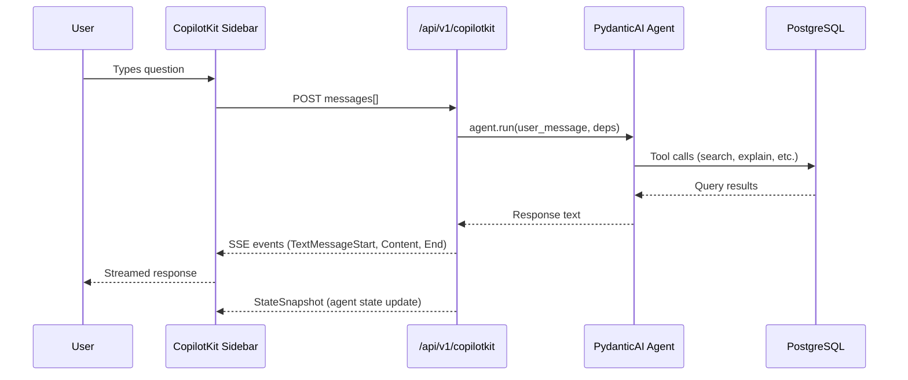
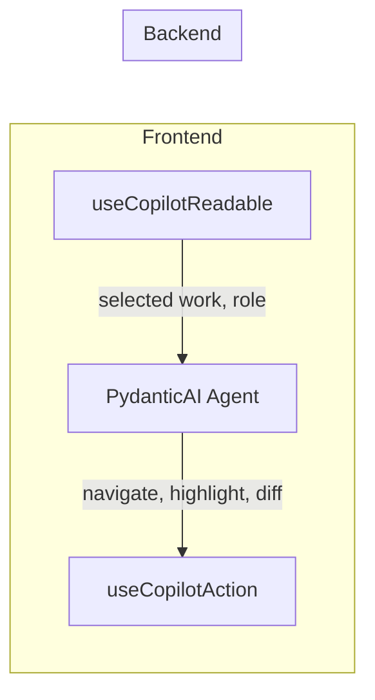

# Agentic UI

The Music Attribution Scaffold includes a conversational agent that helps artists, managers, and musicologists review and improve attribution records. The agent understands confidence scoring, assurance levels, and source agreement -- and can explain, search, suggest corrections, and collect structured feedback.

## Architecture Overview

The agentic UI is a three-layer stack:

1. **PydanticAI agent** (backend) -- Python agent with 4 domain tools and a system prompt tuned for music attribution
2. **AG-UI SSE protocol** (transport) -- Server-Sent Events streaming from a FastAPI endpoint
3. **CopilotKit** (frontend) -- React sidebar with bidirectional context sharing via readable state and action hooks



### Key Files

| Layer | File | Purpose |
|-------|------|---------|
| Agent | `src/music_attribution/chat/agent.py` | PydanticAI agent definition + 4 tools |
| State | `src/music_attribution/chat/state.py` | `AttributionAgentState` shared between agent and frontend |
| Endpoint | `src/music_attribution/chat/agui_endpoint.py` | FastAPI SSE endpoint for AG-UI protocol |
| Provider | `frontend/src/lib/copilot/copilot-provider.tsx` | CopilotKit React provider with graceful degradation |
| Sidebar | `frontend/src/components/chat/copilot-sidebar.tsx` | CopilotKit sidebar wrapper component |
| Readable | `frontend/src/hooks/use-attribution-context.ts` | Feeds selected work + user role to agent context |
| Actions | `frontend/src/hooks/use-agent-actions.ts` | Registers UI actions the agent can invoke |

## Agent Tools

The PydanticAI agent exposes 4 domain tools. Each tool receives `AgentDeps` (shared state + async database session factory) and returns a human-readable string.

| Tool | Parameters | What It Does |
|------|-----------|--------------|
| `explain_confidence` | `work_id: str` | Looks up an attribution record and breaks down the confidence score into contributing factors: source agreement, number of corroborating sources, and assurance level. |
| `search_attributions` | `query: str` | Runs a hybrid search (text + vector via reciprocal rank fusion) across the catalog and returns up to 10 matching works with confidence scores and assurance levels. |
| `suggest_correction` | `work_id`, `field`, `current_value`, `suggested_value`, `reason` | Creates a `CorrectionPreview` diff and stores it in agent state for the user to review before committing. |
| `submit_feedback` | `work_id`, `overall_assessment: float`, `free_text` | Persists a `FeedbackCard` to the database. Includes center-bias detection (flags assessments between 0.45 and 0.55). |

### Tool Flow Example

A typical correction flow spans two tool calls:

```
User: "The producer credit on 'Hide and Seek' looks wrong"

Agent calls: suggest_correction(
    work_id="...",
    field="producer",
    current_value="Unknown",
    suggested_value="Imogen Heap",
    reason="Self-produced — confirmed in liner notes and MusicBrainz"
)
→ CorrectionPreview stored in state, shown as diff in UI

User: "That looks right, submit it"

Agent calls: submit_feedback(
    work_id="...",
    overall_assessment=0.85,
    free_text="Producer confirmed via liner notes"
)
→ FeedbackCard persisted to PostgreSQL
```

## AG-UI Protocol

The agent communicates with CopilotKit via [AG-UI](https://docs.ag-ui.com/) (Agent-User Interaction protocol), a Server-Sent Events-based protocol for streaming agent responses.

### Endpoint

```
POST /api/v1/copilotkit
Content-Type: application/json

{
  "messages": [
    { "role": "user", "content": "Explain the confidence for this work" }
  ]
}
```

Response: `text/event-stream` with AG-UI events.

### Event Sequence

Each request produces the following SSE event sequence:

| Order | Event Type | Payload |
|-------|-----------|---------|
| 1 | `RunStarted` | `{ runId }` |
| 2 | `TextMessageStart` | `{ messageId, role: "assistant" }` |
| 3..N | `TextMessageContent` | `{ content }` (chunked at 50 chars for streaming feel) |
| N+1 | `TextMessageEnd` | `{}` |
| N+2 | `StateSnapshot` | `{ snapshot: AttributionAgentState }` |
| N+3 | `RunFinished` | `{ runId }` |

The `StateSnapshot` event is critical -- it pushes the agent's updated state (current work, confidence score, explanation text, search results) to the frontend after every interaction.

### Lazy Agent Initialization

The agent is created as a lazy singleton (`_get_agent()`) to avoid requiring an `ANTHROPIC_API_KEY` at import time. This allows the rest of the application to start even when agent functionality is not configured.

## Model Configuration

### Default Model

The agent defaults to `anthropic:claude-haiku-4-5`, configured in `src/music_attribution/config.py`:

```python
attribution_agent_model: str = Field(
    default="anthropic:claude-haiku-4-5",
    description="PydanticAI model string for attribution agent",
)
```

### Override via Environment Variable

Set `ATTRIBUTION_AGENT_MODEL` to use a different model:

```bash
# Use Sonnet for more nuanced explanations
ATTRIBUTION_AGENT_MODEL=anthropic:claude-sonnet-4-5 make agent

# Use OpenAI
ATTRIBUTION_AGENT_MODEL=openai:gpt-4o make agent
```

The value must be a valid [PydanticAI model string](https://ai.pydantic.dev/models/).

### Failover

PydanticAI's `FallbackModel` can be configured for automatic failover when the primary model is unavailable. The `retries=2` setting on the agent provides retry logic for transient failures.

## Shared State

The `AttributionAgentState` Pydantic model is the bridge between backend agent and frontend UI. It is updated by tools during execution and pushed to CopilotKit via the `StateSnapshot` event.

```python
class AttributionAgentState(BaseModel):
    current_work_id: str | None       # Work being discussed
    current_work_title: str | None     # Display title
    confidence_score: float | None     # Score under discussion (0.0-1.0)
    review_queue_size: int             # Pending review count
    pending_correction: CorrectionPreview | None  # Diff preview
    explanation_text: str | None       # Agent's explanation
    last_search_query: str | None      # Last search term
    last_search_count: int             # Result count
```

## Frontend Integration

### CopilotKit Provider

The `CopilotProvider` wraps the application and connects to the backend endpoint. If `NEXT_PUBLIC_API_URL` is not set, it degrades gracefully -- the app works without agent functionality.

```tsx
// frontend/src/lib/copilot/copilot-provider.tsx
<CopilotKit runtimeUrl={COPILOT_RUNTIME_URL}>
  {children}
</CopilotKit>
```

The runtime URL is derived from `NEXT_PUBLIC_API_URL`:

```ts
// frontend/src/lib/config.ts
export const COPILOT_RUNTIME_URL = API_URL
  ? `${API_URL}/api/v1/copilotkit`
  : null;
```

### Sidebar Component

The `AgentSidebar` wraps CopilotKit's `CopilotSidebar` with project-specific labels and styling:

```tsx
<CKSidebar
  defaultOpen={true}
  labels={{
    title: "Attribution Agent",
    placeholder: "Ask about confidence scores, credits, or attributions...",
  }}
/>
```

### Readable State (UI to Agent)

The `useAttributionContext` hook feeds the currently selected work and user role into the agent's context. This enables the agent to adapt its responses based on what the user is looking at.

```tsx
// frontend/src/hooks/use-attribution-context.ts
useCopilotReadable({
  description: "Current user role (artist or query)",
  value: role,
});

useCopilotReadable({
  description: "Currently selected attribution record",
  value: selectedWork ? {
    attribution_id, work_title, artist_name,
    confidence_score, assurance_level, source_agreement,
    credits_count, needs_review, review_priority,
  } : null,
});
```

### Action Hooks (Agent to UI)

The `useAgentActions` hook registers 4 CopilotKit actions that the agent can invoke to manipulate the frontend:

| Action | Parameters | Effect |
|--------|-----------|--------|
| `navigate_to_work` | `workId: string` | Navigate the UI to show a specific attribution record |
| `highlight_credit` | `entityId: string` | Highlight a specific credit entity in the UI |
| `open_feedback_panel` | `workId: string` | Open the feedback panel for a specific attribution |
| `show_correction_diff` | `field`, `current`, `suggested` | Show a before/after correction diff in the UI |

This creates the **DuetUI bidirectional context loop**:



### Review Queue and Feedback Flow

Two key components integrate the agent into the attribution review workflow:

- **`AgentReviewQueue`** -- Displays works sorted by review priority with agent-generated suggestions shown as diffs (current value with strikethrough, suggested value highlighted). Includes batch "Approve All" and a progress counter.
- **`AgentFeedbackFlow`** -- A multi-step wizard (role, evidence type, confidence slider, preview, submit) that collects structured feedback. Includes center-bias detection with a warning when assessments fall between 45-55%.

## Running the Agent

### Prerequisites

- `ANTHROPIC_API_KEY` environment variable set (or whichever provider you configure)
- PostgreSQL running (for tool database access)
- Frontend configured with `NEXT_PUBLIC_API_URL=http://localhost:8000`

### Start Backend and Frontend Together

```bash
# Starts agent backend on :8000 and frontend on :3000
make dev-agent
```

### Start Separately

```bash
# Backend only (requires ANTHROPIC_API_KEY + PostgreSQL)
make agent

# Frontend only (in a separate terminal)
make dev-frontend
```

### Frontend Environment

Create `frontend/.env.local` with:

```
NEXT_PUBLIC_API_URL=http://localhost:8000
```

## Testing

### Backend Agent Tests

The agent uses a lazy singleton pattern, which means tests can mock the agent without requiring an API key:

```python
from unittest.mock import patch, AsyncMock

@patch("music_attribution.chat.agui_endpoint._get_agent")
async def test_copilotkit_endpoint(mock_get_agent, client):
    mock_agent = AsyncMock()
    mock_agent.run.return_value.data = "Test response"
    mock_get_agent.return_value = mock_agent

    response = await client.post("/api/v1/copilotkit", json={
        "messages": [{"role": "user", "content": "Hello"}]
    })
    assert response.status_code == 200
```

### Frontend Agent Integration Tests

The frontend includes 11 agent integration tests (`frontend/src/__tests__/agent-integration.test.tsx`) covering:

- **Proficiency model** -- Verifies novice/intermediate/expert level thresholds based on interaction count and success rate
- **PostHog event schema** -- Validates that all analytics events follow snake_case naming
- **Feature flag defaults** -- Confirms density mapping covers all proficiency levels

Run them with:

```bash
make test-frontend
```

### Adaptive UI

The agent integration includes a proficiency model that tracks user interactions:

| Level | Threshold | UI Density |
|-------|-----------|-----------|
| Novice | < 10 interactions | Comfortable |
| Intermediate | 10-49 interactions, 60%+ success | Compact |
| Expert | 50+ interactions, 75%+ success | Dense |

This drives adaptive tooltips and feature flags -- experienced users see a denser interface with fewer explanatory tooltips.
