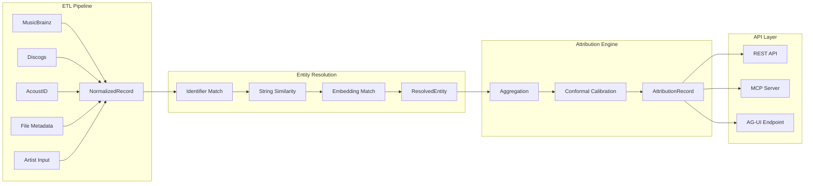

# User Guide

Technical documentation for developers working with the Music Attribution Scaffold.

## Architecture

The scaffold implements a **5-pipeline architecture** where data flows from raw sources to a user-facing application:

## Sections

| Guide | What You'll Learn |
|-------|-------------------|
| [Architecture Overview](architecture.md) | 5-pipeline design, cross-cutting concerns, data flow |
| [Backend](backend.md) | Python modules, database, testing, Docker |
| [Frontend](frontend.md) | Next.js pages, design system, components, Jotai state |
| [Agentic UI](agent.md) | PydanticAI agent, CopilotKit, AG-UI protocol |
