# Voice Agent Implementation Guide

**A comprehensive tutorial for building the premium voice agent feature on top of the Music Attribution Scaffold's existing text-based conversational agent.**

**Companion to:** Teikari, P. (2026). *Music Attribution with Transparent Confidence*. SSRN No. 6109087.

**Research base:** [docs/planning/voice-agent-research/](../planning/voice-agent-research/README.md)

---

## Table of Contents

1. [Introduction](#1-introduction)
2. [Voice AI Landscape and Architecture](#2-voice-ai-landscape-and-architecture)
3. [Speech-to-Text Deep Dive](#3-speech-to-text-deep-dive)
4. [Text-to-Speech Deep Dive](#4-text-to-speech-deep-dive)
5. [LLM and End-to-End Speech Models](#5-llm-and-end-to-end-speech-models)
6. [Production and Deployment](#6-production-and-deployment)
7. [Evaluation and Benchmarks](#7-evaluation-and-benchmarks)
8. [FinOps and Economics](#8-finops-and-economics)
9. [Ethics, Safety, and Consent](#9-ethics-safety-and-consent)
10. [Recommended Stack and Roadmap](#10-recommended-stack-and-roadmap)

---

## 1. Introduction

### Why Voice for Music Attribution?

The Music Attribution Scaffold already ships a text-based conversational agent — PydanticAI with 4 attribution tools, streamed via AG-UI protocol through CopilotKit. The agent answers questions about music credits, queries confidence scores, and suggests corrections.

Adding voice serves two business purposes:

1. **Attribution Gathering** — Many session musicians find typing tedious. Voice input removes friction, especially for complex stories (*"We recorded that in three sessions across two studios..."*). Voice responses are typically 3-4x longer than typed responses, capturing more attribution context.

2. **Digital Twin** — An artist's voice AI that can authentically discuss their work. "Ask Imogen about her new album" is a headline-worthy feature. This is the premium/Pro tier upsell.

Both use cases share the same underlying voice pipeline. The difference is which persona responds: the system voice (attribution agent) or the artist's cloned voice (digital twin).

### What This Tutorial Covers

This tutorial goes far beyond the existing PRD ([docs/prd/voice-agent/toc-voice-agent.md](../prd/voice-agent/toc-voice-agent.md)) with:

- Comprehensive assessment of 20+ voice AI providers (Jan 2025 - Feb 2026)
- 40+ academic papers on voice agent architecture, evaluation, and ethics
- Detailed FinOps analysis with per-minute cost breakdowns
- Voice agent leaderboard analysis and evaluation gap assessment
- Concrete implementation roadmap building on the existing MVP

Each section includes infographic figure references (32 figures total) designed for [Nano Banana Pro](../figures/repo-figures/PROMPTING-INSTRUCTIONS-REPO.md) generation.

---

## 2. Voice AI Landscape and Architecture

### 2.1 The Full Stack

A production voice agent is not a single model — it is a five-layer pipeline with orchestration:

**Transport → STT → LLM → TTS → Transport**

Each layer has its own latency budget, and the total must stay under 500ms for natural conversation (800ms acceptable threshold). Voice Activity Detection (VAD) and turn detection form the critical orchestration layer that ties everything together.

*Figure: The five-layer voice agent pipeline with turn detection as the orchestration layer. See [figure plan](../figures/repo-figures/figure-plans/fig-voice-01-full-stack-architecture.md).*

### 2.2 The Latency Budget

Every millisecond matters. The human neurological response window is 200-300ms — anything beyond 800ms feels sluggish. The voice pipeline budget breaks down as:

| Stage | Target | Best Available (Feb 2026) |
|-------|--------|--------------------------|
| VAD | <100ms | Silero: 4ms RTF |
| STT | <250ms | Deepgram Flux: 260ms end-of-turn |
| LLM TTFT | <200ms | Haiku 4.5: ~150ms |
| TTS TTFA | <100ms | Cartesia Sonic Turbo: 40ms |
| Transport | <50ms | WebRTC: ~30ms |
| **Total** | **<500ms** | **~484ms achievable** |

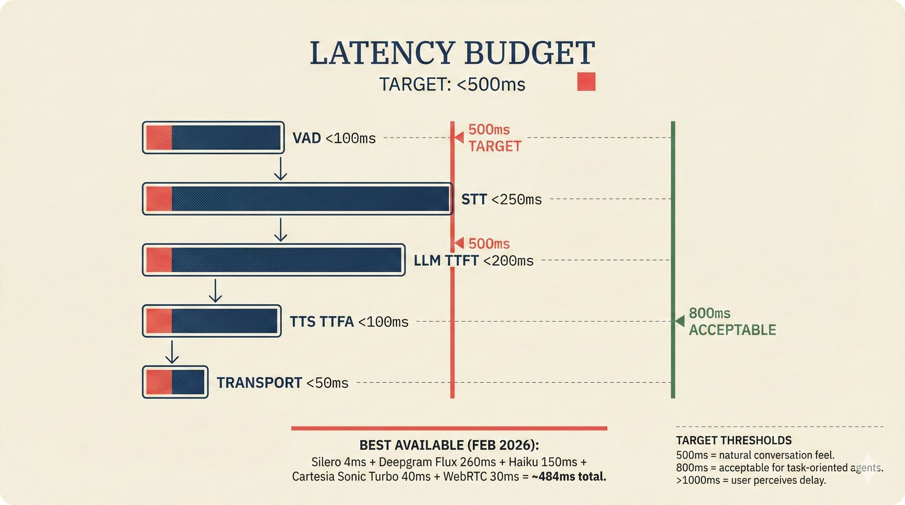
*Figure: Production latency budget showing each pipeline stage's contribution. See [figure plan](../figures/repo-figures/figure-plans/fig-voice-02-pipeline-latency-budget.md).*

### 2.3 Cascaded vs Speech-to-Speech

The traditional approach is a **cascaded pipeline**: separate STT, LLM, and TTS components stitched together. This is modular (swap any component independently) but accumulates latency at each boundary.

The emerging alternative is **speech-to-speech (S2S)**: a single model that takes audio in and produces audio out, eliminating text intermediaries. Ultravox v0.7 achieved 97.7% pass rate on the aiewf-eval benchmark — surpassing GPT Realtime (86.7%) and Gemini Live (86.0%).

The **tandem pattern** (proposed in the KAME paper, arXiv:2510.02327) combines both: a fast S2S front-end handles conversational flow while a cloud LLM concurrently queries databases, injecting results into the speech stream. This is ideal for attribution queries where the agent needs to look up MusicBrainz/Discogs data mid-conversation.

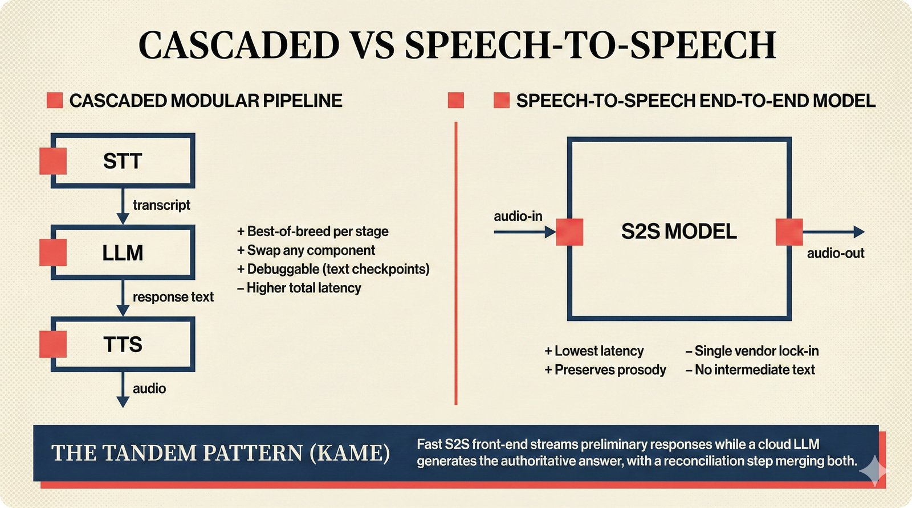
*Figure: Architecture comparison showing tradeoffs between modularity and latency. See [figure plan](../figures/repo-figures/figure-plans/fig-voice-03-cascaded-vs-speech-to-speech.md).*

### 2.4 Framework Selection

Two open-source frameworks dominate: **Pipecat** (Daily.co) and **LiveKit Agents**.

- **Pipecat**: Python-first, 40+ service plugins, BSD license, modular FrameProcessor pipeline, Pipecat Flows for state management, Smart Turn for semantic endpointing
- **LiveKit Agents**: WebRTC-native, agent-as-participant model, semantic turn detection (<25ms), Telephony 1.0 (SIP/DTMF), Cloud Agents managed deployment

Managed platforms (Retell at $0.07/min, Vapi at $0.14/min) trade flexibility for simplicity — useful for prototyping but too opaque for a scaffold.

**Our recommendation: Pipecat** — Python-native matches the existing PydanticAI backend, and the plugin architecture allows swapping STT/TTS providers without code changes.

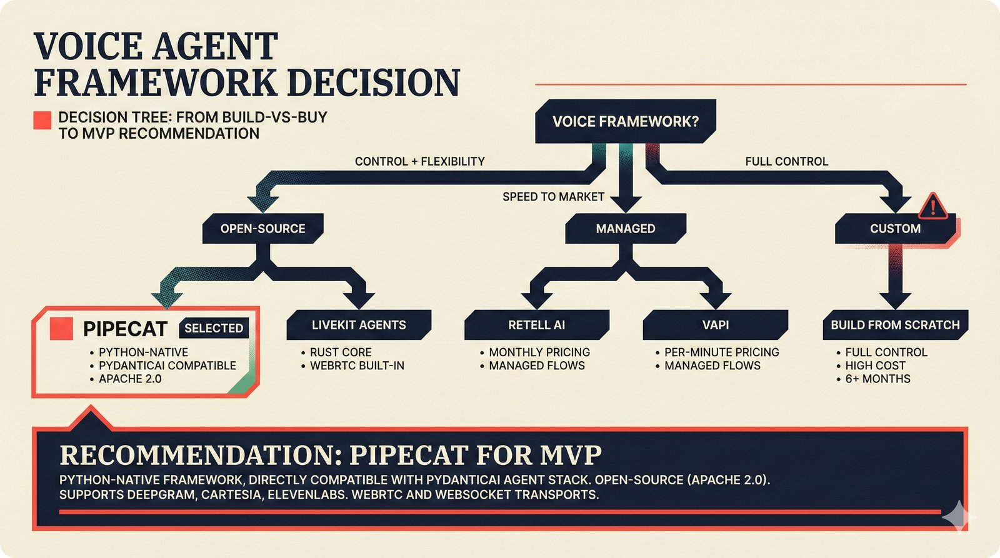
*Figure: Decision tree for voice agent framework selection. See [figure plan](../figures/repo-figures/figure-plans/fig-voice-04-framework-landscape.md).*

### 2.5 The Dual Persona System

The same voice pipeline serves two personas, gated by consent levels:

- **Attribution Agent** (Consent Level 1): System voice, gap-filling, review queue. "Who mixed this track?" → queries attribution engine.
- **Digital Twin** (Consent Levels 2-3): Artist's cloned voice, fan interactions, promotional experiences. "What inspired River Song?" → responds in Imogen's voice.

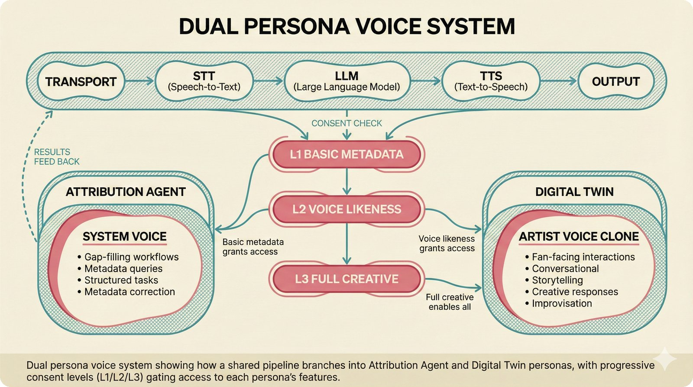
*Figure: Shared pipeline branching into attribution agent and digital twin personas. See [figure plan](../figures/repo-figures/figure-plans/fig-voice-05-dual-persona-system.md).*

### 2.6 Transport Layer

WebRTC delivers sub-30ms transport with built-in echo cancellation and noise suppression. WebSocket is simpler to implement but adds 50-100ms and requires client-side audio processing. Both Pipecat and LiveKit support WebRTC natively. The OpenAI Realtime API supports both protocols.

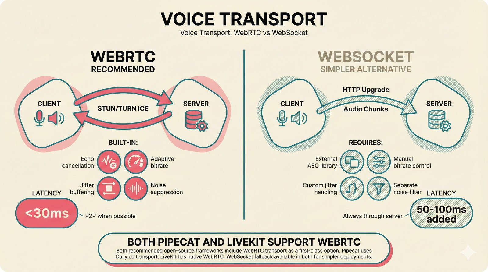
*Figure: WebRTC vs WebSocket voice transport comparison. See [figure plan](../figures/repo-figures/figure-plans/fig-voice-06-webrtc-transport-layer.md).*

---

## 3. Speech-to-Text Deep Dive

### 3.1 The STT Landscape

The STT landscape as of February 2026 spans commercial leaders, open-source alternatives, and edge-optimized models:

| Category | Champion | WER | Speed | Cost |
|----------|----------|-----|-------|------|
| **Benchmark accuracy** | NVIDIA Canary-Qwen-2.5B | 5.63% | 418x RT | Open-source |
| **Production accuracy** | Deepgram Nova-3 | 5.26% (batch) | Real-time | $0.0077/min |
| **Self-hosted** | faster-whisper | ~8-10% | 4x Whisper | Free |
| **Edge** | Moonshine | ~Whisper-level | 5-15x faster | Free |
| **Multilingual** | Whisper Large V3 | ~10% | 1x | $0.006/min |
| **Open-source realtime** | Mistral Voxtral Mini 4B | <Whisper V3 | 480ms delay | Free (Apache 2.0) |

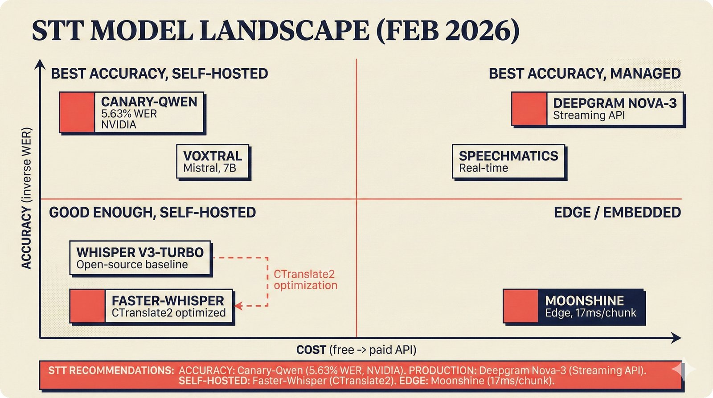
*Figure: STT model landscape mapped by accuracy and cost. See [figure plan](../figures/repo-figures/figure-plans/fig-voice-07-stt-model-landscape.md).*

### 3.2 Accuracy vs Latency

The Pareto frontier has shifted dramatically. In 2024, you chose accuracy OR speed. In 2026, models like Canary-Qwen deliver both (5.63% WER at 418x real-time). Edge models like Moonshine sacrifice minimal accuracy for 5-15x speed gains.

*Figure: Scatter plot of STT models showing the shifted Pareto frontier. See [figure plan](../figures/repo-figures/figure-plans/fig-voice-08-stt-accuracy-vs-latency.md).*

### 3.3 VAD and Turn Detection Evolution

Turn detection is the single most impactful recent advance in voice AI. It evolved through three generations:

1. **Silence thresholds** (2020-2023): WebRTC VAD, simple GMM, 50% TPR. Triggers on any pause, causing constant false interruptions.
2. **Deep learning VAD** (2023-2025): Silero VAD, neural network, 87.7% TPR at RTF 0.004. Better but still pause-based.
3. **Semantic endpointing** (2025-2026): Deepgram Flux fuses acoustic cues (prosody, pauses) with semantic understanding (grammar, intent). 260ms end-of-turn, 30% fewer false interruptions. LiveKit's transformer model runs <25ms on CPU across 13 languages. Pipecat Smart Turn is fully open-source.

A voice attribution agent that cuts off an artist mid-sentence about credits destroys trust. Semantic turn detection is not optional.

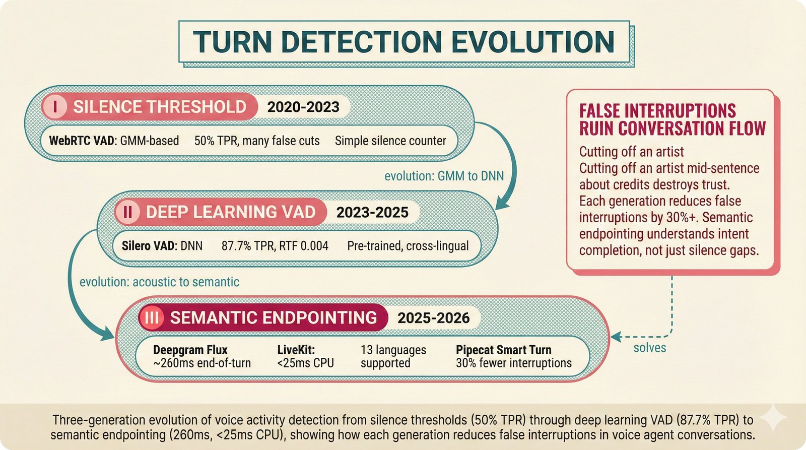
*Figure: Three-generation evolution of turn detection. See [figure plan](../figures/repo-figures/figure-plans/fig-voice-09-vad-turn-detection-evolution.md).*

### 3.4 Conversational Speech Recognition

Deepgram Flux represents a paradigm shift: instead of stitching separate VAD + ASR + endpointing components, it fuses acoustic and semantic streams into a single Conversational Speech Recognition (CSR) model. This eliminates the fragile multi-component pipeline and achieves 260ms end-of-turn detection with 30% fewer false interruptions.

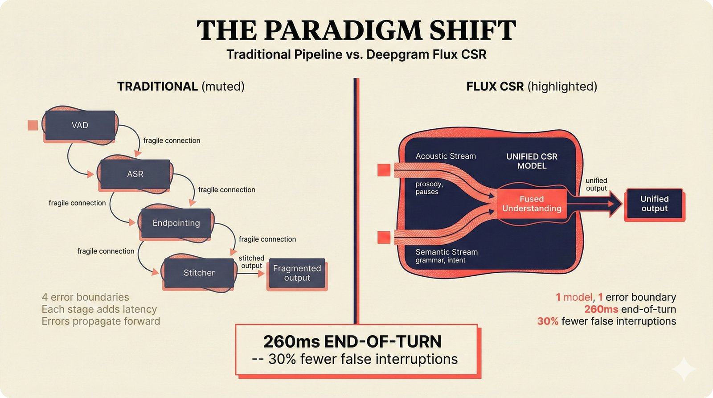
*Figure: The paradigm shift from fragmented ASR pipeline to unified CSR. See [figure plan](../figures/repo-figures/figure-plans/fig-voice-10-conversational-speech-recognition.md).*

---

## 4. Text-to-Speech Deep Dive

### 4.1 The TTS Landscape

The TTS landscape bifurcated in 2025. Commercial leaders compete on latency and expressiveness while open-source models crossed the quality threshold:

**Commercial:**
- **ElevenLabs**: Eleven v3 (most expressive, 70+ languages), Flash v2.5 (~75ms)
- **Cartesia Sonic**: 40ms TTFA (industry-leading), SSM architecture, consistent P50-P99
- **Inworld AI**: 200ms, gaming-focused, $5/1M chars
- **Rime AI**: Sub-200ms, no concurrency limits

**Open-Source (the 2025 revolution):**
- **Chatterbox** (Resemble AI): MIT license, 350M params, outperforms ElevenLabs in blind evals
- **Orpheus TTS**: Apache 2.0, 3B params, emotional tags (<laugh>, <sigh>), ~200ms streaming
- **Kokoro-82M**: Apache 2.0, <0.3s, <1GB VRAM, ~$0.06/hr

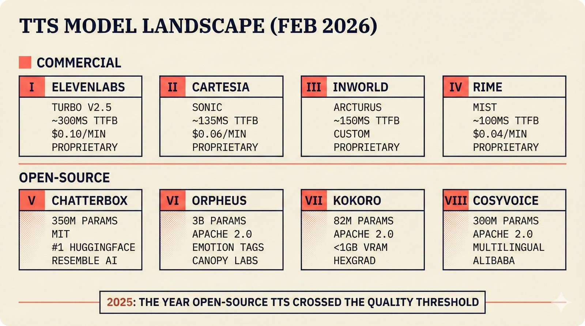
*Figure: TTS landscape showing commercial and open-source tiers. See [figure plan](../figures/repo-figures/figure-plans/fig-voice-11-tts-model-landscape.md).*

### 4.2 TTS Arena Leaderboard

The TTS Arena V2 (HuggingFace, Elo-based blind human preference) reveals that specialized models now top ElevenLabs:

| Rank | Model | Elo |
|------|-------|-----|
| 1 | Vocu V3.0 | 1613 |
| 2 | Inworld TTS | 1578 |
| 3 | CastleFlow v1.0 | 1575 |
| 6 | Hume Octave | 1559 |
| 7 | ElevenLabs Flash v2.5 | 1547 |

Sesame CSM-1B (open-source, Llama backbone) achieved a remarkable result: evaluators showed no preference between CSM-1B output and real human speech without context.

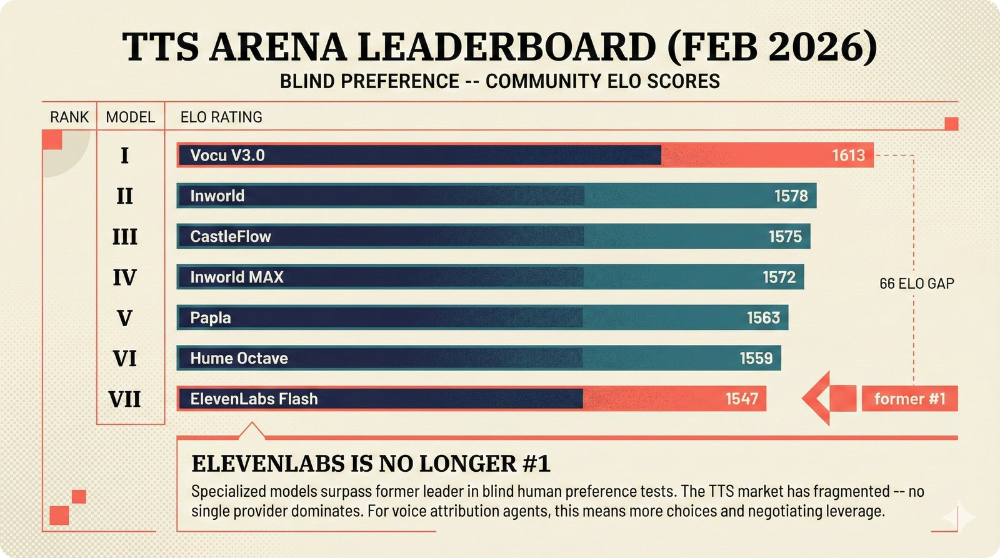
*Figure: TTS Arena V2 Elo rankings as of February 2026. See [figure plan](../figures/repo-figures/figure-plans/fig-voice-12-tts-arena-leaderboard.md).*

### 4.3 The Open-Source TTS Revolution

Three open-source models make production-quality voice synthesis essentially free to self-host. This changes the economics of voice AI fundamentally — TTS is no longer the cost bottleneck.

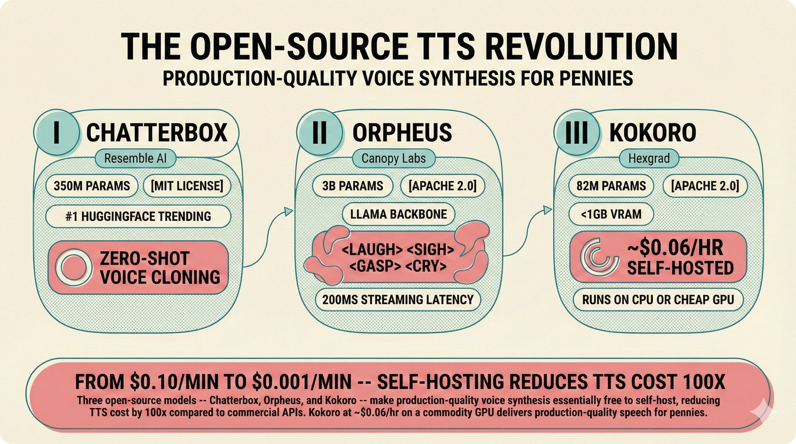
*Figure: The three models driving the open-source TTS revolution. See [figure plan](../figures/repo-figures/figure-plans/fig-voice-13-open-source-tts-revolution.md).*

### 4.4 Voice Cloning and Consent

Voice cloning for the digital twin feature requires careful consent management. The PRAC3 framework (Privacy, Reputation, Accountability, Consent, Credit, Compensation) from voice actor research maps directly to our A0-A3 assurance levels:

| PRAC3 Dimension | A0-A3 Mapping | Implementation |
|-----------------|---------------|----------------|
| **Privacy** | All levels | Voice data encryption, retention limits |
| **Reputation** | A2+ | Deepfake detection, brand protection |
| **Accountability** | A1+ | C2PA provenance, audit trail |
| **Consent** | A1+ | MCP permission queries, revocation rights |
| **Credit** | A1+ | ISRC/ISWC metadata, attribution chain |
| **Compensation** | A2+ | Royalty tracking infrastructure |

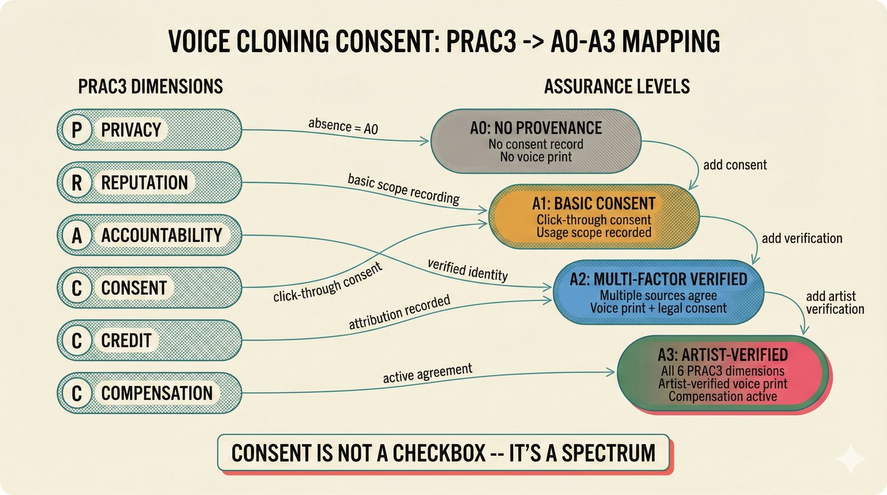
*Figure: PRAC3 consent dimensions mapped to A0-A3 assurance levels. See [figure plan](../figures/repo-figures/figure-plans/fig-voice-14-voice-cloning-consent-framework.md).*

---

## 5. LLM and End-to-End Speech Models

### 5.1 Speech LLM Taxonomy

The ACL 2025 SpeechLM survey (arXiv:2410.03751) establishes the first comprehensive taxonomy of Speech Language Models. Three architectural families:

1. **Encoder-Decoder**: Separate understanding and generation (e.g., Whisper-based pipelines)
2. **Decoder-Only**: Autoregressive, single model (e.g., Moshi, GLM-4-Voice)
3. **Hierarchical Codebook**: Multi-scale audio tokens (e.g., SpeechTokenizer, Encodec-based)

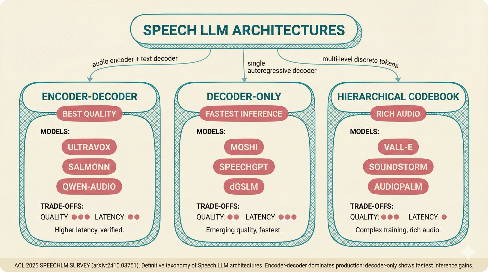
*Figure: Taxonomy of speech LLM architectures from ACL 2025 survey. See [figure plan](../figures/repo-figures/figure-plans/fig-voice-15-speech-llm-taxonomy.md).*

### 5.2 The Ultravox Breakthrough

Ultravox v0.7 is a milestone: the first speech-to-speech model to surpass text-mode frontier LLMs on a production-realistic benchmark. It processes audio directly (no separate ASR stage), achieving 97.7% pass rate on aiewf-eval with 864ms voice-to-voice latency.

For comparison:
- **GPT-5.1** (text mode): 100% but too slow for voice
- **Claude Sonnet 4.5** (text mode): 100% but too slow for voice
- **Ultravox v0.7** (S2S): 97.7% at production-viable latency
- **GPT Realtime** (S2S): 86.7%
- **Gemini Live** (S2S): 86.0% at 2,624ms latency

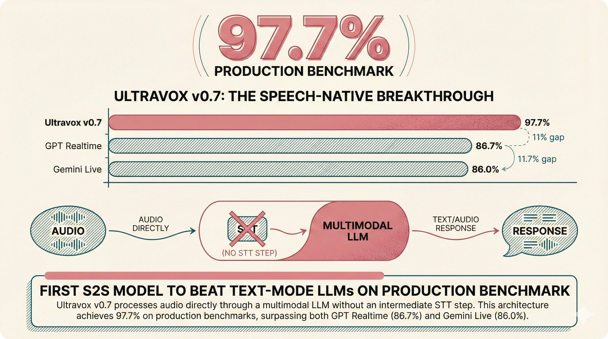
*Figure: Ultravox v0.7 surpassing GPT Realtime and Gemini Live. See [figure plan](../figures/repo-figures/figure-plans/fig-voice-16-ultravox-breakthrough.md).*

### 5.3 Full-Duplex Architecture

Full-duplex voice AI — where the system can listen while speaking — is the frontier. Traditional turn-based conversation feels rigid. Full-duplex enables natural backchanneling ("mm-hmm", "right"), graceful interruption handling, and collaborative speech overlap.

Key models: Moshi (200ms round-trip, Kyutai Labs), SALMONN-omni (codec-free), PersonaPlex (NVIDIA, ICASSP 2026).

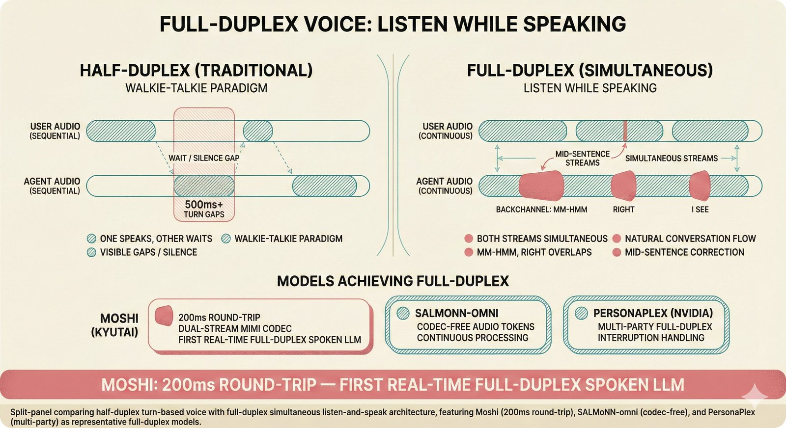
*Figure: Half-duplex vs full-duplex voice architecture comparison. See [figure plan](../figures/repo-figures/figure-plans/fig-voice-17-full-duplex-architecture.md).*

---

## 6. Production and Deployment

### 6.1 Pipecat Pipeline Anatomy

Pipecat organizes voice processing as a chain of `FrameProcessor` objects. Audio frames flow through the pipeline: Transport → VAD → STT → LLM → TTS → Transport. Each processor can be a built-in component or a service plugin (40+ available). `ParallelPipeline` runs context processing alongside the main voice loop. `Pipecat Flows` manages complex conversational state.

*Figure: Detailed Pipecat pipeline architecture. See [figure plan](../figures/repo-figures/figure-plans/fig-voice-18-pipecat-pipeline-anatomy.md).*

### 6.2 LiveKit Agents Architecture

LiveKit's model is "agent-as-participant" — the voice agent joins the WebRTC session like any other user. This is elegant for multi-party scenarios and provides native telephony (SIP, DTMF). Cloud Agents offers managed deployment with global edge network.

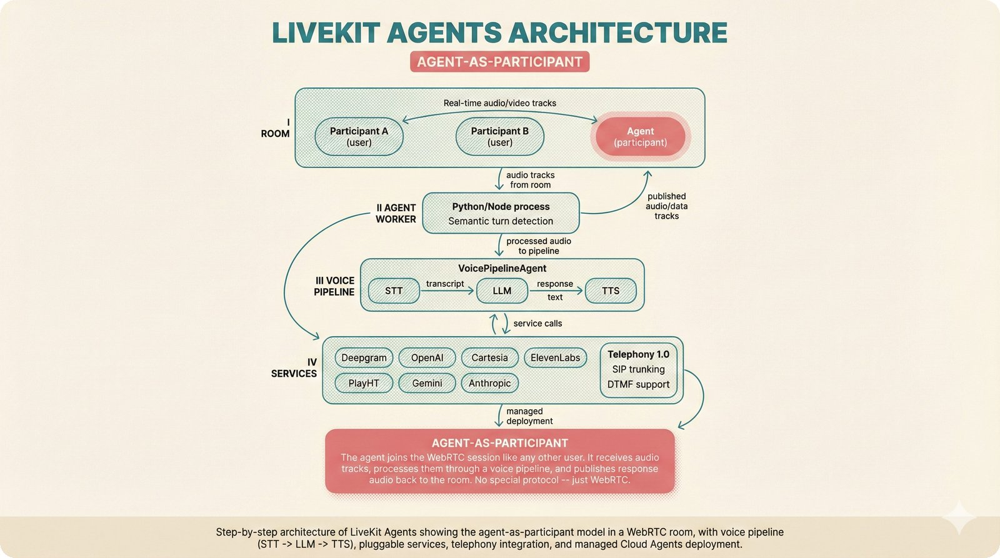
*Figure: LiveKit's agent-as-participant WebRTC model. See [figure plan](../figures/repo-figures/figure-plans/fig-voice-19-livekit-agents-architecture.md).*

### 6.3 Deployment Options

Four deployment paths, each with different cost/complexity tradeoffs:

| Path | Cost/Min | Time to Market | DevOps Burden |
|------|----------|---------------|---------------|
| **Managed** (Retell/Vapi) | $0.07-0.14 | Days | None |
| **Framework + APIs** (Pipecat + Deepgram + Cartesia) | $0.04-0.08 | Weeks | Low |
| **Self-Hosted** (Pipecat + faster-whisper + Orpheus) | $0.01-0.02 | Months | High |
| **Hybrid** (Cloud LLM + on-device STT/TTS) | $0.005-0.01 | Months | High |

**Recommendation:** Start with Framework + APIs (Path B), migrate to self-hosted as volume grows.

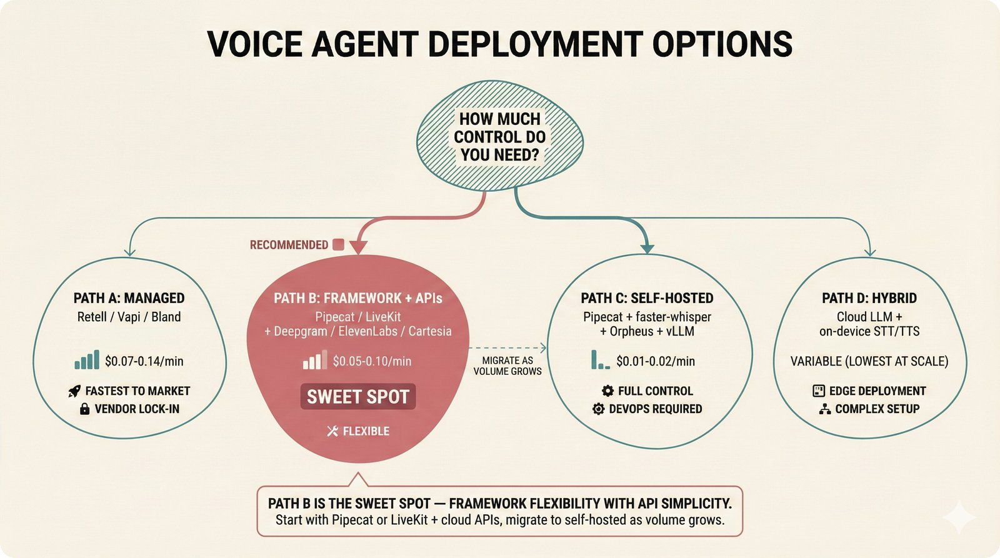
*Figure: Decision tree for voice agent deployment. See [figure plan](../figures/repo-figures/figure-plans/fig-voice-20-production-deployment-options.md).*

### 6.4 Build vs Buy Decision

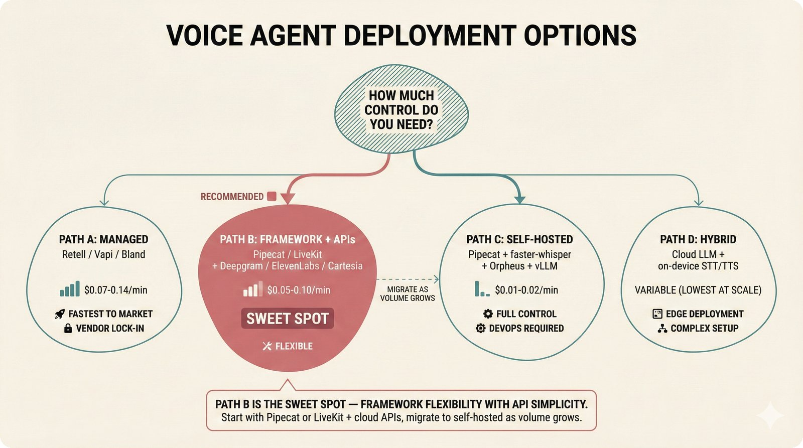
*Figure: Comparison matrix across managed, framework, self-hosted, and hybrid approaches. See [figure plan](../figures/repo-figures/figure-plans/fig-voice-21-managed-vs-self-hosted-decision.md).*

---

## 7. Evaluation and Benchmarks

### 7.1 The Evolution of Voice Agent Evaluation

Voice agent evaluation has undergone a paradigm shift from 2024 to 2026:

- **2024**: Component metrics only (WER for STT, MOS for TTS), single utterance, English only
- **Early 2025**: Multi-dimensional (Full-Duplex-Bench, VocalBench), audio-native evaluation
- **Mid 2025**: Agentic, production-oriented (VoiceAgentBench, aiewf-eval with 30-turn conversations)
- **Late 2025**: LLM-as-Judge revolution (SpeechLLM-as-Judges, TRACE framework)
- **Early 2026**: Safety + emotion (LALM-as-Judge, ICASSP HumDial Challenge, Audio MultiChallenge)

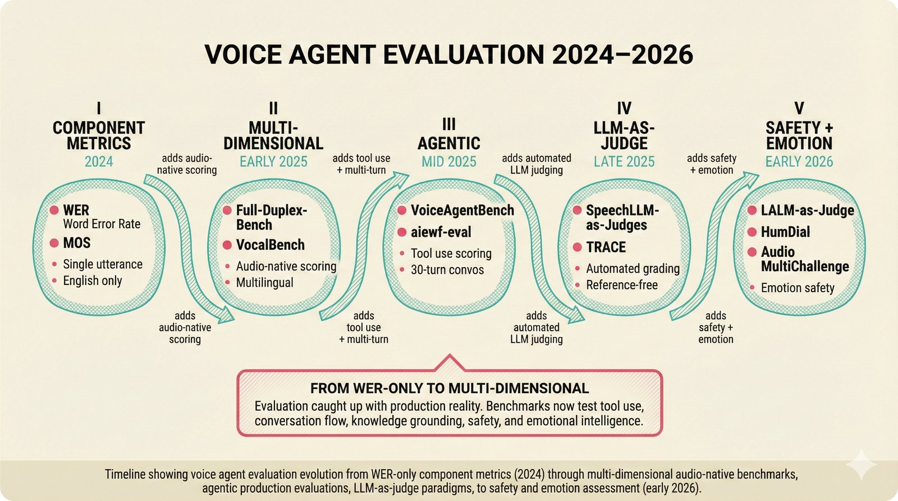
*Figure: Timeline of voice agent evaluation paradigm shifts. See [figure plan](../figures/repo-figures/figure-plans/fig-voice-22-evaluation-evolution-timeline.md).*

### 7.2 The Fragmented Leaderboard Landscape

As of February 2026, there is **no unified voice agent leaderboard**. The ecosystem is fragmented:

- **STT**: HuggingFace Open ASR Leaderboard (60+ models, WER metric)
- **TTS**: TTS Arena V2 (Elo-based blind preference), Artificial Analysis Speech Arena
- **End-to-End**: aiewf-eval (30-turn, tool calling, Claude-as-judge)
- **Voice Cloning**: ClonEval (cosine similarity)

No single leaderboard captures the full voice agent experience.

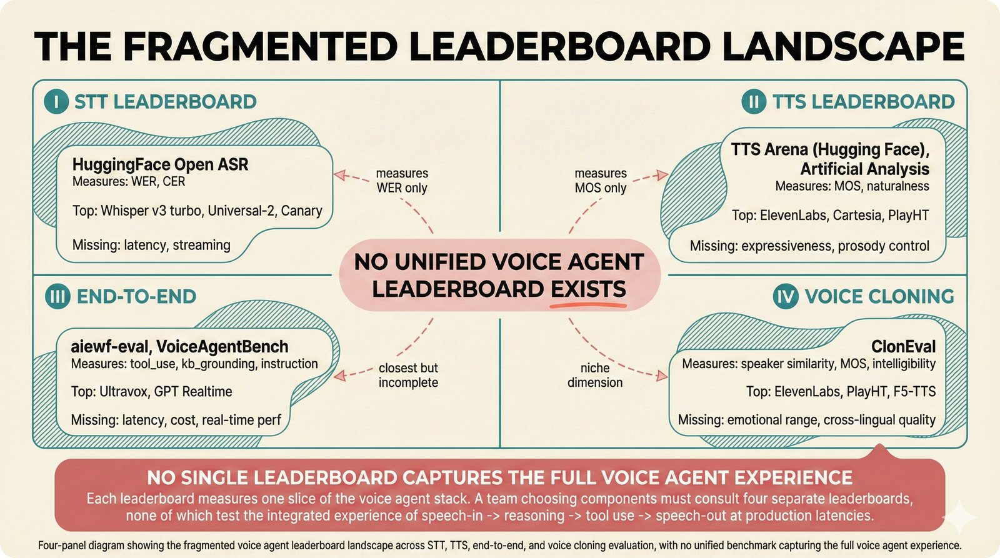
*Figure: The fragmented voice AI leaderboard ecosystem. See [figure plan](../figures/repo-figures/figure-plans/fig-voice-23-leaderboard-landscape-fragmentation.md).*

### 7.3 The aiewf-eval Benchmark

The aiewf-eval benchmark (Daily/Pipecat) tests production-realistic 30-turn voice conversations with tool calling, instruction following, and knowledge grounding. Claude serves as judge across three dimensions.

The defining finding: **the intelligence-latency tradeoff**. Three text-mode models achieve 100% pass rate but are too slow for production voice. Most deployed systems still run 18-month-old models because "switching is expensive and evaluation is hard."

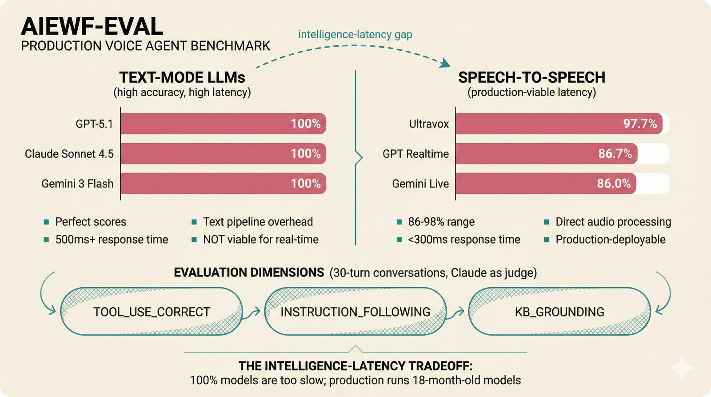
*Figure: aiewf-eval benchmark results comparing text-mode and speech-to-speech models. See [figure plan](../figures/repo-figures/figure-plans/fig-voice-24-aiewf-eval-benchmark-results.md).*

### 7.4 What Leaderboards Miss

Current leaderboards fail to capture 8 of 10 critical dimensions for production voice agents:

1. **Accent/dialect bias** — ASR consistently worse for non-native speakers, no per-accent breakdowns
2. **Cross-session consistency** — no benchmark tests multi-session state
3. **Cost-quality tradeoffs** — no leaderboard incorporates pricing
4. **Emotional appropriateness** — only MULTI-Bench and ICASSP HumDial address this
5. **Safety under adversarial audio** — all models degrade to 35-40% refusal rates
6. **Background noise robustness** — most benchmarks use clean studio audio
7. **Multi-party scenarios** — no benchmark tests handoffs or conferencing
8. **Graceful error recovery** — only Audio MultiChallenge's Voice Editing axis begins this

For music attribution specifically, leaderboards also miss: music-domain vocabulary accuracy (artist names, ISRCs), confidence communication quality (does the voice convey certainty appropriately?), and digital twin persona fidelity.

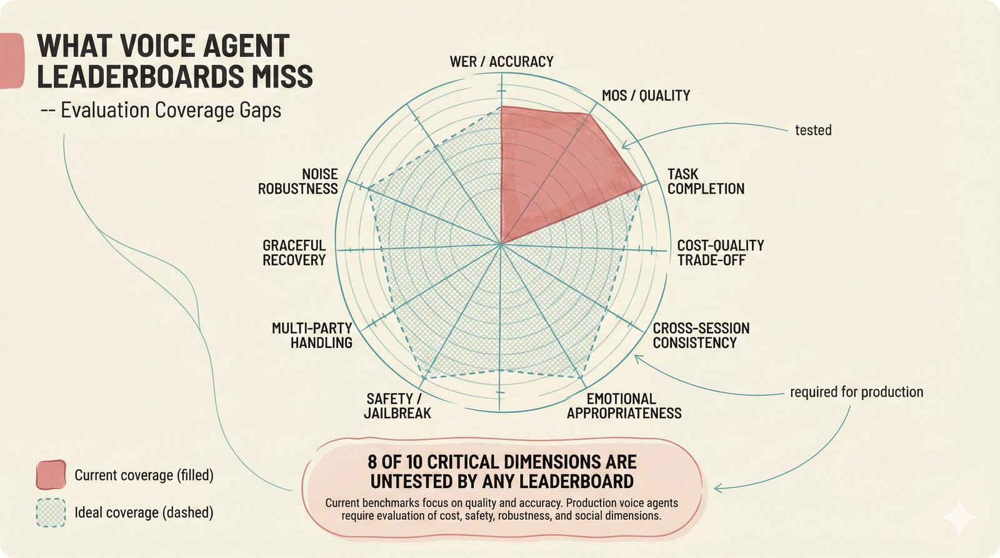
*Figure: Radar chart showing what current voice agent leaderboards miss. See [figure plan](../figures/repo-figures/figure-plans/fig-voice-25-evaluation-gaps-radar.md).*

### 7.5 Key Academic Papers (Post-October 2025)

Recent papers pushing the evaluation frontier:

| Paper | Date | Key Finding |
|-------|------|-------------|
| **MULTI-Bench** (arXiv:2511.00850) | Nov 2025 | First emotional intelligence benchmark for spoken dialogue |
| **Testing the Testers** (arXiv:2511.04133) | Nov 2025 | Meta-evaluation: top platform 0.92 F1, simulation quality only 0.61 |
| **Audio MultiChallenge** (arXiv:2512.14865) | Dec 2025 | Best model (Gemini 3 Pro) achieves only 54.65% on realistic multi-turn |
| **ICASSP HumDial** (arXiv:2601.05564) | Jan 2026 | Emotion analysis advancing faster than empathetic generation |
| **TRACE** (arXiv:2601.13742) | Jan 2026 | LLM judges with audio cues outperform audio-native judges |
| **LALM-as-a-Judge** (arXiv:2602.04796) | Feb 2026 | First safety evaluation for multi-turn spoken dialogues |

---

## 8. FinOps and Economics

### 8.1 Anatomy of a Minute

The cost of one minute of voice agent conversation breaks down into five components. The total ranges from $0.01/min (budget self-hosted) to $0.20+/min (premium commercial):

| Tier | STT | LLM | TTS | Transport | Total |
|------|-----|-----|-----|-----------|-------|
| **Budget** | Whisper self-hosted ($0.001) | Gemini Flash ($0.001) | Kokoro self-hosted ($0.001) | WebSocket ($0) | **~$0.01** |
| **Standard** | Deepgram Nova-3 ($0.008) | GPT-4o mini ($0.006) | Cartesia Sonic ($0.025) | WebRTC ($0.004) | **~$0.04** |
| **Premium** | Deepgram Flux ($0.010) | Claude Sonnet ($0.060) | ElevenLabs Flash ($0.080) | WebRTC ($0.004) | **~$0.15** |

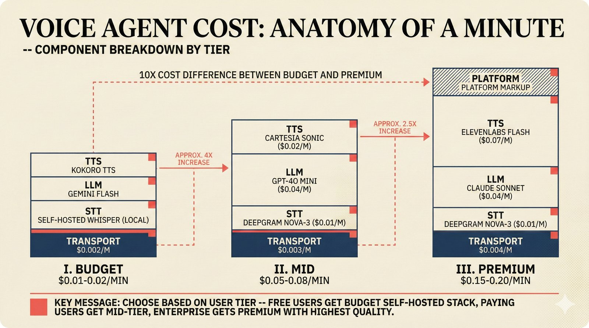
*Figure: Stacked cost breakdown across three tiers. See [figure plan](../figures/repo-figures/figure-plans/fig-voice-26-cost-per-minute-breakdown.md).*

### 8.2 Six Cost Optimization Levers

Combined optimization can achieve up to 16x cost reduction:

1. **Model Selection** — Right-size LLM per query complexity (Haiku for simple, Sonnet for complex)
2. **Semantic Caching** — Cache common response audio, 15-30% reduction
3. **On-Device STT/TTS** — Eliminate per-minute API costs entirely
4. **Context Management** — Aggressive truncation reduces token spend
5. **Tiered Quality** — Free tier uses self-hosted, premium uses commercial APIs
6. **Volume Commitments** — Growth/Enterprise tiers offer 30-50% discount

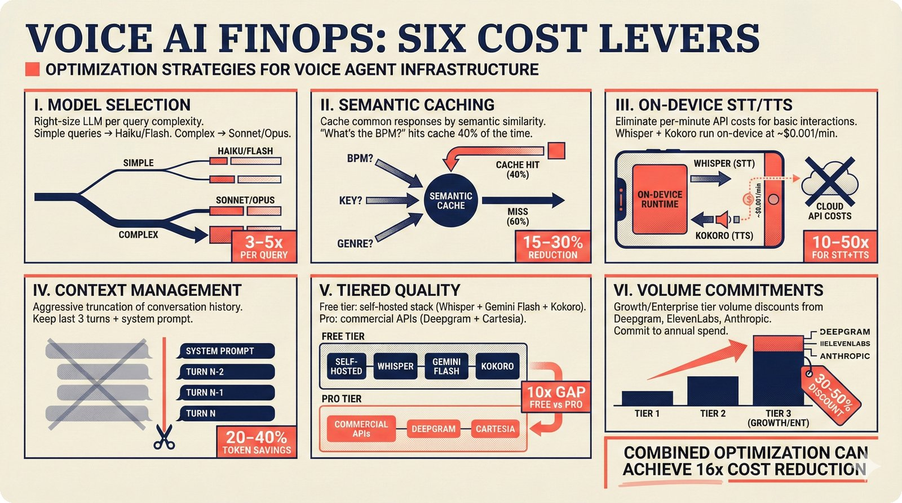
*Figure: Six cost levers for voice AI optimization. See [figure plan](../figures/repo-figures/figure-plans/fig-voice-27-finops-optimization-strategies.md).*

### 8.3 The AI Companion Cost Trap

The cautionary tale: flat-rate subscriptions + power users = structural loss.

- **Character.AI**: 100M DAU averaging 93 min/day. At $0.01/hr serving cost, that's $365M/year. 2024 revenue: $32.2M.
- **Dolores**: $25/day API costs from 1,000 beta users. 70% of revenue came from ElevenLabs realistic voice purchases. One user chatted for 12 hours straight.
- **Replika**: NSFW content restriction caused 70% usage drop — the engagement was parasocial, not utility.

The lesson for music attribution: **tier pricing from day one**. The digital twin feature could attract parasocial engagement patterns if not carefully bounded. Implement per-user daily caps, token budgets, and tiered access.

Character.AI achieved 3.8x cost improvement by migrating from NVIDIA GPUs to Google TPU v6e. Midjourney saved $16.8M/year via similar migration. Infrastructure optimization is the largest single cost lever.

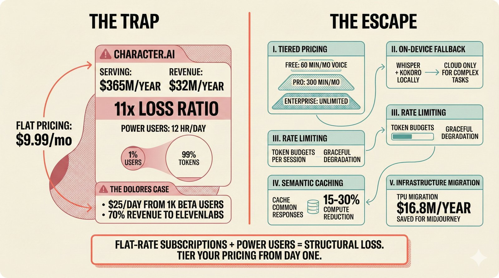
*Figure: The structural economics of flat-rate AI companions. See [figure plan](../figures/repo-figures/figure-plans/fig-voice-28-ai-companion-cost-trap.md).*

---

## 9. Ethics, Safety, and Consent

### 9.1 The Voice Rights Stack

The PRAC3 framework (Privacy, Reputation, Accountability, Consent, Credit, Compensation) from professional voice actor research (arXiv:2507.16247) maps directly to music attribution:

- **Privacy** → Voice data encryption, retention limits, right to deletion
- **Reputation** → Deepfake detection (ASVspoof 5), brand protection controls
- **Accountability** → C2PA content credentials for audio provenance
- **Consent** → MCP permission queries, explicit consent with revocation rights
- **Credit** → ISRC/ISWC metadata chain, attribution-by-design
- **Compensation** → Royalty tracking, transparent payment infrastructure

This extends the paper's A0-A3 assurance framework to voice: A0 (no voice consent) → A1 (basic ToS) → A2 (multi-factor verification) → A3 (artist-verified voice print with C2PA binding).

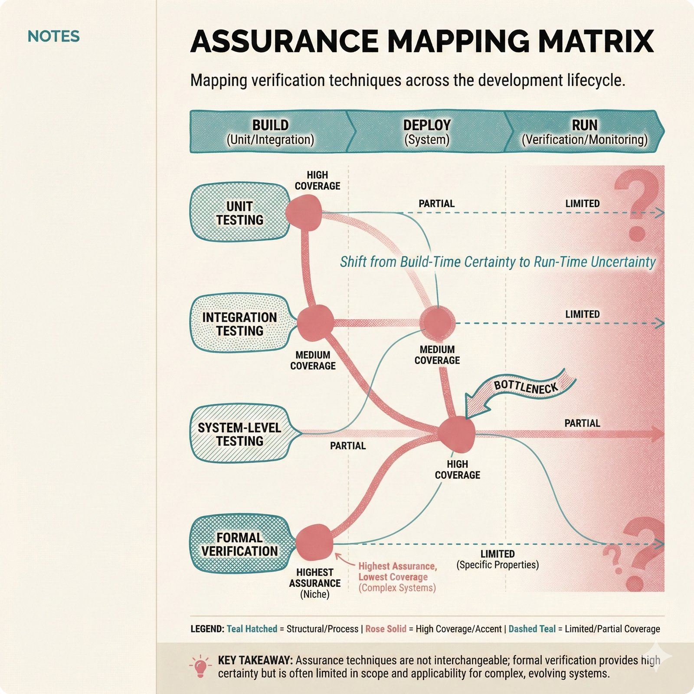
*Figure: Voice rights stack mapping PRAC3 to music attribution. See [figure plan](../figures/repo-figures/figure-plans/fig-voice-29-prac3-assurance-mapping.md).*

### 9.2 EU AI Act Compliance

The EU AI Act (Article 50, enforcement through August 2026) mandates:

1. **Disclosure**: Voice agents must identify themselves as AI-powered
2. **Synthetic audio labeling**: All TTS output must be marked as AI-generated
3. **Deepfake provisions**: Voice cloning requires explicit, informed consent
4. **Transparency**: Document training data and model capabilities
5. **Risk classification**: Interactive voice agents likely fall under "limited risk" tier

These requirements are not optional — they're legal obligations for any voice agent deployed in or serving EU users.

*Figure: EU AI Act voice agent compliance checklist. See [figure plan](../figures/repo-figures/figure-plans/fig-voice-30-eu-ai-act-voice-compliance.md).*

---

## 10. Recommended Stack and Roadmap

### 10.1 The Recommended MVP Stack

Building on the existing text agent (PydanticAI + Haiku 4.5 + CopilotKit), the recommended voice stack:

| Layer | Choice | Why |
|-------|--------|-----|
| **Framework** | Pipecat | Python-native, matches PydanticAI backend |
| **STT** | Deepgram Nova-3 / Flux | Best accuracy, CSR eliminates separate VAD |
| **LLM** | Existing PydanticAI agent | No change — voice pipeline wraps text agent |
| **TTS** | Cartesia Sonic (primary) + Orpheus (self-hosted fallback) | Lowest latency commercial + free self-hosted option |
| **Transport** | WebRTC via Daily.co | Pipecat native, sub-30ms |
| **Turn Detection** | Pipecat Smart Turn | Open-source semantic endpointing |
| **VAD** | Silero VAD | Enterprise-grade, open-source |

**Estimated cost:** ~$0.04/min standard tier, ~$0.005/min self-hosted tier.

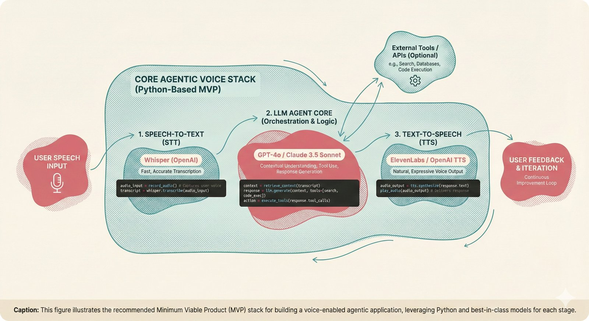
*Figure: Recommended production stack for music attribution voice agent. See [figure plan](../figures/repo-figures/figure-plans/fig-voice-31-recommended-mvp-stack.md).*

### 10.2 Implementation Roadmap

Five phases, building incrementally on the existing MVP:

| Phase | Timeline | Deliverable | Cost Impact |
|-------|----------|-------------|-------------|
| **I: Voice Input** | Month 1-2 | STT to existing text agent, responses as text | +$0.008/min |
| **II: System Voice** | Month 2-3 | Add TTS, basic voice output | +$0.035/min |
| **III: Natural Conversation** | Month 3-4 | Smart Turn, interruption handling, <500ms | Same |
| **IV: Digital Twin** | Month 4-6 | Artist voice clone, consent framework | +$0.10-0.15/min |
| **V: Premium Features** | Month 6+ | Emotional TTS, multi-language, on-device | Variable |

**Phase I ships in 2 months** — voice input to the existing agent requires zero TTS work. This is the fastest path to user feedback on voice attribution gathering.

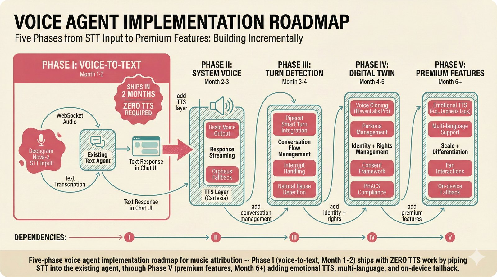
*Figure: Five-phase implementation roadmap. See [figure plan](../figures/repo-figures/figure-plans/fig-voice-32-implementation-roadmap.md).*

---

## References

### Academic Papers

- Défossez et al. (2024). Moshi: Full-Duplex Speech-Text Foundation Model. arXiv:2410.00037.
- KAME (2025). Tandem Architecture for Real-Time Conversational AI. arXiv:2510.02327.
- Sharma et al. (2025). PRAC3: Long-Tailed Risks of Voice Actors. arXiv:2507.16247.
- VoiceAgentBench (2025). arXiv:2510.07978.
- Testing the Testers (2025). arXiv:2511.04133.
- MULTI-Bench (2025). arXiv:2511.00850.
- Audio MultiChallenge (2025). arXiv:2512.14865.
- ICASSP 2026 HumDial Challenge. arXiv:2601.05564.
- TRACE: Hearing Between the Lines (2026). arXiv:2601.13742.
- LALM-as-a-Judge (2026). arXiv:2602.04796.
- WhisperKit (2025). arXiv:2507.10860.
- SpeechLM Survey (ACL 2025). arXiv:2410.03751.
- Conformal Prediction for Speech (2025). arXiv:2503.22712.
- ASVspoof 5 (2025). ScienceDirect.
- C2PA Specifications 2.1-2.3 (2025).
- From Generation to Attribution (NeurIPS 2025 Workshop).
- DDEX AI Ad Hoc Group metadata standards (2025).
- Pex Voice Identification (2025).

### Industry Sources

- [Pipecat Documentation](https://docs.pipecat.ai/)
- [LiveKit Agents Documentation](https://docs.livekit.io/agents/)
- [Deepgram Nova-3 / Flux](https://deepgram.com/)
- [Cartesia Sonic](https://cartesia.ai/)
- [ElevenLabs](https://elevenlabs.io/)
- [Orpheus TTS](https://github.com/canopyai/Orpheus-TTS)
- [Kokoro-82M](https://huggingface.co/hexgrad/Kokoro-82M)
- [Chatterbox](https://github.com/resemble-ai/chatterbox)
- [TTS Arena V2](https://huggingface.co/spaces/TTS-AGI/TTS-Arena-V2)
- [HuggingFace Open ASR Leaderboard](https://huggingface.co/spaces/hf-audio/open_asr_leaderboard)
- [aiewf-eval Benchmark](https://github.com/kwindla/aiewf-eval)
- [Hamming AI Quality Framework](https://hamming.ai/)
- [Coval 2026 Voice AI Report](https://www.coval.dev/2026-voice-ai-report)
- [Voice AI Meetup, Feb 26 2026, SF](https://luma.com/) — Pipecat + Speechmatics + Tavus + Daily

### Research Documents

- [Voice AI Infrastructure Report](../planning/voice-agent-research/voice-ai-infrastructure.md)
- [Academic Papers Survey](../planning/voice-agent-research/academic-papers.md)
- [FinOps Economics Report](../planning/voice-agent-research/finops-economics.md)
- [Leaderboards and Evaluation Report](../planning/voice-agent-research/leaderboards-evaluation.md)
- [Recommended Stack](../planning/voice-agent-research/recommended-stack.md)

---

*Music Attribution Scaffold — Voice Agent Implementation Guide v1.0.0*
*Last updated: 2026-02-20*
