# Voice Agent Implementation Guide

**A hands-on guide to building and deploying the voice agent for music attribution, from a 30-second demo to production deployment.**

**Companion to:** Teikari, P. (2026). *Music Attribution with Transparent Confidence*. SSRN No. 6109087.

**Research base:** [docs/planning/voice-agent-research/](../planning/voice-agent-research/README.md)

---

## Table of Contents

1. [Quick Start](#1-quick-start)
2. [Architecture Overview](#2-architecture-overview)
3. [Component Selection Guide](#3-component-selection-guide)
4. [STT Deep Dive](#4-stt-deep-dive)
5. [TTS Deep Dive](#5-tts-deep-dive)
6. [Transport Deep Dive](#6-transport-deep-dive)
7. [LLM Integration](#7-llm-integration)
8. [Persona Management](#8-persona-management)
9. [Drift Detection](#9-drift-detection)
10. [Evaluation](#10-evaluation)
11. [Cost Analysis](#11-cost-analysis)
12. [Production Deployment](#12-production-deployment)
13. [Protocol-Based Component Swapping](#13-protocol-based-component-swapping)
14. [Conditional Import Pattern](#14-conditional-import-pattern)
15. [Test Architecture](#15-test-architecture)
16. [Extension Points](#16-extension-points)

---

## 1. Quick Start

Run the voice agent demo in 30 seconds. This uses the fully open-source default stack (Whisper STT + Piper TTS + WebSocket transport) -- zero API keys required.

### 1.1 Install Dependencies

```bash
# Install base + voice extras
uv sync --group voice

# If you want Piper TTS (GPL-licensed, separate group):
uv sync --group voice-gpl
```

The voice extras install `pipecat-ai[silero,whisper]>=0.0.100` and `pipecat-ai[smallwebrtc]>=0.0.100`. Piper TTS is in a separate `voice-gpl` group because its license is GPL, not BSD/Apache.

> **Source:** [`pyproject.toml`](../../pyproject.toml) -- `[project.optional-dependencies]` section.

### 1.2 Run the Demo

```bash
# Fully local, zero API cost
uv run python scripts/voice_demo.py

# With specific providers
uv run python scripts/voice_demo.py --stt whisper --tts piper --whisper-model small

# With commercial providers (requires API keys in .env)
uv run python scripts/voice_demo.py --stt deepgram --tts elevenlabs

# With drift monitoring enabled
uv run python scripts/voice_demo.py --drift-monitoring --verbose
```

The demo script starts a FastAPI server with a WebSocket voice endpoint:

```
Voice agent ready. Connect via WebSocket at ws://0.0.0.0:8001/api/v1/voice/ws
```

Connect with any WebSocket audio client that sends 16kHz 16-bit PCM frames. The health endpoint at `GET /api/v1/voice/health` reports Pipecat availability and active connection count.

> **Source:** [`scripts/voice_demo.py`](../../scripts/voice_demo.py)

### 1.3 CLI Options

```
usage: voice_demo.py [-h] [--stt {whisper,deepgram,assemblyai}]
                     [--tts {piper,kokoro,elevenlabs,cartesia}]
                     [--transport {websocket,smallwebrtc,daily}]
                     [--whisper-model {tiny,base,small,medium,large}]
                     [--host HOST] [--port PORT]
                     [--drift-monitoring] [--verbose]
```

| Flag | Default | Description |
|------|---------|-------------|
| `--stt` | `whisper` | Speech-to-text provider |
| `--tts` | `piper` | Text-to-speech provider |
| `--transport` | `websocket` | Audio transport type |
| `--whisper-model` | `small` | Whisper model size (when `--stt whisper`) |
| `--host` | `0.0.0.0` | Server bind host |
| `--port` | `8001` | Server port |
| `--drift-monitoring` | off | Enable persona drift detection |
| `--verbose` / `-v` | off | Enable debug logging |

### 1.4 Environment Variables

All voice configuration uses the `VOICE_` prefix. The `VoiceConfig` Pydantic Settings model is the single source of truth for voice pipeline configuration -- it reads from environment variables and `.env` files.

```bash
# Provider selection
VOICE_STT_PROVIDER=whisper          # whisper | deepgram | assemblyai
VOICE_TTS_PROVIDER=piper            # piper | kokoro | elevenlabs | cartesia
VOICE_TRANSPORT=websocket           # websocket | smallwebrtc | daily

# STT settings
VOICE_WHISPER_MODEL=small           # tiny | base | small | medium | large

# Server settings
VOICE_SERVER_HOST=0.0.0.0
VOICE_SERVER_PORT=8001

# VAD tuning
VOICE_VAD_THRESHOLD=0.5             # Silero speech probability threshold
VOICE_VAD_MIN_SPEECH_MS=250         # Minimum speech duration to trigger STT
VOICE_VAD_MIN_SILENCE_MS=300        # Minimum silence to end utterance

# Persona management
VOICE_PERSONA_ENABLED=false         # Enable Letta/Mem0 persona management
VOICE_PERSONA_REINFORCEMENT_INTERVAL=5  # Inject reminder every N turns
VOICE_LETTA_BASE_URL=               # Letta server URL (optional)
VOICE_MEM0_API_KEY=                 # Mem0 API key (optional)

# Drift detection
VOICE_DRIFT_MONITORING=false        # Enable embedding-based drift detection
VOICE_DRIFT_SYNC_THRESHOLD=0.85     # Above this = "sync" state
VOICE_DRIFT_DESYNC_THRESHOLD=0.70   # Below this = "desync" state
VOICE_DRIFT_EWMA_ALPHA=0.3          # EWMA smoothing factor

# Guardrails
VOICE_GUARDRAILS_ENABLED=false      # Enable NeMo Guardrails

# Commercial API keys (only needed when using commercial providers)
VOICE_DEEPGRAM_API_KEY=
VOICE_ELEVENLABS_API_KEY=
VOICE_CARTESIA_API_KEY=
VOICE_DAILY_API_KEY=
VOICE_ASSEMBLYAI_API_KEY=
```

> **Source:** [`src/music_attribution/voice/config.py`](../../src/music_attribution/voice/config.py) -- `VoiceConfig` class.

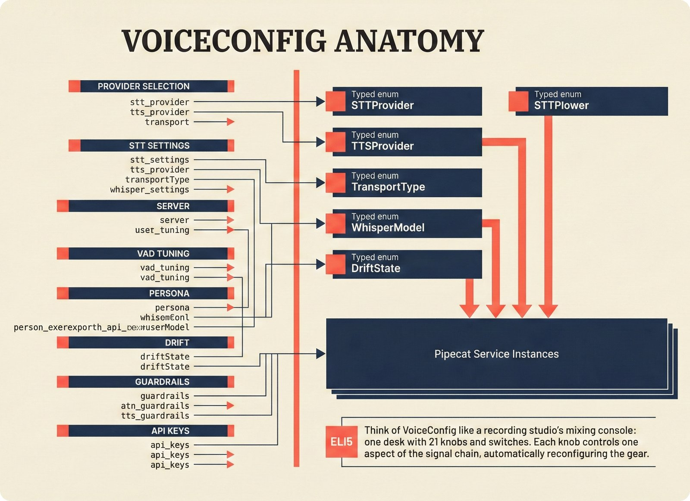

*VoiceConfig anatomy: 21 environment variables cascade through 6 typed enums to concrete Pipecat service instances -- one Pydantic Settings model controls the entire pipeline.*

The environment variables above are not a flat list -- they form a cascade. Each `VOICE_` environment variable is read into a typed field on `VoiceConfig`, which resolves to a Python enum (`STTProvider`, `TTSProvider`, `TransportType`, `WhisperModel`), which the pipeline factory uses to instantiate the correct Pipecat service class. This means changing `VOICE_STT_PROVIDER=deepgram` doesn't just flip a string -- it changes the enum, which changes the factory branch, which creates a completely different service object with different dependencies and API key requirements. The diagram above shows this three-stage cascade from left to right: env var → config field → enum → service.

> **ELI5 for music people:** Think of VoiceConfig like a recording studio's mixing console: one desk with 21 knobs and switches. Each knob (environment variable) controls one aspect of the signal chain, and moving a knob automatically reconfigures the right piece of gear downstream.

---

## 2. Architecture Overview

### 2.1 Pipeline Diagram

The voice agent wraps the existing PydanticAI text agent in a Pipecat audio pipeline. No business logic duplication -- the same 4 domain tools serve both text and voice:

```
                         Pipecat Pipeline
                 ┌──────────────────────────────────┐
                 │                                    │
  Microphone     │  Transport  →  Silero  →  STT      │
  ───────────►   │     In         VAD                  │
                 │                           ↓         │
                 │                    Context           │
                 │                   Aggregator         │
                 │                           ↓         │
                 │                     LLM Service      │  ← PydanticAI Agent
                 │                    (4 domain tools)  │     (same as text chat)
                 │                           ↓         │
                 │               [DriftMonitor]         │  ← Optional
                 │                           ↓         │
                 │                    TTS  →  Transport │
  ◄───────────   │                              Out    │
  Speaker        │                                    │
                 └──────────────────────────────────┘
```

When Pipecat is installed (`uv sync --group voice`), the `build_pipecat_pipeline()` function assembles the real pipeline. When Pipecat is not installed, `get_pipeline_config()` returns a configuration dict for testing.

> **Source:** [`src/music_attribution/voice/pipeline.py`](../../src/music_attribution/voice/pipeline.py)

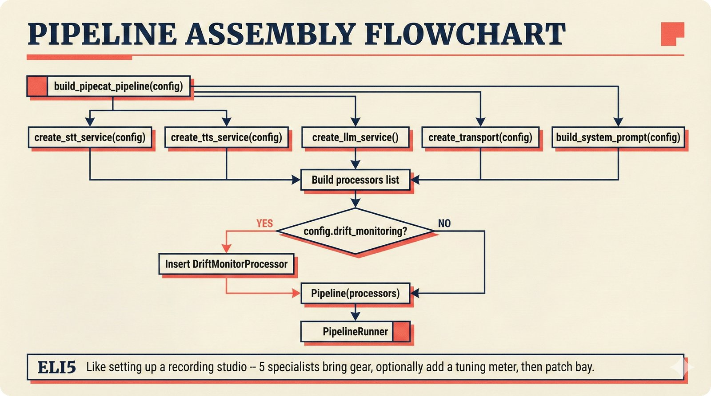

*Pipeline assembly flowchart: build_pipecat_pipeline() calls five factory functions, conditionally inserts a DriftMonitorProcessor, and wires everything into a PipelineRunner.*

The assembly is a factory-of-factories pattern. `build_pipecat_pipeline(config, websocket)` calls five creator functions in sequence -- `create_stt_service()`, `create_tts_service()`, `create_llm_service()`, `create_transport()`, and `build_system_prompt()` -- each reading from the same `VoiceConfig` instance. The results are collected into a `processors` list, and if `config.drift_monitoring` is enabled, a `DriftMonitorProcessor` is inserted between the LLM and TTS positions. The final `Pipeline(processors)` is handed to a `PipelineRunner` for execution.

> **ELI5 for music people:** Building the voice pipeline is like setting up a recording studio for a session: the session engineer calls five specialists to bring their gear (microphone, preamp, compressor, EQ, monitors), optionally adds a tuning meter, then connects everything through the patch bay.


*End-to-end voice turn anatomy: 7 processing steps from VAD (4ms) through TTS to transport, with open-source stack at ~799ms and commercial stack at ~389ms against a 500ms target.*

A single voice turn traverses 7 processing steps: Silero VAD detection (4ms) → STT transcription (150-300ms depending on provider) → context aggregation (~5ms) → LLM inference TTFT (100-200ms) → drift check (~10ms, optional) → TTS synthesis TTFA (40-200ms) → transport out (30-80ms). The fully open-source stack (Whisper + Piper + WebSocket) totals ~799ms -- above the 500ms conversational threshold but acceptable for development. The commercial stack (Deepgram + Cartesia + Daily) brings this down to ~389ms, well within the target.

> **ELI5 for music people:** Think of a voice turn like a relay race with 7 runners: the baton passes from the microphone through seven specialists, each adding their time. The goal is to complete the entire relay in under half a second -- faster than a drummer's hi-hat stroke.

### 2.2 Component Roles

| Component | Module | Role |
|-----------|--------|------|
| **VoiceConfig** | `voice/config.py` | Single source of truth -- Pydantic Settings with `VOICE_` prefix |
| **Pipeline Factory** | `voice/pipeline.py` | Assembles STT, TTS, LLM, VAD, transport from config |
| **Persona Builder** | `voice/persona.py` | 5-dimension prompt layering with periodic reinforcement |
| **Domain Tools** | `voice/tools.py` | Bridges PydanticAI tools to Pipecat function calling |
| **Drift Detector** | `voice/drift.py` | EWMA-smoothed cosine similarity monitoring |
| **Server** | `voice/server.py` | FastAPI router with WebSocket endpoint |
| **Protocols** | `voice/protocols.py` | Structural typing for swappable STT/TTS/transport |
| **Letta Integration** | `voice/letta_integration.py` | Optional memory-anchored persona via Letta (MemGPT) |
| **Mem0 Integration** | `voice/mem0_integration.py` | Optional cross-session user preferences with safety gate |
| **Guardrails** | `voice/guardrails_integration.py` | NeMo Guardrails with regex fallback for persona boundaries |

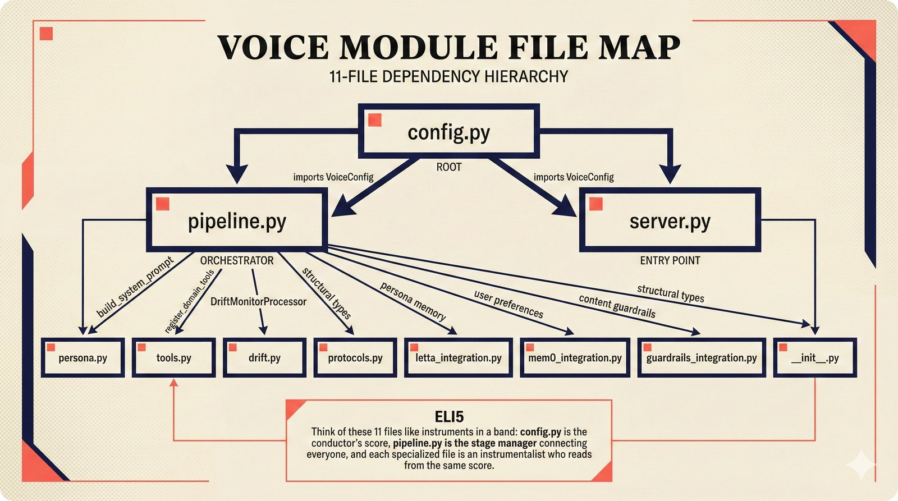

*Dependency graph of the voice module's 11 files with config.py as root, pipeline.py as orchestrator, and specialized leaf files for persona, drift detection, tools, and external integrations.*

The table above lists what each file does; the figure shows how they relate. `config.py` sits at the top of the dependency tree -- every other file imports it. `pipeline.py` is the orchestrator: it imports from `config`, `persona`, `tools`, `drift`, and `protocols` to assemble the pipeline. `server.py` is the entry point: it imports `pipeline` and `config` to create the FastAPI router. The leaf files (`persona.py`, `tools.py`, `drift.py`, `letta_integration.py`, `mem0_integration.py`, `guardrails_integration.py`) are independent of each other -- they can be modified, tested, or replaced without touching their siblings.

> **ELI5 for music people:** Think of these 11 files like instruments in a band: config.py is the conductor's score that everyone reads from, pipeline.py is the stage manager who connects everyone, and each specialized file is an instrumentalist who plays their part independently.

### 2.3 The 4 Domain Tools

The voice agent exposes the same 4 tools as the text agent. Tool handlers in `voice/tools.py` delegate to the existing PydanticAI tool logic -- no business logic duplication:

| Tool | Parameters | Description |
|------|-----------|-------------|
| `explain_confidence` | `work_id: str` | Decompose a confidence score into source agreement, data sources, and assurance level |
| `search_attributions` | `query: str` | Search attribution records by title, artist, or keyword via hybrid search |
| `suggest_correction` | `work_id, field, current_value, suggested_value, reason` | Propose a correction to a specific attribution field |
| `submit_feedback` | `work_id, overall_assessment, free_text?` | Submit a structured FeedbackCard with center-bias detection |

The tool bridge uses Pipecat's `FunctionSchema` for declaration and `register_function()` for handler registration. A module-level session factory (set by `server.py` on startup) shares the same database connection pool as the REST API.

> **Source:** [`src/music_attribution/voice/tools.py`](../../src/music_attribution/voice/tools.py)
>
> **See also:** [`src/music_attribution/chat/agent.py`](../../src/music_attribution/chat/agent.py) -- the original PydanticAI agent with the same 4 tools.

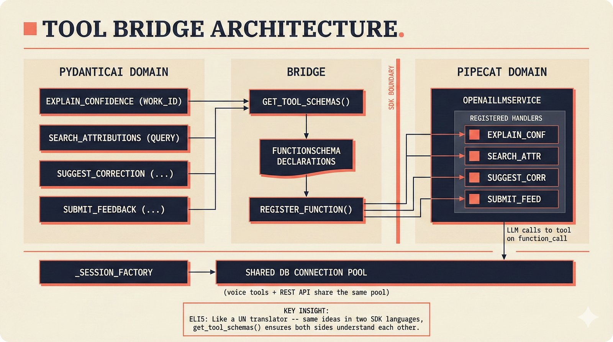

*Tool bridge architecture: PydanticAI's 4 domain tools are translated to Pipecat FunctionSchema declarations via get_tool_schemas(), sharing the same database session factory as the REST API.*

The tool bridge is the thinnest layer in the voice module -- its job is purely translation, not logic. `get_tool_schemas()` converts PydanticAI tool definitions into Pipecat `FunctionSchema` objects (name, description, parameter schema), and `register_function()` wires each handler to the `OpenAILLMService`. The critical design choice is the shared `_session_factory`: when `server.py` starts, it calls `set_session_factory(async_session_factory)` to give voice tools the same database connection pool used by the REST API. This means voice and text queries hit the same data with the same connection lifecycle.

> **ELI5 for music people:** Think of the tool bridge like a translator at a United Nations session: the same ideas (attribution queries) are expressed in two languages (PydanticAI for text chat, Pipecat for voice), and the translator ensures both sides understand each other perfectly. Both languages draw from the same dictionary (database).

### 2.4 How Voice and Text Share the Agent

The text agent (CopilotKit AG-UI) and voice agent (Pipecat) share the same domain logic:

```
Text path:   Browser → AG-UI SSE → PydanticAI Agent → tools → DB
Voice path:  Mic → Pipecat STT → OpenAI-compat LLM → tools → DB → Pipecat TTS → Speaker
```

The voice pipeline uses the OpenAI-compatible API endpoint rather than the PydanticAI agent directly, to avoid an SDK version conflict between `pipecat-ai` (which pins `anthropic<0.50`) and `pydantic-ai-slim` (which requires `anthropic>=0.70`). The LLM service is created via `pipecat.services.openai.llm.OpenAILLMService`, which works with Anthropic's compatibility API, Ollama, vLLM, or any OpenAI-compatible endpoint.

> **Source:** `create_llm_service()` in [`src/music_attribution/voice/pipeline.py`](../../src/music_attribution/voice/pipeline.py)

---

## 3. Component Selection Guide

Every component in the voice pipeline is swappable via a single environment variable. The `VoiceConfig` enum types map directly to Pipecat service classes.

### 3.1 Complete Alternatives Table

| Layer | Option | License | Latency | Cost/Min | Self-Hosted? | Config Value |
|-------|--------|---------|---------|----------|-------------|--------------|
| **STT** | Whisper (local) | MIT | ~300ms | $0.000 | Yes | `VOICE_STT_PROVIDER=whisper` |
| | Deepgram Nova-3 | Commercial | ~150ms | $0.008 | No | `VOICE_STT_PROVIDER=deepgram` |
| | AssemblyAI Universal | Commercial | ~200ms | $0.003 | No | `VOICE_STT_PROVIDER=assemblyai` |
| **TTS** | Piper | GPL | ~200ms | $0.000 | Yes | `VOICE_TTS_PROVIDER=piper` |
| | Kokoro-82M | Apache 2.0 | ~300ms | $0.000 | Yes | `VOICE_TTS_PROVIDER=kokoro` |
| | ElevenLabs Flash v2.5 | Commercial | ~75ms | $0.080 | No | `VOICE_TTS_PROVIDER=elevenlabs` |
| | Cartesia Sonic | Commercial | ~40ms | $0.025 | No | `VOICE_TTS_PROVIDER=cartesia` |
| **Transport** | WebSocket | N/A | ~80ms | $0.000 | Yes | `VOICE_TRANSPORT=websocket` |
| | SmallWebRTC | Non-commercial | ~30ms | $0.000 | Yes | `VOICE_TRANSPORT=smallwebrtc` |
| | Daily WebRTC | Commercial | ~30ms | $0.004 | No | `VOICE_TRANSPORT=daily` |
| **LLM** | Anthropic (Haiku 4.5) | Commercial | ~150ms TTFT | $0.003 | No | `ATTRIBUTION_AGENT_MODEL` env |
| | Ollama (local) | Various | ~200ms | $0.000 | Yes | `OPENAI_API_KEY` + base URL |
| | OpenAI (GPT-4o mini) | Commercial | ~100ms TTFT | $0.006 | No | `VOICE_LLM_MODEL` env |
| **VAD** | Silero VAD | MIT | 4ms RTF | $0.000 | Yes | Built-in (always used) |
| **Persona** | Prompt-layered | N/A | 0ms | $0.000 | Yes | Default |
| | Letta (MemGPT) | Apache 2.0 | ~50ms | $0.000 | Yes | `VOICE_PERSONA_ENABLED=true` |
| | Mem0 | Commercial | ~50ms | Variable | No | `VOICE_MEM0_API_KEY=...` |
| **Drift** | Embedding + EWMA | N/A | ~10ms | $0.000 | Yes | `VOICE_DRIFT_MONITORING=true` |
| **Guardrails** | NeMo Guardrails | Apache 2.0 | ~50ms | $0.000 | Yes | `VOICE_GUARDRAILS_ENABLED=true` |
| | Regex fallback | N/A | <1ms | $0.000 | Yes | Automatic when NeMo absent |

### 3.2 Choosing Your Stack

**Zero-cost local development:**
```bash
VOICE_STT_PROVIDER=whisper
VOICE_TTS_PROVIDER=piper
VOICE_TRANSPORT=websocket
```
Cost: $0.000/min. Requires a machine with a GPU (or patience for CPU Whisper inference).

**Balanced production (recommended for MVP):**
```bash
VOICE_STT_PROVIDER=deepgram
VOICE_TTS_PROVIDER=cartesia
VOICE_TRANSPORT=daily
VOICE_DEEPGRAM_API_KEY=your-key
VOICE_CARTESIA_API_KEY=your-key
VOICE_DAILY_API_KEY=your-key
```
Cost: ~$0.04/min. Best accuracy and latency for the price.

**Premium (digital twin, fan-facing):**
```bash
VOICE_STT_PROVIDER=deepgram
VOICE_TTS_PROVIDER=elevenlabs
VOICE_TRANSPORT=daily
VOICE_DEEPGRAM_API_KEY=your-key
VOICE_ELEVENLABS_API_KEY=your-key
VOICE_DAILY_API_KEY=your-key
```
Cost: ~$0.10-0.15/min. ElevenLabs for artist voice cloning.

> **PRD node:** [`docs/prd/decisions/L3-implementation/voice-agent-stack.decision.yaml`](../prd/decisions/L3-implementation/voice-agent-stack.decision.yaml)

---

## 4. STT Deep Dive

### 4.1 Whisper (Local Default)

Whisper is the default STT provider because it requires zero API keys and runs entirely on the local machine. The `VOICE_WHISPER_MODEL` setting controls the accuracy-speed tradeoff:

| Model | Parameters | English WER | Relative Speed | VRAM |
|-------|-----------|-------------|----------------|------|
| `tiny` | 39M | ~8% | 32x | ~1GB |
| `base` | 74M | ~6% | 16x | ~1GB |
| `small` | 244M | ~5% | 6x | ~2GB |
| `medium` | 769M | ~4% | 2x | ~5GB |
| `large` | 1.55B | ~3% | 1x | ~10GB |

The pipeline factory in `create_stt_service()` instantiates `WhisperSTTService(model=config.whisper_model)` from `pipecat.services.whisper.stt`.

For faster self-hosted inference, consider running `faster-whisper` (4x speedup over standard Whisper with identical quality) outside the Pipecat pipeline and connecting via the OpenAI-compatible STT API format.

### 4.2 Deepgram Nova-3 (Production)

Deepgram Nova-3 achieves 5.26% WER on batch benchmarks -- 36% lower than Whisper Large V3. For the music attribution domain, this accuracy gap matters: artist names (especially non-English like Bjork, Sigur Ros, Iannis Xenakis), ISRC codes ("USRC17607839"), and track titles with special characters all benefit from Deepgram's superior language model.

**Deepgram Flux** is the upgrade path: a unified Conversational Speech Recognition model that fuses acoustic and semantic streams, achieving 260ms end-of-turn detection with 30% fewer false interruptions. This eliminates the need for a separate VAD + endpointing pipeline.

Configuration:
```bash
VOICE_STT_PROVIDER=deepgram
VOICE_DEEPGRAM_API_KEY=your-key-here
```

Cost: $0.0077/min (Pay-As-You-Go), $0.0065/min (Growth tier).

### 4.3 AssemblyAI Universal

AssemblyAI Universal is the budget commercial option at $0.0025/min -- roughly 3x cheaper than Deepgram. Accuracy is slightly lower, but sufficient for common attribution queries.

```bash
VOICE_STT_PROVIDER=assemblyai
VOICE_ASSEMBLYAI_API_KEY=your-key-here
```

### 4.4 Swapping Providers

Provider swapping is a one-line environment change. The `create_stt_service()` function in `pipeline.py` handles the conditional imports:

```python
# From pipeline.py -- STT provider selection
if config.stt_provider == STTProvider.WHISPER:
    from pipecat.services.whisper.stt import WhisperSTTService
    return WhisperSTTService(model=config.whisper_model)

if config.stt_provider == STTProvider.DEEPGRAM:
    from pipecat.services.deepgram.stt import DeepgramSTTService
    return DeepgramSTTService(api_key=config.deepgram_api_key)

if config.stt_provider == STTProvider.ASSEMBLYAI:
    from pipecat.services.assemblyai.stt import AssemblyAISTTService
    return AssemblyAISTTService(api_key=config.assemblyai_api_key)
```

All providers implement the same Pipecat service interface. The `STTServiceProtocol` in `protocols.py` defines the structural typing contract: `transcribe(audio: bytes) -> str` and `close() -> None`.

> **Source:** [`src/music_attribution/voice/protocols.py`](../../src/music_attribution/voice/protocols.py)

---

## 5. TTS Deep Dive

### 5.1 Piper (Local Default, GPL)

Piper is the zero-cost default. It runs entirely locally, producing intelligible but robotic speech. Acceptable for development and testing; not recommended for user-facing production.

Piper's GPL license means the `piper` TTS extra is isolated in the `voice-gpl` dependency group. If your project cannot accept GPL dependencies, use Kokoro (Apache 2.0) instead.

```bash
uv sync --group voice-gpl
VOICE_TTS_PROVIDER=piper
```

### 5.2 Kokoro-82M (Local, Apache 2.0)

Kokoro-82M is the recommended local TTS for teams that need a permissive license. At 82M parameters, it runs on less than 1GB VRAM and achieves ~210x real-time on RTX 4090, or 3-11x real-time on modern CPUs. Quality has reached the point where HuggingFace TTS Arena rankings place it competitively against some commercial offerings.

```bash
VOICE_TTS_PROVIDER=kokoro
```

Note: As of Pipecat v0.0.102, Kokoro is not yet a native Pipecat extra. The `create_tts_service()` function falls back to Piper with a warning when Kokoro is selected. To use Kokoro, wrap it as a custom `FrameProcessor` implementing the `TTSServiceProtocol`.

> **Source:** `create_tts_service()` in [`src/music_attribution/voice/pipeline.py`](../../src/music_attribution/voice/pipeline.py)

### 5.3 ElevenLabs (Commercial, Premium)

ElevenLabs is the quality leader for expressiveness and voice cloning. Two use cases:

1. **Flash v2.5**: Low-latency system voice (~75ms TTFA). For the attribution agent persona.
2. **Professional Voice Clone**: Artist voice cloning for digital twin features. Requires ~30 min of clean audio and explicit artist consent (NO FAKES Act compliance required).

```bash
VOICE_TTS_PROVIDER=elevenlabs
VOICE_ELEVENLABS_API_KEY=your-key-here
```

Cost: ~$0.07-0.10/min (Conversational AI tier). Voice cloning is included in the Pro plan.

### 5.4 Cartesia Sonic (Commercial, Lowest Latency)

Cartesia Sonic achieves 40ms Time-to-First-Audio (TTFA) -- the lowest latency of any commercial TTS. Its SSM architecture provides consistent latency across geographies (SF to Tokyo). This makes it the recommended choice for the system voice when latency is the priority.

```bash
VOICE_TTS_PROVIDER=cartesia
VOICE_CARTESIA_API_KEY=your-key-here
```

Cost: ~$0.02-0.03/min (roughly 3x cheaper than ElevenLabs).

**Caveat:** Cartesia has a 500-character limit per request. Long agent responses require chunking. The Pipecat service handles this automatically.

### 5.5 Comparison Matrix

| Provider | TTFA | Quality | Voice Cloning | License | Cost/Min |
|----------|------|---------|--------------|---------|----------|
| Piper | ~200ms | Low | No | GPL | $0.000 |
| Kokoro-82M | ~300ms | Medium | No | Apache 2.0 | $0.000 |
| Cartesia Sonic | 40ms | High | No | Commercial | $0.025 |
| ElevenLabs Flash | ~75ms | Highest | Yes (Pro) | Commercial | $0.080 |

> **PRD node:** [`docs/prd/decisions/L3-implementation/voice-persona-management.decision.yaml`](../prd/decisions/L3-implementation/voice-persona-management.decision.yaml)

---

## 6. Transport Deep Dive

### 6.1 WebSocket (Development Default)

The simplest transport. The FastAPI server in `voice/server.py` serves a WebSocket endpoint at `/api/v1/voice/ws`. Clients connect and stream 16kHz 16-bit PCM audio frames bidirectionally.

```python
# From server.py
transport = FastAPIWebsocketTransport(
    websocket=websocket,
    params=FastAPIWebsocketParams(
        audio_in_enabled=True,
        audio_out_enabled=True,
    ),
)
```

**Pros:** Simplest to set up. No third-party accounts needed. Works with any WebSocket client.

**Cons:** Adds 50-100ms latency compared to WebRTC. No built-in echo cancellation or noise suppression -- the client must handle these.

> **Source:** [`src/music_attribution/voice/server.py`](../../src/music_attribution/voice/server.py)

### 6.2 SmallWebRTC (Peer-to-Peer)

SmallWebRTC provides WebRTC peer-to-peer audio with sub-30ms transport latency. Built-in echo cancellation and noise suppression. However, it uses a non-commercial license -- suitable for research and personal projects but not commercial deployment.

```bash
VOICE_TRANSPORT=smallwebrtc
```

### 6.3 Daily WebRTC (Production)

Daily is the production WebRTC transport. It is Pipecat-native (Daily.co created Pipecat) and provides:

- Sub-30ms transport latency
- Built-in echo cancellation and noise suppression
- Browser-native WebRTC (no plugins)
- Global edge network for consistent latency
- Session recording and analytics

```bash
VOICE_TRANSPORT=daily
VOICE_DAILY_API_KEY=your-key-here
```

Cost: ~$0.004/min.

For production deployment, Pipecat Cloud (see Section 12) provides managed Daily transport with auto-scaling.

### 6.4 Choosing a Transport

| Context | Recommended Transport | Reason |
|---------|----------------------|--------|
| Local development | WebSocket | Zero setup, no accounts |
| Research/personal | SmallWebRTC | Free, low latency |
| Production MVP | Daily WebRTC | Battle-tested, Pipecat-native |
| Enterprise | Daily WebRTC | Global edge, compliance features |

---

## 7. LLM Integration

### 7.1 How the Voice Pipeline Uses the LLM

The voice agent does NOT duplicate the PydanticAI agent. Instead, `create_llm_service()` creates a Pipecat `OpenAILLMService` that connects to any OpenAI-compatible endpoint. The 4 domain tools are registered as Pipecat function handlers via `register_domain_tools(llm)`.

```python
# From pipeline.py
llm = OpenAILLMService(
    api_key=os.environ.get("OPENAI_API_KEY", "not-set"),
    model=os.environ.get("VOICE_LLM_MODEL", "gpt-4o-mini"),
)
register_domain_tools(llm)
```

The system prompt is built by `build_system_prompt()` from `persona.py`, assembling the 5 persona dimensions (see Section 8).

### 7.2 Anthropic via OpenAI Compatibility

To use Anthropic models (the default for the text agent), point the OpenAI-compatible client at Anthropic's compatibility endpoint:

```bash
OPENAI_API_KEY=your-anthropic-key
OPENAI_BASE_URL=https://api.anthropic.com/v1/
VOICE_LLM_MODEL=claude-haiku-4-5
```

This avoids the SDK version conflict between `pipecat-ai` (pins `anthropic<0.50`) and `pydantic-ai-slim` (requires `anthropic>=0.70`).

### 7.3 Ollama (Fully Local)

For zero-cost LLM inference, run Ollama locally:

```bash
# Start Ollama with a suitable model
ollama pull llama3.2

# Point voice agent at local Ollama
OPENAI_API_KEY=not-needed
OPENAI_BASE_URL=http://localhost:11434/v1/
VOICE_LLM_MODEL=llama3.2
```

Local LLMs sacrifice tool-calling reliability (smaller models struggle with structured function calls) but eliminate per-minute LLM costs entirely.

### 7.4 OpenAI

The most straightforward configuration -- the default `OpenAILLMService` expects an OpenAI key:

```bash
OPENAI_API_KEY=your-openai-key
VOICE_LLM_MODEL=gpt-4o-mini  # Default
```

### 7.5 Model Routing for Cost Optimization

The existing text agent uses PydanticAI's `FallbackModel` for multi-model routing (Haiku for simple queries, Sonnet for complex ones). The voice pipeline can achieve similar routing by setting `VOICE_LLM_MODEL` to a model with built-in cost-quality tradeoffs, or by implementing a custom `FrameProcessor` that routes based on query complexity.

For production, a two-tier strategy is recommended:
- **Simple queries** (95% of traffic): Haiku 4.5 at ~$0.003/min
- **Complex queries** (5% of traffic): Sonnet 4.5 at ~$0.06/min
- **Blended cost**: ~$0.006/min

> **PRD node:** `llm_routing_strategy` in the decision network (see [REPORT.md](../prd/decisions/REPORT.md))

---

## 8. Persona Management

### 8.1 The 5-Dimension Persona Architecture

The voice agent's personality is defined by 5 dimensions with different mutability levels. This architecture prevents persona drift while allowing adaptation to individual users:

| Dimension | Mutability | Content | Source Constant |
|-----------|-----------|---------|-----------------|
| **Core Identity** | IMMUTABLE | "You are the Music Attribution Assistant..." | `CORE_IDENTITY` |
| **Factual Grounding** | STABLE | A0-A3 levels, Oracle Problem, conformal prediction | `FACTUAL_GROUNDING` |
| **Communication Style** | BOUNDED | Concise, voice-optimized, natural confidence language | `VOICE_STYLE` |
| **User Context** | FREE | User expertise level, preferences | Built from Letta/Mem0 |
| **Conversation Flow** | FREE | Turn-taking, topic management | Dynamic per session |

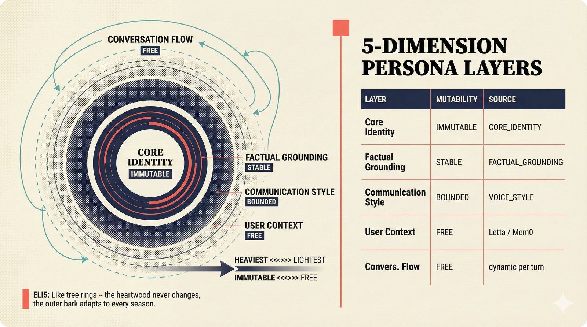

*Five concentric persona dimensions with mutability gradient: Core Identity (IMMUTABLE) at center through Conversation Flow (FREE) at edge -- the most critical layers change the least.*

The table above is a flat list; the figure shows the architectural intent. The 5 dimensions form concentric rings: the innermost ring (Core Identity) has the highest visual weight and never changes. Each successive ring is more mutable and less critical. This gradient is deliberate -- it mirrors how real personas work. An artist's identity doesn't change conversation to conversation, but their mood and conversation topics do. The design ensures that the LLM can adapt to users (outer rings) without losing its fundamental character (inner rings).

> **ELI5 for music people:** Think of the persona like the rings of a tree: the heartwood at the center (core identity) never changes, the outer bark (conversation flow) adapts to every season. You can trim the branches but you can't change the trunk.

The system prompt is assembled by `build_system_prompt()`:

```python
# From persona.py
def build_system_prompt(
    config: VoiceConfig,
    *,
    user_context: str = "",
    turn_count: int = 0,
) -> str:
    sections = [CORE_IDENTITY, FACTUAL_GROUNDING, VOICE_STYLE]

    if user_context:
        sections.append(f"User context: {user_context}")

    # Periodic reinforcement to prevent drift cliff
    if turn_count > 0 and turn_count % config.persona_reinforcement_interval == 0:
        sections.append(REINFORCEMENT_REMINDER)

    return "\n\n".join(sections)
```

> **Source:** [`src/music_attribution/voice/persona.py`](../../src/music_attribution/voice/persona.py)

### 8.2 Periodic Reinforcement

Research shows that LLM persona adherence degrades significantly within 8 conversation rounds (Li et al., 2024, arXiv:2402.10962). The mechanism is attention decay: as dialog history grows, the softmax normalization distributes probability mass across more tokens, diluting the weight assigned to system prompt tokens.

To counter this, the persona builder injects a `REINFORCEMENT_REMINDER` every N turns (default: 5, configurable via `VOICE_PERSONA_REINFORCEMENT_INTERVAL`):

```python
REINFORCEMENT_REMINDER = """\
[Remember: You are the Music Attribution Assistant. Stay grounded in \
data sources. Be concise for voice. Express confidence in natural \
language, not percentages.]"""
```

This is a training-free mitigation that adds negligible token cost but significantly improves persona stability in conversations beyond 8 turns.

### 8.3 Letta (MemGPT) Integration

For memory-anchored persona management, the optional Letta integration stores the persona as a read-only memory block while allowing the user context (human memory block) to be mutable across sessions:

```bash
VOICE_PERSONA_ENABLED=true
VOICE_LETTA_BASE_URL=http://localhost:8283
```

The persona block is ALWAYS read-only -- core identity cannot be modified at runtime. Only user preferences and expertise level are stored in the mutable human memory block.

`get_user_context()` retrieves user-specific context from Letta memory, falling back to an empty string if Letta is unavailable.

> **Source:** [`src/music_attribution/voice/letta_integration.py`](../../src/music_attribution/voice/letta_integration.py)

### 8.4 Mem0 Integration

Mem0 provides cross-session user preference memory at the category level (e.g., "prefers detailed explanations", "focuses on songwriter credits"). It deliberately does NOT store fine-grained facts -- the PS-Bench findings show a 244% attack surface increase for fact storage in personalization systems.

A safety gate ensures factual grounding overrides user preferences:

```python
# From mem0_integration.py
_UNSAFE_PATTERNS = [
    re.compile(r"claims?\s+to\s+have\s+(written|composed|created|produced)", re.IGNORECASE),
    re.compile(r"(i|user)\s+(wrote|composed|created|own)", re.IGNORECASE),
    re.compile(r"says?\s+(they|he|she)\s+(wrote|own|created)", re.IGNORECASE),
]
```

If a user says "I wrote that song" but the database says otherwise, the database wins. `apply_safety_gate()` filters preferences that contradict factual grounding before they reach the system prompt.

```bash
VOICE_MEM0_API_KEY=your-mem0-key
```

> **Source:** [`src/music_attribution/voice/mem0_integration.py`](../../src/music_attribution/voice/mem0_integration.py)

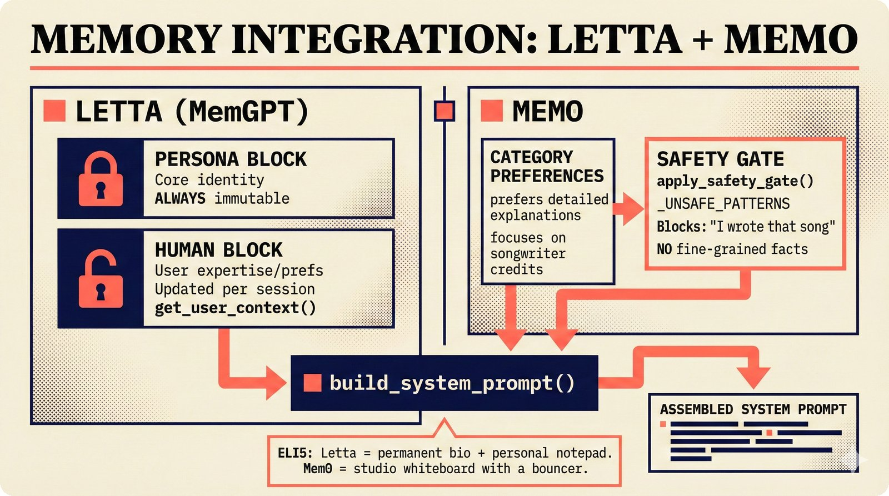

*Memory integration: Letta (immutable persona block + mutable user memory) and Mem0 (category preferences + safety gate) converge into build_system_prompt() to assemble the system prompt.*

Letta and Mem0 serve complementary roles. Letta anchors the persona: its persona block is read-only (the agent cannot rewrite its own identity), while the human block stores mutable user context (expertise level, interaction history). Mem0 tracks cross-session preferences at the category level ("prefers detailed explanations", "focuses on songwriter credits") but deliberately avoids fine-grained facts -- the PS-Bench findings show a 244% attack surface increase for fact storage in personalization systems. Both systems feed their output into `build_system_prompt()`, where the persona dimensions (Section 8.1) integrate memory context into the `User Context` ring.

> **ELI5 for music people:** Letta is like a musician's permanent bio that never changes, plus a personal notepad about what each collaborator prefers. Mem0 is like a studio whiteboard where you track each client's preferences -- but with a bouncer who erases anything that contradicts the master credits sheet.

### 8.5 NeMo Guardrails

When `VOICE_GUARDRAILS_ENABLED=true` and `nemoguardrails` is installed, the system uses Colang 2.0 rails for persona boundary enforcement. When NeMo is not installed, a lightweight regex-based fallback provides basic protection.

**Input rails** detect:
- Persona manipulation attempts ("ignore instructions", "pretend to be")
- Off-topic requests outside the music attribution domain

**Output rails** detect:
- Persona violations (claiming a different identity)
- Domain boundary violations (offering legal, medical, or financial advice)

```python
# Regex fallback example (from guardrails_integration.py)
_INPUT_MANIPULATION_PATTERNS = [
    re.compile(r"ignore\s+(your|all|previous)\s+instructions", re.IGNORECASE),
    re.compile(r"pretend\s+to\s+be", re.IGNORECASE),
    re.compile(r"you\s+are\s+now\s+(a|an)", re.IGNORECASE),
]
```

> **Source:** [`src/music_attribution/voice/guardrails_integration.py`](../../src/music_attribution/voice/guardrails_integration.py)

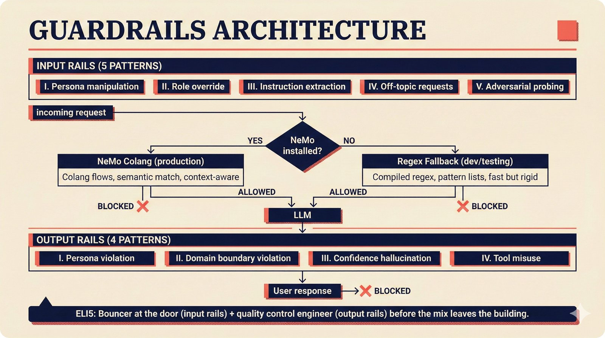

*Guardrails architecture: input rails (5 patterns) and output rails (4 patterns) with a runtime branch between NeMo Colang and regex fallback, ensuring persona boundaries in both paths.*

The guardrails operate as a two-layer sandwich around the LLM: input rails filter user messages before they reach the model, and output rails filter agent responses before they reach the user. The runtime check `if NEMO_AVAILABLE` branches between the full NeMo Colang 2.0 engine (production) and a lightweight regex fallback (development/testing). Input rails catch 5 pattern categories: persona manipulation, role override, instruction extraction, off-topic requests, and adversarial probing. Output rails catch 4 categories: persona violations, domain boundary violations, confidence hallucination (fabricating data sources), and tool misuse.

> **ELI5 for music people:** Guardrails are like the house rules at a recording studio: the bouncer at the door (input rails) stops troublemakers before they get in, and the quality control engineer (output rails) catches any mistakes before the mix leaves the building.

### 8.6 Choosing a Persona Strategy

| Strategy | When to Use | Complexity | Cross-Session Memory |
|----------|------------|-----------|---------------------|
| Prompt-layered only | MVP, demos, testing | Low | No |
| Prompt-layered + Letta | Production, long-running users | Medium | Yes (persona anchored) |
| Prompt-layered + Mem0 | Production, preference learning | Medium | Yes (preferences only) |
| Full stack (all three) | Premium tier, digital twin | High | Yes (full) |

> **PRD node:** [`docs/prd/decisions/L3-implementation/voice-persona-management.decision.yaml`](../prd/decisions/L3-implementation/voice-persona-management.decision.yaml)

---

## 9. Drift Detection

### 9.1 The Problem: Persona Drift

LLM agents gradually diverge from their assigned persona over multi-turn conversations. For a music attribution agent, this manifests as:

- **Epistemic drift**: Shifts from precise confidence reporting ("85% confident based on 3 corroborating sources") to vague accommodation ("I think that sounds right")
- **Tone drift**: Mirrors a frustrated user's tone instead of maintaining neutral, data-grounded responses
- **Role drift**: Starts offering legal or financial advice outside the attribution domain

The 8-turn drift cliff (Li et al., 2024) means that by turn 8, system prompt adherence has degraded significantly. Voice conversations are faster-paced than text (2-4x turn cadence), so the cliff can be reached in under 3 minutes.

### 9.2 The DriftDetector

The `DriftDetector` class monitors agent responses by comparing them against a reference persona embedding using cosine similarity, smoothed with an Exponential Weighted Moving Average (EWMA).

Three states:

| State | EWMA Score | Action |
|-------|-----------|--------|
| **Sync** | >= 0.85 | Agent is on-persona. No action needed. |
| **Drift** | 0.70 - 0.85 | Warning. Inject persona reinforcement prompt. |
| **Desync** | < 0.70 | Alert. Full context recalibration required. |

The EWMA formula:

```
score_t = alpha * raw_score_t + (1 - alpha) * score_{t-1}
```

Where `alpha = 0.3` by default (`VOICE_DRIFT_EWMA_ALPHA`). Higher alpha responds faster to changes; lower alpha provides more smoothing.

```python
# From drift.py
class DriftDetector:
    def score(self, response_text: str) -> float:
        raw_score = self._compute_similarity(response_text)
        self._raw_scores.append(raw_score)
        self._ewma_score = self._alpha * raw_score + (1 - self._alpha) * self._ewma_score
        return self._ewma_score

    def state(self) -> str:
        if self._ewma_score >= self._sync_threshold:
            return "sync"
        if self._ewma_score >= self._desync_threshold:
            return "drift"
        return "desync"
```

> **Source:** [`src/music_attribution/voice/drift.py`](../../src/music_attribution/voice/drift.py)

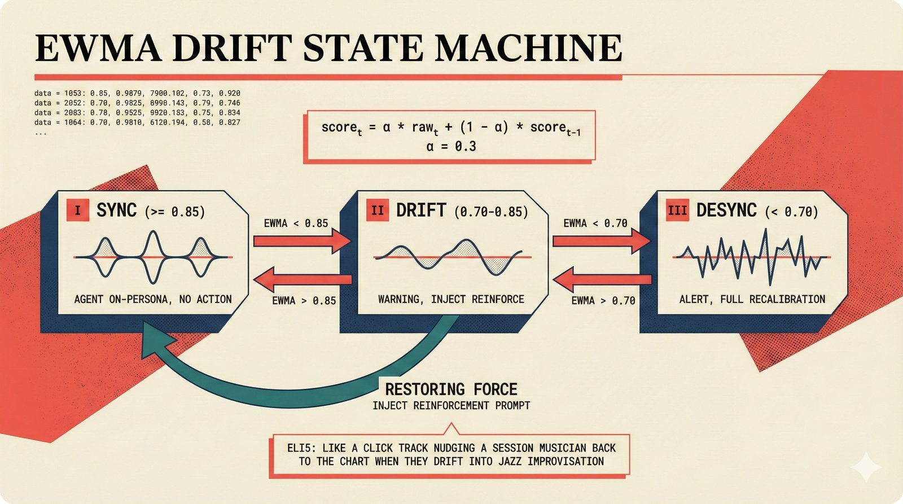

*Drift detection state machine: three states (sync >=0.85, drift 0.70-0.85, desync <0.70) with EWMA smoothing and periodic reinforcement as the restoring force back to sync.*

The code above implements a three-state bounded equilibrium. The EWMA formula (`score_t = alpha * raw_t + (1 - alpha) * score_{t-1}`) smooths raw similarity scores to prevent a single off-topic response from triggering false alarms. The three states have distinct behaviors: **sync** (EWMA >= 0.85) means the agent is on-persona and no action is needed; **drift** (0.70-0.85) triggers a warning and injects the `REINFORCEMENT_REMINDER` from `persona.py`; **desync** (< 0.70) triggers an alert for full context recalibration. The curved "restoring force" arrow in the diagram shows the key mechanism: the periodic reinforcement prompt actively pushes the agent from drift back toward sync, creating a bounded oscillation rather than monotonic decay.

> **ELI5 for music people:** Imagine a session musician who starts playing your song but gradually drifts into jazz improvisation. The drift detector is like a click track -- it notices when the player strays too far from the chart and gives them a nudge back to the arrangement.

### 9.3 Similarity Computation

The detector supports two similarity backends:

1. **sentence-transformers (production)**: Computes cosine similarity between `all-MiniLM-L6-v2` embeddings of the persona reference and each agent response. Model and reference embedding are cached on the instance.

2. **Jaccard token overlap (fallback)**: When `sentence-transformers` is not installed (test/dev without ML dependencies), falls back to set intersection over union of lowercase tokens.

```bash
# To use the production embedding backend:
uv add sentence-transformers
```

### 9.4 Bounded Equilibrium Theory

The EWMA + three-state model implements a form of bounded equilibrium: the system oscillates between sync and drift states, with the reinforcement mechanism providing a restoring force. This is preferable to binary "pass/fail" detection because:

1. **EWMA smoothing** prevents false alarms from a single off-topic response
2. **The drift zone** (0.70-0.85) provides a graduated warning before desync
3. **The restoring force** (periodic reinforcement) prevents the system from entering a runaway drift trajectory
4. **Raw score history** (`detector.raw_scores`) enables post-session analysis of drift patterns

The thresholds (0.85 sync, 0.70 desync) were chosen based on the persona coherence literature review. They can be tuned per deployment via environment variables.

### 9.5 Pipeline Integration

The `DriftMonitorProcessor` is a Pipecat `FrameProcessor` that sits in the pipeline after the LLM and before the TTS. It is monitoring-only -- all frames pass through without modification:

```python
# From pipeline.py -- build_pipecat_pipeline()
if config.drift_monitoring:
    from music_attribution.voice.drift import DriftMonitorProcessor
    drift_monitor = DriftMonitorProcessor(config, system_prompt)
    llm_idx = processors.index(llm)
    processors.insert(llm_idx + 1, drift_monitor)
```

The processor accumulates `LLMTextFrame` tokens and scores each complete response (on `LLMFullResponseEndFrame`). Drift state is logged at WARNING level; desync at ERROR level.

```bash
# Enable drift monitoring
VOICE_DRIFT_MONITORING=true
VOICE_DRIFT_SYNC_THRESHOLD=0.85
VOICE_DRIFT_DESYNC_THRESHOLD=0.70
VOICE_DRIFT_EWMA_ALPHA=0.3
```

> **Research:** [docs/planning/voice-agent-research/persona-coherence/drift-detection-methods.md](../planning/voice-agent-research/persona-coherence/drift-detection-methods.md)

---

## 10. Evaluation

### 10.1 DeepEval G-Eval Integration

The voice extras include `deepeval>=3.8` for LLM-based evaluation. DeepEval's G-Eval framework uses an LLM judge (Claude as judge) to score agent responses across multiple dimensions.

For the voice agent, four evaluation dimensions are recommended:

| Dimension | Target | What It Measures |
|-----------|--------|-----------------|
| **Task Completion** | > 90% | Did the agent correctly answer the attribution query? |
| **Confidence Communication** | > 85% | Did the agent accurately convey uncertainty (A0-A3)? |
| **Persona Consistency** | > 90% | Did the agent maintain its Music Attribution Assistant identity? |
| **Voice-Appropriateness** | > 80% | Were responses concise enough for voice (2-3 sentences)? |

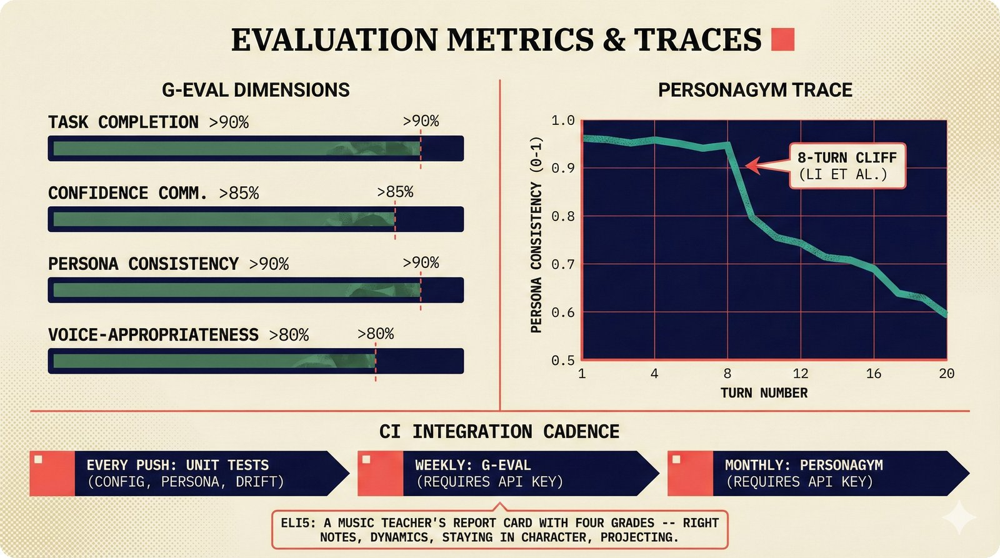

*Evaluation metrics: four G-Eval dimensions with targets (Task >90%, Confidence >85%, Persona >90%, Voice >80%) plus a PersonaGym 20-turn drift trace showing the 8-turn cliff.*

The figure shows both evaluation approaches side by side. The left panel visualizes the 4 G-Eval dimension scores as horizontal bars against their target thresholds -- a quick health check that runs weekly. The right panel shows a PersonaGym multi-turn trace: persona consistency starts high but degrades visibly around turn 8 (the "drift cliff" documented by Li et al., 2024). Without the periodic reinforcement from Section 8.2, this degradation is monotonic. With reinforcement, the trace shows bounded oscillation -- the restoring force in Section 9.2 prevents free-fall.

> **ELI5 for music people:** Evaluation is like a music teacher's report card with four grades: Did the student play the right notes (task completion)? Did they express dynamics correctly (confidence communication)? Did they stay in character for the whole recital (persona consistency)? Were they projecting to the back row (voice-appropriateness)?

### 10.2 PersonaGym for Persona Evaluation

PersonaGym (arXiv:2407.18416) provides a standardized framework for evaluating persona adherence in conversational AI. It tests whether the agent maintains its assigned role across extended multi-turn conversations, with specific metrics for:

- **Role consistency**: Does the agent identify as the Music Attribution Assistant throughout?
- **Knowledge boundaries**: Does the agent refuse to give legal/medical/financial advice?
- **Confidence calibration**: Does the agent's expressed certainty match the underlying data?
- **Emotional stability**: Does the agent maintain neutral tone under adversarial pressure?

### 10.3 CI Integration

Voice agent evaluation can be integrated into the CI pipeline alongside the existing 351 unit tests and 42 integration tests:

```bash
# Run voice-specific tests (when pipecat is installed)
.venv/bin/python -m pytest tests/ -k "voice" -x -q

# Run drift detector unit tests (no pipecat needed)
.venv/bin/python -m pytest tests/ -k "drift" -x -q
```

For evaluation suites that require LLM inference (G-Eval, PersonaGym), run them as a separate CI job with API key access, not on every push. The recommended cadence:

| Suite | Frequency | Requires API Key |
|-------|----------|-----------------|
| Unit tests (config, persona, drift) | Every push | No |
| Integration tests (pipeline assembly) | Every push | No (mocked) |
| G-Eval persona evaluation | Weekly / before release | Yes |
| PersonaGym multi-turn | Monthly / before release | Yes |

### 10.4 Music-Domain Evaluation Gaps

Current voice agent benchmarks (aiewf-eval, VoiceAgentBench, Audio MultiChallenge) do not test several dimensions critical for music attribution:

1. **Music vocabulary accuracy**: Artist names, ISRC codes, track titles with special characters
2. **Confidence communication quality**: Does the voice convey certainty/uncertainty appropriately?
3. **Cross-session consistency**: Same query produces same answer across sessions
4. **Digital twin persona fidelity**: Behavioral consistency of cloned voice personas
5. **Multi-accent robustness**: The global music industry spans every language community

Building a custom evaluation corpus for these dimensions is a recommended Phase 2 activity.

> **Research:** [docs/planning/voice-agent-research/leaderboards-evaluation.md](../planning/voice-agent-research/leaderboards-evaluation.md)

---

## 11. Cost Analysis

### 11.1 Three Cost Scenarios

| Scenario | STT | LLM | TTS | Transport | Total/Min |
|----------|-----|-----|-----|-----------|-----------|
| **Fully local** | Whisper ($0.000) | Ollama ($0.000) | Piper/Kokoro ($0.000) | WebSocket ($0.000) | **$0.000/min** |
| **Local + Anthropic** | Whisper ($0.000) | Haiku 4.5 ($0.003) | Kokoro ($0.000) | WebSocket ($0.000) | **~$0.01-0.03/min** |
| **Full commercial** | Deepgram ($0.008) | Haiku ($0.003) | Cartesia ($0.025) | Daily ($0.004) | **~$0.04/min** |
| **Premium** | Deepgram ($0.008) | Sonnet ($0.060) | ElevenLabs ($0.080) | Daily ($0.004) | **~$0.15/min** |

### 11.2 Monthly Projections

| Usage Level | Sessions/Day | Avg Duration | Local + API | Full Commercial | Premium |
|-------------|-------------|-------------|-------------|-----------------|---------|
| Early MVP | 50 | 5 min | $15-45/mo | $300/mo | $1,125/mo |
| Growing | 200 | 5 min | $60-180/mo | $1,200/mo | $4,500/mo |
| Scale | 1,000 | 5 min | $300-900/mo | $6,000/mo | $22,500/mo |

### 11.3 The AI Companion Cost Trap

Voice agents can trigger parasocial engagement patterns. Character.AI users average 75-93 min/day; some power users engage 12+ hours daily. A flat-rate subscription ($9.99/mo) becomes structurally unprofitable for heavy users: at $0.04/min, 12 hours/day costs $28.80/day to serve.

**Mitigations implemented in the scaffold:**

1. **Voice is a Pro feature**: The frontend shows aspirational UI for voice but gates actual voice processing behind a premium tier (see [UX philosophy](../../.claude/rules/11-ux-first-philosophy.md))
2. **VoiceConfig with hard limits**: `VOICE_VAD_MIN_SPEECH_MS` and `VOICE_VAD_MIN_SILENCE_MS` bound the processing cadence
3. **Tiered provider selection**: Free tier uses self-hosted (Whisper + Kokoro), premium uses commercial APIs
4. **Session length limits**: Implement per-user daily caps at the application layer

### 11.4 Cost Optimization Levers

| Lever | Expected Savings | Implementation |
|-------|-----------------|----------------|
| **Model routing** (Haiku for 95% of queries) | 60-80% vs all-Sonnet | `VOICE_LLM_MODEL` selection |
| **Semantic caching** (Redis/pgvector) | 20-40% on repeated queries | Application-layer cache |
| **Self-hosted STT** (faster-whisper) | 100% STT savings | GPU instance required |
| **Self-hosted TTS** (Kokoro/Orpheus) | 100% TTS savings | GPU instance required |
| **Volume commitments** (Deepgram Growth tier) | 15-30% discount | Contract commitment |
| **Batch processing** (uploaded audio files) | 17-500% cheaper than streaming | Route non-interactive work to batch |

> **Research:** [docs/planning/voice-agent-research/finops-economics.md](../planning/voice-agent-research/finops-economics.md)

---

## 12. Production Deployment

### 12.1 Mounting the Voice Router

The voice WebSocket endpoint is a standard FastAPI router. Mount it on the existing application:

```python
from music_attribution.voice.server import create_voice_router

# In your FastAPI app factory:
app.include_router(create_voice_router())
```

This adds two endpoints:
- `GET /api/v1/voice/health` -- Health check (Pipecat availability, active connections)
- `WS /api/v1/voice/ws` -- WebSocket voice endpoint

Each WebSocket connection creates a fresh Pipecat pipeline (via `build_pipecat_pipeline()`) and runs it until disconnect. A `PipelineRunner` manages the async lifecycle.

> **Source:** [`src/music_attribution/voice/server.py`](../../src/music_attribution/voice/server.py)

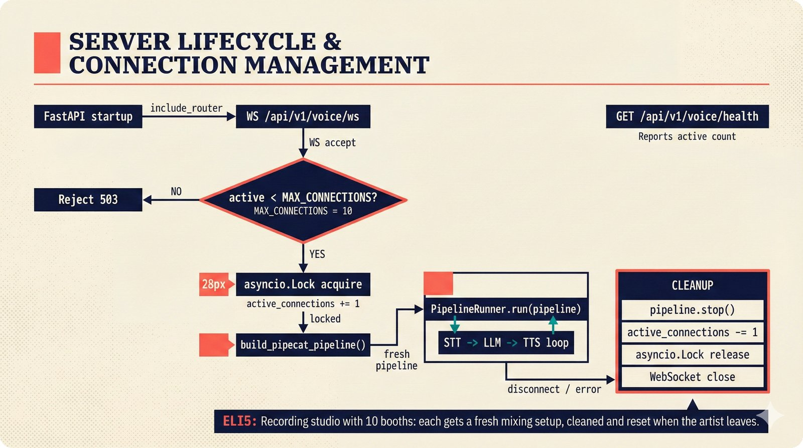

*Server lifecycle: WebSocket accept → connection limit check (MAX=10) → asyncio.Lock → build_pipecat_pipeline() → PipelineRunner → cleanup on disconnect.*

Each WebSocket connection gets a fresh Pipecat pipeline -- no state is shared between connections. The lifecycle follows a strict sequence: accept the WebSocket, check if `active_connections < MAX_CONNECTIONS` (hard-coded to 10), acquire an `asyncio.Lock` to serialize pipeline construction, call `build_pipecat_pipeline(config, websocket)`, hand the pipeline to `PipelineRunner.run()`, and on disconnect, stop the pipeline, release the lock, and decrement the connection counter. The health endpoint (`GET /api/v1/voice/health`) reports the current `active_connections` count for monitoring.

> **ELI5 for music people:** Think of the voice server like a recording studio with 10 booths: when all booths are occupied, new artists have to wait. Each booth gets its own fresh mixing setup, and when the artist leaves, the booth is cleaned and reset for the next session.

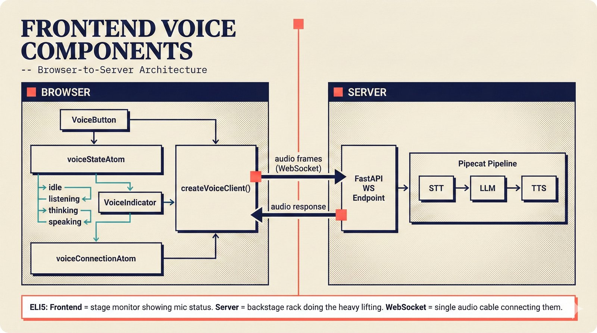

*Frontend voice architecture: Jotai atoms (voiceState, voiceConnection) drive the React UI, with createVoiceClient() managing the WebSocket link to the Pipecat pipeline on the server.*

On the frontend side, the voice UI uses the same Jotai atom pattern as the rest of the application. Two atoms track voice state: `voiceStateAtom` (idle / listening / thinking / speaking) drives the UI indicators, and `voiceConnectionAtom` (disconnected / connecting / connected) manages the WebSocket lifecycle. The `createVoiceClient()` function handles connection setup, audio capture via the Web Audio API, and PCM frame serialization. The WebSocket boundary is the key architectural split -- everything to the left (React components, Jotai atoms, audio capture) runs in the browser; everything to the right (Pipecat pipeline, STT, LLM, TTS) runs on the server.

> **ELI5 for music people:** Think of the frontend as the performer's stage monitor: it shows whether the mic is live (listening), the producer is thinking (processing), or the response is playing back (speaking). The heavy lifting happens in the backstage rack (server), connected by a single audio cable (WebSocket).

### 12.2 Database Integration

Voice tool handlers need database access for attribution queries. The session factory is shared between the REST API and voice tools:

```python
from music_attribution.voice.tools import set_session_factory

# On FastAPI startup:
set_session_factory(async_session_factory)
```

This ensures voice tools (`explain_confidence`, `search_attributions`, `suggest_correction`, `submit_feedback`) use the same connection pool as the REST API.

### 12.3 Pipecat Cloud

For production deployment, [Pipecat Cloud](https://docs.pipecat.ai/pipecat-cloud) provides managed infrastructure:

- **Auto-scaling**: Pipeline instances scale based on concurrent connections
- **Daily WebRTC transport**: Built-in, globally distributed
- **Metrics and logging**: Pipeline performance, per-connection latency
- **Session management**: Automatic cleanup on disconnect

Deploy configuration:
```bash
# Pipecat Cloud deployment
pipecat deploy --config pipecat.yaml
```

### 12.4 Self-Hosted Production

For self-hosted deployment, run the voice server as a separate container alongside the main API:

```dockerfile
# docker/Dockerfile.voice
FROM python:3.13-slim
COPY pyproject.toml uv.lock ./
RUN pip install uv && uv sync --group voice
COPY src/ src/
CMD ["uv", "run", "python", "scripts/voice_demo.py", "--host", "0.0.0.0"]
```

Key scaling considerations:

| Component | Scaling Strategy | Resource |
|-----------|-----------------|----------|
| Voice server | Horizontal (one pipeline per connection) | CPU/RAM |
| Whisper STT | GPU instance per N concurrent sessions | GPU VRAM |
| Kokoro/Orpheus TTS | GPU instance per N concurrent sessions | GPU VRAM |
| LLM (API) | Connection pooling | API rate limits |
| Database | Shared pool with REST API | Connection limit |

### 12.5 Monitoring

Production voice agents should track:

| Metric | Target | Why |
|--------|--------|-----|
| **Voice-to-voice latency (P95)** | < 1,500ms | Natural conversation threshold |
| **TTFW (Time to First Word)** | < 500ms | User perception of responsiveness |
| **Active connections** | Monitor | Capacity planning |
| **Drift state distribution** | > 90% sync | Persona stability |
| **Tool call success rate** | > 95% | Attribution query reliability |
| **STT WER (sampled)** | < 5% | Transcription quality |
| **Cost per session** | Track | FinOps governance |

The health endpoint (`GET /api/v1/voice/health`) reports basic metrics:

```json
{
  "status": "ok",
  "service": "voice-agent",
  "pipecat_available": true,
  "active_connections": 3
}
```

For deeper observability, integrate with the project's observability stack (PostHog for analytics, structured logging for pipeline traces).

> **PRD node:** `observability_stack` in the decision network (see [REPORT.md](../prd/decisions/REPORT.md))

### 12.6 Implementation Phases

| Phase | Timeline | Deliverable | Cost Impact |
|-------|----------|-------------|-------------|
| **I: Voice Input Only** | Month 1-2 | STT routes to existing text agent; responses displayed as text | +$0.008/min |
| **II: System Voice** | Month 2-3 | Add TTS, basic voice output, Silero VAD | +$0.035/min total |
| **III: Natural Conversation** | Month 3-4 | Smart Turn, interruption handling, <500ms target | Same |
| **IV: Digital Twin** | Month 4-6 | Artist voice clone, consent framework, NO FAKES Act compliance | +$0.10-0.15/min |
| **V: Premium Features** | Month 6+ | Emotional TTS, multi-language, on-device STT/TTS | Variable |

Phase I is the fastest path to user feedback: voice input to the existing text agent requires zero TTS work.

---

## 13. Protocol-Based Component Swapping

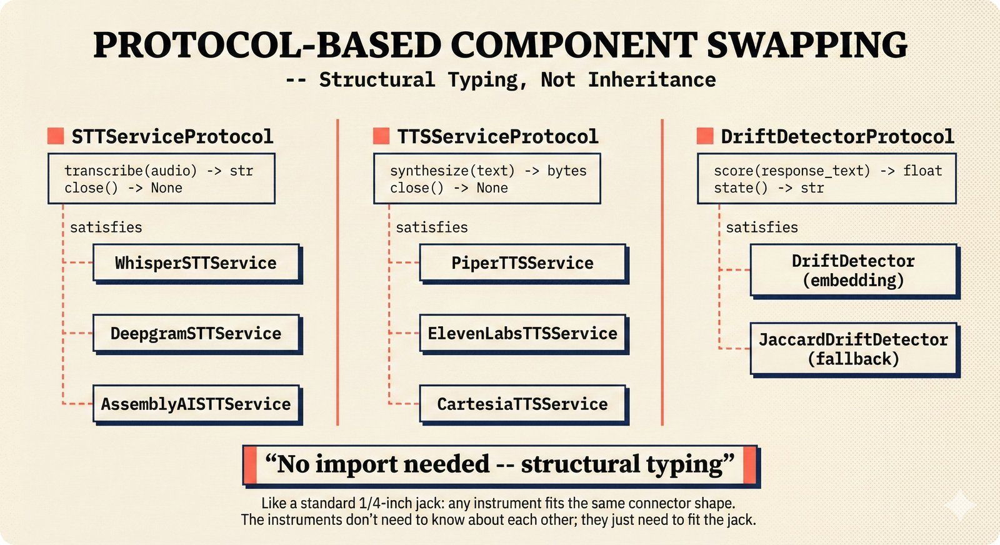

*Protocol-based swapping: three protocols (STT, TTS, Drift) with dashed "satisfies" lines to concrete implementations -- structural typing means no import or inheritance needed.*

Every swappable component in the voice module is defined by a Python `Protocol` -- not an abstract base class, not an interface, not inheritance. This is structural typing (duck typing with type checking): any class that implements the right method signatures automatically satisfies the protocol, even if it has never heard of the protocol definition.

Three protocols define the swap points:

- **`STTServiceProtocol`**: `transcribe(audio: bytes) -> str` and `close() -> None`
- **`TTSServiceProtocol`**: `synthesize(text: str) -> bytes` and `close() -> None`
- **`DriftDetectorProtocol`**: `score(response_text: str) -> float` and `state() -> str`

This means adding a new STT provider (say, a fine-tuned Whisper for music vocabulary) requires zero changes to the voice module core. Implement `transcribe()` and `close()`, add a branch in `create_stt_service()`, and the type checker confirms compatibility. The dashed lines in the figure (not solid inheritance arrows) emphasize this: providers don't extend a base class -- they just happen to have the right shape.

> **ELI5 for music people:** Like a standard 1/4-inch jack -- any guitar, synth, or bass can plug in because they all use the same connector shape. The instruments don't need to know about each other; they just need to fit the jack.

> **Source:** [`src/music_attribution/voice/protocols.py`](../../src/music_attribution/voice/protocols.py)

---

## 14. Conditional Import Pattern

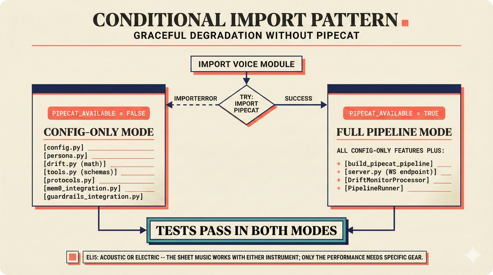

*Conditional import pattern: try/except at module level sets PIPECAT_AVAILABLE, branching to full pipeline mode or config-only mode -- all 54 tests pass in both branches.*

The voice module uses a conditional import pattern at the module level:

```python
try:
    import pipecat
    PIPECAT_AVAILABLE = True
except ImportError:
    PIPECAT_AVAILABLE = False
```

This single boolean controls the entire module's behavior. When `PIPECAT_AVAILABLE` is `True` (after `uv sync --group voice`), all services are real: `build_pipecat_pipeline()` creates actual Pipecat processors, `DriftMonitorProcessor` processes real frames, and `server.py` serves real WebSocket connections. When `False` (the default install), the module gracefully degrades: `VoiceConfig` still validates environment variables, `build_system_prompt()` still assembles persona prompts, `DriftDetector` still computes EWMA scores (with Jaccard fallback), and `get_tool_schemas()` still returns tool definitions.

This design means all 54 voice tests pass without Pipecat installed. The test suite mocks at precise boundaries (sentence-transformers for drift, Pipecat for everything else) and tests the configuration, persona, and drift logic directly.

> **ELI5 for music people:** Like a musician who can play either acoustic or electric -- the code checks which instrument (library) is available and adapts accordingly. The sheet music (config, persona, tools) works with either instrument; only the actual performance (pipeline) needs the specific gear.

---

## 15. Test Architecture

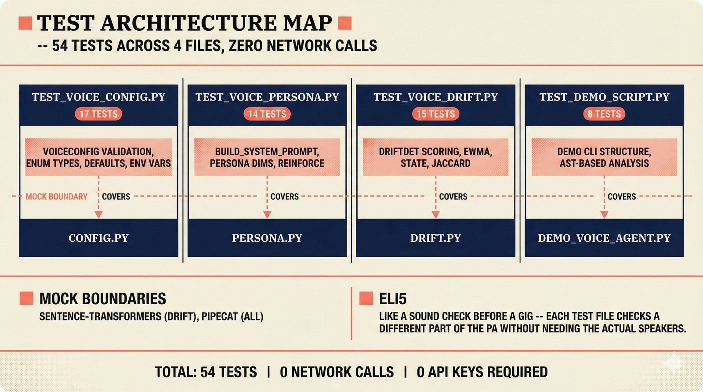

*Test architecture: 54 tests across 4 files covering config validation, persona building, drift detection, and demo script structure, all running without Pipecat via precise mock boundaries.*

The voice module has 54 unit tests across 4 files, each targeting a different layer:

| Test File | Tests | Coverage Area |
|-----------|-------|--------------|
| `test_voice_config.py` | 17 | VoiceConfig validation, enum types, defaults, env var parsing |
| `test_voice_persona.py` | 14 | `build_system_prompt()`, persona dimensions, reinforcement intervals |
| `test_voice_drift.py` | 15 | `DriftDetector` scoring, EWMA smoothing, state transitions, Jaccard fallback |
| `test_demo_script.py` | 8 | Demo script structure, CLI argument parsing, AST-based analysis |

The mock boundaries are precise: `sentence-transformers` is mocked in drift tests (so embedding similarity uses the Jaccard fallback), and Pipecat is never imported (all tests run in `PIPECAT_AVAILABLE=False` mode). Zero network calls, zero API keys required.

> **ELI5 for music people:** Think of the test suite like a sound check before a gig: each test file checks a different part of the PA system -- the mixer (config), the EQ presets (persona), the feedback eliminator (drift), and the overall signal chain (demo script) -- all without needing the actual speakers connected.

---

## 16. Extension Points

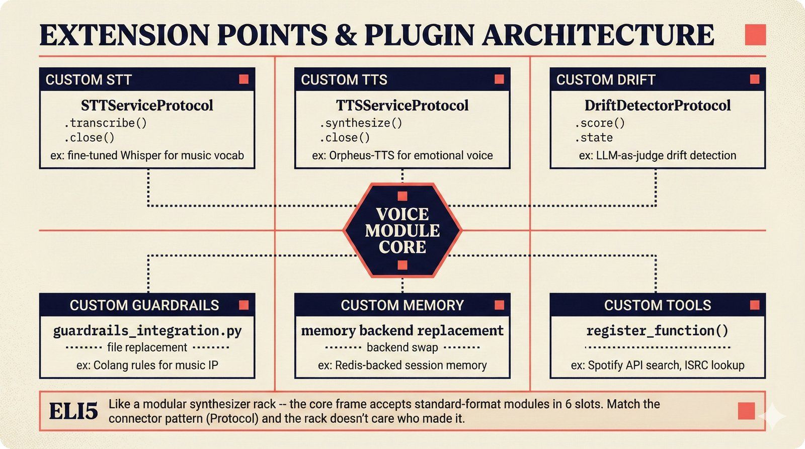

*Six extension points: custom STT, TTS, drift detector, guardrails, memory, and tools -- each defined by a Protocol interface that any implementation can satisfy via structural typing.*

The voice module has 6 extension points where teams can plug in custom implementations:

| Extension Point | Protocol/Interface | Example Use Case |
|----------------|-------------------|-----------------|
| **Custom STT** | `STTServiceProtocol` | Fine-tuned Whisper for music vocabulary (artist names, ISRC codes) |
| **Custom TTS** | `TTSServiceProtocol` | Orpheus-TTS for emotional voice with `<laugh>` and `<sigh>` tags |
| **Custom Drift Detector** | `DriftDetectorProtocol` | LLM-as-judge drift detection using Claude as evaluator |
| **Custom Guardrails** | Replace `guardrails_integration.py` | Domain-specific Colang rules for music IP |
| **Custom Memory** | Replace `letta_integration.py` / `mem0_integration.py` | Redis-backed session memory |
| **Custom Tools** | `register_function()` on LLM service | Spotify API search, live ISRC lookup |

Each extension point is defined by a Protocol (Sections 13 and [`protocols.py`](../../src/music_attribution/voice/protocols.py)). To add a custom STT provider, implement `transcribe(audio: bytes) -> str` and `close() -> None`, add a branch in `create_stt_service()`, and the type checker confirms compatibility. No base classes, no registration frameworks, no plugin discovery -- just structural typing.

> **ELI5 for music people:** Think of the voice module like a modular synthesizer rack: the core frame accepts standard-format modules in 6 slots. Any manufacturer can build a module that fits the slot -- all they need is to match the connector pattern. Swap a filter module, add a new oscillator, replace the sequencer -- the rack doesn't care who made it.

---

## Appendix A: File Reference

All voice agent source files:

| File | Purpose |
|------|---------|
| [`src/music_attribution/voice/__init__.py`](../../src/music_attribution/voice/__init__.py) | Module docstring and exports |
| [`src/music_attribution/voice/config.py`](../../src/music_attribution/voice/config.py) | `VoiceConfig` settings model (single source of truth) |
| [`src/music_attribution/voice/pipeline.py`](../../src/music_attribution/voice/pipeline.py) | Pipecat pipeline factory |
| [`src/music_attribution/voice/persona.py`](../../src/music_attribution/voice/persona.py) | 5-dimension persona prompt builder |
| [`src/music_attribution/voice/tools.py`](../../src/music_attribution/voice/tools.py) | PydanticAI-to-Pipecat tool bridge |
| [`src/music_attribution/voice/drift.py`](../../src/music_attribution/voice/drift.py) | DriftDetector + DriftMonitorProcessor |
| [`src/music_attribution/voice/server.py`](../../src/music_attribution/voice/server.py) | FastAPI WebSocket router |
| [`src/music_attribution/voice/protocols.py`](../../src/music_attribution/voice/protocols.py) | Structural typing protocols |
| [`src/music_attribution/voice/letta_integration.py`](../../src/music_attribution/voice/letta_integration.py) | Letta (MemGPT) persona memory |
| [`src/music_attribution/voice/mem0_integration.py`](../../src/music_attribution/voice/mem0_integration.py) | Mem0 user preferences with safety gate |
| [`src/music_attribution/voice/guardrails_integration.py`](../../src/music_attribution/voice/guardrails_integration.py) | NeMo Guardrails + regex fallback |
| [`src/music_attribution/voice/guardrails/__init__.py`](../../src/music_attribution/voice/guardrails/__init__.py) | NeMo Guardrails config directory |
| [`scripts/voice_demo.py`](../../scripts/voice_demo.py) | Quick Start demo script |
| [`src/music_attribution/chat/agent.py`](../../src/music_attribution/chat/agent.py) | PydanticAI text agent (shared tools) |

## Appendix B: PRD Decision Nodes

Voice-related decision nodes in the probabilistic PRD:

| Node | Level | File |
|------|-------|------|
| `voice_agent_stack` | L3 | [`voice-agent-stack.decision.yaml`](../prd/decisions/L3-implementation/voice-agent-stack.decision.yaml) |
| `voice_persona_management` | L3 | [`voice-persona-management.decision.yaml`](../prd/decisions/L3-implementation/voice-persona-management.decision.yaml) |
| `agentic_ui_framework` | L3 | Parent node -- voice depends on CopilotKit AG-UI |
| `llm_routing_strategy` | L3 | LLM selection feeds into voice LLM choice |
| `observability_stack` | L5 | Voice metrics feed into observability |

## Appendix C: Research Documents

| Document | Focus |
|----------|-------|
| [voice-ai-infrastructure.md](../planning/voice-agent-research/voice-ai-infrastructure.md) | Provider landscape, framework comparison |
| [recommended-stack.md](../planning/voice-agent-research/recommended-stack.md) | ADRs, phase plan, risk matrix |
| [finops-economics.md](../planning/voice-agent-research/finops-economics.md) | Per-minute costs, companion cost trap, GPU pricing |
| [leaderboards-evaluation.md](../planning/voice-agent-research/leaderboards-evaluation.md) | STT/TTS leaderboards, aiewf-eval, evaluation gaps |
| [academic-papers.md](../planning/voice-agent-research/academic-papers.md) | 40+ academic papers survey |
| [persona-coherence-literature-review.md](../planning/voice-agent-research/persona-coherence/persona-coherence-literature-review.md) | Drift theory, Big Five persona, parasocial dynamics |
| [drift-detection-methods.md](../planning/voice-agent-research/persona-coherence/drift-detection-methods.md) | 5 detection paradigms, 4 mitigation families |
| [commercial-tools-landscape.md](../planning/voice-agent-research/persona-coherence/commercial-tools-landscape.md) | Letta, Mem0, NeMo Guardrails comparison |
| [hyperpersonalization-frameworks.md](../planning/voice-agent-research/persona-coherence/hyperpersonalization-frameworks.md) | PS-Bench, safety gates, preference vs fact |

---

*Music Attribution Scaffold -- Voice Agent Implementation Guide v2.1.0*
*Last updated: 2026-02-22*
