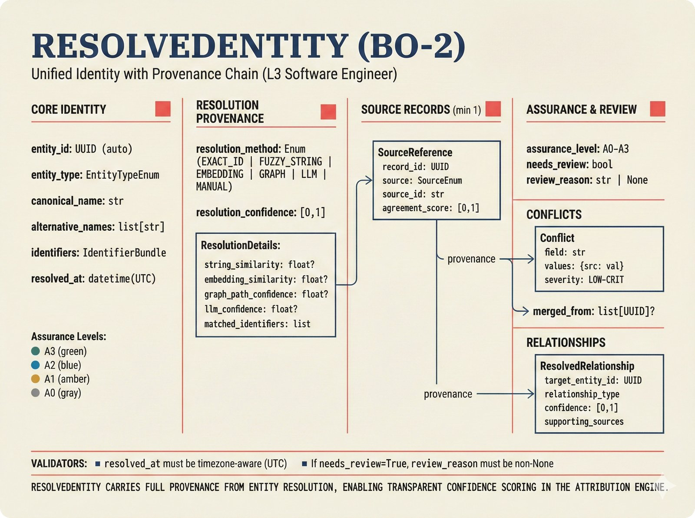
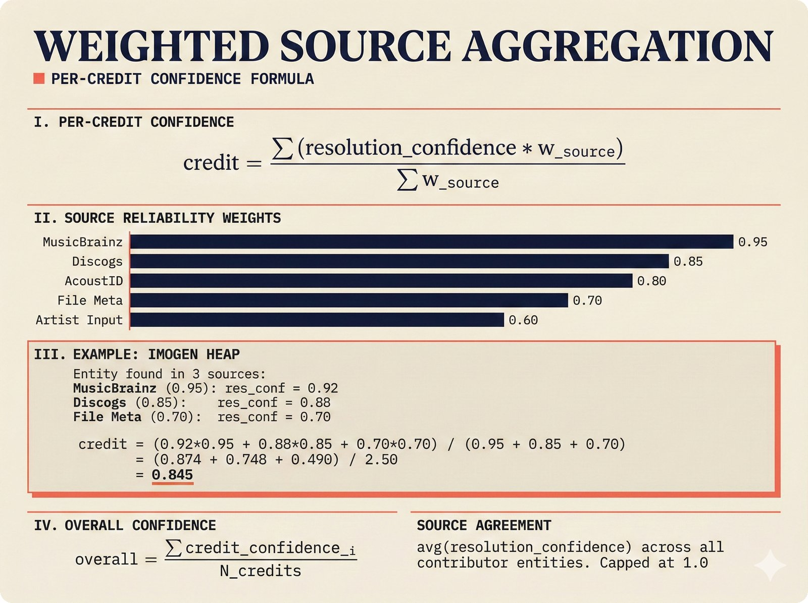
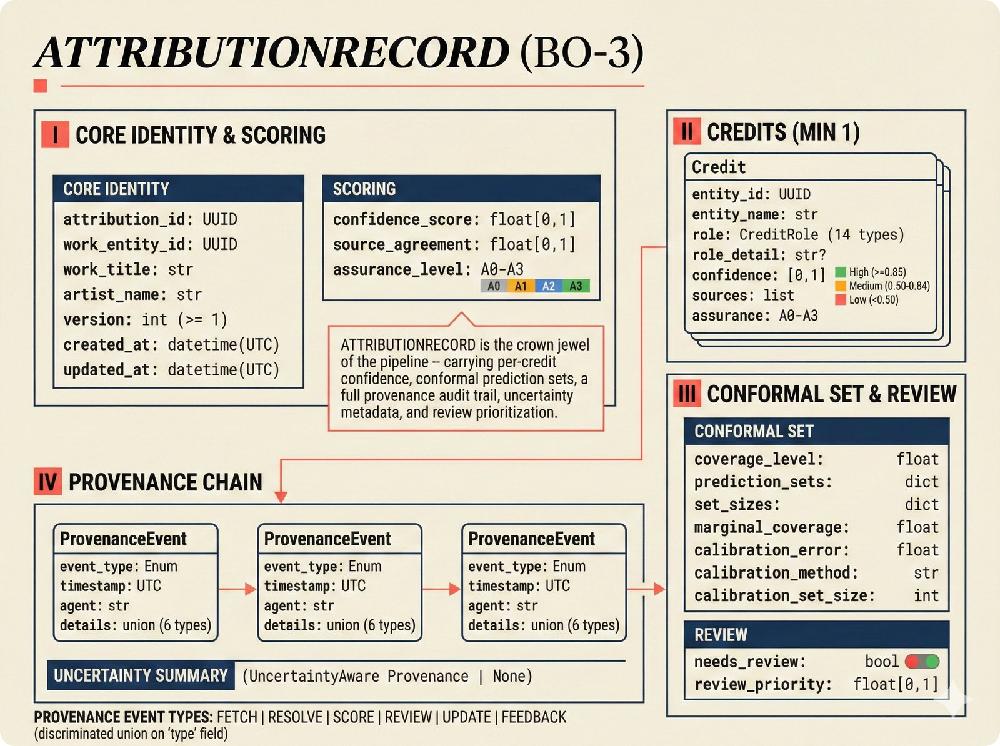
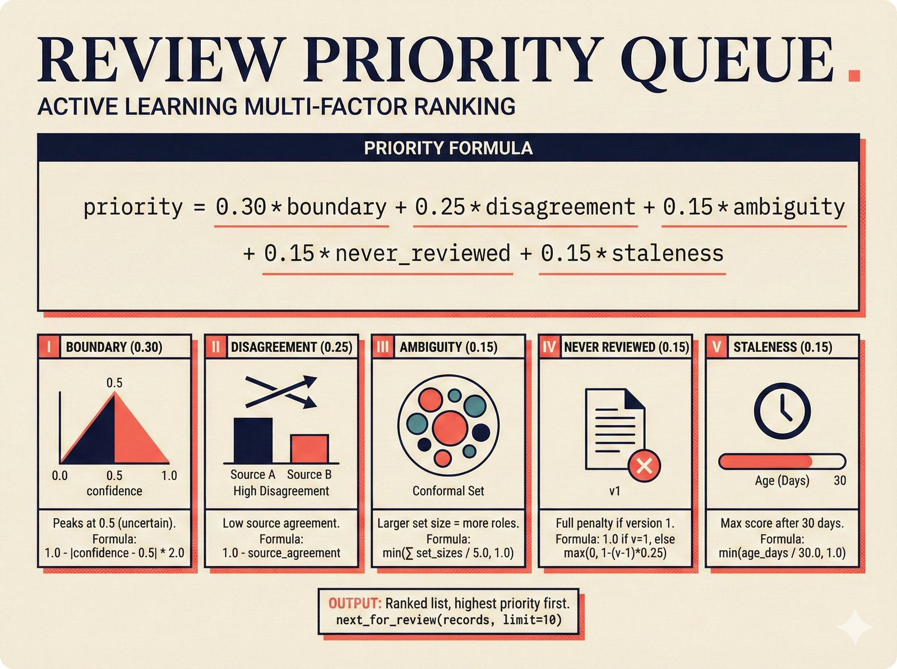

# attribution -- Attribution Engine Pipeline

The Attribution Engine aggregates resolved entities into complete `AttributionRecord` objects with calibrated confidence scores and conformal prediction sets. This is Pipeline 3 in the architecture.

## Files

| File | Purpose |
|---|---|
| `aggregator.py` | Multi-source credit aggregation with weighted voting |
| `conformal.py` | Conformal prediction scoring (Adaptive Prediction Sets) |
| `priority_queue.py` | Active learning review queue with multi-factor priority |
| `persistence.py` | In-memory + async PostgreSQL repositories for AttributionRecord |

## Key Classes

### CreditAggregator

Aggregates credits from multiple `ResolvedEntity` objects into a single `AttributionRecord`:

```python
aggregator = CreditAggregator()
record = await aggregator.aggregate(
    work_entity=work,                    # The work/recording ResolvedEntity
    contributor_entities=contributors,   # List of contributing artist entities
    roles=role_mapping,                  # entity_id -> CreditRoleEnum
)
```

The aggregator:
1. **Builds credits** with per-source weighted confidence scores.
2. **Computes overall confidence** as the average across all credit confidences.
3. **Measures source agreement** from inter-entity resolution confidence.
4. **Determines assurance level** as the minimum across all contributors (weakest link).
5. **Creates a provenance event** documenting the scoring method used.
6. **Flags for review** if confidence falls below the review threshold.

Source reliability weights are defined in `constants.py`:
- MusicBrainz: highest (structured, community-maintained)
- Discogs: high (community-maintained, strong on credits)
- AcoustID: medium (fingerprint-based, may have false positives)
- Artist input: high (first-party, but unverified)
- File metadata: lower (may be incomplete or user-edited)

### ConformalScorer

Wraps attribution confidence in conformal prediction sets using the Adaptive Prediction Sets (APS) method:

```python
scorer = ConformalScorer()
conformal_set = scorer.score(
    predictions=[(CreditRoleEnum.PERFORMER, 0.9), (CreditRoleEnum.PRODUCER, 0.7)],
    coverage=0.90,
)
```

"90% confident" must actually mean 90% coverage. The scorer:
1. Sorts predictions by confidence (descending).
2. Includes roles until cumulative confidence reaches the target coverage.
3. Reports marginal coverage (achieved) and calibration error (deviation from target).

The `calibrate()` method computes Expected Calibration Error (ECE) from predictions vs. actuals using 10-bin histogram binning.

### ReviewPriorityQueue

Ranks `AttributionRecord` objects for human review using a multi-factor priority formula:

| Factor | Weight | Meaning |
|---|---|---|
| Boundary proximity | 0.30 | Records near 0.5 confidence are most informative for active learning |
| Source disagreement | 0.25 | Low source agreement indicates conflicting data |
| Ambiguity | 0.15 | Larger conformal prediction sets indicate more uncertainty |
| Never reviewed | 0.15 | Version 1 records have never been reviewed by a human |
| Staleness | 0.15 | Older records may have stale data (30+ days = max score) |

```python
queue = ReviewPriorityQueue()
priority = queue.compute_priority(record)       # -> float (0.0-1.0)
top_records = queue.next_for_review(records, limit=10)
```

### Persistence

Two repository implementations:

- **`AttributionRecordRepository`**: In-memory storage for development and testing. Full async interface.
- **`AsyncAttributionRepository`**: PostgreSQL via SQLAlchemy `AsyncSession`. Supports store, update (with automatic version increment and provenance event), find_by_id, find_by_work_entity_id, find_needs_review, and list_all with pagination.

Updates automatically:
- Increment the version number.
- Set `updated_at` to current UTC time.
- Append an UPDATE provenance event to the chain.

## Connection to Adjacent Pipelines

- **Upstream**: Consumes `ResolvedEntity` objects from the Entity Resolution pipeline.
- **Output**: Produces `AttributionRecord` with calibrated confidence, conformal sets, and provenance chain.
- **Downstream**: The API (`api/routes/attribution.py`) serves records as JSON. The Chat Agent queries records via tools. The MCP server exposes records for AI platform queries.
- **Feedback**: May receive `PipelineFeedback(type=DISPUTE)` from the API when users challenge an attribution.

## Full API Documentation

See the [API Reference: Attribution Engine](https://petteriTeikari.github.io/music-attribution-scaffold/api-reference/attribution/) on the documentation site.

## Visual Documentation


*Attribution engine pipeline -- from resolved entities through credit aggregation to calibrated AttributionRecord.*


*Weighted source aggregation -- MusicBrainz, Discogs, AcoustID, artist input, and file metadata reliability weights.*


*Conformal prediction calibration -- Adaptive Prediction Sets ensuring "90% confident" means 90% coverage.*


*AttributionRecord boundary object schema with confidence scores, provenance chain, and conformal sets.*


*Active learning review priority queue -- multi-factor scoring for human review triage.*
