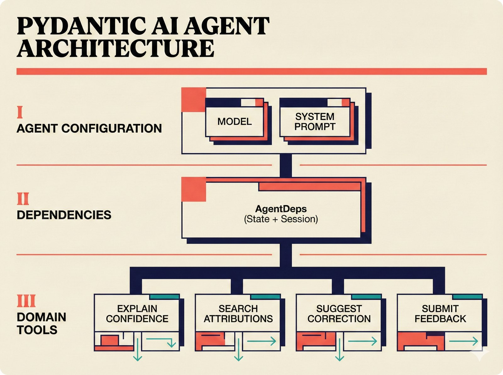
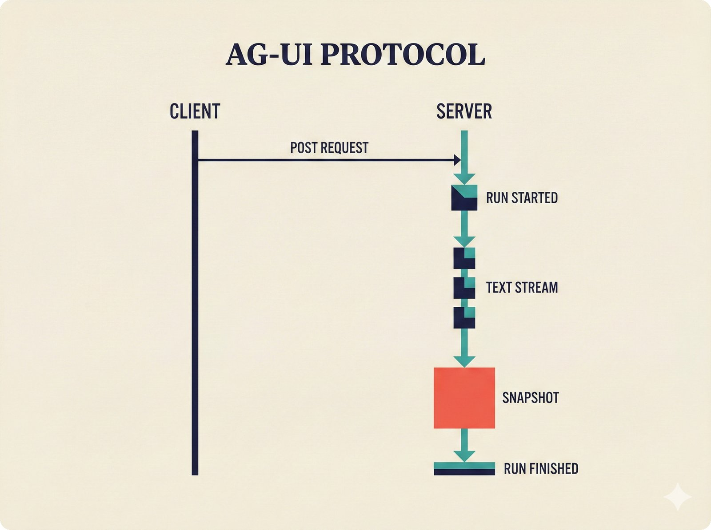
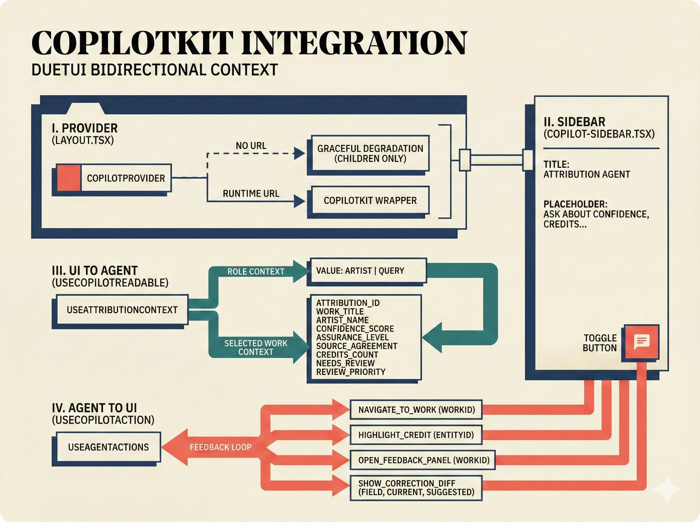
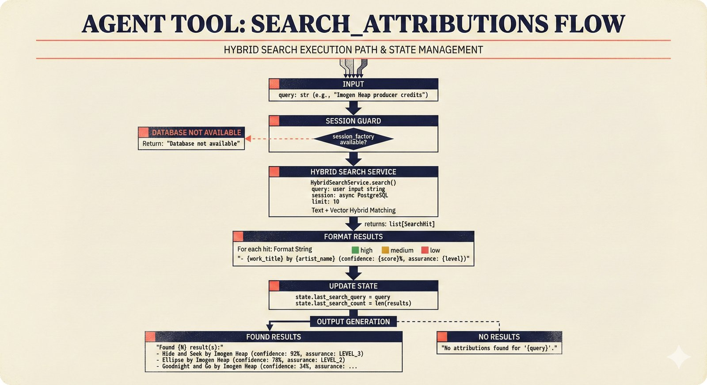
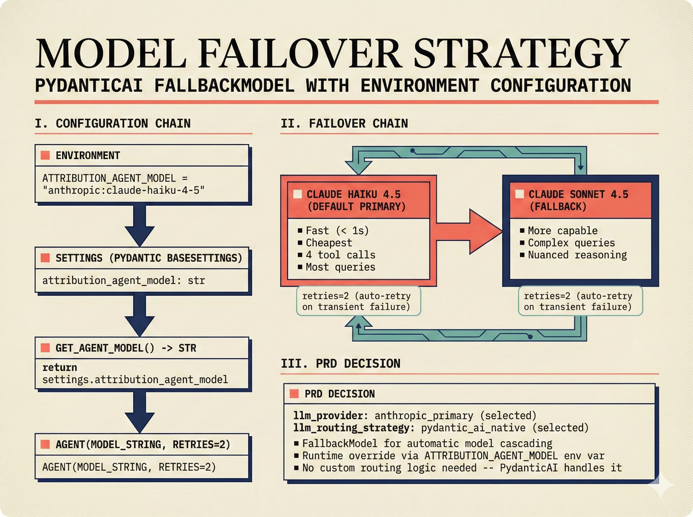
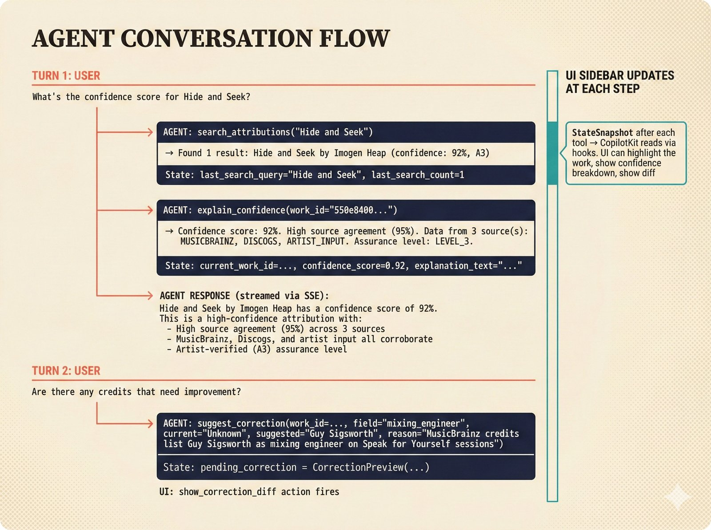
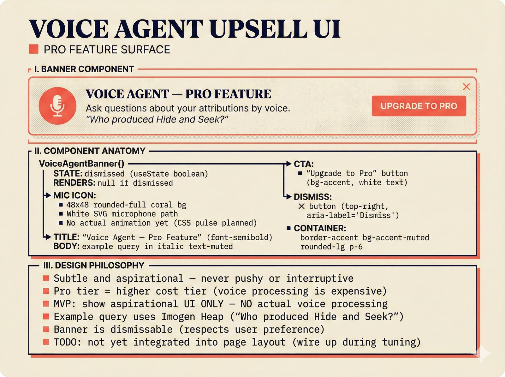
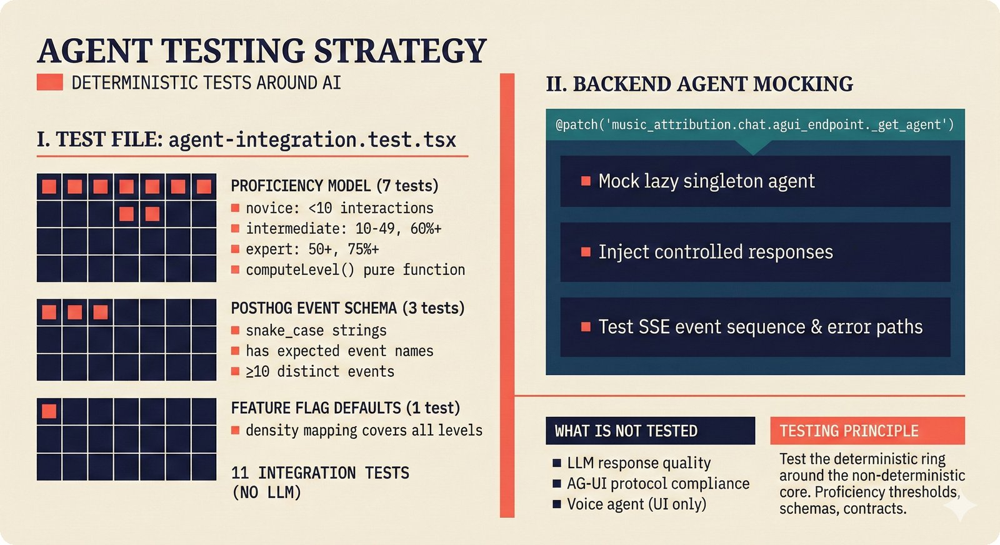

# chat -- PydanticAI Agent and AG-UI Endpoint

The Chat module implements Pipeline 5: an AI assistant that helps artists, managers, and musicologists review and improve attribution records. The agent is powered by PydanticAI and communicates with the frontend via the AG-UI protocol over SSE.

## Files

| File | Purpose |
|---|---|
| `agent.py` | PydanticAI agent definition with 4 domain tools |
| `agui_endpoint.py` | FastAPI SSE endpoint for CopilotKit (AG-UI protocol) |
| `state.py` | Shared state model synced between agent and frontend |

## Architecture

```
Frontend (CopilotKit)  <--SSE-->  AG-UI Endpoint  <-->  PydanticAI Agent
                                      |                       |
                                 State sync              4 domain tools
                                 (StateSnapshot)              |
                                                         PostgreSQL
```

## Agent Tools

The agent has 4 tools for interacting with the attribution database:

| Tool | Input | Output | Purpose |
|---|---|---|---|
| `explain_confidence` | work_id (UUID) | Human-readable explanation | Breaks down confidence into contributing factors (source agreement, number of sources, assurance level) |
| `search_attributions` | query (string) | Formatted result list | Hybrid search across works by title, artist, or keyword |
| `suggest_correction` | work_id, field, current_value, suggested_value, reason | Correction preview | Creates a `CorrectionPreview` for the user to review before submission |
| `submit_feedback` | work_id, overall_assessment (0.0-1.0), free_text | Confirmation | Persists a `FeedbackCard` to the database. Detects center-bias (0.45-0.55 assessments). |

## System Prompt

The agent is instructed to:
- Understand A0-A3 assurance levels and the Oracle Problem.
- Break down confidence scores into source agreement, corroborating sources, conformal set sizes, and calibration quality.
- Use clear, non-technical language for artists while being precise for technical users.
- Be concise, prefer bullet points, and reference specific data sources by name.

## Shared State

`AttributionAgentState` is a Pydantic model that syncs between the agent and frontend via AG-UI `StateSnapshot` events:

| Field | Type | Purpose |
|---|---|---|
| `current_work_id` | str or None | Attribution ID being discussed |
| `current_work_title` | str or None | Display title |
| `confidence_score` | float or None | Current confidence score |
| `review_queue_size` | int | Pending review count |
| `pending_correction` | CorrectionPreview or None | Correction awaiting confirmation |
| `explanation_text` | str or None | Current confidence explanation |
| `last_search_query` | str or None | Most recent search query |
| `last_search_count` | int | Result count from last search |

The frontend observes these fields via `useCopilotReadable` hooks for real-time UI updates.

## AG-UI Endpoint

The `/api/v1/copilotkit` POST endpoint receives conversation messages from CopilotKit and streams AG-UI events back via SSE:

1. `RunStarted` -- Agent begins processing.
2. `TextMessageStart` -- New assistant message.
3. `TextMessageContent` (chunked) -- Response text in 50-character chunks for streaming feel.
4. `TextMessageEnd` -- Message complete.
5. `StateSnapshot` -- Full state sync to frontend.
6. `RunFinished` -- Processing complete.

The agent is created as a lazy singleton (`_get_agent()`) to avoid requiring an API key at import time.

## Dependencies

The `AgentDeps` dataclass provides runtime dependencies to agent tools:
- `state`: Mutable `AttributionAgentState` for the current session.
- `session_factory`: Optional async session factory for PostgreSQL access.

## Model Configuration

The agent model is configurable via the `ATTRIBUTION_AGENT_MODEL` environment variable. Default: `anthropic:claude-haiku-4-5`. PydanticAI's `FallbackModel` provides automatic failover to alternative providers.

## Connection to Adjacent Pipelines

- **Upstream**: Queries `AttributionRecord` from the database via `AsyncAttributionRepository`.
- **Input**: User messages from the CopilotKit frontend.
- **Output**: AG-UI SSE events (text responses, state updates).
- **Reverse flow**: `submit_feedback` creates `FeedbackCard` objects that flow back to the Attribution Engine.

## Full API Documentation

See the [API Reference: Chat Agent](https://petteriTeikari.github.io/music-attribution-scaffold/api-reference/chat/) on the documentation site.

## Visual Documentation

<details>
<summary>Click to expand visual documentation</summary>


*Full stack agentic architecture -- CopilotKit frontend, AG-UI protocol, PydanticAI backend.*


*PydanticAI agent architecture -- agent definition with 4 domain tools and structured dependencies.*


*AG-UI protocol flow -- SSE event sequence for streaming agent responses and state synchronization.*


*CopilotKit integration -- readable/action hooks for bidirectional agent-frontend communication.*


*Tool: search_attributions -- hybrid search across works by title, artist, or keyword.*


*Tool: explain_confidence -- breaking down confidence into source agreement, assurance level, and calibration.*


*Model failover -- PydanticAI FallbackModel with automatic provider chain switching.*


*Typical conversation flow -- user query, tool invocation, state update, and streamed response.*


*Voice agent upsell -- aspirational Pro tier UI surface (not implemented in MVP).*


*Testing strategy -- mock agent injection, AG-UI endpoint tests, and state synchronization verification.*

</details>
