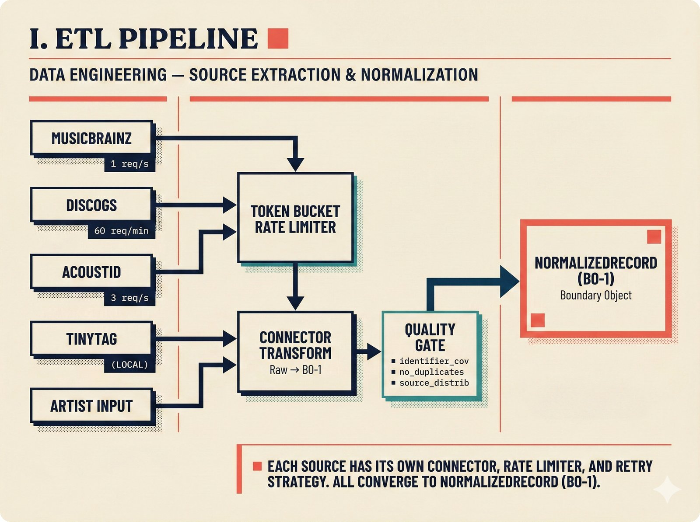
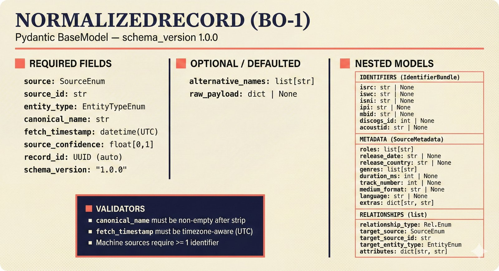
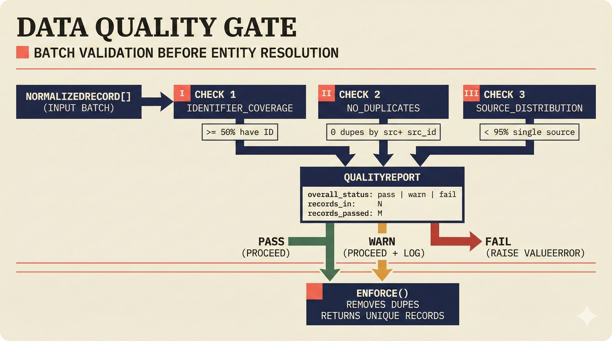
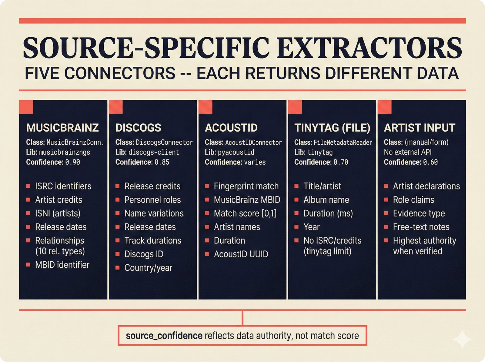
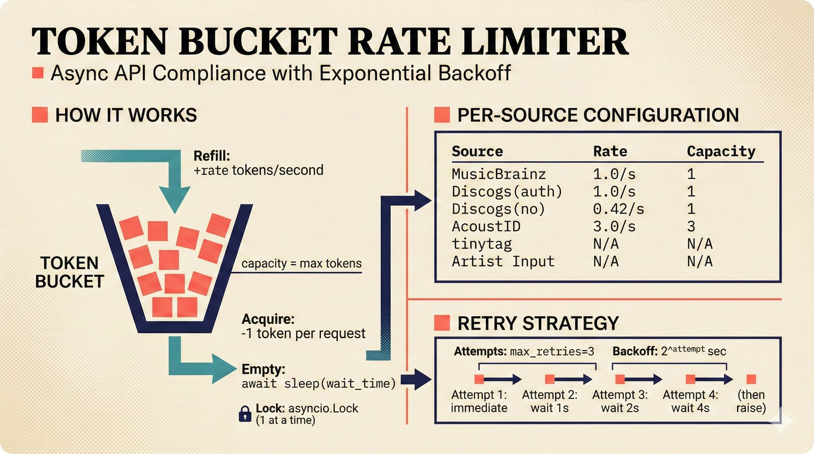

# etl -- Data Engineering Pipeline

The ETL (Extract, Transform, Load) pipeline fetches music metadata from five external sources and normalizes everything into `NormalizedRecord` boundary objects. This is Pipeline 1 in the architecture.

## Data Sources

| Source | Connector | Confidence | Rate Limit |
|---|---|---|---|
| MusicBrainz | `MusicBrainzConnector` | 0.90 | 1 req/s |
| Discogs | `DiscogsConnector` | 0.85 | 60 req/min (auth), 25 req/min (unauth) |
| AcoustID | `AcoustIDConnector` | Score-based (0.0-1.0) | 3 req/s |
| File metadata | `FileMetadataReader` | 0.70 (tags found), 0.30 (minimal) | N/A (local) |
| Artist input | (manual) | 0.95 | N/A |

## Files

| File | Purpose |
|---|---|
| `musicbrainz.py` | MusicBrainz API connector -- fetches recordings, artists, relationships. Uses `musicbrainzngs`. |
| `discogs.py` | Discogs API connector -- fetches releases (with per-track extraction), artists, search. Uses `python3-discogs-client`. |
| `acoustid.py` | AcoustID fingerprint connector -- generates Chromaprint fingerprints from audio files, looks up matching recordings. Uses `pyacoustid`. |
| `file_metadata.py` | Local file metadata reader -- extracts title, artist, album, duration from audio files. Uses `tinytag` (MIT, pure Python). |
| `quality_gate.py` | Batch quality validation before handoff to Entity Resolution. |
| `rate_limiter.py` | Async token bucket rate limiter shared by all API connectors. |
| `persistence.py` | PostgreSQL persistence for `NormalizedRecord` with upsert semantics. |

## Key Classes

### MusicBrainzConnector

```python
connector = MusicBrainzConnector(user_agent="MyApp/1.0 (me@example.com)")
record = await connector.fetch_recording("mbid-here")  # -> NormalizedRecord
artist = await connector.fetch_artist("mbid-here")      # -> NormalizedRecord
```

Extracts relationships (producer, performer, composer, etc.) from artist-relation-lists and maps them to `RelationshipTypeEnum`. Wraps synchronous `musicbrainzngs` calls in `asyncio.to_thread()`.

### DiscogsConnector

```python
connector = DiscogsConnector(user_agent="MyApp/1.0", token="optional-token")
records = await connector.fetch_release(12345)  # -> list[NormalizedRecord]
```

Produces one `NormalizedRecord` per track (RECORDING) plus one for the release itself (RELEASE). Parses comma-separated Discogs roles ("Producer, Engineer") into separate relationships.

### AcoustIDConnector

```python
connector = AcoustIDConnector(api_key="your-key")
fingerprint, duration = await connector.fingerprint_file(Path("track.mp3"))
records = await connector.lookup(fingerprint, duration)  # -> list[NormalizedRecord]
```

Returns results sorted by fingerprint match score (descending). Links to MusicBrainz recording IDs when available.

### FileMetadataReader

```python
reader = FileMetadataReader()
record = reader.read(Path("track.flac"))  # -> NormalizedRecord
```

Supports MP3, M4A, WAV, OGG, FLAC, WMA, AIFF. Falls back to filename stem if no tags are found. Note: ISRC and detailed credits (TIPL/TMCL frames) are not available via tinytag -- those come from MusicBrainz/Discogs APIs.

### DataQualityGate

Validates batches of `NormalizedRecord` before passing to Entity Resolution:

- **Identifier coverage**: Warns if too few records have standard identifiers.
- **Duplicate detection**: Fails if duplicate source+source_id combinations exist.
- **Source distribution**: Warns if all records come from a single source.

The `enforce()` method raises `ValueError` on critical failures and removes duplicates from passing batches.

### TokenBucketRateLimiter

Async token bucket shared by all connectors. Ensures compliance with per-API rate limits. Supports burst via configurable capacity.

## Connection to Adjacent Pipelines

- **Output**: `NormalizedRecord` boundary objects, validated by `DataQualityGate`.
- **Downstream**: Entity Resolution (`resolution/orchestrator.py`) consumes batches of `NormalizedRecord`.
- **Persistence**: `NormalizedRecordRepository` stores records in PostgreSQL with upsert-on-conflict (source + source_id).
- **Feedback**: May receive `PipelineFeedback(type=REFETCH)` signals from Entity Resolution when source data appears stale or incorrect.

## Full API Documentation

See the [API Reference: ETL Pipeline](https://petteriTeikari.github.io/music-attribution-scaffold/api-reference/etl/) on the documentation site.

## Visual Documentation


*ETL pipeline overview -- five source connectors feeding into NormalizedRecord boundary objects.*


*NormalizedRecord boundary object schema with field types and validation rules.*


*DataQualityGate validation flow -- identifier coverage, duplicate detection, and source distribution checks.*


*Source-specific extraction and transformation logic for each connector.*


*Async token bucket rate limiter shared by all API connectors with per-source capacity configuration.*
