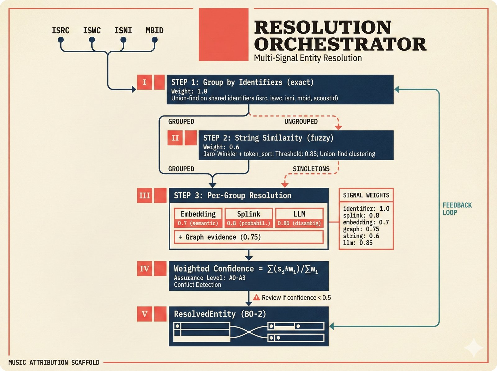
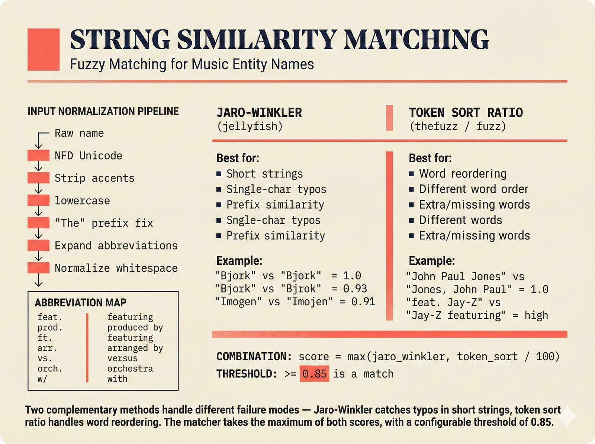
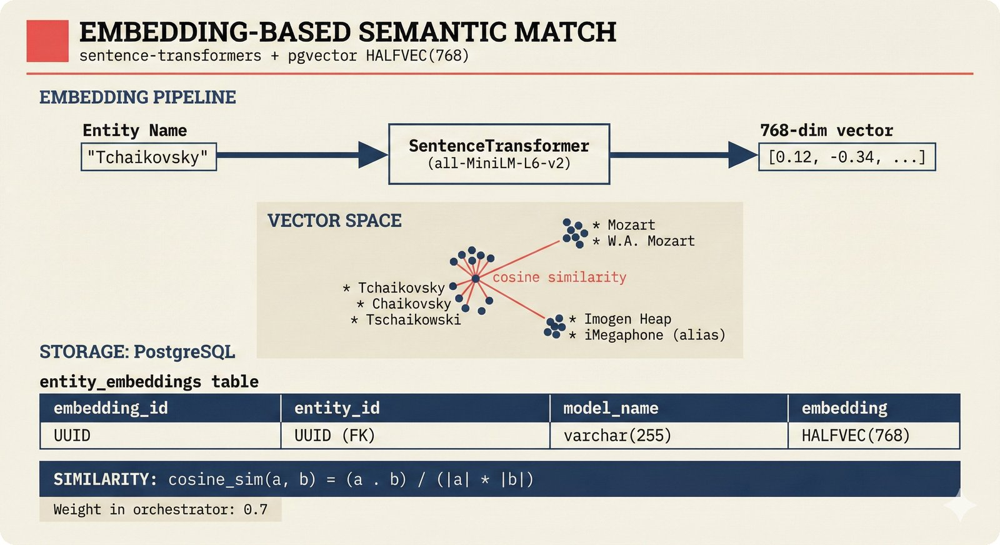
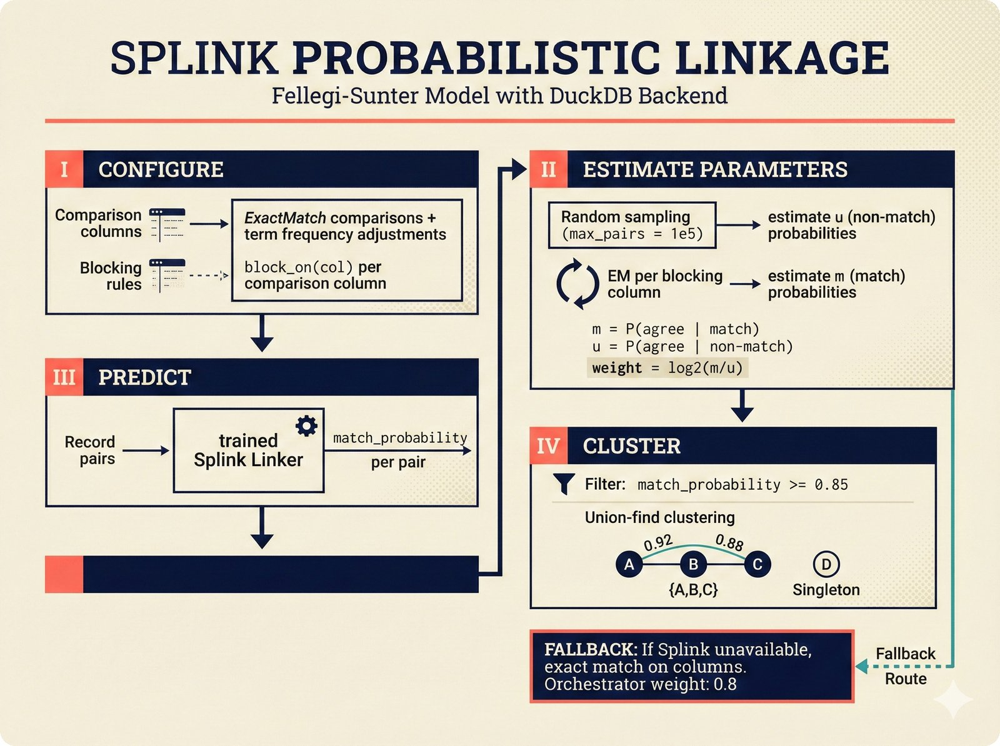
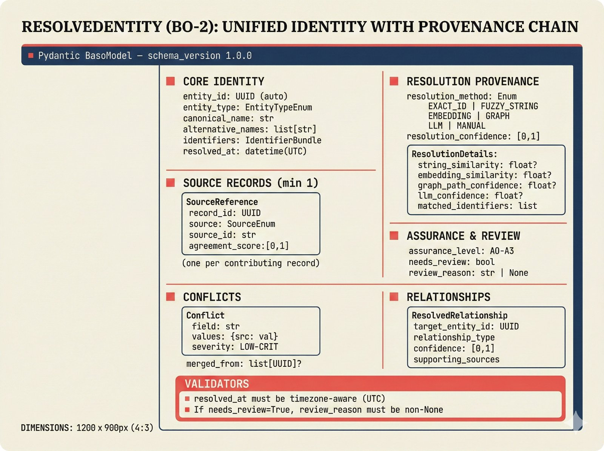

# resolution -- Entity Resolution Pipeline

The Entity Resolution pipeline takes batches of `NormalizedRecord` objects (potentially describing the same entity from different sources) and resolves them into unified `ResolvedEntity` objects. This is Pipeline 2 in the architecture.

## 5-Strategy Resolution Cascade

The orchestrator applies resolution strategies in order of cost and confidence:

| Strategy | File | Method | Cost | When Used |
|---|---|---|---|---|
| 1. Identifier match | `identifier_match.py` | `EXACT_ID` | Free | Always first -- shared ISRC/ISWC/ISNI/MBID |
| 2. String similarity | `string_similarity.py` | `FUZZY_STRING` | Cheap | Ungrouped records after step 1 |
| 3. Splink linkage | `splink_linkage.py` | Probabilistic | Medium | Fellegi-Sunter model for scaled matching |
| 4. Embedding match | `embedding_match.py` | `EMBEDDING` | Medium | Semantic similarity for translations, variant spellings |
| 5. LLM disambiguation | `llm_disambiguation.py` | `LLM` | Expensive | Only when signals are ambiguous (0.4-0.7 range) |

Graph-based resolution (`graph_resolution.py`) provides supplementary evidence rather than running as a standalone step.

## Files

| File | Purpose |
|---|---|
| `orchestrator.py` | Multi-signal orchestrator combining all strategies into a single pipeline |
| `identifier_match.py` | Exact matching on ISRC, ISWC, ISNI, MBID, AcoustID using union-find |
| `string_similarity.py` | Fuzzy name matching with Jaro-Winkler + token-sort ratio |
| `splink_linkage.py` | Fellegi-Sunter probabilistic record linkage via Splink (DuckDB backend) |
| `embedding_match.py` | Semantic matching via sentence-transformers (all-MiniLM-L6-v2) |
| `graph_resolution.py` | Relationship graph evidence (shared neighbors = same entity) |
| `llm_disambiguation.py` | PydanticAI-powered disambiguation for hard cases (e.g., "John Williams") |
| `graph_store.py` | In-memory graph storage for ResolvedEntities (Apache AGE in production) |
| `embedding_service.py` | Embedding generation and storage service |
| `edge_repository.py` | Relationship edge persistence |

## Key Classes

### ResolutionOrchestrator

The main entry point for resolution:

```python
orchestrator = ResolutionOrchestrator()
entities = await orchestrator.resolve(records)  # list[NormalizedRecord] -> list[ResolvedEntity]
```

The orchestrator:
1. Groups records by shared identifiers (union-find).
2. Tries string similarity on ungrouped records.
3. Creates singleton groups for remaining records.
4. Resolves each group into a `ResolvedEntity` with per-method confidence breakdown.

Default signal weights: identifier (1.0), LLM (0.85), Splink (0.8), graph (0.75), embedding (0.7), string (0.6).

### IdentifierMatcher

Highest-confidence, lowest-cost strategy. Two records sharing any standard identifier (ISRC, ISWC, ISNI, MBID, AcoustID) are the same entity.

Computes assurance levels from identifier evidence:
- A3: ISNI confirmed + multi-source
- A2: Multi-source with shared identifier
- A1: Single source with identifier
- A0: No identifiers

### StringSimilarityMatcher

Combines Jaro-Winkler (good for typos in short strings) with token-sort ratio (good for word reordering). Handles music-domain normalizations:
- "The" prefix handling ("Beatles, The" --> "the beatles")
- Abbreviation expansion ("feat." --> "featuring", "ft." --> "featuring")
- Unicode accent stripping
- Whitespace normalization

Default match threshold: 0.85.

### SplinkMatcher

Fellegi-Sunter probabilistic record linkage using the Splink library with DuckDB backend. Estimates m/u parameters from data and produces calibrated match probabilities. Falls back to exact column matching if Splink is not available.

### EmbeddingMatcher

Lazy-loads a sentence-transformer model (`all-MiniLM-L6-v2`) to embed entity names. Finds semantically similar entities via cosine similarity. Handles cases string matching misses: translations, very different spellings, abbreviations.

### GraphResolver

Maintains an adjacency graph of entity relationships. Two entities sharing many neighbors (e.g., both appeared on the same 3 albums) are likely the same or closely related. Uses Jaccard coefficient with shared-count boosting.

### LLMDisambiguator

Last-resort strategy for truly ambiguous cases. Only invoked when the best signal from other methods falls in the 0.4-0.7 range (cost control). Uses caching (SHA-256 key) to avoid redundant LLM calls. Produces structured `DisambiguationResult` with reasoning.

### GraphStore

In-memory graph for storing `ResolvedEntity` objects and their relationships. Supports BFS shortest-path queries and relationship-type-filtered traversals. In production, this would be backed by Apache AGE (PostgreSQL graph extension).

## Connection to Adjacent Pipelines

- **Upstream**: Consumes `list[NormalizedRecord]` from the ETL pipeline.
- **Output**: Produces `list[ResolvedEntity]` with resolution confidence, assurance level, and conflict detection.
- **Downstream**: The Attribution Engine (`attribution/aggregator.py`) consumes `ResolvedEntity` objects.
- **Feedback**: May send `PipelineFeedback(type=REFETCH)` upstream if source data is consistently wrong. May receive `PipelineFeedback(type=RECALIBRATE)` from Attribution Engine if resolution confidence was miscalibrated.

## Full API Documentation

See the [API Reference: Entity Resolution](https://petteriTeikari.github.io/music-attribution-scaffold/api-reference/resolution/) on the documentation site.

## Visual Documentation


*ResolutionOrchestrator cascade -- strategies applied in order of cost and confidence.*


*String similarity matching with music-domain normalizations (prefix handling, abbreviation expansion, accent stripping).*


*Embedding-based semantic matching via sentence-transformers and pgvector cosine similarity.*


*Splink probabilistic record linkage -- Fellegi-Sunter model estimating match/unmatch probabilities.*


*ResolvedEntity boundary object schema with per-method confidence breakdown and assurance levels.*
